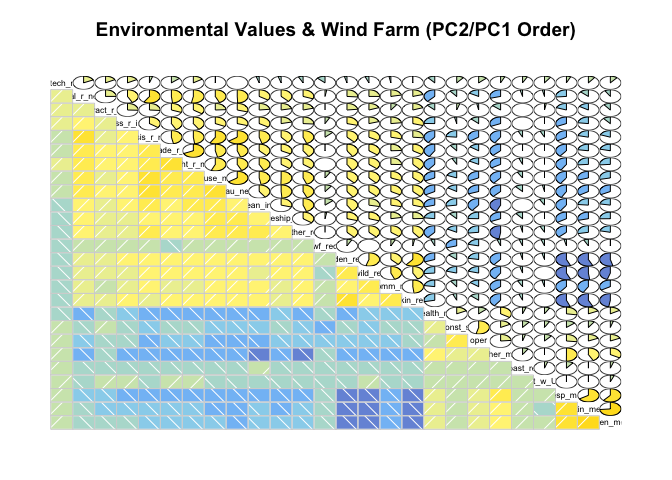
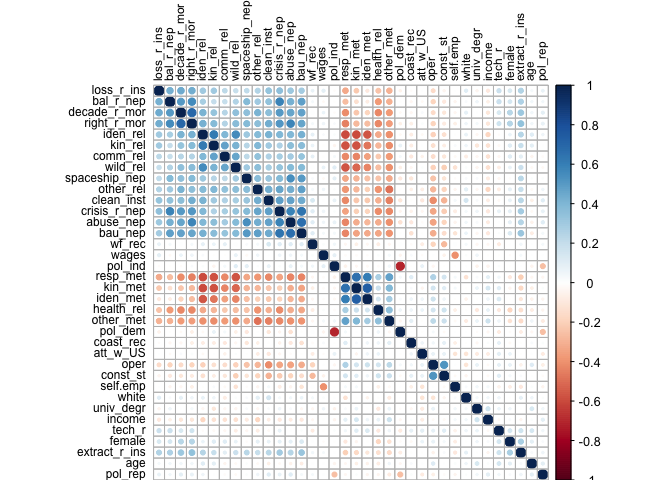

# Correlation exploration WF EV
Sarah Klain  
May 1, 2016  


Setup


```r
library(Hmisc) #to run correlations with sig levels
```

```
## Loading required package: grid
## Loading required package: lattice
## Loading required package: survival
## Loading required package: Formula
## Loading required package: ggplot2
```

```
## Warning: package 'ggplot2' was built under R version 3.2.4
```

```
## Warning: replacing previous import by 'ggplot2::unit' when loading 'Hmisc'
```

```
## Warning: replacing previous import by 'ggplot2::arrow' when loading 'Hmisc'
```

```
## Warning: replacing previous import by 'scales::alpha' when loading 'Hmisc'
```

```
## 
## Attaching package: 'Hmisc'
## 
## The following objects are masked from 'package:base':
## 
##     format.pval, round.POSIXt, trunc.POSIXt, units
```

```r
library(ggthemes) # for pretty themes in ggplot
```

```
## Warning: replacing previous import by 'grid::arrow' when loading 'ggthemes'
```

```
## Warning: replacing previous import by 'grid::unit' when loading 'ggthemes'
```

```
## Warning: replacing previous import by 'scales::alpha' when loading
## 'ggthemes'
```

```r
library(viridis) # for pretty colors
library(dplyr)
```

```
## 
## Attaching package: 'dplyr'
## 
## The following objects are masked from 'package:Hmisc':
## 
##     combine, src, summarize
## 
## The following objects are masked from 'package:stats':
## 
##     filter, lag
## 
## The following objects are masked from 'package:base':
## 
##     intersect, setdiff, setequal, union
```

```r
library(knitr) # tool for making nice tables
library(tidyr) # data table wrangling tool
library(broom)
library(stargazer) # makes pretty tables
```

```
## 
## Please cite as: 
## 
##  Hlavac, Marek (2015). stargazer: Well-Formatted Regression and Summary Statistics Tables.
##  R package version 5.2. http://CRAN.R-project.org/package=stargazer
```

```r
library(corrgram)
library(ggplot2) # for great charts
# library(stats) # for PCA
# library(psych)
```

Input data

```r
setwd("/Users/sarahklain/Documents/R_2015/navi") #set working directory
ev_wf <- read.csv("cer_2016_01_08_dem3.csv")
#str(ev_wf)
```

### Correlations


```r
corr1 <- rcorr(as.matrix(ev_wf[11:37]), type = "pearson")
corr1
```

```
##               coast_rec att_w_US  oper const_st wf_rec abuse_nep bal_r_nep
## coast_rec          1.00     0.05  0.04     0.09  -0.05     -0.08     -0.04
## att_w_US           0.05     1.00  0.11     0.16  -0.05     -0.02     -0.03
## oper               0.04     0.11  1.00     0.49  -0.21     -0.32     -0.17
## const_st           0.09     0.16  0.49     1.00  -0.28     -0.15     -0.11
## wf_rec            -0.05    -0.05 -0.21    -0.28   1.00      0.08      0.03
## abuse_nep         -0.08    -0.02 -0.32    -0.15   0.08      1.00      0.44
## bal_r_nep         -0.04    -0.03 -0.17    -0.11   0.03      0.44      1.00
## crisis_r_nep      -0.07    -0.07 -0.35    -0.28   0.12      0.58      0.59
## spaceship_nep     -0.11    -0.02 -0.25    -0.13   0.03      0.50      0.38
## bau_nep           -0.12    -0.03 -0.31    -0.19   0.10      0.65      0.49
## extract_r_ins      0.00     0.03 -0.03     0.05   0.02      0.24      0.25
## loss_r_ins        -0.01     0.01 -0.13    -0.02   0.07      0.32      0.43
## decade_r_mor      -0.01     0.02 -0.15    -0.04  -0.02      0.47      0.48
## comm_rel          -0.08    -0.04 -0.14    -0.06   0.07      0.31      0.22
## wild_rel          -0.04     0.00 -0.21    -0.16  -0.01      0.38      0.25
## clean_inst         0.00    -0.08 -0.40    -0.19   0.13      0.47      0.34
## tech_r             0.07     0.09  0.13     0.20  -0.13      0.01      0.18
## iden_rel          -0.04    -0.04 -0.22    -0.13   0.07      0.38      0.26
## kin_rel           -0.06     0.00 -0.13    -0.04   0.03      0.37      0.20
## right_r_mor       -0.06     0.02 -0.17    -0.02   0.01      0.56      0.53
## health_rel         0.05     0.08  0.13     0.12  -0.06     -0.33     -0.38
## other_rel         -0.03    -0.07 -0.27    -0.14   0.01      0.44      0.31
## kin_met            0.02    -0.02  0.18     0.11  -0.07     -0.30     -0.13
## resp_met           0.10     0.02  0.27     0.20  -0.04     -0.41     -0.26
## iden_met           0.05     0.06  0.18     0.07  -0.02     -0.28     -0.08
## other_met          0.09     0.01  0.24     0.16  -0.05     -0.39     -0.30
## mean_nep          -0.10    -0.05 -0.36    -0.22   0.09      0.79      0.75
##               crisis_r_nep spaceship_nep bau_nep extract_r_ins loss_r_ins
## coast_rec            -0.07         -0.11   -0.12          0.00      -0.01
## att_w_US             -0.07         -0.02   -0.03          0.03       0.01
## oper                 -0.35         -0.25   -0.31         -0.03      -0.13
## const_st             -0.28         -0.13   -0.19          0.05      -0.02
## wf_rec                0.12          0.03    0.10          0.02       0.07
## abuse_nep             0.58          0.50    0.65          0.24       0.32
## bal_r_nep             0.59          0.38    0.49          0.25       0.43
## crisis_r_nep          1.00          0.39    0.65          0.26       0.35
## spaceship_nep         0.39          1.00    0.49          0.22       0.21
## bau_nep               0.65          0.49    1.00          0.30       0.30
## extract_r_ins         0.26          0.22    0.30          1.00       0.26
## loss_r_ins            0.35          0.21    0.30          0.26       1.00
## decade_r_mor          0.47          0.33    0.45          0.31       0.43
## comm_rel              0.29          0.22    0.33          0.10       0.23
## wild_rel              0.33          0.30    0.37          0.19       0.20
## clean_inst            0.46          0.30    0.41          0.23       0.34
## tech_r                0.05         -0.05    0.01          0.17       0.17
## iden_rel              0.38          0.30    0.41          0.23       0.29
## kin_rel               0.27          0.24    0.38          0.19       0.30
## right_r_mor           0.48          0.36    0.43          0.35       0.41
## health_rel           -0.40         -0.23   -0.33         -0.12      -0.25
## other_rel             0.45          0.35    0.44          0.21       0.26
## kin_met              -0.21         -0.29   -0.34         -0.16      -0.23
## resp_met             -0.34         -0.34   -0.42         -0.19      -0.32
## iden_met             -0.19         -0.25   -0.33         -0.10      -0.11
## other_met            -0.41         -0.32   -0.38         -0.14      -0.32
## mean_nep              0.83          0.70    0.84          0.32       0.41
##               decade_r_mor comm_rel wild_rel clean_inst tech_r iden_rel
## coast_rec            -0.01    -0.08    -0.04       0.00   0.07    -0.04
## att_w_US              0.02    -0.04     0.00      -0.08   0.09    -0.04
## oper                 -0.15    -0.14    -0.21      -0.40   0.13    -0.22
## const_st             -0.04    -0.06    -0.16      -0.19   0.20    -0.13
## wf_rec               -0.02     0.07    -0.01       0.13  -0.13     0.07
## abuse_nep             0.47     0.31     0.38       0.47   0.01     0.38
## bal_r_nep             0.48     0.22     0.25       0.34   0.18     0.26
## crisis_r_nep          0.47     0.29     0.33       0.46   0.05     0.38
## spaceship_nep         0.33     0.22     0.30       0.30  -0.05     0.30
## bau_nep               0.45     0.33     0.37       0.41   0.01     0.41
## extract_r_ins         0.31     0.10     0.19       0.23   0.17     0.23
## loss_r_ins            0.43     0.23     0.20       0.34   0.17     0.29
## decade_r_mor          1.00     0.24     0.36       0.38   0.13     0.41
## comm_rel              0.24     1.00     0.44       0.29  -0.03     0.38
## wild_rel              0.36     0.44     1.00       0.28  -0.06     0.55
## clean_inst            0.38     0.29     0.28       1.00  -0.05     0.42
## tech_r                0.13    -0.03    -0.06      -0.05   1.00    -0.04
## iden_rel              0.41     0.38     0.55       0.42  -0.04     1.00
## kin_rel               0.34     0.48     0.43       0.30  -0.02     0.61
## right_r_mor           0.68     0.26     0.37       0.43   0.16     0.42
## health_rel           -0.42    -0.22    -0.26      -0.29  -0.11    -0.31
## other_rel             0.41     0.36     0.38       0.45  -0.07     0.38
## kin_met              -0.22    -0.42    -0.52      -0.24   0.10    -0.57
## resp_met             -0.40    -0.40    -0.56      -0.41   0.06    -0.56
## iden_met             -0.21    -0.34    -0.45      -0.22   0.11    -0.54
## other_met            -0.37    -0.36    -0.42      -0.44   0.06    -0.39
## mean_nep              0.56     0.35     0.42       0.50   0.05     0.44
##               kin_rel right_r_mor health_rel other_rel kin_met resp_met
## coast_rec       -0.06       -0.06       0.05     -0.03    0.02     0.10
## att_w_US         0.00        0.02       0.08     -0.07   -0.02     0.02
## oper            -0.13       -0.17       0.13     -0.27    0.18     0.27
## const_st        -0.04       -0.02       0.12     -0.14    0.11     0.20
## wf_rec           0.03        0.01      -0.06      0.01   -0.07    -0.04
## abuse_nep        0.37        0.56      -0.33      0.44   -0.30    -0.41
## bal_r_nep        0.20        0.53      -0.38      0.31   -0.13    -0.26
## crisis_r_nep     0.27        0.48      -0.40      0.45   -0.21    -0.34
## spaceship_nep    0.24        0.36      -0.23      0.35   -0.29    -0.34
## bau_nep          0.38        0.43      -0.33      0.44   -0.34    -0.42
## extract_r_ins    0.19        0.35      -0.12      0.21   -0.16    -0.19
## loss_r_ins       0.30        0.41      -0.25      0.26   -0.23    -0.32
## decade_r_mor     0.34        0.68      -0.42      0.41   -0.22    -0.40
## comm_rel         0.48        0.26      -0.22      0.36   -0.42    -0.40
## wild_rel         0.43        0.37      -0.26      0.38   -0.52    -0.56
## clean_inst       0.30        0.43      -0.29      0.45   -0.24    -0.41
## tech_r          -0.02        0.16      -0.11     -0.07    0.10     0.06
## iden_rel         0.61        0.42      -0.31      0.38   -0.57    -0.56
## kin_rel          1.00        0.39      -0.29      0.40   -0.57    -0.56
## right_r_mor      0.39        1.00      -0.40      0.36   -0.26    -0.42
## health_rel      -0.29       -0.40       1.00     -0.39    0.18     0.28
## other_rel        0.40        0.36      -0.39      1.00   -0.28    -0.38
## kin_met         -0.57       -0.26       0.18     -0.28    1.00     0.66
## resp_met        -0.56       -0.42       0.28     -0.38    0.66     1.00
## iden_met        -0.48       -0.26       0.16     -0.21    0.74     0.61
## other_met       -0.40       -0.34       0.34     -0.48    0.43     0.50
## mean_nep         0.37        0.60      -0.43      0.51   -0.32    -0.45
##               iden_met other_met mean_nep
## coast_rec         0.05      0.09    -0.10
## att_w_US          0.06      0.01    -0.05
## oper              0.18      0.24    -0.36
## const_st          0.07      0.16    -0.22
## wf_rec           -0.02     -0.05     0.09
## abuse_nep        -0.28     -0.39     0.79
## bal_r_nep        -0.08     -0.30     0.75
## crisis_r_nep     -0.19     -0.41     0.83
## spaceship_nep    -0.25     -0.32     0.70
## bau_nep          -0.33     -0.38     0.84
## extract_r_ins    -0.10     -0.14     0.32
## loss_r_ins       -0.11     -0.32     0.41
## decade_r_mor     -0.21     -0.37     0.56
## comm_rel         -0.34     -0.36     0.35
## wild_rel         -0.45     -0.42     0.42
## clean_inst       -0.22     -0.44     0.50
## tech_r            0.11      0.06     0.05
## iden_rel         -0.54     -0.39     0.44
## kin_rel          -0.48     -0.40     0.37
## right_r_mor      -0.26     -0.34     0.60
## health_rel        0.16      0.34    -0.43
## other_rel        -0.21     -0.48     0.51
## kin_met           0.74      0.43    -0.32
## resp_met          0.61      0.50    -0.45
## iden_met          1.00      0.33    -0.29
## other_met         0.33      1.00    -0.46
## mean_nep         -0.29     -0.46     1.00
## 
## n
##               coast_rec att_w_US oper const_st wf_rec abuse_nep bal_r_nep
## coast_rec           400      400  400      398    400       400       400
## att_w_US            400      400  400      398    400       400       400
## oper                400      400  400      398    400       400       400
## const_st            398      398  398      398    398       398       398
## wf_rec              400      400  400      398    400       400       400
## abuse_nep           400      400  400      398    400       400       400
## bal_r_nep           400      400  400      398    400       400       400
## crisis_r_nep        400      400  400      398    400       400       400
## spaceship_nep       398      398  398      396    398       398       398
## bau_nep             400      400  400      398    400       400       400
## extract_r_ins       400      400  400      398    400       400       400
## loss_r_ins          398      398  398      396    398       398       398
## decade_r_mor        400      400  400      398    400       400       400
## comm_rel            399      399  399      397    399       399       399
## wild_rel            400      400  400      398    400       400       400
## clean_inst          400      400  400      398    400       400       400
## tech_r              400      400  400      398    400       400       400
## iden_rel            400      400  400      398    400       400       400
## kin_rel             398      398  398      396    398       398       398
## right_r_mor         398      398  398      396    398       398       398
## health_rel          398      398  398      396    398       398       398
## other_rel           400      400  400      398    400       400       400
## kin_met             398      398  398      397    398       398       398
## resp_met            399      399  399      397    399       399       399
## iden_met            400      400  400      398    400       400       400
## other_met           400      400  400      398    400       400       400
## mean_nep            400      400  400      398    400       400       400
##               crisis_r_nep spaceship_nep bau_nep extract_r_ins loss_r_ins
## coast_rec              400           398     400           400        398
## att_w_US               400           398     400           400        398
## oper                   400           398     400           400        398
## const_st               398           396     398           398        396
## wf_rec                 400           398     400           400        398
## abuse_nep              400           398     400           400        398
## bal_r_nep              400           398     400           400        398
## crisis_r_nep           400           398     400           400        398
## spaceship_nep          398           398     398           398        396
## bau_nep                400           398     400           400        398
## extract_r_ins          400           398     400           400        398
## loss_r_ins             398           396     398           398        398
## decade_r_mor           400           398     400           400        398
## comm_rel               399           397     399           399        397
## wild_rel               400           398     400           400        398
## clean_inst             400           398     400           400        398
## tech_r                 400           398     400           400        398
## iden_rel               400           398     400           400        398
## kin_rel                398           396     398           398        396
## right_r_mor            398           396     398           398        396
## health_rel             398           396     398           398        396
## other_rel              400           398     400           400        398
## kin_met                398           396     398           398        396
## resp_met               399           397     399           399        397
## iden_met               400           398     400           400        398
## other_met              400           398     400           400        398
## mean_nep               400           398     400           400        398
##               decade_r_mor comm_rel wild_rel clean_inst tech_r iden_rel
## coast_rec              400      399      400        400    400      400
## att_w_US               400      399      400        400    400      400
## oper                   400      399      400        400    400      400
## const_st               398      397      398        398    398      398
## wf_rec                 400      399      400        400    400      400
## abuse_nep              400      399      400        400    400      400
## bal_r_nep              400      399      400        400    400      400
## crisis_r_nep           400      399      400        400    400      400
## spaceship_nep          398      397      398        398    398      398
## bau_nep                400      399      400        400    400      400
## extract_r_ins          400      399      400        400    400      400
## loss_r_ins             398      397      398        398    398      398
## decade_r_mor           400      399      400        400    400      400
## comm_rel               399      399      399        399    399      399
## wild_rel               400      399      400        400    400      400
## clean_inst             400      399      400        400    400      400
## tech_r                 400      399      400        400    400      400
## iden_rel               400      399      400        400    400      400
## kin_rel                398      397      398        398    398      398
## right_r_mor            398      397      398        398    398      398
## health_rel             398      397      398        398    398      398
## other_rel              400      399      400        400    400      400
## kin_met                398      397      398        398    398      398
## resp_met               399      398      399        399    399      399
## iden_met               400      399      400        400    400      400
## other_met              400      399      400        400    400      400
## mean_nep               400      399      400        400    400      400
##               kin_rel right_r_mor health_rel other_rel kin_met resp_met
## coast_rec         398         398        398       400     398      399
## att_w_US          398         398        398       400     398      399
## oper              398         398        398       400     398      399
## const_st          396         396        396       398     397      397
## wf_rec            398         398        398       400     398      399
## abuse_nep         398         398        398       400     398      399
## bal_r_nep         398         398        398       400     398      399
## crisis_r_nep      398         398        398       400     398      399
## spaceship_nep     396         396        396       398     396      397
## bau_nep           398         398        398       400     398      399
## extract_r_ins     398         398        398       400     398      399
## loss_r_ins        396         396        396       398     396      397
## decade_r_mor      398         398        398       400     398      399
## comm_rel          397         397        397       399     397      398
## wild_rel          398         398        398       400     398      399
## clean_inst        398         398        398       400     398      399
## tech_r            398         398        398       400     398      399
## iden_rel          398         398        398       400     398      399
## kin_rel           398         397        396       398     396      397
## right_r_mor       397         398        396       398     396      397
## health_rel        396         396        398       398     396      397
## other_rel         398         398        398       400     398      399
## kin_met           396         396        396       398     398      397
## resp_met          397         397        397       399     397      399
## iden_met          398         398        398       400     398      399
## other_met         398         398        398       400     398      399
## mean_nep          398         398        398       400     398      399
##               iden_met other_met mean_nep
## coast_rec          400       400      400
## att_w_US           400       400      400
## oper               400       400      400
## const_st           398       398      398
## wf_rec             400       400      400
## abuse_nep          400       400      400
## bal_r_nep          400       400      400
## crisis_r_nep       400       400      400
## spaceship_nep      398       398      398
## bau_nep            400       400      400
## extract_r_ins      400       400      400
## loss_r_ins         398       398      398
## decade_r_mor       400       400      400
## comm_rel           399       399      399
## wild_rel           400       400      400
## clean_inst         400       400      400
## tech_r             400       400      400
## iden_rel           400       400      400
## kin_rel            398       398      398
## right_r_mor        398       398      398
## health_rel         398       398      398
## other_rel          400       400      400
## kin_met            398       398      398
## resp_met           399       399      399
## iden_met           400       400      400
## other_met          400       400      400
## mean_nep           400       400      400
## 
## P
##               coast_rec att_w_US oper   const_st wf_rec abuse_nep
## coast_rec               0.3375   0.3828 0.0771   0.3204 0.1091   
## att_w_US      0.3375             0.0259 0.0013   0.3087 0.6244   
## oper          0.3828    0.0259          0.0000   0.0000 0.0000   
## const_st      0.0771    0.0013   0.0000          0.0000 0.0029   
## wf_rec        0.3204    0.3087   0.0000 0.0000          0.0979   
## abuse_nep     0.1091    0.6244   0.0000 0.0029   0.0979          
## bal_r_nep     0.4526    0.5068   0.0007 0.0219   0.6010 0.0000   
## crisis_r_nep  0.1779    0.1792   0.0000 0.0000   0.0128 0.0000   
## spaceship_nep 0.0334    0.7325   0.0000 0.0086   0.6042 0.0000   
## bau_nep       0.0212    0.5216   0.0000 0.0002   0.0471 0.0000   
## extract_r_ins 0.9755    0.5896   0.5573 0.3202   0.7135 0.0000   
## loss_r_ins    0.8908    0.8224   0.0123 0.6300   0.1514 0.0000   
## decade_r_mor  0.7719    0.6511   0.0028 0.4318   0.6394 0.0000   
## comm_rel      0.1261    0.4304   0.0040 0.2380   0.1789 0.0000   
## wild_rel      0.4206    0.9583   0.0000 0.0018   0.9083 0.0000   
## clean_inst    0.9427    0.1235   0.0000 0.0002   0.0086 0.0000   
## tech_r        0.1430    0.0594   0.0106 0.0000   0.0115 0.7687   
## iden_rel      0.4760    0.4270   0.0000 0.0124   0.1441 0.0000   
## kin_rel       0.2620    0.9763   0.0084 0.4601   0.5897 0.0000   
## right_r_mor   0.2571    0.6545   0.0008 0.6266   0.8711 0.0000   
## health_rel    0.2967    0.1168   0.0106 0.0172   0.2400 0.0000   
## other_rel     0.5195    0.1717   0.0000 0.0061   0.8457 0.0000   
## kin_met       0.6495    0.6745   0.0003 0.0308   0.1509 0.0000   
## resp_met      0.0378    0.6291   0.0000 0.0000   0.4631 0.0000   
## iden_met      0.3105    0.2416   0.0003 0.1894   0.7131 0.0000   
## other_met     0.0818    0.8594   0.0000 0.0013   0.2886 0.0000   
## mean_nep      0.0370    0.3680   0.0000 0.0000   0.0602 0.0000   
##               bal_r_nep crisis_r_nep spaceship_nep bau_nep extract_r_ins
## coast_rec     0.4526    0.1779       0.0334        0.0212  0.9755       
## att_w_US      0.5068    0.1792       0.7325        0.5216  0.5896       
## oper          0.0007    0.0000       0.0000        0.0000  0.5573       
## const_st      0.0219    0.0000       0.0086        0.0002  0.3202       
## wf_rec        0.6010    0.0128       0.6042        0.0471  0.7135       
## abuse_nep     0.0000    0.0000       0.0000        0.0000  0.0000       
## bal_r_nep               0.0000       0.0000        0.0000  0.0000       
## crisis_r_nep  0.0000                 0.0000        0.0000  0.0000       
## spaceship_nep 0.0000    0.0000                     0.0000  0.0000       
## bau_nep       0.0000    0.0000       0.0000                0.0000       
## extract_r_ins 0.0000    0.0000       0.0000        0.0000               
## loss_r_ins    0.0000    0.0000       0.0000        0.0000  0.0000       
## decade_r_mor  0.0000    0.0000       0.0000        0.0000  0.0000       
## comm_rel      0.0000    0.0000       0.0000        0.0000  0.0572       
## wild_rel      0.0000    0.0000       0.0000        0.0000  0.0001       
## clean_inst    0.0000    0.0000       0.0000        0.0000  0.0000       
## tech_r        0.0004    0.3431       0.3653        0.9059  0.0006       
## iden_rel      0.0000    0.0000       0.0000        0.0000  0.0000       
## kin_rel       0.0000    0.0000       0.0000        0.0000  0.0001       
## right_r_mor   0.0000    0.0000       0.0000        0.0000  0.0000       
## health_rel    0.0000    0.0000       0.0000        0.0000  0.0138       
## other_rel     0.0000    0.0000       0.0000        0.0000  0.0000       
## kin_met       0.0091    0.0000       0.0000        0.0000  0.0014       
## resp_met      0.0000    0.0000       0.0000        0.0000  0.0001       
## iden_met      0.0902    0.0001       0.0000        0.0000  0.0424       
## other_met     0.0000    0.0000       0.0000        0.0000  0.0068       
## mean_nep      0.0000    0.0000       0.0000        0.0000  0.0000       
##               loss_r_ins decade_r_mor comm_rel wild_rel clean_inst tech_r
## coast_rec     0.8908     0.7719       0.1261   0.4206   0.9427     0.1430
## att_w_US      0.8224     0.6511       0.4304   0.9583   0.1235     0.0594
## oper          0.0123     0.0028       0.0040   0.0000   0.0000     0.0106
## const_st      0.6300     0.4318       0.2380   0.0018   0.0002     0.0000
## wf_rec        0.1514     0.6394       0.1789   0.9083   0.0086     0.0115
## abuse_nep     0.0000     0.0000       0.0000   0.0000   0.0000     0.7687
## bal_r_nep     0.0000     0.0000       0.0000   0.0000   0.0000     0.0004
## crisis_r_nep  0.0000     0.0000       0.0000   0.0000   0.0000     0.3431
## spaceship_nep 0.0000     0.0000       0.0000   0.0000   0.0000     0.3653
## bau_nep       0.0000     0.0000       0.0000   0.0000   0.0000     0.9059
## extract_r_ins 0.0000     0.0000       0.0572   0.0001   0.0000     0.0006
## loss_r_ins               0.0000       0.0000   0.0000   0.0000     0.0007
## decade_r_mor  0.0000                  0.0000   0.0000   0.0000     0.0070
## comm_rel      0.0000     0.0000                0.0000   0.0000     0.5614
## wild_rel      0.0000     0.0000       0.0000            0.0000     0.2419
## clean_inst    0.0000     0.0000       0.0000   0.0000              0.3536
## tech_r        0.0007     0.0070       0.5614   0.2419   0.3536           
## iden_rel      0.0000     0.0000       0.0000   0.0000   0.0000     0.4302
## kin_rel       0.0000     0.0000       0.0000   0.0000   0.0000     0.7250
## right_r_mor   0.0000     0.0000       0.0000   0.0000   0.0000     0.0018
## health_rel    0.0000     0.0000       0.0000   0.0000   0.0000     0.0299
## other_rel     0.0000     0.0000       0.0000   0.0000   0.0000     0.1542
## kin_met       0.0000     0.0000       0.0000   0.0000   0.0000     0.0449
## resp_met      0.0000     0.0000       0.0000   0.0000   0.0000     0.1964
## iden_met      0.0283     0.0000       0.0000   0.0000   0.0000     0.0307
## other_met     0.0000     0.0000       0.0000   0.0000   0.0000     0.1980
## mean_nep      0.0000     0.0000       0.0000   0.0000   0.0000     0.2986
##               iden_rel kin_rel right_r_mor health_rel other_rel kin_met
## coast_rec     0.4760   0.2620  0.2571      0.2967     0.5195    0.6495 
## att_w_US      0.4270   0.9763  0.6545      0.1168     0.1717    0.6745 
## oper          0.0000   0.0084  0.0008      0.0106     0.0000    0.0003 
## const_st      0.0124   0.4601  0.6266      0.0172     0.0061    0.0308 
## wf_rec        0.1441   0.5897  0.8711      0.2400     0.8457    0.1509 
## abuse_nep     0.0000   0.0000  0.0000      0.0000     0.0000    0.0000 
## bal_r_nep     0.0000   0.0000  0.0000      0.0000     0.0000    0.0091 
## crisis_r_nep  0.0000   0.0000  0.0000      0.0000     0.0000    0.0000 
## spaceship_nep 0.0000   0.0000  0.0000      0.0000     0.0000    0.0000 
## bau_nep       0.0000   0.0000  0.0000      0.0000     0.0000    0.0000 
## extract_r_ins 0.0000   0.0001  0.0000      0.0138     0.0000    0.0014 
## loss_r_ins    0.0000   0.0000  0.0000      0.0000     0.0000    0.0000 
## decade_r_mor  0.0000   0.0000  0.0000      0.0000     0.0000    0.0000 
## comm_rel      0.0000   0.0000  0.0000      0.0000     0.0000    0.0000 
## wild_rel      0.0000   0.0000  0.0000      0.0000     0.0000    0.0000 
## clean_inst    0.0000   0.0000  0.0000      0.0000     0.0000    0.0000 
## tech_r        0.4302   0.7250  0.0018      0.0299     0.1542    0.0449 
## iden_rel               0.0000  0.0000      0.0000     0.0000    0.0000 
## kin_rel       0.0000           0.0000      0.0000     0.0000    0.0000 
## right_r_mor   0.0000   0.0000              0.0000     0.0000    0.0000 
## health_rel    0.0000   0.0000  0.0000                 0.0000    0.0004 
## other_rel     0.0000   0.0000  0.0000      0.0000               0.0000 
## kin_met       0.0000   0.0000  0.0000      0.0004     0.0000           
## resp_met      0.0000   0.0000  0.0000      0.0000     0.0000    0.0000 
## iden_met      0.0000   0.0000  0.0000      0.0010     0.0000    0.0000 
## other_met     0.0000   0.0000  0.0000      0.0000     0.0000    0.0000 
## mean_nep      0.0000   0.0000  0.0000      0.0000     0.0000    0.0000 
##               resp_met iden_met other_met mean_nep
## coast_rec     0.0378   0.3105   0.0818    0.0370  
## att_w_US      0.6291   0.2416   0.8594    0.3680  
## oper          0.0000   0.0003   0.0000    0.0000  
## const_st      0.0000   0.1894   0.0013    0.0000  
## wf_rec        0.4631   0.7131   0.2886    0.0602  
## abuse_nep     0.0000   0.0000   0.0000    0.0000  
## bal_r_nep     0.0000   0.0902   0.0000    0.0000  
## crisis_r_nep  0.0000   0.0001   0.0000    0.0000  
## spaceship_nep 0.0000   0.0000   0.0000    0.0000  
## bau_nep       0.0000   0.0000   0.0000    0.0000  
## extract_r_ins 0.0001   0.0424   0.0068    0.0000  
## loss_r_ins    0.0000   0.0283   0.0000    0.0000  
## decade_r_mor  0.0000   0.0000   0.0000    0.0000  
## comm_rel      0.0000   0.0000   0.0000    0.0000  
## wild_rel      0.0000   0.0000   0.0000    0.0000  
## clean_inst    0.0000   0.0000   0.0000    0.0000  
## tech_r        0.1964   0.0307   0.1980    0.2986  
## iden_rel      0.0000   0.0000   0.0000    0.0000  
## kin_rel       0.0000   0.0000   0.0000    0.0000  
## right_r_mor   0.0000   0.0000   0.0000    0.0000  
## health_rel    0.0000   0.0010   0.0000    0.0000  
## other_rel     0.0000   0.0000   0.0000    0.0000  
## kin_met       0.0000   0.0000   0.0000    0.0000  
## resp_met               0.0000   0.0000    0.0000  
## iden_met      0.0000            0.0000    0.0000  
## other_met     0.0000   0.0000             0.0000  
## mean_nep      0.0000   0.0000   0.0000
```

```r
# corr2 <- rcorr(as.matrix(ev_wf[11:37]), type = "spearman")
# corr2
```

Make it visual


```r
corrgram(ev_wf[1:36], order=TRUE, lower.panel=panel.shade, 
   upper.panel=panel.pie, text.panel=panel.txt, main="Environmental Values & Wind Farm (PC2/PC1 Order)")
```

 

```r
#fun colors
cg_yb <- corrgram(ev_wf[11:36], order=TRUE, lower.panel=panel.shade, 
   upper.panel=panel.pie, text.panel=panel.txt, col.regions = colorRampPalette(c("purple4", "skyblue1", "khaki1", "gold1")), main="Environmental Values & Wind Farm (PC2/PC1 Order)")
```

 

```r
cg_yb
```

```
## NULL
```

```r
#ggsave(cg_yb, file = "/Users/sarahklain/Documents/R_2015/navi/corr_figs/cg_y_b.pdf")
#pdf(file = "/Users/sarahklain/Documents/R_2015/navi/corr_figs/cg_y_b.pdf")
```


```r
library(corrplot)
```

```
## Warning: package 'corrplot' was built under R version 3.2.5
```

```r
ev_wf2 <-na.omit(ev_wf)
corrplot(cor(as.matrix(ev_wf2[1:36])), order = "hclust", tl.col='black', tl.cex=.75, na.label.col = "black") 
```

 

