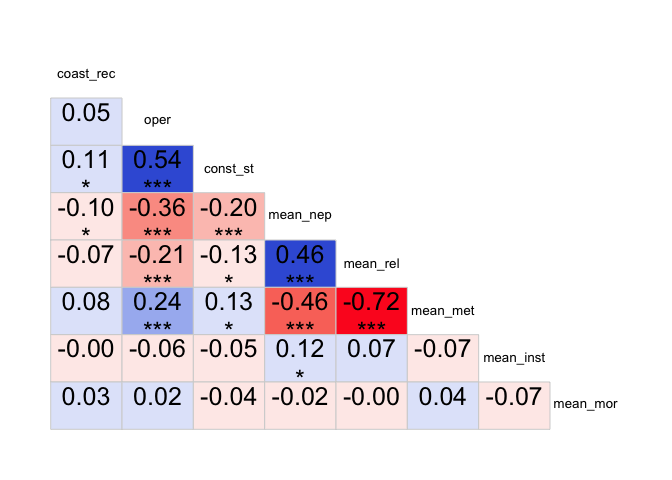

# Correlation exploration WF EV
Sarah Klain  
May 1, 2016  


Setup


```r
library(Hmisc) #to run correlations with sig levels
```

```
## Loading required package: grid
## Loading required package: lattice
## Loading required package: survival
## Loading required package: Formula
## Loading required package: ggplot2
```

```
## Warning: package 'ggplot2' was built under R version 3.2.4
```

```
## Warning: replacing previous import by 'ggplot2::unit' when loading 'Hmisc'
```

```
## Warning: replacing previous import by 'ggplot2::arrow' when loading 'Hmisc'
```

```
## Warning: replacing previous import by 'scales::alpha' when loading 'Hmisc'
```

```
## 
## Attaching package: 'Hmisc'
## 
## The following objects are masked from 'package:base':
## 
##     format.pval, round.POSIXt, trunc.POSIXt, units
```

```r
library(corrgram)
library(corrplot) # for great charts
```

```
## Warning: package 'corrplot' was built under R version 3.2.5
```

```r
# library(stats) # for PCA
# library(psych)
```

Input data

In cer_2016_01_08_dem4.csv I recoded const_st by removing the 5s, which removes the "not sure" responses

```r
setwd("/Users/sarahklain/Documents/R_2015/navi") #set working directory
ev_wf <- read.csv("cer_2016_01_08_dem4.csv")
#str(ev_wf)
```

### Correlations


```r
corr1 <- rcorr(as.matrix(ev_wf[11:37]), type = "pearson")
corr1
```

```
##               coast_rec att_w_US  oper const_st wf_rec abuse_nep bal_r_nep
## coast_rec          1.00     0.05  0.04     0.11  -0.05     -0.08     -0.04
## att_w_US           0.05     1.00  0.11     0.08  -0.05     -0.02     -0.03
## oper               0.04     0.11  1.00     0.54  -0.21     -0.32     -0.17
## const_st           0.11     0.08  0.54     1.00  -0.30     -0.18     -0.10
## wf_rec            -0.05    -0.05 -0.21    -0.30   1.00      0.08      0.03
## abuse_nep         -0.08    -0.02 -0.32    -0.18   0.08      1.00      0.44
## bal_r_nep         -0.04    -0.03 -0.17    -0.10   0.03      0.44      1.00
## crisis_r_nep      -0.07    -0.07 -0.35    -0.23   0.12      0.58      0.59
## spaceship_nep     -0.11    -0.02 -0.25    -0.11   0.03      0.50      0.38
## bau_nep           -0.12    -0.03 -0.31    -0.16   0.10      0.65      0.49
## extract_r_ins      0.00     0.03 -0.03     0.05   0.02      0.24      0.25
## loss_r_ins        -0.01     0.01 -0.13    -0.03   0.07      0.32      0.43
## decade_r_mor      -0.01     0.02 -0.15    -0.10  -0.02      0.47      0.48
## comm_rel          -0.08    -0.04 -0.14    -0.10   0.07      0.31      0.22
## wild_rel          -0.04     0.00 -0.21    -0.20  -0.01      0.38      0.25
## clean_inst         0.00    -0.08 -0.40    -0.27   0.13      0.47      0.34
## tech_r             0.07     0.09  0.13     0.11  -0.13      0.01      0.18
## iden_rel          -0.04    -0.04 -0.22    -0.13   0.07      0.38      0.26
## kin_rel           -0.06     0.00 -0.13    -0.06   0.03      0.37      0.20
## right_r_mor       -0.06     0.02 -0.17    -0.07   0.01      0.56      0.53
## health_rel         0.05     0.08  0.13     0.17  -0.06     -0.33     -0.38
## other_rel         -0.03    -0.07 -0.27    -0.17   0.01      0.44      0.31
## kin_met            0.02    -0.02  0.18     0.09  -0.07     -0.30     -0.13
## resp_met           0.10     0.02  0.27     0.14  -0.04     -0.41     -0.26
## iden_met           0.05     0.06  0.18     0.05  -0.02     -0.28     -0.08
## other_met          0.09     0.01  0.24     0.17  -0.05     -0.39     -0.30
## mean_nep          -0.10    -0.05 -0.36    -0.20   0.09      0.79      0.75
##               crisis_r_nep spaceship_nep bau_nep extract_r_ins loss_r_ins
## coast_rec            -0.07         -0.11   -0.12          0.00      -0.01
## att_w_US             -0.07         -0.02   -0.03          0.03       0.01
## oper                 -0.35         -0.25   -0.31         -0.03      -0.13
## const_st             -0.23         -0.11   -0.16          0.05      -0.03
## wf_rec                0.12          0.03    0.10          0.02       0.07
## abuse_nep             0.58          0.50    0.65          0.24       0.32
## bal_r_nep             0.59          0.38    0.49          0.25       0.43
## crisis_r_nep          1.00          0.39    0.65          0.26       0.35
## spaceship_nep         0.39          1.00    0.49          0.22       0.21
## bau_nep               0.65          0.49    1.00          0.30       0.30
## extract_r_ins         0.26          0.22    0.30          1.00       0.26
## loss_r_ins            0.35          0.21    0.30          0.26       1.00
## decade_r_mor          0.47          0.33    0.45          0.31       0.43
## comm_rel              0.29          0.22    0.33          0.10       0.23
## wild_rel              0.33          0.30    0.37          0.19       0.20
## clean_inst            0.46          0.30    0.41          0.23       0.34
## tech_r                0.05         -0.05    0.01          0.17       0.17
## iden_rel              0.38          0.30    0.41          0.23       0.29
## kin_rel               0.27          0.24    0.38          0.19       0.30
## right_r_mor           0.48          0.36    0.43          0.35       0.41
## health_rel           -0.40         -0.23   -0.33         -0.12      -0.25
## other_rel             0.45          0.35    0.44          0.21       0.26
## kin_met              -0.21         -0.29   -0.34         -0.16      -0.23
## resp_met             -0.34         -0.34   -0.42         -0.19      -0.32
## iden_met             -0.19         -0.25   -0.33         -0.10      -0.11
## other_met            -0.41         -0.32   -0.38         -0.14      -0.32
## mean_nep              0.83          0.70    0.84          0.32       0.41
##               decade_r_mor comm_rel wild_rel clean_inst tech_r iden_rel
## coast_rec            -0.01    -0.08    -0.04       0.00   0.07    -0.04
## att_w_US              0.02    -0.04     0.00      -0.08   0.09    -0.04
## oper                 -0.15    -0.14    -0.21      -0.40   0.13    -0.22
## const_st             -0.10    -0.10    -0.20      -0.27   0.11    -0.13
## wf_rec               -0.02     0.07    -0.01       0.13  -0.13     0.07
## abuse_nep             0.47     0.31     0.38       0.47   0.01     0.38
## bal_r_nep             0.48     0.22     0.25       0.34   0.18     0.26
## crisis_r_nep          0.47     0.29     0.33       0.46   0.05     0.38
## spaceship_nep         0.33     0.22     0.30       0.30  -0.05     0.30
## bau_nep               0.45     0.33     0.37       0.41   0.01     0.41
## extract_r_ins         0.31     0.10     0.19       0.23   0.17     0.23
## loss_r_ins            0.43     0.23     0.20       0.34   0.17     0.29
## decade_r_mor          1.00     0.24     0.36       0.38   0.13     0.41
## comm_rel              0.24     1.00     0.44       0.29  -0.03     0.38
## wild_rel              0.36     0.44     1.00       0.28  -0.06     0.55
## clean_inst            0.38     0.29     0.28       1.00  -0.05     0.42
## tech_r                0.13    -0.03    -0.06      -0.05   1.00    -0.04
## iden_rel              0.41     0.38     0.55       0.42  -0.04     1.00
## kin_rel               0.34     0.48     0.43       0.30  -0.02     0.61
## right_r_mor           0.68     0.26     0.37       0.43   0.16     0.42
## health_rel           -0.42    -0.22    -0.26      -0.29  -0.11    -0.31
## other_rel             0.41     0.36     0.38       0.45  -0.07     0.38
## kin_met              -0.22    -0.42    -0.52      -0.24   0.10    -0.57
## resp_met             -0.40    -0.40    -0.56      -0.41   0.06    -0.56
## iden_met             -0.21    -0.34    -0.45      -0.22   0.11    -0.54
## other_met            -0.37    -0.36    -0.42      -0.44   0.06    -0.39
## mean_nep              0.56     0.35     0.42       0.50   0.05     0.44
##               kin_rel right_r_mor health_rel other_rel kin_met resp_met
## coast_rec       -0.06       -0.06       0.05     -0.03    0.02     0.10
## att_w_US         0.00        0.02       0.08     -0.07   -0.02     0.02
## oper            -0.13       -0.17       0.13     -0.27    0.18     0.27
## const_st        -0.06       -0.07       0.17     -0.17    0.09     0.14
## wf_rec           0.03        0.01      -0.06      0.01   -0.07    -0.04
## abuse_nep        0.37        0.56      -0.33      0.44   -0.30    -0.41
## bal_r_nep        0.20        0.53      -0.38      0.31   -0.13    -0.26
## crisis_r_nep     0.27        0.48      -0.40      0.45   -0.21    -0.34
## spaceship_nep    0.24        0.36      -0.23      0.35   -0.29    -0.34
## bau_nep          0.38        0.43      -0.33      0.44   -0.34    -0.42
## extract_r_ins    0.19        0.35      -0.12      0.21   -0.16    -0.19
## loss_r_ins       0.30        0.41      -0.25      0.26   -0.23    -0.32
## decade_r_mor     0.34        0.68      -0.42      0.41   -0.22    -0.40
## comm_rel         0.48        0.26      -0.22      0.36   -0.42    -0.40
## wild_rel         0.43        0.37      -0.26      0.38   -0.52    -0.56
## clean_inst       0.30        0.43      -0.29      0.45   -0.24    -0.41
## tech_r          -0.02        0.16      -0.11     -0.07    0.10     0.06
## iden_rel         0.61        0.42      -0.31      0.38   -0.57    -0.56
## kin_rel          1.00        0.39      -0.29      0.40   -0.57    -0.56
## right_r_mor      0.39        1.00      -0.40      0.36   -0.26    -0.42
## health_rel      -0.29       -0.40       1.00     -0.39    0.18     0.28
## other_rel        0.40        0.36      -0.39      1.00   -0.28    -0.38
## kin_met         -0.57       -0.26       0.18     -0.28    1.00     0.66
## resp_met        -0.56       -0.42       0.28     -0.38    0.66     1.00
## iden_met        -0.48       -0.26       0.16     -0.21    0.74     0.61
## other_met       -0.40       -0.34       0.34     -0.48    0.43     0.50
## mean_nep         0.37        0.60      -0.43      0.51   -0.32    -0.45
##               iden_met other_met mean_nep
## coast_rec         0.05      0.09    -0.10
## att_w_US          0.06      0.01    -0.05
## oper              0.18      0.24    -0.36
## const_st          0.05      0.17    -0.20
## wf_rec           -0.02     -0.05     0.09
## abuse_nep        -0.28     -0.39     0.79
## bal_r_nep        -0.08     -0.30     0.75
## crisis_r_nep     -0.19     -0.41     0.83
## spaceship_nep    -0.25     -0.32     0.70
## bau_nep          -0.33     -0.38     0.84
## extract_r_ins    -0.10     -0.14     0.32
## loss_r_ins       -0.11     -0.32     0.41
## decade_r_mor     -0.21     -0.37     0.56
## comm_rel         -0.34     -0.36     0.35
## wild_rel         -0.45     -0.42     0.42
## clean_inst       -0.22     -0.44     0.50
## tech_r            0.11      0.06     0.05
## iden_rel         -0.54     -0.39     0.44
## kin_rel          -0.48     -0.40     0.37
## right_r_mor      -0.26     -0.34     0.60
## health_rel        0.16      0.34    -0.43
## other_rel        -0.21     -0.48     0.51
## kin_met           0.74      0.43    -0.32
## resp_met          0.61      0.50    -0.45
## iden_met          1.00      0.33    -0.29
## other_met         0.33      1.00    -0.46
## mean_nep         -0.29     -0.46     1.00
## 
## n
##               coast_rec att_w_US oper const_st wf_rec abuse_nep bal_r_nep
## coast_rec           400      400  400      382    400       400       400
## att_w_US            400      400  400      382    400       400       400
## oper                400      400  400      382    400       400       400
## const_st            382      382  382      382    382       382       382
## wf_rec              400      400  400      382    400       400       400
## abuse_nep           400      400  400      382    400       400       400
## bal_r_nep           400      400  400      382    400       400       400
## crisis_r_nep        400      400  400      382    400       400       400
## spaceship_nep       398      398  398      380    398       398       398
## bau_nep             400      400  400      382    400       400       400
## extract_r_ins       400      400  400      382    400       400       400
## loss_r_ins          398      398  398      380    398       398       398
## decade_r_mor        400      400  400      382    400       400       400
## comm_rel            399      399  399      381    399       399       399
## wild_rel            400      400  400      382    400       400       400
## clean_inst          400      400  400      382    400       400       400
## tech_r              400      400  400      382    400       400       400
## iden_rel            400      400  400      382    400       400       400
## kin_rel             398      398  398      380    398       398       398
## right_r_mor         398      398  398      380    398       398       398
## health_rel          398      398  398      380    398       398       398
## other_rel           400      400  400      382    400       400       400
## kin_met             398      398  398      381    398       398       398
## resp_met            399      399  399      381    399       399       399
## iden_met            400      400  400      382    400       400       400
## other_met           400      400  400      382    400       400       400
## mean_nep            400      400  400      382    400       400       400
##               crisis_r_nep spaceship_nep bau_nep extract_r_ins loss_r_ins
## coast_rec              400           398     400           400        398
## att_w_US               400           398     400           400        398
## oper                   400           398     400           400        398
## const_st               382           380     382           382        380
## wf_rec                 400           398     400           400        398
## abuse_nep              400           398     400           400        398
## bal_r_nep              400           398     400           400        398
## crisis_r_nep           400           398     400           400        398
## spaceship_nep          398           398     398           398        396
## bau_nep                400           398     400           400        398
## extract_r_ins          400           398     400           400        398
## loss_r_ins             398           396     398           398        398
## decade_r_mor           400           398     400           400        398
## comm_rel               399           397     399           399        397
## wild_rel               400           398     400           400        398
## clean_inst             400           398     400           400        398
## tech_r                 400           398     400           400        398
## iden_rel               400           398     400           400        398
## kin_rel                398           396     398           398        396
## right_r_mor            398           396     398           398        396
## health_rel             398           396     398           398        396
## other_rel              400           398     400           400        398
## kin_met                398           396     398           398        396
## resp_met               399           397     399           399        397
## iden_met               400           398     400           400        398
## other_met              400           398     400           400        398
## mean_nep               400           398     400           400        398
##               decade_r_mor comm_rel wild_rel clean_inst tech_r iden_rel
## coast_rec              400      399      400        400    400      400
## att_w_US               400      399      400        400    400      400
## oper                   400      399      400        400    400      400
## const_st               382      381      382        382    382      382
## wf_rec                 400      399      400        400    400      400
## abuse_nep              400      399      400        400    400      400
## bal_r_nep              400      399      400        400    400      400
## crisis_r_nep           400      399      400        400    400      400
## spaceship_nep          398      397      398        398    398      398
## bau_nep                400      399      400        400    400      400
## extract_r_ins          400      399      400        400    400      400
## loss_r_ins             398      397      398        398    398      398
## decade_r_mor           400      399      400        400    400      400
## comm_rel               399      399      399        399    399      399
## wild_rel               400      399      400        400    400      400
## clean_inst             400      399      400        400    400      400
## tech_r                 400      399      400        400    400      400
## iden_rel               400      399      400        400    400      400
## kin_rel                398      397      398        398    398      398
## right_r_mor            398      397      398        398    398      398
## health_rel             398      397      398        398    398      398
## other_rel              400      399      400        400    400      400
## kin_met                398      397      398        398    398      398
## resp_met               399      398      399        399    399      399
## iden_met               400      399      400        400    400      400
## other_met              400      399      400        400    400      400
## mean_nep               400      399      400        400    400      400
##               kin_rel right_r_mor health_rel other_rel kin_met resp_met
## coast_rec         398         398        398       400     398      399
## att_w_US          398         398        398       400     398      399
## oper              398         398        398       400     398      399
## const_st          380         380        380       382     381      381
## wf_rec            398         398        398       400     398      399
## abuse_nep         398         398        398       400     398      399
## bal_r_nep         398         398        398       400     398      399
## crisis_r_nep      398         398        398       400     398      399
## spaceship_nep     396         396        396       398     396      397
## bau_nep           398         398        398       400     398      399
## extract_r_ins     398         398        398       400     398      399
## loss_r_ins        396         396        396       398     396      397
## decade_r_mor      398         398        398       400     398      399
## comm_rel          397         397        397       399     397      398
## wild_rel          398         398        398       400     398      399
## clean_inst        398         398        398       400     398      399
## tech_r            398         398        398       400     398      399
## iden_rel          398         398        398       400     398      399
## kin_rel           398         397        396       398     396      397
## right_r_mor       397         398        396       398     396      397
## health_rel        396         396        398       398     396      397
## other_rel         398         398        398       400     398      399
## kin_met           396         396        396       398     398      397
## resp_met          397         397        397       399     397      399
## iden_met          398         398        398       400     398      399
## other_met         398         398        398       400     398      399
## mean_nep          398         398        398       400     398      399
##               iden_met other_met mean_nep
## coast_rec          400       400      400
## att_w_US           400       400      400
## oper               400       400      400
## const_st           382       382      382
## wf_rec             400       400      400
## abuse_nep          400       400      400
## bal_r_nep          400       400      400
## crisis_r_nep       400       400      400
## spaceship_nep      398       398      398
## bau_nep            400       400      400
## extract_r_ins      400       400      400
## loss_r_ins         398       398      398
## decade_r_mor       400       400      400
## comm_rel           399       399      399
## wild_rel           400       400      400
## clean_inst         400       400      400
## tech_r             400       400      400
## iden_rel           400       400      400
## kin_rel            398       398      398
## right_r_mor        398       398      398
## health_rel         398       398      398
## other_rel          400       400      400
## kin_met            398       398      398
## resp_met           399       399      399
## iden_met           400       400      400
## other_met          400       400      400
## mean_nep           400       400      400
## 
## P
##               coast_rec att_w_US oper   const_st wf_rec abuse_nep
## coast_rec               0.3375   0.3828 0.0398   0.3204 0.1091   
## att_w_US      0.3375             0.0259 0.1275   0.3087 0.6244   
## oper          0.3828    0.0259          0.0000   0.0000 0.0000   
## const_st      0.0398    0.1275   0.0000          0.0000 0.0003   
## wf_rec        0.3204    0.3087   0.0000 0.0000          0.0979   
## abuse_nep     0.1091    0.6244   0.0000 0.0003   0.0979          
## bal_r_nep     0.4526    0.5068   0.0007 0.0407   0.6010 0.0000   
## crisis_r_nep  0.1779    0.1792   0.0000 0.0000   0.0128 0.0000   
## spaceship_nep 0.0334    0.7325   0.0000 0.0269   0.6042 0.0000   
## bau_nep       0.0212    0.5216   0.0000 0.0022   0.0471 0.0000   
## extract_r_ins 0.9755    0.5896   0.5573 0.3660   0.7135 0.0000   
## loss_r_ins    0.8908    0.8224   0.0123 0.5082   0.1514 0.0000   
## decade_r_mor  0.7719    0.6511   0.0028 0.0484   0.6394 0.0000   
## comm_rel      0.1261    0.4304   0.0040 0.0610   0.1789 0.0000   
## wild_rel      0.4206    0.9583   0.0000 0.0000   0.9083 0.0000   
## clean_inst    0.9427    0.1235   0.0000 0.0000   0.0086 0.0000   
## tech_r        0.1430    0.0594   0.0106 0.0353   0.0115 0.7687   
## iden_rel      0.4760    0.4270   0.0000 0.0100   0.1441 0.0000   
## kin_rel       0.2620    0.9763   0.0084 0.2401   0.5897 0.0000   
## right_r_mor   0.2571    0.6545   0.0008 0.1584   0.8711 0.0000   
## health_rel    0.2967    0.1168   0.0106 0.0006   0.2400 0.0000   
## other_rel     0.5195    0.1717   0.0000 0.0010   0.8457 0.0000   
## kin_met       0.6495    0.6745   0.0003 0.0716   0.1509 0.0000   
## resp_met      0.0378    0.6291   0.0000 0.0071   0.4631 0.0000   
## iden_met      0.3105    0.2416   0.0003 0.3683   0.7131 0.0000   
## other_met     0.0818    0.8594   0.0000 0.0007   0.2886 0.0000   
## mean_nep      0.0370    0.3680   0.0000 0.0000   0.0602 0.0000   
##               bal_r_nep crisis_r_nep spaceship_nep bau_nep extract_r_ins
## coast_rec     0.4526    0.1779       0.0334        0.0212  0.9755       
## att_w_US      0.5068    0.1792       0.7325        0.5216  0.5896       
## oper          0.0007    0.0000       0.0000        0.0000  0.5573       
## const_st      0.0407    0.0000       0.0269        0.0022  0.3660       
## wf_rec        0.6010    0.0128       0.6042        0.0471  0.7135       
## abuse_nep     0.0000    0.0000       0.0000        0.0000  0.0000       
## bal_r_nep               0.0000       0.0000        0.0000  0.0000       
## crisis_r_nep  0.0000                 0.0000        0.0000  0.0000       
## spaceship_nep 0.0000    0.0000                     0.0000  0.0000       
## bau_nep       0.0000    0.0000       0.0000                0.0000       
## extract_r_ins 0.0000    0.0000       0.0000        0.0000               
## loss_r_ins    0.0000    0.0000       0.0000        0.0000  0.0000       
## decade_r_mor  0.0000    0.0000       0.0000        0.0000  0.0000       
## comm_rel      0.0000    0.0000       0.0000        0.0000  0.0572       
## wild_rel      0.0000    0.0000       0.0000        0.0000  0.0001       
## clean_inst    0.0000    0.0000       0.0000        0.0000  0.0000       
## tech_r        0.0004    0.3431       0.3653        0.9059  0.0006       
## iden_rel      0.0000    0.0000       0.0000        0.0000  0.0000       
## kin_rel       0.0000    0.0000       0.0000        0.0000  0.0001       
## right_r_mor   0.0000    0.0000       0.0000        0.0000  0.0000       
## health_rel    0.0000    0.0000       0.0000        0.0000  0.0138       
## other_rel     0.0000    0.0000       0.0000        0.0000  0.0000       
## kin_met       0.0091    0.0000       0.0000        0.0000  0.0014       
## resp_met      0.0000    0.0000       0.0000        0.0000  0.0001       
## iden_met      0.0902    0.0001       0.0000        0.0000  0.0424       
## other_met     0.0000    0.0000       0.0000        0.0000  0.0068       
## mean_nep      0.0000    0.0000       0.0000        0.0000  0.0000       
##               loss_r_ins decade_r_mor comm_rel wild_rel clean_inst tech_r
## coast_rec     0.8908     0.7719       0.1261   0.4206   0.9427     0.1430
## att_w_US      0.8224     0.6511       0.4304   0.9583   0.1235     0.0594
## oper          0.0123     0.0028       0.0040   0.0000   0.0000     0.0106
## const_st      0.5082     0.0484       0.0610   0.0000   0.0000     0.0353
## wf_rec        0.1514     0.6394       0.1789   0.9083   0.0086     0.0115
## abuse_nep     0.0000     0.0000       0.0000   0.0000   0.0000     0.7687
## bal_r_nep     0.0000     0.0000       0.0000   0.0000   0.0000     0.0004
## crisis_r_nep  0.0000     0.0000       0.0000   0.0000   0.0000     0.3431
## spaceship_nep 0.0000     0.0000       0.0000   0.0000   0.0000     0.3653
## bau_nep       0.0000     0.0000       0.0000   0.0000   0.0000     0.9059
## extract_r_ins 0.0000     0.0000       0.0572   0.0001   0.0000     0.0006
## loss_r_ins               0.0000       0.0000   0.0000   0.0000     0.0007
## decade_r_mor  0.0000                  0.0000   0.0000   0.0000     0.0070
## comm_rel      0.0000     0.0000                0.0000   0.0000     0.5614
## wild_rel      0.0000     0.0000       0.0000            0.0000     0.2419
## clean_inst    0.0000     0.0000       0.0000   0.0000              0.3536
## tech_r        0.0007     0.0070       0.5614   0.2419   0.3536           
## iden_rel      0.0000     0.0000       0.0000   0.0000   0.0000     0.4302
## kin_rel       0.0000     0.0000       0.0000   0.0000   0.0000     0.7250
## right_r_mor   0.0000     0.0000       0.0000   0.0000   0.0000     0.0018
## health_rel    0.0000     0.0000       0.0000   0.0000   0.0000     0.0299
## other_rel     0.0000     0.0000       0.0000   0.0000   0.0000     0.1542
## kin_met       0.0000     0.0000       0.0000   0.0000   0.0000     0.0449
## resp_met      0.0000     0.0000       0.0000   0.0000   0.0000     0.1964
## iden_met      0.0283     0.0000       0.0000   0.0000   0.0000     0.0307
## other_met     0.0000     0.0000       0.0000   0.0000   0.0000     0.1980
## mean_nep      0.0000     0.0000       0.0000   0.0000   0.0000     0.2986
##               iden_rel kin_rel right_r_mor health_rel other_rel kin_met
## coast_rec     0.4760   0.2620  0.2571      0.2967     0.5195    0.6495 
## att_w_US      0.4270   0.9763  0.6545      0.1168     0.1717    0.6745 
## oper          0.0000   0.0084  0.0008      0.0106     0.0000    0.0003 
## const_st      0.0100   0.2401  0.1584      0.0006     0.0010    0.0716 
## wf_rec        0.1441   0.5897  0.8711      0.2400     0.8457    0.1509 
## abuse_nep     0.0000   0.0000  0.0000      0.0000     0.0000    0.0000 
## bal_r_nep     0.0000   0.0000  0.0000      0.0000     0.0000    0.0091 
## crisis_r_nep  0.0000   0.0000  0.0000      0.0000     0.0000    0.0000 
## spaceship_nep 0.0000   0.0000  0.0000      0.0000     0.0000    0.0000 
## bau_nep       0.0000   0.0000  0.0000      0.0000     0.0000    0.0000 
## extract_r_ins 0.0000   0.0001  0.0000      0.0138     0.0000    0.0014 
## loss_r_ins    0.0000   0.0000  0.0000      0.0000     0.0000    0.0000 
## decade_r_mor  0.0000   0.0000  0.0000      0.0000     0.0000    0.0000 
## comm_rel      0.0000   0.0000  0.0000      0.0000     0.0000    0.0000 
## wild_rel      0.0000   0.0000  0.0000      0.0000     0.0000    0.0000 
## clean_inst    0.0000   0.0000  0.0000      0.0000     0.0000    0.0000 
## tech_r        0.4302   0.7250  0.0018      0.0299     0.1542    0.0449 
## iden_rel               0.0000  0.0000      0.0000     0.0000    0.0000 
## kin_rel       0.0000           0.0000      0.0000     0.0000    0.0000 
## right_r_mor   0.0000   0.0000              0.0000     0.0000    0.0000 
## health_rel    0.0000   0.0000  0.0000                 0.0000    0.0004 
## other_rel     0.0000   0.0000  0.0000      0.0000               0.0000 
## kin_met       0.0000   0.0000  0.0000      0.0004     0.0000           
## resp_met      0.0000   0.0000  0.0000      0.0000     0.0000    0.0000 
## iden_met      0.0000   0.0000  0.0000      0.0010     0.0000    0.0000 
## other_met     0.0000   0.0000  0.0000      0.0000     0.0000    0.0000 
## mean_nep      0.0000   0.0000  0.0000      0.0000     0.0000    0.0000 
##               resp_met iden_met other_met mean_nep
## coast_rec     0.0378   0.3105   0.0818    0.0370  
## att_w_US      0.6291   0.2416   0.8594    0.3680  
## oper          0.0000   0.0003   0.0000    0.0000  
## const_st      0.0071   0.3683   0.0007    0.0000  
## wf_rec        0.4631   0.7131   0.2886    0.0602  
## abuse_nep     0.0000   0.0000   0.0000    0.0000  
## bal_r_nep     0.0000   0.0902   0.0000    0.0000  
## crisis_r_nep  0.0000   0.0001   0.0000    0.0000  
## spaceship_nep 0.0000   0.0000   0.0000    0.0000  
## bau_nep       0.0000   0.0000   0.0000    0.0000  
## extract_r_ins 0.0001   0.0424   0.0068    0.0000  
## loss_r_ins    0.0000   0.0283   0.0000    0.0000  
## decade_r_mor  0.0000   0.0000   0.0000    0.0000  
## comm_rel      0.0000   0.0000   0.0000    0.0000  
## wild_rel      0.0000   0.0000   0.0000    0.0000  
## clean_inst    0.0000   0.0000   0.0000    0.0000  
## tech_r        0.1964   0.0307   0.1980    0.2986  
## iden_rel      0.0000   0.0000   0.0000    0.0000  
## kin_rel       0.0000   0.0000   0.0000    0.0000  
## right_r_mor   0.0000   0.0000   0.0000    0.0000  
## health_rel    0.0000   0.0010   0.0000    0.0000  
## other_rel     0.0000   0.0000   0.0000    0.0000  
## kin_met       0.0000   0.0000   0.0000    0.0000  
## resp_met               0.0000   0.0000    0.0000  
## iden_met      0.0000            0.0000    0.0000  
## other_met     0.0000   0.0000             0.0000  
## mean_nep      0.0000   0.0000   0.0000
```

```r
ev_sn <- read.csv("cer_snip.csv")
 
corr2 <- rcorr(as.matrix(ev_sn), type = "pearson")
corr2
```

```
##               coast_rec att_w_US  oper const_st wf_rec abuse_nep bal_r_nep
## coast_rec          1.00     0.05  0.04     0.11  -0.05     -0.08     -0.04
## att_w_US           0.05     1.00  0.11     0.08  -0.05     -0.02     -0.03
## oper               0.04     0.11  1.00     0.54  -0.21     -0.32     -0.17
## const_st           0.11     0.08  0.54     1.00  -0.30     -0.18     -0.10
## wf_rec            -0.05    -0.05 -0.21    -0.30   1.00      0.08      0.03
## abuse_nep         -0.08    -0.02 -0.32    -0.18   0.08      1.00      0.44
## bal_r_nep         -0.04    -0.03 -0.17    -0.10   0.03      0.44      1.00
## crisis_r_nep      -0.07    -0.07 -0.35    -0.23   0.12      0.58      0.59
## spaceship_nep     -0.11    -0.02 -0.25    -0.11   0.03      0.50      0.38
## bau_nep           -0.12    -0.03 -0.31    -0.16   0.10      0.65      0.49
## extract_r_ins      0.00     0.03 -0.03     0.05   0.02      0.24      0.25
## loss_r_ins        -0.01     0.01 -0.13    -0.03   0.07      0.32      0.43
## decade_r_mor      -0.01     0.02 -0.15    -0.10  -0.02      0.47      0.48
## comm_rel          -0.08    -0.04 -0.14    -0.10   0.07      0.31      0.22
## wild_rel          -0.04     0.00 -0.21    -0.20  -0.01      0.38      0.25
## clean_inst         0.00    -0.08 -0.40    -0.27   0.13      0.47      0.34
## tech_r             0.07     0.09  0.13     0.11  -0.13      0.01      0.18
## iden_rel          -0.04    -0.04 -0.22    -0.13   0.07      0.38      0.26
## kin_rel           -0.06     0.00 -0.13    -0.06   0.03      0.37      0.20
## right_r_mor       -0.06     0.02 -0.17    -0.07   0.01      0.56      0.53
## health_rel         0.05     0.08  0.13     0.17  -0.06     -0.33     -0.38
## other_rel         -0.03    -0.07 -0.27    -0.17   0.01      0.44      0.31
## kin_met            0.02    -0.02  0.18     0.09  -0.07     -0.30     -0.13
## resp_met           0.10     0.02  0.27     0.14  -0.04     -0.41     -0.26
## iden_met           0.05     0.06  0.18     0.05  -0.02     -0.28     -0.08
## other_met          0.09     0.01  0.24     0.17  -0.05     -0.39     -0.30
## mean_nep          -0.10    -0.05 -0.36    -0.20   0.09      0.79      0.75
## mean_rel          -0.05    -0.01 -0.24    -0.13   0.03      0.43      0.22
## mean_met           0.08     0.02  0.26     0.13  -0.06     -0.42     -0.22
## mean_inst          0.00    -0.02 -0.08    -0.05   0.01      0.10     -0.03
## mean_mor           0.05     0.00  0.02    -0.04  -0.04     -0.10     -0.03
##               crisis_r_nep spaceship_nep bau_nep extract_r_ins loss_r_ins
## coast_rec            -0.07         -0.11   -0.12          0.00      -0.01
## att_w_US             -0.07         -0.02   -0.03          0.03       0.01
## oper                 -0.35         -0.25   -0.31         -0.03      -0.13
## const_st             -0.23         -0.11   -0.16          0.05      -0.03
## wf_rec                0.12          0.03    0.10          0.02       0.07
## abuse_nep             0.58          0.50    0.65          0.24       0.32
## bal_r_nep             0.59          0.38    0.49          0.25       0.43
## crisis_r_nep          1.00          0.39    0.65          0.26       0.35
## spaceship_nep         0.39          1.00    0.49          0.22       0.21
## bau_nep               0.65          0.49    1.00          0.30       0.30
## extract_r_ins         0.26          0.22    0.30          1.00       0.26
## loss_r_ins            0.35          0.21    0.30          0.26       1.00
## decade_r_mor          0.47          0.33    0.45          0.31       0.43
## comm_rel              0.29          0.22    0.33          0.10       0.23
## wild_rel              0.33          0.30    0.37          0.19       0.20
## clean_inst            0.46          0.30    0.41          0.23       0.34
## tech_r                0.05         -0.05    0.01          0.17       0.17
## iden_rel              0.38          0.30    0.41          0.23       0.29
## kin_rel               0.27          0.24    0.38          0.19       0.30
## right_r_mor           0.48          0.36    0.43          0.35       0.41
## health_rel           -0.40         -0.23   -0.33         -0.12      -0.25
## other_rel             0.45          0.35    0.44          0.21       0.26
## kin_met              -0.21         -0.29   -0.34         -0.16      -0.23
## resp_met             -0.34         -0.34   -0.42         -0.19      -0.32
## iden_met             -0.19         -0.25   -0.33         -0.10      -0.11
## other_met            -0.41         -0.32   -0.38         -0.14      -0.32
## mean_nep              0.83          0.70    0.84          0.32       0.41
## mean_rel              0.35          0.33    0.44          0.22       0.28
## mean_met             -0.34         -0.36   -0.45         -0.17      -0.29
## mean_inst             0.08          0.10    0.13          0.61      -0.52
## mean_mor              0.01         -0.03    0.04         -0.03       0.04
##               decade_r_mor comm_rel wild_rel clean_inst tech_r iden_rel
## coast_rec            -0.01    -0.08    -0.04       0.00   0.07    -0.04
## att_w_US              0.02    -0.04     0.00      -0.08   0.09    -0.04
## oper                 -0.15    -0.14    -0.21      -0.40   0.13    -0.22
## const_st             -0.10    -0.10    -0.20      -0.27   0.11    -0.13
## wf_rec               -0.02     0.07    -0.01       0.13  -0.13     0.07
## abuse_nep             0.47     0.31     0.38       0.47   0.01     0.38
## bal_r_nep             0.48     0.22     0.25       0.34   0.18     0.26
## crisis_r_nep          0.47     0.29     0.33       0.46   0.05     0.38
## spaceship_nep         0.33     0.22     0.30       0.30  -0.05     0.30
## bau_nep               0.45     0.33     0.37       0.41   0.01     0.41
## extract_r_ins         0.31     0.10     0.19       0.23   0.17     0.23
## loss_r_ins            0.43     0.23     0.20       0.34   0.17     0.29
## decade_r_mor          1.00     0.24     0.36       0.38   0.13     0.41
## comm_rel              0.24     1.00     0.44       0.29  -0.03     0.38
## wild_rel              0.36     0.44     1.00       0.28  -0.06     0.55
## clean_inst            0.38     0.29     0.28       1.00  -0.05     0.42
## tech_r                0.13    -0.03    -0.06      -0.05   1.00    -0.04
## iden_rel              0.41     0.38     0.55       0.42  -0.04     1.00
## kin_rel               0.34     0.48     0.43       0.30  -0.02     0.61
## right_r_mor           0.68     0.26     0.37       0.43   0.16     0.42
## health_rel           -0.42    -0.22    -0.26      -0.29  -0.11    -0.31
## other_rel             0.41     0.36     0.38       0.45  -0.07     0.38
## kin_met              -0.22    -0.42    -0.52      -0.24   0.10    -0.57
## resp_met             -0.40    -0.40    -0.56      -0.41   0.06    -0.56
## iden_met             -0.21    -0.34    -0.45      -0.22   0.11    -0.54
## other_met            -0.37    -0.36    -0.42      -0.44   0.06    -0.39
## mean_nep              0.56     0.35     0.42       0.50   0.05     0.44
## mean_rel              0.37     0.67     0.74       0.39  -0.10     0.76
## mean_met             -0.36    -0.46    -0.60      -0.38   0.11    -0.63
## mean_inst             0.02    -0.01     0.09       0.29  -0.04     0.09
## mean_mor              0.43    -0.01     0.01      -0.05  -0.02     0.01
##               kin_rel right_r_mor health_rel other_rel kin_met resp_met
## coast_rec       -0.06       -0.06       0.05     -0.03    0.02     0.10
## att_w_US         0.00        0.02       0.08     -0.07   -0.02     0.02
## oper            -0.13       -0.17       0.13     -0.27    0.18     0.27
## const_st        -0.06       -0.07       0.17     -0.17    0.09     0.14
## wf_rec           0.03        0.01      -0.06      0.01   -0.07    -0.04
## abuse_nep        0.37        0.56      -0.33      0.44   -0.30    -0.41
## bal_r_nep        0.20        0.53      -0.38      0.31   -0.13    -0.26
## crisis_r_nep     0.27        0.48      -0.40      0.45   -0.21    -0.34
## spaceship_nep    0.24        0.36      -0.23      0.35   -0.29    -0.34
## bau_nep          0.38        0.43      -0.33      0.44   -0.34    -0.42
## extract_r_ins    0.19        0.35      -0.12      0.21   -0.16    -0.19
## loss_r_ins       0.30        0.41      -0.25      0.26   -0.23    -0.32
## decade_r_mor     0.34        0.68      -0.42      0.41   -0.22    -0.40
## comm_rel         0.48        0.26      -0.22      0.36   -0.42    -0.40
## wild_rel         0.43        0.37      -0.26      0.38   -0.52    -0.56
## clean_inst       0.30        0.43      -0.29      0.45   -0.24    -0.41
## tech_r          -0.02        0.16      -0.11     -0.07    0.10     0.06
## iden_rel         0.61        0.42      -0.31      0.38   -0.57    -0.56
## kin_rel          1.00        0.39      -0.29      0.40   -0.57    -0.56
## right_r_mor      0.39        1.00      -0.40      0.36   -0.26    -0.42
## health_rel      -0.29       -0.40       1.00     -0.39    0.18     0.28
## other_rel        0.40        0.36      -0.39      1.00   -0.28    -0.38
## kin_met         -0.57       -0.26       0.18     -0.28    1.00     0.66
## resp_met        -0.56       -0.42       0.28     -0.38    0.66     1.00
## iden_met        -0.48       -0.26       0.16     -0.21    0.74     0.61
## other_met       -0.40       -0.34       0.34     -0.48    0.43     0.50
## mean_nep         0.37        0.60      -0.43      0.51   -0.32    -0.45
## mean_rel         0.75        0.38      -0.06      0.56   -0.63    -0.63
## mean_met        -0.61       -0.38       0.28     -0.40    0.88     0.84
## mean_inst        0.02        0.08       0.00      0.11   -0.02    -0.04
## mean_mor        -0.04       -0.37      -0.04      0.09    0.04     0.01
##               iden_met other_met mean_nep mean_rel mean_met mean_inst
## coast_rec         0.05      0.09    -0.10    -0.05     0.08      0.00
## att_w_US          0.06      0.01    -0.05    -0.01     0.02     -0.02
## oper              0.18      0.24    -0.36    -0.24     0.26     -0.08
## const_st          0.05      0.17    -0.20    -0.13     0.13     -0.05
## wf_rec           -0.02     -0.05     0.09     0.03    -0.06      0.01
## abuse_nep        -0.28     -0.39     0.79     0.43    -0.42      0.10
## bal_r_nep        -0.08     -0.30     0.75     0.22    -0.22     -0.03
## crisis_r_nep     -0.19     -0.41     0.83     0.35    -0.34      0.08
## spaceship_nep    -0.25     -0.32     0.70     0.33    -0.36      0.10
## bau_nep          -0.33     -0.38     0.84     0.44    -0.45      0.13
## extract_r_ins    -0.10     -0.14     0.32     0.22    -0.17      0.61
## loss_r_ins       -0.11     -0.32     0.41     0.28    -0.29     -0.52
## decade_r_mor     -0.21     -0.37     0.56     0.37    -0.36      0.02
## comm_rel         -0.34     -0.36     0.35     0.67    -0.46     -0.01
## wild_rel         -0.45     -0.42     0.42     0.74    -0.60      0.09
## clean_inst       -0.22     -0.44     0.50     0.39    -0.38      0.29
## tech_r            0.11      0.06     0.05    -0.10     0.11     -0.04
## iden_rel         -0.54     -0.39     0.44     0.76    -0.63      0.09
## kin_rel          -0.48     -0.40     0.37     0.75    -0.61      0.02
## right_r_mor      -0.26     -0.34     0.60     0.38    -0.38      0.08
## health_rel        0.16      0.34    -0.43    -0.06     0.28      0.00
## other_rel        -0.21     -0.48     0.51     0.56    -0.40      0.11
## kin_met           0.74      0.43    -0.32    -0.63     0.88     -0.02
## resp_met          0.61      0.50    -0.45    -0.63     0.84     -0.04
## iden_met          1.00      0.33    -0.29    -0.55     0.85     -0.07
## other_met         0.33      1.00    -0.46    -0.47     0.66     -0.01
## mean_nep         -0.29     -0.46     1.00     0.45    -0.45      0.10
## mean_rel         -0.55     -0.47     0.45     1.00    -0.70      0.09
## mean_met          0.85      0.66    -0.45    -0.70     1.00     -0.05
## mean_inst        -0.07     -0.01     0.10     0.09    -0.05      1.00
## mean_mor          0.06     -0.06    -0.02     0.00     0.02     -0.07
##               mean_mor
## coast_rec         0.05
## att_w_US          0.00
## oper              0.02
## const_st         -0.04
## wf_rec           -0.04
## abuse_nep        -0.10
## bal_r_nep        -0.03
## crisis_r_nep      0.01
## spaceship_nep    -0.03
## bau_nep           0.04
## extract_r_ins    -0.03
## loss_r_ins        0.04
## decade_r_mor      0.43
## comm_rel         -0.01
## wild_rel          0.01
## clean_inst       -0.05
## tech_r           -0.02
## iden_rel          0.01
## kin_rel          -0.04
## right_r_mor      -0.37
## health_rel       -0.04
## other_rel         0.09
## kin_met           0.04
## resp_met          0.01
## iden_met          0.06
## other_met        -0.06
## mean_nep         -0.02
## mean_rel          0.00
## mean_met          0.02
## mean_inst        -0.07
## mean_mor          1.00
## 
## n
##               coast_rec att_w_US oper const_st wf_rec abuse_nep bal_r_nep
## coast_rec           400      400  400      382    400       400       400
## att_w_US            400      400  400      382    400       400       400
## oper                400      400  400      382    400       400       400
## const_st            382      382  382      382    382       382       382
## wf_rec              400      400  400      382    400       400       400
## abuse_nep           400      400  400      382    400       400       400
## bal_r_nep           400      400  400      382    400       400       400
## crisis_r_nep        400      400  400      382    400       400       400
## spaceship_nep       398      398  398      380    398       398       398
## bau_nep             400      400  400      382    400       400       400
## extract_r_ins       400      400  400      382    400       400       400
## loss_r_ins          398      398  398      380    398       398       398
## decade_r_mor        400      400  400      382    400       400       400
## comm_rel            399      399  399      381    399       399       399
## wild_rel            400      400  400      382    400       400       400
## clean_inst          400      400  400      382    400       400       400
## tech_r              400      400  400      382    400       400       400
## iden_rel            400      400  400      382    400       400       400
## kin_rel             398      398  398      380    398       398       398
## right_r_mor         398      398  398      380    398       398       398
## health_rel          398      398  398      380    398       398       398
## other_rel           400      400  400      382    400       400       400
## kin_met             398      398  398      381    398       398       398
## resp_met            399      399  399      381    399       399       399
## iden_met            400      400  400      382    400       400       400
## other_met           400      400  400      382    400       400       400
## mean_nep            400      400  400      382    400       400       400
## mean_rel            400      400  400      382    400       400       400
## mean_met            400      400  400      382    400       400       400
## mean_inst           400      400  400      382    400       400       400
## mean_mor            400      400  400      382    400       400       400
##               crisis_r_nep spaceship_nep bau_nep extract_r_ins loss_r_ins
## coast_rec              400           398     400           400        398
## att_w_US               400           398     400           400        398
## oper                   400           398     400           400        398
## const_st               382           380     382           382        380
## wf_rec                 400           398     400           400        398
## abuse_nep              400           398     400           400        398
## bal_r_nep              400           398     400           400        398
## crisis_r_nep           400           398     400           400        398
## spaceship_nep          398           398     398           398        396
## bau_nep                400           398     400           400        398
## extract_r_ins          400           398     400           400        398
## loss_r_ins             398           396     398           398        398
## decade_r_mor           400           398     400           400        398
## comm_rel               399           397     399           399        397
## wild_rel               400           398     400           400        398
## clean_inst             400           398     400           400        398
## tech_r                 400           398     400           400        398
## iden_rel               400           398     400           400        398
## kin_rel                398           396     398           398        396
## right_r_mor            398           396     398           398        396
## health_rel             398           396     398           398        396
## other_rel              400           398     400           400        398
## kin_met                398           396     398           398        396
## resp_met               399           397     399           399        397
## iden_met               400           398     400           400        398
## other_met              400           398     400           400        398
## mean_nep               400           398     400           400        398
## mean_rel               400           398     400           400        398
## mean_met               400           398     400           400        398
## mean_inst              400           398     400           400        398
## mean_mor               400           398     400           400        398
##               decade_r_mor comm_rel wild_rel clean_inst tech_r iden_rel
## coast_rec              400      399      400        400    400      400
## att_w_US               400      399      400        400    400      400
## oper                   400      399      400        400    400      400
## const_st               382      381      382        382    382      382
## wf_rec                 400      399      400        400    400      400
## abuse_nep              400      399      400        400    400      400
## bal_r_nep              400      399      400        400    400      400
## crisis_r_nep           400      399      400        400    400      400
## spaceship_nep          398      397      398        398    398      398
## bau_nep                400      399      400        400    400      400
## extract_r_ins          400      399      400        400    400      400
## loss_r_ins             398      397      398        398    398      398
## decade_r_mor           400      399      400        400    400      400
## comm_rel               399      399      399        399    399      399
## wild_rel               400      399      400        400    400      400
## clean_inst             400      399      400        400    400      400
## tech_r                 400      399      400        400    400      400
## iden_rel               400      399      400        400    400      400
## kin_rel                398      397      398        398    398      398
## right_r_mor            398      397      398        398    398      398
## health_rel             398      397      398        398    398      398
## other_rel              400      399      400        400    400      400
## kin_met                398      397      398        398    398      398
## resp_met               399      398      399        399    399      399
## iden_met               400      399      400        400    400      400
## other_met              400      399      400        400    400      400
## mean_nep               400      399      400        400    400      400
## mean_rel               400      399      400        400    400      400
## mean_met               400      399      400        400    400      400
## mean_inst              400      399      400        400    400      400
## mean_mor               400      399      400        400    400      400
##               kin_rel right_r_mor health_rel other_rel kin_met resp_met
## coast_rec         398         398        398       400     398      399
## att_w_US          398         398        398       400     398      399
## oper              398         398        398       400     398      399
## const_st          380         380        380       382     381      381
## wf_rec            398         398        398       400     398      399
## abuse_nep         398         398        398       400     398      399
## bal_r_nep         398         398        398       400     398      399
## crisis_r_nep      398         398        398       400     398      399
## spaceship_nep     396         396        396       398     396      397
## bau_nep           398         398        398       400     398      399
## extract_r_ins     398         398        398       400     398      399
## loss_r_ins        396         396        396       398     396      397
## decade_r_mor      398         398        398       400     398      399
## comm_rel          397         397        397       399     397      398
## wild_rel          398         398        398       400     398      399
## clean_inst        398         398        398       400     398      399
## tech_r            398         398        398       400     398      399
## iden_rel          398         398        398       400     398      399
## kin_rel           398         397        396       398     396      397
## right_r_mor       397         398        396       398     396      397
## health_rel        396         396        398       398     396      397
## other_rel         398         398        398       400     398      399
## kin_met           396         396        396       398     398      397
## resp_met          397         397        397       399     397      399
## iden_met          398         398        398       400     398      399
## other_met         398         398        398       400     398      399
## mean_nep          398         398        398       400     398      399
## mean_rel          398         398        398       400     398      399
## mean_met          398         398        398       400     398      399
## mean_inst         398         398        398       400     398      399
## mean_mor          398         398        398       400     398      399
##               iden_met other_met mean_nep mean_rel mean_met mean_inst
## coast_rec          400       400      400      400      400       400
## att_w_US           400       400      400      400      400       400
## oper               400       400      400      400      400       400
## const_st           382       382      382      382      382       382
## wf_rec             400       400      400      400      400       400
## abuse_nep          400       400      400      400      400       400
## bal_r_nep          400       400      400      400      400       400
## crisis_r_nep       400       400      400      400      400       400
## spaceship_nep      398       398      398      398      398       398
## bau_nep            400       400      400      400      400       400
## extract_r_ins      400       400      400      400      400       400
## loss_r_ins         398       398      398      398      398       398
## decade_r_mor       400       400      400      400      400       400
## comm_rel           399       399      399      399      399       399
## wild_rel           400       400      400      400      400       400
## clean_inst         400       400      400      400      400       400
## tech_r             400       400      400      400      400       400
## iden_rel           400       400      400      400      400       400
## kin_rel            398       398      398      398      398       398
## right_r_mor        398       398      398      398      398       398
## health_rel         398       398      398      398      398       398
## other_rel          400       400      400      400      400       400
## kin_met            398       398      398      398      398       398
## resp_met           399       399      399      399      399       399
## iden_met           400       400      400      400      400       400
## other_met          400       400      400      400      400       400
## mean_nep           400       400      400      400      400       400
## mean_rel           400       400      400      400      400       400
## mean_met           400       400      400      400      400       400
## mean_inst          400       400      400      400      400       400
## mean_mor           400       400      400      400      400       400
##               mean_mor
## coast_rec          400
## att_w_US           400
## oper               400
## const_st           382
## wf_rec             400
## abuse_nep          400
## bal_r_nep          400
## crisis_r_nep       400
## spaceship_nep      398
## bau_nep            400
## extract_r_ins      400
## loss_r_ins         398
## decade_r_mor       400
## comm_rel           399
## wild_rel           400
## clean_inst         400
## tech_r             400
## iden_rel           400
## kin_rel            398
## right_r_mor        398
## health_rel         398
## other_rel          400
## kin_met            398
## resp_met           399
## iden_met           400
## other_met          400
## mean_nep           400
## mean_rel           400
## mean_met           400
## mean_inst          400
## mean_mor           400
## 
## P
##               coast_rec att_w_US oper   const_st wf_rec abuse_nep
## coast_rec               0.3375   0.3828 0.0398   0.3204 0.1091   
## att_w_US      0.3375             0.0259 0.1275   0.3087 0.6244   
## oper          0.3828    0.0259          0.0000   0.0000 0.0000   
## const_st      0.0398    0.1275   0.0000          0.0000 0.0003   
## wf_rec        0.3204    0.3087   0.0000 0.0000          0.0979   
## abuse_nep     0.1091    0.6244   0.0000 0.0003   0.0979          
## bal_r_nep     0.4526    0.5068   0.0007 0.0407   0.6010 0.0000   
## crisis_r_nep  0.1779    0.1792   0.0000 0.0000   0.0128 0.0000   
## spaceship_nep 0.0334    0.7325   0.0000 0.0269   0.6042 0.0000   
## bau_nep       0.0212    0.5216   0.0000 0.0022   0.0471 0.0000   
## extract_r_ins 0.9755    0.5896   0.5573 0.3660   0.7135 0.0000   
## loss_r_ins    0.8908    0.8224   0.0123 0.5082   0.1514 0.0000   
## decade_r_mor  0.7719    0.6511   0.0028 0.0484   0.6394 0.0000   
## comm_rel      0.1261    0.4304   0.0040 0.0610   0.1789 0.0000   
## wild_rel      0.4206    0.9583   0.0000 0.0000   0.9083 0.0000   
## clean_inst    0.9427    0.1235   0.0000 0.0000   0.0086 0.0000   
## tech_r        0.1430    0.0594   0.0106 0.0353   0.0115 0.7687   
## iden_rel      0.4760    0.4270   0.0000 0.0100   0.1441 0.0000   
## kin_rel       0.2620    0.9763   0.0084 0.2401   0.5897 0.0000   
## right_r_mor   0.2571    0.6545   0.0008 0.1584   0.8711 0.0000   
## health_rel    0.2967    0.1168   0.0106 0.0006   0.2400 0.0000   
## other_rel     0.5195    0.1717   0.0000 0.0010   0.8457 0.0000   
## kin_met       0.6495    0.6745   0.0003 0.0716   0.1509 0.0000   
## resp_met      0.0378    0.6291   0.0000 0.0071   0.4631 0.0000   
## iden_met      0.3105    0.2416   0.0003 0.3683   0.7131 0.0000   
## other_met     0.0818    0.8594   0.0000 0.0007   0.2886 0.0000   
## mean_nep      0.0370    0.3680   0.0000 0.0000   0.0602 0.0000   
## mean_rel      0.3056    0.8285   0.0000 0.0102   0.5783 0.0000   
## mean_met      0.1159    0.6389   0.0000 0.0099   0.2714 0.0000   
## mean_inst     0.9670    0.6364   0.1245 0.3191   0.8405 0.0445   
## mean_mor      0.3582    0.9711   0.6709 0.4106   0.4345 0.0559   
##               bal_r_nep crisis_r_nep spaceship_nep bau_nep extract_r_ins
## coast_rec     0.4526    0.1779       0.0334        0.0212  0.9755       
## att_w_US      0.5068    0.1792       0.7325        0.5216  0.5896       
## oper          0.0007    0.0000       0.0000        0.0000  0.5573       
## const_st      0.0407    0.0000       0.0269        0.0022  0.3660       
## wf_rec        0.6010    0.0128       0.6042        0.0471  0.7135       
## abuse_nep     0.0000    0.0000       0.0000        0.0000  0.0000       
## bal_r_nep               0.0000       0.0000        0.0000  0.0000       
## crisis_r_nep  0.0000                 0.0000        0.0000  0.0000       
## spaceship_nep 0.0000    0.0000                     0.0000  0.0000       
## bau_nep       0.0000    0.0000       0.0000                0.0000       
## extract_r_ins 0.0000    0.0000       0.0000        0.0000               
## loss_r_ins    0.0000    0.0000       0.0000        0.0000  0.0000       
## decade_r_mor  0.0000    0.0000       0.0000        0.0000  0.0000       
## comm_rel      0.0000    0.0000       0.0000        0.0000  0.0572       
## wild_rel      0.0000    0.0000       0.0000        0.0000  0.0001       
## clean_inst    0.0000    0.0000       0.0000        0.0000  0.0000       
## tech_r        0.0004    0.3431       0.3653        0.9059  0.0006       
## iden_rel      0.0000    0.0000       0.0000        0.0000  0.0000       
## kin_rel       0.0000    0.0000       0.0000        0.0000  0.0001       
## right_r_mor   0.0000    0.0000       0.0000        0.0000  0.0000       
## health_rel    0.0000    0.0000       0.0000        0.0000  0.0138       
## other_rel     0.0000    0.0000       0.0000        0.0000  0.0000       
## kin_met       0.0091    0.0000       0.0000        0.0000  0.0014       
## resp_met      0.0000    0.0000       0.0000        0.0000  0.0001       
## iden_met      0.0902    0.0001       0.0000        0.0000  0.0424       
## other_met     0.0000    0.0000       0.0000        0.0000  0.0068       
## mean_nep      0.0000    0.0000       0.0000        0.0000  0.0000       
## mean_rel      0.0000    0.0000       0.0000        0.0000  0.0000       
## mean_met      0.0000    0.0000       0.0000        0.0000  0.0004       
## mean_inst     0.4905    0.0950       0.0389        0.0075  0.0000       
## mean_mor      0.5457    0.8961       0.6148        0.4141  0.5245       
##               loss_r_ins decade_r_mor comm_rel wild_rel clean_inst tech_r
## coast_rec     0.8908     0.7719       0.1261   0.4206   0.9427     0.1430
## att_w_US      0.8224     0.6511       0.4304   0.9583   0.1235     0.0594
## oper          0.0123     0.0028       0.0040   0.0000   0.0000     0.0106
## const_st      0.5082     0.0484       0.0610   0.0000   0.0000     0.0353
## wf_rec        0.1514     0.6394       0.1789   0.9083   0.0086     0.0115
## abuse_nep     0.0000     0.0000       0.0000   0.0000   0.0000     0.7687
## bal_r_nep     0.0000     0.0000       0.0000   0.0000   0.0000     0.0004
## crisis_r_nep  0.0000     0.0000       0.0000   0.0000   0.0000     0.3431
## spaceship_nep 0.0000     0.0000       0.0000   0.0000   0.0000     0.3653
## bau_nep       0.0000     0.0000       0.0000   0.0000   0.0000     0.9059
## extract_r_ins 0.0000     0.0000       0.0572   0.0001   0.0000     0.0006
## loss_r_ins               0.0000       0.0000   0.0000   0.0000     0.0007
## decade_r_mor  0.0000                  0.0000   0.0000   0.0000     0.0070
## comm_rel      0.0000     0.0000                0.0000   0.0000     0.5614
## wild_rel      0.0000     0.0000       0.0000            0.0000     0.2419
## clean_inst    0.0000     0.0000       0.0000   0.0000              0.3536
## tech_r        0.0007     0.0070       0.5614   0.2419   0.3536           
## iden_rel      0.0000     0.0000       0.0000   0.0000   0.0000     0.4302
## kin_rel       0.0000     0.0000       0.0000   0.0000   0.0000     0.7250
## right_r_mor   0.0000     0.0000       0.0000   0.0000   0.0000     0.0018
## health_rel    0.0000     0.0000       0.0000   0.0000   0.0000     0.0299
## other_rel     0.0000     0.0000       0.0000   0.0000   0.0000     0.1542
## kin_met       0.0000     0.0000       0.0000   0.0000   0.0000     0.0449
## resp_met      0.0000     0.0000       0.0000   0.0000   0.0000     0.1964
## iden_met      0.0283     0.0000       0.0000   0.0000   0.0000     0.0307
## other_met     0.0000     0.0000       0.0000   0.0000   0.0000     0.1980
## mean_nep      0.0000     0.0000       0.0000   0.0000   0.0000     0.2986
## mean_rel      0.0000     0.0000       0.0000   0.0000   0.0000     0.0391
## mean_met      0.0000     0.0000       0.0000   0.0000   0.0000     0.0336
## mean_inst     0.0000     0.6356       0.8992   0.0761   0.0000     0.4444
## mean_mor      0.4280     0.0000       0.9184   0.8444   0.3063     0.7387
##               iden_rel kin_rel right_r_mor health_rel other_rel kin_met
## coast_rec     0.4760   0.2620  0.2571      0.2967     0.5195    0.6495 
## att_w_US      0.4270   0.9763  0.6545      0.1168     0.1717    0.6745 
## oper          0.0000   0.0084  0.0008      0.0106     0.0000    0.0003 
## const_st      0.0100   0.2401  0.1584      0.0006     0.0010    0.0716 
## wf_rec        0.1441   0.5897  0.8711      0.2400     0.8457    0.1509 
## abuse_nep     0.0000   0.0000  0.0000      0.0000     0.0000    0.0000 
## bal_r_nep     0.0000   0.0000  0.0000      0.0000     0.0000    0.0091 
## crisis_r_nep  0.0000   0.0000  0.0000      0.0000     0.0000    0.0000 
## spaceship_nep 0.0000   0.0000  0.0000      0.0000     0.0000    0.0000 
## bau_nep       0.0000   0.0000  0.0000      0.0000     0.0000    0.0000 
## extract_r_ins 0.0000   0.0001  0.0000      0.0138     0.0000    0.0014 
## loss_r_ins    0.0000   0.0000  0.0000      0.0000     0.0000    0.0000 
## decade_r_mor  0.0000   0.0000  0.0000      0.0000     0.0000    0.0000 
## comm_rel      0.0000   0.0000  0.0000      0.0000     0.0000    0.0000 
## wild_rel      0.0000   0.0000  0.0000      0.0000     0.0000    0.0000 
## clean_inst    0.0000   0.0000  0.0000      0.0000     0.0000    0.0000 
## tech_r        0.4302   0.7250  0.0018      0.0299     0.1542    0.0449 
## iden_rel               0.0000  0.0000      0.0000     0.0000    0.0000 
## kin_rel       0.0000           0.0000      0.0000     0.0000    0.0000 
## right_r_mor   0.0000   0.0000              0.0000     0.0000    0.0000 
## health_rel    0.0000   0.0000  0.0000                 0.0000    0.0004 
## other_rel     0.0000   0.0000  0.0000      0.0000               0.0000 
## kin_met       0.0000   0.0000  0.0000      0.0004     0.0000           
## resp_met      0.0000   0.0000  0.0000      0.0000     0.0000    0.0000 
## iden_met      0.0000   0.0000  0.0000      0.0010     0.0000    0.0000 
## other_met     0.0000   0.0000  0.0000      0.0000     0.0000    0.0000 
## mean_nep      0.0000   0.0000  0.0000      0.0000     0.0000    0.0000 
## mean_rel      0.0000   0.0000  0.0000      0.2106     0.0000    0.0000 
## mean_met      0.0000   0.0000  0.0000      0.0000     0.0000    0.0000 
## mean_inst     0.0590   0.7543  0.1126      0.9753     0.0217    0.6285 
## mean_mor      0.8409   0.4380  0.0000      0.4011     0.0739    0.4501 
##               resp_met iden_met other_met mean_nep mean_rel mean_met
## coast_rec     0.0378   0.3105   0.0818    0.0370   0.3056   0.1159  
## att_w_US      0.6291   0.2416   0.8594    0.3680   0.8285   0.6389  
## oper          0.0000   0.0003   0.0000    0.0000   0.0000   0.0000  
## const_st      0.0071   0.3683   0.0007    0.0000   0.0102   0.0099  
## wf_rec        0.4631   0.7131   0.2886    0.0602   0.5783   0.2714  
## abuse_nep     0.0000   0.0000   0.0000    0.0000   0.0000   0.0000  
## bal_r_nep     0.0000   0.0902   0.0000    0.0000   0.0000   0.0000  
## crisis_r_nep  0.0000   0.0001   0.0000    0.0000   0.0000   0.0000  
## spaceship_nep 0.0000   0.0000   0.0000    0.0000   0.0000   0.0000  
## bau_nep       0.0000   0.0000   0.0000    0.0000   0.0000   0.0000  
## extract_r_ins 0.0001   0.0424   0.0068    0.0000   0.0000   0.0004  
## loss_r_ins    0.0000   0.0283   0.0000    0.0000   0.0000   0.0000  
## decade_r_mor  0.0000   0.0000   0.0000    0.0000   0.0000   0.0000  
## comm_rel      0.0000   0.0000   0.0000    0.0000   0.0000   0.0000  
## wild_rel      0.0000   0.0000   0.0000    0.0000   0.0000   0.0000  
## clean_inst    0.0000   0.0000   0.0000    0.0000   0.0000   0.0000  
## tech_r        0.1964   0.0307   0.1980    0.2986   0.0391   0.0336  
## iden_rel      0.0000   0.0000   0.0000    0.0000   0.0000   0.0000  
## kin_rel       0.0000   0.0000   0.0000    0.0000   0.0000   0.0000  
## right_r_mor   0.0000   0.0000   0.0000    0.0000   0.0000   0.0000  
## health_rel    0.0000   0.0010   0.0000    0.0000   0.2106   0.0000  
## other_rel     0.0000   0.0000   0.0000    0.0000   0.0000   0.0000  
## kin_met       0.0000   0.0000   0.0000    0.0000   0.0000   0.0000  
## resp_met               0.0000   0.0000    0.0000   0.0000   0.0000  
## iden_met      0.0000            0.0000    0.0000   0.0000   0.0000  
## other_met     0.0000   0.0000             0.0000   0.0000   0.0000  
## mean_nep      0.0000   0.0000   0.0000             0.0000   0.0000  
## mean_rel      0.0000   0.0000   0.0000    0.0000            0.0000  
## mean_met      0.0000   0.0000   0.0000    0.0000   0.0000           
## mean_inst     0.4337   0.1419   0.7761    0.0501   0.0738   0.3360  
## mean_mor      0.8534   0.2426   0.2642    0.6649   0.9942   0.6622  
##               mean_inst mean_mor
## coast_rec     0.9670    0.3582  
## att_w_US      0.6364    0.9711  
## oper          0.1245    0.6709  
## const_st      0.3191    0.4106  
## wf_rec        0.8405    0.4345  
## abuse_nep     0.0445    0.0559  
## bal_r_nep     0.4905    0.5457  
## crisis_r_nep  0.0950    0.8961  
## spaceship_nep 0.0389    0.6148  
## bau_nep       0.0075    0.4141  
## extract_r_ins 0.0000    0.5245  
## loss_r_ins    0.0000    0.4280  
## decade_r_mor  0.6356    0.0000  
## comm_rel      0.8992    0.9184  
## wild_rel      0.0761    0.8444  
## clean_inst    0.0000    0.3063  
## tech_r        0.4444    0.7387  
## iden_rel      0.0590    0.8409  
## kin_rel       0.7543    0.4380  
## right_r_mor   0.1126    0.0000  
## health_rel    0.9753    0.4011  
## other_rel     0.0217    0.0739  
## kin_met       0.6285    0.4501  
## resp_met      0.4337    0.8534  
## iden_met      0.1419    0.2426  
## other_met     0.7761    0.2642  
## mean_nep      0.0501    0.6649  
## mean_rel      0.0738    0.9942  
## mean_met      0.3360    0.6622  
## mean_inst               0.1612  
## mean_mor      0.1612
```

```r
ev_wf2 <-na.omit(ev_wf)
```

Make it visual

#```{r}
library(corrplot)
cp1 <- corrplot(cor(as.matrix(ev_wf2[1:36])), order = "hclust", tl.col='black', tl.cex=.75, na.label.col = "black") 

cp1

cp2 <- corrplot(cor(as.matrix(ev_wf2[1:41])), order = "hclust", tl.col='black', tl.cex=.75, na.label.col = "black") 

cp2
#visual with numbers
cp_num <- corrplot(corr, method = "number", tl.cex = 1, tl.col='black')
cp_num

```r
#snippet of dataset
ev_sn2 <- na.omit(ev_sn)
cp_sn <- corrplot(cor(as.matrix(ev_sn2)), order = "hclust", tl.col='black', tl.cex=.75, na.label.col = "black", insig = "pch") 
```

 

```r
cp_sn
```

```
##                 loss_r_ins   bal_r_nep decade_r_mor right_r_mor
## loss_r_ins     1.000000000  0.42660392  0.447106765  0.42849875
## bal_r_nep      0.426603923  1.00000000  0.500948719  0.55358359
## decade_r_mor   0.447106765  0.50094872  1.000000000  0.68927011
## right_r_mor    0.428498750  0.55358359  0.689270110  1.00000000
## kin_rel        0.303447114  0.19727535  0.339119257  0.38818429
## iden_rel       0.307379279  0.28019575  0.411718480  0.42679703
## mean_rel       0.287290776  0.22640771  0.358159267  0.37640440
## comm_rel       0.226002365  0.20547472  0.244927728  0.25414223
## wild_rel       0.194801413  0.25105127  0.351359063  0.37526658
## spaceship_nep  0.210127851  0.38023561  0.338944952  0.36801491
## other_rel      0.260789756  0.30867846  0.408999036  0.35904841
## clean_inst     0.339923147  0.35224321  0.374588546  0.43466153
## crisis_r_nep   0.353922094  0.58165528  0.506263682  0.51746702
## abuse_nep      0.313794436  0.42604363  0.469154710  0.57545576
## bau_nep        0.303481131  0.48790369  0.480039426  0.45739039
## mean_nep       0.411425166  0.74115986  0.586471507  0.62789456
## wf_rec         0.070974412  0.03540961  0.000000000  0.03446688
## extract_r_ins  0.259283688  0.26673396  0.318512127  0.34588256
## mean_inst     -0.516494567 -0.02246788  0.007387494  0.06712702
## resp_met      -0.323410512 -0.25717240 -0.416460816 -0.44536585
## iden_met      -0.101741603 -0.07903585 -0.196203999 -0.26438732
## kin_met       -0.221663106 -0.13354096 -0.234719141 -0.28189512
## mean_met      -0.279499608 -0.22428113 -0.364737251 -0.40755417
## health_rel    -0.242139598 -0.36624846 -0.425049732 -0.42429288
## other_met     -0.302910447 -0.30277186 -0.381754156 -0.36199107
## oper          -0.154695387 -0.18647043 -0.157195002 -0.18874053
## const_st      -0.043888975 -0.09406745 -0.099151770 -0.08906750
## att_w_US       0.003913191 -0.01682316  0.025703763  0.01482871
## tech_r         0.182476725  0.18694733  0.141648018  0.16174396
## coast_rec     -0.008914679 -0.03310638 -0.035959960 -0.07129432
## mean_mor       0.041860775 -0.04471077  0.429128226 -0.35861875
##                    kin_rel     iden_rel     mean_rel     comm_rel
## loss_r_ins     0.303447114  0.307379279  0.287290776  0.226002365
## bal_r_nep      0.197275355  0.280195747  0.226407709  0.205474716
## decade_r_mor   0.339119257  0.411718480  0.358159267  0.244927728
## right_r_mor    0.388184293  0.426797028  0.376404395  0.254142234
## kin_rel        1.000000000  0.617234224  0.748119991  0.476754322
## iden_rel       0.617234224  1.000000000  0.768648570  0.389890267
## mean_rel       0.748119991  0.768648570  1.000000000  0.678468438
## comm_rel       0.476754322  0.389890267  0.678468438  1.000000000
## wild_rel       0.417167106  0.558098584  0.747117359  0.459237625
## spaceship_nep  0.231613392  0.309369500  0.329919997  0.225592841
## other_rel      0.388929301  0.384086882  0.545188811  0.349938702
## clean_inst     0.305355126  0.417885723  0.383837011  0.270250909
## crisis_r_nep   0.267308368  0.394780193  0.356167097  0.287321932
## abuse_nep      0.366806431  0.393303887  0.427898847  0.297045972
## bau_nep        0.376546551  0.419214489  0.457478584  0.340026918
## mean_nep       0.364314189  0.457989831  0.456419330  0.345482266
## wf_rec         0.064182385  0.082055523  0.047395714  0.081893397
## extract_r_ins  0.191368673  0.240343204  0.217902901  0.099650599
## mean_inst      0.007107150  0.084773479  0.071561787 -0.008944415
## resp_met      -0.580403062 -0.591161564 -0.654413551 -0.425121744
## iden_met      -0.474334930 -0.558432281 -0.547300860 -0.350779472
## kin_met       -0.581704941 -0.589386168 -0.646416611 -0.429982549
## mean_met      -0.632505696 -0.667249234 -0.716937383 -0.487611512
## health_rel    -0.291411703 -0.327614605 -0.070047701 -0.223656712
## other_met     -0.411476058 -0.406610234 -0.472608004 -0.382065567
## oper          -0.138627856 -0.197936424 -0.219357625 -0.145970178
## const_st      -0.074795109 -0.136462477 -0.143180109 -0.099830515
## att_w_US       0.001563751 -0.021658170 -0.007795628 -0.048171413
## tech_r        -0.022634527 -0.013615765 -0.094651496 -0.029681391
## coast_rec     -0.081698756 -0.076339162 -0.075388669 -0.086883810
## mean_mor      -0.047014936 -0.001613536 -0.007796870 -0.001264585
##                  wild_rel spaceship_nep   other_rel   clean_inst
## loss_r_ins     0.19480141  0.2101278507  0.26078976  0.339923147
## bal_r_nep      0.25105127  0.3802356074  0.30867846  0.352243206
## decade_r_mor   0.35135906  0.3389449524  0.40899904  0.374588546
## right_r_mor    0.37526658  0.3680149146  0.35904841  0.434661528
## kin_rel        0.41716711  0.2316133923  0.38892930  0.305355126
## iden_rel       0.55809858  0.3093695002  0.38408688  0.417885723
## mean_rel       0.74711736  0.3299199973  0.54518881  0.383837011
## comm_rel       0.45923762  0.2255928411  0.34993870  0.270250909
## wild_rel       1.00000000  0.2949105048  0.36120866  0.280929351
## spaceship_nep  0.29491050  1.0000000000  0.37486931  0.314561096
## other_rel      0.36120866  0.3748693084  1.00000000  0.438739570
## clean_inst     0.28092935  0.3145610959  0.43873957  1.000000000
## crisis_r_nep   0.33399690  0.3814419034  0.46904299  0.485172956
## abuse_nep      0.38395057  0.5321863586  0.43125738  0.473534043
## bau_nep        0.38360004  0.4917664163  0.48209053  0.450212611
## mean_nep       0.41856032  0.7091668223  0.52761616  0.528465742
## wf_rec         0.00000000  0.0268209997  0.03748634  0.133694959
## extract_r_ins  0.18244970  0.2262432244  0.19759977  0.237426771
## mean_inst      0.08229689  0.1155036498  0.10050970  0.286551864
## resp_met      -0.56889060 -0.3252830073 -0.38757861 -0.422336158
## iden_met      -0.43347236 -0.2375544182 -0.20141228 -0.231568996
## kin_met       -0.51638523 -0.2793643784 -0.28154126 -0.240270932
## mean_met      -0.59075488 -0.3518515464 -0.40132412 -0.400036143
## health_rel    -0.26238986 -0.2331038423 -0.39537021 -0.304881014
## other_met     -0.40301676 -0.3156114772 -0.48206548 -0.452012757
## oper          -0.19804606 -0.2361396858 -0.28050610 -0.418629493
## const_st      -0.20872397 -0.1105907688 -0.18213768 -0.294592464
## att_w_US       0.01177667 -0.0005663422 -0.06992003 -0.095278024
## tech_r        -0.07105195 -0.0386294681 -0.07902948 -0.025401511
## coast_rec     -0.03818739 -0.0947067808 -0.05862339 -0.008100675
## mean_mor      -0.01514003 -0.0220942461  0.07934518 -0.059258127
##               crisis_r_nep   abuse_nep       bau_nep    mean_nep
## loss_r_ins     0.353922094  0.31379444  0.3034811308  0.41142517
## bal_r_nep      0.581655276  0.42604363  0.4879036914  0.74115986
## decade_r_mor   0.506263682  0.46915471  0.4800394259  0.58647151
## right_r_mor    0.517467025  0.57545576  0.4573903913  0.62789456
## kin_rel        0.267308368  0.36680643  0.3765465513  0.36431419
## iden_rel       0.394780193  0.39330389  0.4192144892  0.45798983
## mean_rel       0.356167097  0.42789885  0.4574785843  0.45641933
## comm_rel       0.287321932  0.29704597  0.3400269184  0.34548227
## wild_rel       0.333996898  0.38395057  0.3836000436  0.41856032
## spaceship_nep  0.381441903  0.53218636  0.4917664163  0.70916682
## other_rel      0.469042995  0.43125738  0.4820905334  0.52761616
## clean_inst     0.485172956  0.47353404  0.4502126112  0.52846574
## crisis_r_nep   1.000000000  0.58750157  0.6455006480  0.82267634
## abuse_nep      0.587501575  1.00000000  0.6625567790  0.80287982
## bau_nep        0.645500648  0.66255678  1.0000000000  0.84094123
## mean_nep       0.822676336  0.80287982  0.8409412279  1.00000000
## wf_rec         0.106560061  0.10149214  0.1002011263  0.09392034
## extract_r_ins  0.292675969  0.24740307  0.3292121658  0.34950097
## mean_inst      0.110875987  0.10689575  0.1660883163  0.12164476
## resp_met      -0.339738095 -0.43813068 -0.4313224543 -0.45406610
## iden_met      -0.186557131 -0.28696292 -0.3215470733 -0.28094397
## kin_met       -0.203390443 -0.31517806 -0.3478032319 -0.32375937
## mean_met      -0.341543051 -0.43783280 -0.4562562344 -0.45940384
## health_rel    -0.408389672 -0.32004784 -0.3331187971 -0.42563632
## other_met     -0.423943315 -0.41035883 -0.3991095695 -0.47180750
## oper          -0.337055771 -0.35135368 -0.3216990430 -0.36367920
## const_st      -0.213243127 -0.18337975 -0.1456323623 -0.18990359
## att_w_US      -0.034651267 -0.01556546 -0.0007359337 -0.01755487
## tech_r         0.079394605  0.01092697  0.0152608406  0.06698512
## coast_rec     -0.052225489 -0.09249502 -0.1185041922 -0.09906344
## mean_mor       0.007163983 -0.11294375  0.0482733320 -0.02716325
##                    wf_rec extract_r_ins    mean_inst     resp_met
## loss_r_ins     0.07097441  2.592837e-01 -0.516494567 -0.323410512
## bal_r_nep      0.03540961  2.667340e-01 -0.022467877 -0.257172405
## decade_r_mor   0.00000000  3.185121e-01  0.007387494 -0.416460816
## right_r_mor    0.03446688  3.458826e-01  0.067127018 -0.445365848
## kin_rel        0.06418239  1.913687e-01  0.007107150 -0.580403062
## iden_rel       0.08205552  2.403432e-01  0.084773479 -0.591161564
## mean_rel       0.04739571  2.179029e-01  0.071561787 -0.654413551
## comm_rel       0.08189340  9.965060e-02 -0.008944415 -0.425121744
## wild_rel       0.00000000  1.824497e-01  0.082296888 -0.568890598
## spaceship_nep  0.02682100  2.262432e-01  0.115503650 -0.325283007
## other_rel      0.03748634  1.975998e-01  0.100509698 -0.387578606
## clean_inst     0.13369496  2.374268e-01  0.286551864 -0.422336158
## crisis_r_nep   0.10656006  2.926760e-01  0.110875987 -0.339738095
## abuse_nep      0.10149214  2.474031e-01  0.106895751 -0.438130676
## bau_nep        0.10020113  3.292122e-01  0.166088316 -0.431322454
## mean_nep       0.09392034  3.495010e-01  0.121644759 -0.454066104
## wf_rec         1.00000000  4.514071e-02  0.026633150 -0.032390127
## extract_r_ins  0.04514071  1.000000e+00  0.612133418 -0.207732086
## mean_inst      0.02663315  6.121334e-01  1.000000000 -0.048985545
## resp_met      -0.03239013 -2.077321e-01 -0.048985545  1.000000000
## iden_met      -0.03445441 -1.031833e-01 -0.082769671  0.602967111
## kin_met       -0.06489983 -1.682068e-01 -0.032813007  0.654217886
## mean_met      -0.05268707 -1.919118e-01 -0.065352332  0.834781325
## health_rel    -0.07779925 -1.390814e-01 -0.020021665  0.281064556
## other_met     -0.03709887 -1.580505e-01 -0.041233783  0.477495569
## oper          -0.18853505 -5.675424e-02 -0.078551442  0.262136657
## const_st      -0.27239655  2.377482e-02 -0.063105596  0.157026339
## att_w_US      -0.07491708 -9.531742e-05 -0.041685301 -0.005666913
## tech_r        -0.08175226  1.662288e-01 -0.041614405  0.041654439
## coast_rec     -0.01793306 -7.075346e-03 -0.001111372  0.109984172
## mean_mor      -0.04297004 -2.082830e-02 -0.074169233  0.018653145
##                  iden_met     kin_met    mean_met  health_rel    other_met
## loss_r_ins    -0.10174160 -0.22166311 -0.27949961 -0.24213960 -0.302910447
## bal_r_nep     -0.07903585 -0.13354096 -0.22428113 -0.36624846 -0.302771858
## decade_r_mor  -0.19620400 -0.23471914 -0.36473725 -0.42504973 -0.381754156
## right_r_mor   -0.26438732 -0.28189512 -0.40755417 -0.42429288 -0.361991068
## kin_rel       -0.47433493 -0.58170494 -0.63250570 -0.29141170 -0.411476058
## iden_rel      -0.55843228 -0.58938617 -0.66724923 -0.32761460 -0.406610234
## mean_rel      -0.54730086 -0.64641661 -0.71693738 -0.07004770 -0.472608004
## comm_rel      -0.35077947 -0.42998255 -0.48761151 -0.22365671 -0.382065567
## wild_rel      -0.43347236 -0.51638523 -0.59075488 -0.26238986 -0.403016755
## spaceship_nep -0.23755442 -0.27936438 -0.35185155 -0.23310384 -0.315611477
## other_rel     -0.20141228 -0.28154126 -0.40132412 -0.39537021 -0.482065479
## clean_inst    -0.23156900 -0.24027093 -0.40003614 -0.30488101 -0.452012757
## crisis_r_nep  -0.18655713 -0.20339044 -0.34154305 -0.40838967 -0.423943315
## abuse_nep     -0.28696292 -0.31517806 -0.43783280 -0.32004784 -0.410358829
## bau_nep       -0.32154707 -0.34780323 -0.45625623 -0.33311880 -0.399109570
## mean_nep      -0.28094397 -0.32375937 -0.45940384 -0.42563632 -0.471807504
## wf_rec        -0.03445441 -0.06489983 -0.05268707 -0.07779925 -0.037098870
## extract_r_ins -0.10318333 -0.16820682 -0.19191179 -0.13908145 -0.158050532
## mean_inst     -0.08276967 -0.03281301 -0.06535233 -0.02002167 -0.041233783
## resp_met       0.60296711  0.65421789  0.83478132  0.28106456  0.477495569
## iden_met       1.00000000  0.73775642  0.85220047  0.16106872  0.303938533
## kin_met        0.73775642  1.00000000  0.88223703  0.18835610  0.398023219
## mean_met       0.85220047  0.88223703  1.00000000  0.29320212  0.641412097
## health_rel     0.16106872  0.18835610  0.29320212  1.00000000  0.356611898
## other_met      0.30393853  0.39802322  0.64141210  0.35661190  1.000000000
## oper           0.17506880  0.16156269  0.24926438  0.15559791  0.226859444
## const_st       0.05382237  0.10650689  0.14610283  0.17025443  0.180910422
## att_w_US       0.05594678 -0.04062834  0.00410573  0.06354964 -0.005091878
## tech_r         0.12479789  0.10646228  0.10574378 -0.09359802  0.051866008
## coast_rec      0.05828263  0.02379995  0.08503606  0.06118126  0.096772294
## mean_mor       0.07681503  0.04901746  0.03815609 -0.01868499 -0.040573018
##                      oper    const_st      att_w_US      tech_r
## loss_r_ins    -0.15469539 -0.04388898  3.913191e-03  0.18247672
## bal_r_nep     -0.18647043 -0.09406745 -1.682316e-02  0.18694733
## decade_r_mor  -0.15719500 -0.09915177  2.570376e-02  0.14164802
## right_r_mor   -0.18874053 -0.08906750  1.482871e-02  0.16174396
## kin_rel       -0.13862786 -0.07479511  1.563751e-03 -0.02263453
## iden_rel      -0.19793642 -0.13646248 -2.165817e-02 -0.01361576
## mean_rel      -0.21935762 -0.14318011 -7.795628e-03 -0.09465150
## comm_rel      -0.14597018 -0.09983051 -4.817141e-02 -0.02968139
## wild_rel      -0.19804606 -0.20872397  1.177667e-02 -0.07105195
## spaceship_nep -0.23613969 -0.11059077 -5.663422e-04 -0.03862947
## other_rel     -0.28050610 -0.18213768 -6.992003e-02 -0.07902948
## clean_inst    -0.41862949 -0.29459246 -9.527802e-02 -0.02540151
## crisis_r_nep  -0.33705577 -0.21324313 -3.465127e-02  0.07939461
## abuse_nep     -0.35135368 -0.18337975 -1.556546e-02  0.01092697
## bau_nep       -0.32169904 -0.14563236 -7.359337e-04  0.01526084
## mean_nep      -0.36367920 -0.18990359 -1.755487e-02  0.06698512
## wf_rec        -0.18853505 -0.27239655 -7.491708e-02 -0.08175226
## extract_r_ins -0.05675424  0.02377482 -9.531742e-05  0.16622884
## mean_inst     -0.07855144 -0.06310560 -4.168530e-02 -0.04161440
## resp_met       0.26213666  0.15702634 -5.666913e-03  0.04165444
## iden_met       0.17506880  0.05382237  5.594678e-02  0.12479789
## kin_met        0.16156269  0.10650689 -4.062834e-02  0.10646228
## mean_met       0.24926438  0.14610283  4.105730e-03  0.10574378
## health_rel     0.15559791  0.17025443  6.354964e-02 -0.09359802
## other_met      0.22685944  0.18091042 -5.091878e-03  0.05186601
## oper           1.00000000  0.52507849  7.535531e-02  0.07949981
## const_st       0.52507849  1.00000000  7.701052e-02  0.10174246
## att_w_US       0.07535531  0.07701052  1.000000e+00  0.09565456
## tech_r         0.07949981  0.10174246  9.565456e-02  1.00000000
## coast_rec      0.04202505  0.08813218  5.661083e-02  0.08469959
## mean_mor       0.03276671 -0.01671067  1.463085e-02 -0.01914139
##                  coast_rec     mean_mor
## loss_r_ins    -0.008914679  0.041860775
## bal_r_nep     -0.033106380 -0.044710766
## decade_r_mor  -0.035959960  0.429128226
## right_r_mor   -0.071294318 -0.358618746
## kin_rel       -0.081698756 -0.047014936
## iden_rel      -0.076339162 -0.001613536
## mean_rel      -0.075388669 -0.007796870
## comm_rel      -0.086883810 -0.001264585
## wild_rel      -0.038187389 -0.015140032
## spaceship_nep -0.094706781 -0.022094246
## other_rel     -0.058623385  0.079345177
## clean_inst    -0.008100675 -0.059258127
## crisis_r_nep  -0.052225489  0.007163983
## abuse_nep     -0.092495023 -0.112943749
## bau_nep       -0.118504192  0.048273332
## mean_nep      -0.099063436 -0.027163250
## wf_rec        -0.017933061 -0.042970043
## extract_r_ins -0.007075346 -0.020828295
## mean_inst     -0.001111372 -0.074169233
## resp_met       0.109984172  0.018653145
## iden_met       0.058282629  0.076815030
## kin_met        0.023799953  0.049017462
## mean_met       0.085036060  0.038156086
## health_rel     0.061181265 -0.018684985
## other_met      0.096772294 -0.040573018
## oper           0.042025048  0.032766713
## const_st       0.088132178 -0.016710666
## att_w_US       0.056610835  0.014630846
## tech_r         0.084699593 -0.019141386
## coast_rec      1.000000000  0.042550578
## mean_mor       0.042550578  1.000000000
```

get p values for smaller subset of variables

```r
library(psych)
```

```
## 
## Attaching package: 'psych'
## 
## The following object is masked from 'package:Hmisc':
## 
##     describe
## 
## The following objects are masked from 'package:ggplot2':
## 
##     %+%, alpha
```

```r
corr.test(ev_wf[11:15], ev_wf[11:15])
```

```
## Call:corr.test(x = ev_wf[11:15], y = ev_wf[11:15])
## Correlation matrix 
##           coast_rec att_w_US  oper const_st wf_rec
## coast_rec      1.00     0.05  0.04     0.11  -0.05
## att_w_US       0.05     1.00  0.11     0.08  -0.05
## oper           0.04     0.11  1.00     0.54  -0.21
## const_st       0.11     0.08  0.54     1.00  -0.30
## wf_rec        -0.05    -0.05 -0.21    -0.30   1.00
## Sample Size 
##           coast_rec att_w_US oper const_st wf_rec
## coast_rec       400      400  400      382    400
## att_w_US        400      400  400      382    400
## oper            400      400  400      382    400
## const_st        382      382  382      382    382
## wf_rec          400      400  400      382    400
## Probability values  adjusted for multiple tests. 
##           coast_rec att_w_US oper const_st wf_rec
## coast_rec      0.00     1.00 1.00     0.48      1
## att_w_US       1.00     0.00 0.36     1.00      1
## oper           1.00     0.36 0.00     0.00      0
## const_st       0.48     1.00 0.00     0.00      0
## wf_rec         1.00     1.00 0.00     0.00      0
## 
##  To see confidence intervals of the correlations, print with the short=FALSE option
```

```r
corr.test(ev_wf[11:15], ev_wf[38:41])
```

```
## Call:corr.test(x = ev_wf[11:15], y = ev_wf[38:41])
## Correlation matrix 
##           mean_rel mean_met mean_inst mean_mor
## coast_rec    -0.05     0.08      0.00     0.05
## att_w_US     -0.01     0.02     -0.02     0.00
## oper         -0.24     0.26     -0.08     0.02
## const_st     -0.13     0.13     -0.05    -0.04
## wf_rec        0.03    -0.06      0.01    -0.04
## Sample Size 
##           mean_rel mean_met mean_inst mean_mor
## coast_rec      400      400       400      400
## att_w_US       400      400       400      400
## oper           400      400       400      400
## const_st       382      382       382      382
## wf_rec         400      400       400      400
## Probability values  adjusted for multiple tests. 
##           mean_rel mean_met mean_inst mean_mor
## coast_rec     1.00     1.00         1        1
## att_w_US      1.00     1.00         1        1
## oper          0.00     0.00         1        1
## const_st      0.18     0.18         1        1
## wf_rec        1.00     1.00         1        1
## 
##  To see confidence intervals of the correlations, print with the short=FALSE option
```

```r
corr.test(ev_wf[11:15], ev_wf[16:41])
```

```
## Call:corr.test(x = ev_wf[11:15], y = ev_wf[16:41])
## Correlation matrix 
##           abuse_nep bal_r_nep crisis_r_nep spaceship_nep bau_nep
## coast_rec     -0.08     -0.04        -0.07         -0.11   -0.12
## att_w_US      -0.02     -0.03        -0.07         -0.02   -0.03
## oper          -0.32     -0.17        -0.35         -0.25   -0.31
## const_st      -0.18     -0.10        -0.23         -0.11   -0.16
## wf_rec         0.08      0.03         0.12          0.03    0.10
##           extract_r_ins loss_r_ins decade_r_mor comm_rel wild_rel
## coast_rec          0.00      -0.01        -0.01    -0.08    -0.04
## att_w_US           0.03       0.01         0.02    -0.04     0.00
## oper              -0.03      -0.13        -0.15    -0.14    -0.21
## const_st           0.05      -0.03        -0.10    -0.10    -0.20
## wf_rec             0.02       0.07        -0.02     0.07    -0.01
##           clean_inst tech_r iden_rel kin_rel right_r_mor health_rel
## coast_rec       0.00   0.07    -0.04   -0.06       -0.06       0.05
## att_w_US       -0.08   0.09    -0.04    0.00        0.02       0.08
## oper           -0.40   0.13    -0.22   -0.13       -0.17       0.13
## const_st       -0.27   0.11    -0.13   -0.06       -0.07       0.17
## wf_rec          0.13  -0.13     0.07    0.03        0.01      -0.06
##           other_rel kin_met resp_met iden_met other_met mean_nep mean_rel
## coast_rec     -0.03    0.02     0.10     0.05      0.09    -0.10    -0.05
## att_w_US      -0.07   -0.02     0.02     0.06      0.01    -0.05    -0.01
## oper          -0.27    0.18     0.27     0.18      0.24    -0.36    -0.24
## const_st      -0.17    0.09     0.14     0.05      0.17    -0.20    -0.13
## wf_rec         0.01   -0.07    -0.04    -0.02     -0.05     0.09     0.03
##           mean_met mean_inst mean_mor
## coast_rec     0.08      0.00     0.05
## att_w_US      0.02     -0.02     0.00
## oper          0.26     -0.08     0.02
## const_st      0.13     -0.05    -0.04
## wf_rec       -0.06      0.01    -0.04
## Sample Size 
##           abuse_nep bal_r_nep crisis_r_nep spaceship_nep bau_nep
## coast_rec       400       400          400           398     400
## att_w_US        400       400          400           398     400
## oper            400       400          400           398     400
## const_st        382       382          382           380     382
## wf_rec          400       400          400           398     400
##           extract_r_ins loss_r_ins decade_r_mor comm_rel wild_rel
## coast_rec           400        398          400      399      400
## att_w_US            400        398          400      399      400
## oper                400        398          400      399      400
## const_st            382        380          382      381      382
## wf_rec              400        398          400      399      400
##           clean_inst tech_r iden_rel kin_rel right_r_mor health_rel
## coast_rec        400    400      400     398         398        398
## att_w_US         400    400      400     398         398        398
## oper             400    400      400     398         398        398
## const_st         382    382      382     380         380        380
## wf_rec           400    400      400     398         398        398
##           other_rel kin_met resp_met iden_met other_met mean_nep mean_rel
## coast_rec       400     398      399      400       400      400      400
## att_w_US        400     398      399      400       400      400      400
## oper            400     398      399      400       400      400      400
## const_st        382     381      381      382       382      382      382
## wf_rec          400     398      399      400       400      400      400
##           mean_met mean_inst mean_mor
## coast_rec      400       400      400
## att_w_US       400       400      400
## oper           400       400      400
## const_st       382       382      382
## wf_rec         400       400      400
## Probability values  adjusted for multiple tests. 
##           abuse_nep bal_r_nep crisis_r_nep spaceship_nep bau_nep
## coast_rec      1.00      1.00            1             1    1.00
## att_w_US       1.00      1.00            1             1    1.00
## oper           0.00      0.08            0             0    0.00
## const_st       0.03      1.00            0             1    0.23
## wf_rec         1.00      1.00            1             1    1.00
##           extract_r_ins loss_r_ins decade_r_mor comm_rel wild_rel
## coast_rec             1          1         1.00     1.00     1.00
## att_w_US              1          1         1.00     1.00     1.00
## oper                  1          1         0.29     0.41     0.00
## const_st              1          1         1.00     1.00     0.01
## wf_rec                1          1         1.00     1.00     1.00
##           clean_inst tech_r iden_rel kin_rel right_r_mor health_rel
## coast_rec       1.00      1     1.00    1.00        1.00       1.00
## att_w_US        1.00      1     1.00    1.00        1.00       1.00
## oper            0.00      1     0.00    0.85        0.08       1.00
## const_st        0.00      1     0.98    1.00        1.00       0.07
## wf_rec          0.86      1     1.00    1.00        1.00       1.00
##           other_rel kin_met resp_met iden_met other_met mean_nep mean_rel
## coast_rec       1.0    1.00     1.00     1.00      1.00     1.00     1.00
## att_w_US        1.0    1.00     1.00     1.00      1.00     1.00     1.00
## oper            0.0    0.03     0.00     0.04      0.00     0.00     0.00
## const_st        0.1    1.00     0.73     1.00      0.08     0.01     0.99
## wf_rec          1.0    1.00     1.00     1.00      1.00     1.00     1.00
##           mean_met mean_inst mean_mor
## coast_rec     1.00         1        1
## att_w_US      1.00         1        1
## oper          0.00         1        1
## const_st      0.98         1        1
## wf_rec        1.00         1        1
## 
##  To see confidence intervals of the correlations, print with the short=FALSE option
```

oper negatively correlates with other_rel, 
const_st neg corr with clean instr

correlation table with only wind farm attitude questions


```r
library(Hmisc)

flattenCorrMatrix <- function(cormat, pmat) {
  ut <- upper.tri(cormat)
  data.frame(
    row = rownames(cormat)[row(cormat)[ut]],
    column = rownames(cormat)[col(cormat)[ut]],
    cor  =(cormat)[ut],
    p = pmat[ut]
    )
}

res <- rcorr(as.matrix(ev_sn2))
fcm <- flattenCorrMatrix(res$r, res$P)
fcm
```

```
##               row        column           cor            p
## 1       coast_rec      att_w_US  5.661083e-02 2.774269e-01
## 2       coast_rec          oper  4.202505e-02 4.202493e-01
## 3        att_w_US          oper  7.535531e-02 1.479974e-01
## 4       coast_rec      const_st  8.813218e-02 9.049058e-02
## 5        att_w_US      const_st  7.701052e-02 1.392710e-01
## 6            oper      const_st  5.250785e-01 0.000000e+00
## 7       coast_rec        wf_rec -1.793306e-02 7.309893e-01
## 8        att_w_US        wf_rec -7.491708e-02 1.503760e-01
## 9            oper        wf_rec -1.885350e-01 2.652869e-04
## 10       const_st        wf_rec -2.723966e-01 1.021190e-07
## 11      coast_rec     abuse_nep -9.249502e-02 7.557347e-02
## 12       att_w_US     abuse_nep -1.556546e-02 7.653883e-01
## 13           oper     abuse_nep -3.513537e-01 3.435474e-12
## 14       const_st     abuse_nep -1.833798e-01 3.917846e-04
## 15         wf_rec     abuse_nep  1.014921e-01 5.109580e-02
## 16      coast_rec     bal_r_nep -3.310638e-02 5.255372e-01
## 17       att_w_US     bal_r_nep -1.682316e-02 7.470529e-01
## 18           oper     bal_r_nep -1.864704e-01 3.105049e-04
## 19       const_st     bal_r_nep -9.406745e-02 7.071390e-02
## 20         wf_rec     bal_r_nep  3.540961e-02 4.971215e-01
## 21      abuse_nep     bal_r_nep  4.260436e-01 0.000000e+00
## 22      coast_rec  crisis_r_nep -5.222549e-02 3.164102e-01
## 23       att_w_US  crisis_r_nep -3.465127e-02 5.063865e-01
## 24           oper  crisis_r_nep -3.370558e-01 2.789813e-11
## 25       const_st  crisis_r_nep -2.132431e-01 3.540307e-05
## 26         wf_rec  crisis_r_nep  1.065601e-01 4.049886e-02
## 27      abuse_nep  crisis_r_nep  5.875016e-01 0.000000e+00
## 28      bal_r_nep  crisis_r_nep  5.816553e-01 0.000000e+00
## 29      coast_rec spaceship_nep -9.470678e-02 6.881245e-02
## 30       att_w_US spaceship_nep -5.663421e-04 9.913376e-01
## 31           oper spaceship_nep -2.361397e-01 4.390801e-06
## 32       const_st spaceship_nep -1.105908e-01 3.345457e-02
## 33         wf_rec spaceship_nep  2.682100e-02 6.070708e-01
## 34      abuse_nep spaceship_nep  5.321863e-01 0.000000e+00
## 35      bal_r_nep spaceship_nep  3.802356e-01 3.574918e-14
## 36   crisis_r_nep spaceship_nep  3.814419e-01 2.930989e-14
## 37      coast_rec       bau_nep -1.185042e-01 2.261959e-02
## 38       att_w_US       bau_nep -7.359337e-04 9.887438e-01
## 39           oper       bau_nep -3.216991e-01 2.353731e-10
## 40       const_st       bau_nep -1.456324e-01 5.003716e-03
## 41         wf_rec       bau_nep  1.002011e-01 5.413752e-02
## 42      abuse_nep       bau_nep  6.625568e-01 0.000000e+00
## 43      bal_r_nep       bau_nep  4.879037e-01 0.000000e+00
## 44   crisis_r_nep       bau_nep  6.455007e-01 0.000000e+00
## 45  spaceship_nep       bau_nep  4.917664e-01 0.000000e+00
## 46      coast_rec extract_r_ins -7.075346e-03 8.921073e-01
## 47       att_w_US extract_r_ins -9.531742e-05 9.985421e-01
## 48           oper extract_r_ins -5.675424e-02 2.762097e-01
## 49       const_st extract_r_ins  2.377482e-02 6.485088e-01
## 50         wf_rec extract_r_ins  4.514071e-02 3.865986e-01
## 51      abuse_nep extract_r_ins  2.474031e-01 1.450825e-06
## 52      bal_r_nep extract_r_ins  2.667340e-01 1.908620e-07
## 53   crisis_r_nep extract_r_ins  2.926760e-01 9.649065e-09
## 54  spaceship_nep extract_r_ins  2.262432e-01 1.111520e-05
## 55        bau_nep extract_r_ins  3.292122e-01 8.415846e-11
## 56      coast_rec    loss_r_ins -8.914679e-03 8.643020e-01
## 57       att_w_US    loss_r_ins  3.913192e-03 9.402009e-01
## 58           oper    loss_r_ins -1.546954e-01 2.849380e-03
## 59       const_st    loss_r_ins -4.388897e-02 3.999165e-01
## 60         wf_rec    loss_r_ins  7.097441e-02 1.730972e-01
## 61      abuse_nep    loss_r_ins  3.137944e-01 6.738230e-10
## 62      bal_r_nep    loss_r_ins  4.266039e-01 0.000000e+00
## 63   crisis_r_nep    loss_r_ins  3.539221e-01 2.331468e-12
## 64  spaceship_nep    loss_r_ins  2.101278e-01 4.625514e-05
## 65        bau_nep    loss_r_ins  3.034811e-01 2.538779e-09
## 66  extract_r_ins    loss_r_ins  2.592837e-01 4.252501e-07
## 67      coast_rec  decade_r_mor -3.595996e-02 4.904544e-01
## 68       att_w_US  decade_r_mor  2.570376e-02 6.221325e-01
## 69           oper  decade_r_mor -1.571950e-01 2.426587e-03
## 70       const_st  decade_r_mor -9.915177e-02 5.671943e-02
## 71         wf_rec  decade_r_mor  0.000000e+00 1.000000e+00
## 72      abuse_nep  decade_r_mor  4.691547e-01 0.000000e+00
## 73      bal_r_nep  decade_r_mor  5.009487e-01 0.000000e+00
## 74   crisis_r_nep  decade_r_mor  5.062637e-01 0.000000e+00
## 75  spaceship_nep  decade_r_mor  3.389449e-01 2.128342e-11
## 76        bau_nep  decade_r_mor  4.800394e-01 0.000000e+00
## 77  extract_r_ins  decade_r_mor  3.185121e-01 3.610192e-10
## 78     loss_r_ins  decade_r_mor  4.471068e-01 0.000000e+00
## 79      coast_rec      comm_rel -8.688381e-02 9.516782e-02
## 80       att_w_US      comm_rel -4.817141e-02 3.554880e-01
## 81           oper      comm_rel -1.459702e-01 4.902430e-03
## 82       const_st      comm_rel -9.983052e-02 5.503801e-02
## 83         wf_rec      comm_rel  8.189340e-02 1.158200e-01
## 84      abuse_nep      comm_rel  2.970460e-01 5.660507e-09
## 85      bal_r_nep      comm_rel  2.054747e-01 6.845975e-05
## 86   crisis_r_nep      comm_rel  2.873219e-01 1.832257e-08
## 87  spaceship_nep      comm_rel  2.255928e-01 1.179793e-05
## 88        bau_nep      comm_rel  3.400269e-01 1.821210e-11
## 89  extract_r_ins      comm_rel  9.965060e-02 5.547962e-02
## 90     loss_r_ins      comm_rel  2.260024e-01 1.136354e-05
## 91   decade_r_mor      comm_rel  2.449277e-01 1.859187e-06
## 92      coast_rec      wild_rel -3.818739e-02 4.639667e-01
## 93       att_w_US      wild_rel  1.177667e-02 8.213802e-01
## 94           oper      wild_rel -1.980461e-01 1.257427e-04
## 95       const_st      wild_rel -2.087240e-01 5.211123e-05
## 96         wf_rec      wild_rel  0.000000e+00 1.000000e+00
## 97      abuse_nep      wild_rel  3.839506e-01 1.909584e-14
## 98      bal_r_nep      wild_rel  2.510513e-01 1.001809e-06
## 99   crisis_r_nep      wild_rel  3.339969e-01 4.307266e-11
## 100 spaceship_nep      wild_rel  2.949105e-01 7.354154e-09
## 101       bau_nep      wild_rel  3.836001e-01 2.042810e-14
## 102 extract_r_ins      wild_rel  1.824497e-01 4.198749e-04
## 103    loss_r_ins      wild_rel  1.948014e-01 1.628654e-04
## 104  decade_r_mor      wild_rel  3.513591e-01 3.432588e-12
## 105      comm_rel      wild_rel  4.592376e-01 0.000000e+00
## 106     coast_rec    clean_inst -8.100674e-03 8.765888e-01
## 107      att_w_US    clean_inst -9.527802e-02 6.714909e-02
## 108          oper    clean_inst -4.186295e-01 0.000000e+00
## 109      const_st    clean_inst -2.945925e-01 7.645080e-09
## 110        wf_rec    clean_inst  1.336950e-01 1.003735e-02
## 111     abuse_nep    clean_inst  4.735340e-01 0.000000e+00
## 112     bal_r_nep    clean_inst  3.522432e-01 3.004930e-12
## 113  crisis_r_nep    clean_inst  4.851730e-01 0.000000e+00
## 114 spaceship_nep    clean_inst  3.145611e-01 6.092931e-10
## 115       bau_nep    clean_inst  4.502126e-01 0.000000e+00
## 116 extract_r_ins    clean_inst  2.374268e-01 3.879461e-06
## 117    loss_r_ins    clean_inst  3.399231e-01 1.848699e-11
## 118  decade_r_mor    clean_inst  3.745885e-01 9.059420e-14
## 119      comm_rel    clean_inst  2.702509e-01 1.296459e-07
## 120      wild_rel    clean_inst  2.809294e-01 3.872236e-08
## 121     coast_rec        tech_r  8.469959e-02 1.038134e-01
## 122      att_w_US        tech_r  9.565456e-02 6.607082e-02
## 123          oper        tech_r  7.949980e-02 1.268974e-01
## 124      const_st        tech_r  1.017425e-01 5.052285e-02
## 125        wf_rec        tech_r -8.175226e-02 1.164514e-01
## 126     abuse_nep        tech_r  1.092697e-02 8.340740e-01
## 127     bal_r_nep        tech_r  1.869473e-01 2.994635e-04
## 128  crisis_r_nep        tech_r  7.939461e-02 1.274024e-01
## 129 spaceship_nep        tech_r -3.862947e-02 4.588056e-01
## 130       bau_nep        tech_r  1.526084e-02 7.698494e-01
## 131 extract_r_ins        tech_r  1.662288e-01 1.331925e-03
## 132    loss_r_ins        tech_r  1.824767e-01 4.190327e-04
## 133  decade_r_mor        tech_r  1.416480e-01 6.348649e-03
## 134      comm_rel        tech_r -2.968139e-02 5.692703e-01
## 135      wild_rel        tech_r -7.105195e-02 1.726270e-01
## 136    clean_inst        tech_r -2.540151e-02 6.262349e-01
## 137     coast_rec      iden_rel -7.633916e-02 1.427617e-01
## 138      att_w_US      iden_rel -2.165817e-02 6.779645e-01
## 139          oper      iden_rel -1.979364e-01 1.268552e-04
## 140      const_st      iden_rel -1.364625e-01 8.580458e-03
## 141        wf_rec      iden_rel  8.205552e-02 1.150979e-01
## 142     abuse_nep      iden_rel  3.933039e-01 3.996803e-15
## 143     bal_r_nep      iden_rel  2.801957e-01 4.214393e-08
## 144  crisis_r_nep      iden_rel  3.947802e-01 3.108624e-15
## 145 spaceship_nep      iden_rel  3.093695e-01 1.197979e-09
## 146       bau_nep      iden_rel  4.192145e-01 0.000000e+00
## 147 extract_r_ins      iden_rel  2.403432e-01 2.922819e-06
## 148    loss_r_ins      iden_rel  3.073793e-01 1.547054e-09
## 149  decade_r_mor      iden_rel  4.117185e-01 0.000000e+00
## 150      comm_rel      iden_rel  3.898903e-01 7.105427e-15
## 151      wild_rel      iden_rel  5.580986e-01 0.000000e+00
## 152    clean_inst      iden_rel  4.178857e-01 0.000000e+00
## 153        tech_r      iden_rel -1.361576e-02 7.940691e-01
## 154     coast_rec       kin_rel -8.169875e-02 1.166915e-01
## 155      att_w_US       kin_rel  1.563751e-03 9.760849e-01
## 156          oper       kin_rel -1.386279e-01 7.575125e-03
## 157      const_st       kin_rel -7.479511e-02 1.510432e-01
## 158        wf_rec       kin_rel  6.418239e-02 2.180740e-01
## 159     abuse_nep       kin_rel  3.668064e-01 3.161915e-13
## 160     bal_r_nep       kin_rel  1.972754e-01 1.337618e-04
## 161  crisis_r_nep       kin_rel  2.673084e-01 1.792472e-07
## 162 spaceship_nep       kin_rel  2.316134e-01 6.749005e-06
## 163       bau_nep       kin_rel  3.765466e-01 6.572520e-14
## 164 extract_r_ins       kin_rel  1.913687e-01 2.131714e-04
## 165    loss_r_ins       kin_rel  3.034471e-01 2.549691e-09
## 166  decade_r_mor       kin_rel  3.391193e-01 2.075651e-11
## 167      comm_rel       kin_rel  4.767543e-01 0.000000e+00
## 168      wild_rel       kin_rel  4.171671e-01 0.000000e+00
## 169    clean_inst       kin_rel  3.053551e-01 2.002643e-09
## 170        tech_r       kin_rel -2.263453e-02 6.643130e-01
## 171      iden_rel       kin_rel  6.172342e-01 0.000000e+00
## 172     coast_rec   right_r_mor -7.129432e-02 1.711634e-01
## 173      att_w_US   right_r_mor  1.482871e-02 7.761908e-01
## 174          oper   right_r_mor -1.887405e-01 2.611403e-04
## 175      const_st   right_r_mor -8.906750e-02 8.710838e-02
## 176        wf_rec   right_r_mor  3.446688e-02 5.086528e-01
## 177     abuse_nep   right_r_mor  5.754558e-01 0.000000e+00
## 178     bal_r_nep   right_r_mor  5.535836e-01 0.000000e+00
## 179  crisis_r_nep   right_r_mor  5.174670e-01 0.000000e+00
## 180 spaceship_nep   right_r_mor  3.680149e-01 2.609024e-13
## 181       bau_nep   right_r_mor  4.573904e-01 0.000000e+00
## 182 extract_r_ins   right_r_mor  3.458826e-01 7.753798e-12
## 183    loss_r_ins   right_r_mor  4.284987e-01 0.000000e+00
## 184  decade_r_mor   right_r_mor  6.892701e-01 0.000000e+00
## 185      comm_rel   right_r_mor  2.541422e-01 7.287266e-07
## 186      wild_rel   right_r_mor  3.752666e-01 8.104628e-14
## 187    clean_inst   right_r_mor  4.346615e-01 0.000000e+00
## 188        tech_r   right_r_mor  1.617440e-01 1.800812e-03
## 189      iden_rel   right_r_mor  4.267970e-01 0.000000e+00
## 190       kin_rel   right_r_mor  3.881843e-01 9.325873e-15
## 191     coast_rec    health_rel  6.118127e-02 2.404098e-01
## 192      att_w_US    health_rel  6.354964e-02 2.226550e-01
## 193          oper    health_rel  1.555979e-01 2.689554e-03
## 194      const_st    health_rel  1.702544e-01 1.009505e-03
## 195        wf_rec    health_rel -7.779925e-02 1.352542e-01
## 196     abuse_nep    health_rel -3.200479e-01 2.939557e-10
## 197     bal_r_nep    health_rel -3.662485e-01 3.452794e-13
## 198  crisis_r_nep    health_rel -4.083897e-01 2.220446e-16
## 199 spaceship_nep    health_rel -2.331038e-01 5.863755e-06
## 200       bau_nep    health_rel -3.331188e-01 4.874900e-11
## 201 extract_r_ins    health_rel -1.390814e-01 7.378367e-03
## 202    loss_r_ins    health_rel -2.421396e-01 2.450630e-06
## 203  decade_r_mor    health_rel -4.250497e-01 0.000000e+00
## 204      comm_rel    health_rel -2.236567e-01 1.407418e-05
## 205      wild_rel    health_rel -2.623899e-01 3.054096e-07
## 206    clean_inst    health_rel -3.048810e-01 2.126852e-09
## 207        tech_r    health_rel -9.359802e-02 7.213719e-02
## 208      iden_rel    health_rel -3.276146e-01 1.049791e-10
## 209       kin_rel    health_rel -2.914117e-01 1.124015e-08
## 210   right_r_mor    health_rel -4.242929e-01 0.000000e+00
## 211     coast_rec     other_rel -5.862338e-02 2.606758e-01
## 212      att_w_US     other_rel -6.992003e-02 1.795860e-01
## 213          oper     other_rel -2.805061e-01 4.066220e-08
## 214      const_st     other_rel -1.821377e-01 4.297107e-04
## 215        wf_rec     other_rel  3.748634e-02 4.722167e-01
## 216     abuse_nep     other_rel  4.312574e-01 0.000000e+00
## 217     bal_r_nep     other_rel  3.086784e-01 1.309498e-09
## 218  crisis_r_nep     other_rel  4.690430e-01 0.000000e+00
## 219 spaceship_nep     other_rel  3.748693e-01 8.637535e-14
## 220       bau_nep     other_rel  4.820905e-01 0.000000e+00
## 221 extract_r_ins     other_rel  1.975998e-01 1.303295e-04
## 222    loss_r_ins     other_rel  2.607898e-01 3.623854e-07
## 223  decade_r_mor     other_rel  4.089990e-01 2.220446e-16
## 224      comm_rel     other_rel  3.499387e-01 4.246825e-12
## 225      wild_rel     other_rel  3.612086e-01 7.616130e-13
## 226    clean_inst     other_rel  4.387396e-01 0.000000e+00
## 227        tech_r     other_rel -7.902948e-02 1.291675e-01
## 228      iden_rel     other_rel  3.840869e-01 1.865175e-14
## 229       kin_rel     other_rel  3.889293e-01 8.215650e-15
## 230   right_r_mor     other_rel  3.590484e-01 1.064260e-12
## 231    health_rel     other_rel -3.953702e-01 2.664535e-15
## 232     coast_rec       kin_met  2.379995e-02 6.481622e-01
## 233      att_w_US       kin_met -4.062834e-02 4.358742e-01
## 234          oper       kin_met  1.615627e-01 1.822611e-03
## 235      const_st       kin_met  1.065069e-01 4.059958e-02
## 236        wf_rec       kin_met -6.489982e-02 2.129618e-01
## 237     abuse_nep       kin_met -3.151781e-01 5.617622e-10
## 238     bal_r_nep       kin_met -1.335410e-01 1.012451e-02
## 239  crisis_r_nep       kin_met -2.033904e-01 8.137358e-05
## 240 spaceship_nep       kin_met -2.793644e-01 4.637449e-08
## 241       bau_nep       kin_met -3.478032e-01 5.836887e-12
## 242 extract_r_ins       kin_met -1.682068e-01 1.163234e-03
## 243    loss_r_ins       kin_met -2.216631e-01 1.685051e-05
## 244  decade_r_mor       kin_met -2.347191e-01 5.029670e-06
## 245      comm_rel       kin_met -4.299825e-01 0.000000e+00
## 246      wild_rel       kin_met -5.163852e-01 0.000000e+00
## 247    clean_inst       kin_met -2.402709e-01 2.943528e-06
## 248        tech_r       kin_met  1.064623e-01 4.068423e-02
## 249      iden_rel       kin_met -5.893862e-01 0.000000e+00
## 250       kin_rel       kin_met -5.817049e-01 0.000000e+00
## 251   right_r_mor       kin_met -2.818951e-01 3.462489e-08
## 252    health_rel       kin_met  1.883561e-01 2.689483e-04
## 253     other_rel       kin_met -2.815413e-01 3.607513e-08
## 254     coast_rec      resp_met  1.099842e-01 3.444280e-02
## 255      att_w_US      resp_met -5.666913e-03 9.134902e-01
## 256          oper      resp_met  2.621367e-01 3.138128e-07
## 257      const_st      resp_met  1.570263e-01 2.453207e-03
## 258        wf_rec      resp_met -3.239013e-02 5.345395e-01
## 259     abuse_nep      resp_met -4.381307e-01 0.000000e+00
## 260     bal_r_nep      resp_met -2.571724e-01 5.312620e-07
## 261  crisis_r_nep      resp_met -3.397381e-01 1.898703e-11
## 262 spaceship_nep      resp_met -3.252830e-01 1.446168e-10
## 263       bau_nep      resp_met -4.313225e-01 0.000000e+00
## 264 extract_r_ins      resp_met -2.077321e-01 5.666334e-05
## 265    loss_r_ins      resp_met -3.234105e-01 1.866756e-10
## 266  decade_r_mor      resp_met -4.164608e-01 0.000000e+00
## 267      comm_rel      resp_met -4.251218e-01 0.000000e+00
## 268      wild_rel      resp_met -5.688906e-01 0.000000e+00
## 269    clean_inst      resp_met -4.223362e-01 0.000000e+00
## 270        tech_r      resp_met  4.165444e-02 4.243630e-01
## 271      iden_rel      resp_met -5.911615e-01 0.000000e+00
## 272       kin_rel      resp_met -5.804031e-01 0.000000e+00
## 273   right_r_mor      resp_met -4.453658e-01 0.000000e+00
## 274    health_rel      resp_met  2.810646e-01 3.812172e-08
## 275     other_rel      resp_met -3.875786e-01 1.043610e-14
## 276       kin_met      resp_met  6.542179e-01 0.000000e+00
## 277     coast_rec      iden_met  5.828263e-02 2.634619e-01
## 278      att_w_US      iden_met  5.594678e-02 2.831108e-01
## 279          oper      iden_met  1.750688e-01 7.188724e-04
## 280      const_st      iden_met  5.382237e-02 3.018195e-01
## 281        wf_rec      iden_met -3.445441e-02 5.088063e-01
## 282     abuse_nep      iden_met -2.869629e-01 1.911848e-08
## 283     bal_r_nep      iden_met -7.903585e-02 1.291366e-01
## 284  crisis_r_nep      iden_met -1.865571e-01 3.084698e-04
## 285 spaceship_nep      iden_met -2.375544e-01 3.831970e-06
## 286       bau_nep      iden_met -3.215471e-01 2.402518e-10
## 287 extract_r_ins      iden_met -1.031833e-01 4.732813e-02
## 288    loss_r_ins      iden_met -1.017416e-01 5.052480e-02
## 289  decade_r_mor      iden_met -1.962040e-01 1.457087e-04
## 290      comm_rel      iden_met -3.507795e-01 3.744560e-12
## 291      wild_rel      iden_met -4.334724e-01 0.000000e+00
## 292    clean_inst      iden_met -2.315690e-01 6.777240e-06
## 293        tech_r      iden_met  1.247979e-01 1.631420e-02
## 294      iden_rel      iden_met -5.584323e-01 0.000000e+00
## 295       kin_rel      iden_met -4.743349e-01 0.000000e+00
## 296   right_r_mor      iden_met -2.643873e-01 2.462968e-07
## 297    health_rel      iden_met  1.610687e-01 1.883243e-03
## 298     other_rel      iden_met -2.014123e-01 9.572263e-05
## 299       kin_met      iden_met  7.377564e-01 0.000000e+00
## 300      resp_met      iden_met  6.029671e-01 0.000000e+00
## 301     coast_rec     other_met  9.677229e-02 6.295344e-02
## 302      att_w_US     other_met -5.091878e-03 9.222392e-01
## 303          oper     other_met  2.268595e-01 1.050312e-05
## 304      const_st     other_met  1.809104e-01 4.705141e-04
## 305        wf_rec     other_met -3.709887e-02 4.768108e-01
## 306     abuse_nep     other_met -4.103588e-01 2.220446e-16
## 307     bal_r_nep     other_met -3.027719e-01 2.776040e-09
## 308  crisis_r_nep     other_met -4.239433e-01 0.000000e+00
## 309 spaceship_nep     other_met -3.156115e-01 5.305480e-10
## 310       bau_nep     other_met -3.991096e-01 1.332268e-15
## 311 extract_r_ins     other_met -1.580505e-01 2.295569e-03
## 312    loss_r_ins     other_met -3.029104e-01 2.728053e-09
## 313  decade_r_mor     other_met -3.817542e-01 2.775558e-14
## 314      comm_rel     other_met -3.820656e-01 2.620126e-14
## 315      wild_rel     other_met -4.030167e-01 6.661338e-16
## 316    clean_inst     other_met -4.520127e-01 0.000000e+00
## 317        tech_r     other_met  5.186601e-02 3.197574e-01
## 318      iden_rel     other_met -4.066102e-01 4.440892e-16
## 319       kin_rel     other_met -4.114760e-01 0.000000e+00
## 320   right_r_mor     other_met -3.619911e-01 6.741274e-13
## 321    health_rel     other_met  3.566119e-01 1.547651e-12
## 322     other_rel     other_met -4.820655e-01 0.000000e+00
## 323       kin_met     other_met  3.980232e-01 1.776357e-15
## 324      resp_met     other_met  4.774956e-01 0.000000e+00
## 325      iden_met     other_met  3.039385e-01 2.396332e-09
## 326     coast_rec      mean_nep -9.906344e-02 5.694133e-02
## 327      att_w_US      mean_nep -1.755488e-02 7.364499e-01
## 328          oper      mean_nep -3.636792e-01 5.178080e-13
## 329      const_st      mean_nep -1.899036e-01 2.387870e-04
## 330        wf_rec      mean_nep  9.392034e-02 7.115742e-02
## 331     abuse_nep      mean_nep  8.028798e-01 0.000000e+00
## 332     bal_r_nep      mean_nep  7.411599e-01 0.000000e+00
## 333  crisis_r_nep      mean_nep  8.226764e-01 0.000000e+00
## 334 spaceship_nep      mean_nep  7.091668e-01 0.000000e+00
## 335       bau_nep      mean_nep  8.409413e-01 0.000000e+00
## 336 extract_r_ins      mean_nep  3.495010e-01 4.533707e-12
## 337    loss_r_ins      mean_nep  4.114252e-01 0.000000e+00
## 338  decade_r_mor      mean_nep  5.864715e-01 0.000000e+00
## 339      comm_rel      mean_nep  3.454823e-01 8.224532e-12
## 340      wild_rel      mean_nep  4.185603e-01 0.000000e+00
## 341    clean_inst      mean_nep  5.284657e-01 0.000000e+00
## 342        tech_r      mean_nep  6.698512e-02 1.985935e-01
## 343      iden_rel      mean_nep  4.579898e-01 0.000000e+00
## 344       kin_rel      mean_nep  3.643142e-01 4.685141e-13
## 345   right_r_mor      mean_nep  6.278946e-01 0.000000e+00
## 346    health_rel      mean_nep -4.256363e-01 0.000000e+00
## 347     other_rel      mean_nep  5.276161e-01 0.000000e+00
## 348       kin_met      mean_nep -3.237594e-01 1.780285e-10
## 349      resp_met      mean_nep -4.540661e-01 0.000000e+00
## 350      iden_met      mean_nep -2.809440e-01 3.865692e-08
## 351     other_met      mean_nep -4.718075e-01 0.000000e+00
## 352     coast_rec      mean_rel -7.538866e-02 1.478176e-01
## 353      att_w_US      mean_rel -7.795613e-03 8.812013e-01
## 354          oper      mean_rel -2.193576e-01 2.070852e-05
## 355      const_st      mean_rel -1.431801e-01 5.797243e-03
## 356        wf_rec      mean_rel  4.739571e-02 3.632969e-01
## 357     abuse_nep      mean_rel  4.278989e-01 0.000000e+00
## 358     bal_r_nep      mean_rel  2.264077e-01 1.094859e-05
## 359  crisis_r_nep      mean_rel  3.561671e-01 1.656675e-12
## 360 spaceship_nep      mean_rel  3.299200e-01 7.627499e-11
## 361       bau_nep      mean_rel  4.574786e-01 0.000000e+00
## 362 extract_r_ins      mean_rel  2.179029e-01 2.355907e-05
## 363    loss_r_ins      mean_rel  2.872908e-01 1.839032e-08
## 364  decade_r_mor      mean_rel  3.581593e-01 1.220579e-12
## 365      comm_rel      mean_rel  6.784684e-01 0.000000e+00
## 366      wild_rel      mean_rel  7.471173e-01 0.000000e+00
## 367    clean_inst      mean_rel  3.838370e-01 1.953993e-14
## 368        tech_r      mean_rel -9.465149e-02 6.897522e-02
## 369      iden_rel      mean_rel  7.686486e-01 0.000000e+00
## 370       kin_rel      mean_rel  7.481200e-01 0.000000e+00
## 371   right_r_mor      mean_rel  3.764044e-01 6.727952e-14
## 372    health_rel      mean_rel -7.004771e-02 1.787908e-01
## 373     other_rel      mean_rel  5.451888e-01 0.000000e+00
## 374       kin_met      mean_rel -6.464166e-01 0.000000e+00
## 375      resp_met      mean_rel -6.544136e-01 0.000000e+00
## 376      iden_met      mean_rel -5.473009e-01 0.000000e+00
## 377     other_met      mean_rel -4.726080e-01 0.000000e+00
## 378      mean_nep      mean_rel  4.564193e-01 0.000000e+00
## 379     coast_rec      mean_met  8.503606e-02 1.024425e-01
## 380      att_w_US      mean_met  4.105730e-03 9.372646e-01
## 381          oper      mean_met  2.492644e-01 1.201907e-06
## 382      const_st      mean_met  1.461028e-01 4.863167e-03
## 383        wf_rec      mean_met -5.268707e-02 3.121462e-01
## 384     abuse_nep      mean_met -4.378328e-01 0.000000e+00
## 385     bal_r_nep      mean_met -2.242811e-01 1.329802e-05
## 386  crisis_r_nep      mean_met -3.415430e-01 1.462475e-11
## 387 spaceship_nep      mean_met -3.518516e-01 3.187672e-12
## 388       bau_nep      mean_met -4.562562e-01 0.000000e+00
## 389 extract_r_ins      mean_met -1.919118e-01 2.043465e-04
## 390    loss_r_ins      mean_met -2.794996e-01 4.565941e-08
## 391  decade_r_mor      mean_met -3.647372e-01 4.383161e-13
## 392      comm_rel      mean_met -4.876115e-01 0.000000e+00
## 393      wild_rel      mean_met -5.907549e-01 0.000000e+00
## 394    clean_inst      mean_met -4.000362e-01 1.332268e-15
## 395        tech_r      mean_met  1.057438e-01 4.206844e-02
## 396      iden_rel      mean_met -6.672493e-01 0.000000e+00
## 397       kin_rel      mean_met -6.325057e-01 0.000000e+00
## 398   right_r_mor      mean_met -4.075542e-01 4.440892e-16
## 399    health_rel      mean_met  2.932021e-01 9.053209e-09
## 400     other_rel      mean_met -4.013241e-01 8.881784e-16
## 401       kin_met      mean_met  8.822370e-01 0.000000e+00
## 402      resp_met      mean_met  8.347813e-01 0.000000e+00
## 403      iden_met      mean_met  8.522004e-01 0.000000e+00
## 404     other_met      mean_met  6.414121e-01 0.000000e+00
## 405      mean_nep      mean_met -4.594038e-01 0.000000e+00
## 406      mean_rel      mean_met -7.169374e-01 0.000000e+00
## 407     coast_rec     mean_inst -1.111377e-03 9.830020e-01
## 408      att_w_US     mean_inst -4.168531e-02 4.240195e-01
## 409          oper     mean_inst -7.855146e-02 1.315069e-01
## 410      const_st     mean_inst -6.310561e-02 2.259105e-01
## 411        wf_rec     mean_inst  2.663315e-02 6.095919e-01
## 412     abuse_nep     mean_inst  1.068958e-01 3.986783e-02
## 413     bal_r_nep     mean_inst -2.246786e-02 6.666356e-01
## 414  crisis_r_nep     mean_inst  1.108760e-01 3.299830e-02
## 415 spaceship_nep     mean_inst  1.155037e-01 2.630491e-02
## 416       bau_nep     mean_inst  1.660883e-01 1.344725e-03
## 417 extract_r_ins     mean_inst  6.121334e-01 0.000000e+00
## 418    loss_r_ins     mean_inst -5.164946e-01 0.000000e+00
## 419  decade_r_mor     mean_inst  7.387511e-03 8.873780e-01
## 420      comm_rel     mean_inst -8.944399e-03 8.638540e-01
## 421      wild_rel     mean_inst  8.229690e-02 1.140295e-01
## 422    clean_inst     mean_inst  2.865519e-01 2.007090e-08
## 423        tech_r     mean_inst -4.161441e-02 4.248088e-01
## 424      iden_rel     mean_inst  8.477350e-02 1.035111e-01
## 425       kin_rel     mean_inst  7.107162e-03 8.916251e-01
## 426   right_r_mor     mean_inst  6.712703e-02 1.976420e-01
## 427    health_rel     mean_inst -2.002168e-02 7.010822e-01
## 428     other_rel     mean_inst  1.005097e-01 5.339714e-02
## 429       kin_met     mean_inst -3.281301e-02 5.292151e-01
## 430      resp_met     mean_inst -4.898556e-02 3.474064e-01
## 431      iden_met     mean_inst -8.276968e-02 1.119593e-01
## 432     other_met     mean_inst -4.123379e-02 4.290604e-01
## 433      mean_nep     mean_inst  1.216448e-01 1.924942e-02
## 434      mean_rel     mean_inst  7.156181e-02 1.695588e-01
## 435      mean_met     mean_inst -6.535234e-02 2.097820e-01
## 436     coast_rec      mean_mor  4.255058e-02 4.144561e-01
## 437      att_w_US      mean_mor  1.463085e-02 7.790995e-01
## 438          oper      mean_mor  3.276671e-02 5.297967e-01
## 439      const_st      mean_mor -1.671067e-02 7.486873e-01
## 440        wf_rec      mean_mor -4.297004e-02 4.098661e-01
## 441     abuse_nep      mean_mor -1.129437e-01 2.984662e-02
## 442     bal_r_nep      mean_mor -4.471077e-02 3.911423e-01
## 443  crisis_r_nep      mean_mor  7.163983e-03 8.907641e-01
## 444 spaceship_nep      mean_mor -2.209425e-02 6.718539e-01
## 445       bau_nep      mean_mor  4.827333e-02 3.544698e-01
## 446 extract_r_ins      mean_mor -2.082830e-02 6.896516e-01
## 447    loss_r_ins      mean_mor  4.186077e-02 4.220698e-01
## 448  decade_r_mor      mean_mor  4.291282e-01 0.000000e+00
## 449      comm_rel      mean_mor -1.264585e-03 9.806592e-01
## 450      wild_rel      mean_mor -1.514003e-02 7.716207e-01
## 451    clean_inst      mean_mor -5.925813e-02 2.555402e-01
## 452        tech_r      mean_mor -1.914139e-02 7.136342e-01
## 453      iden_rel      mean_mor -1.613536e-03 9.753238e-01
## 454       kin_rel      mean_mor -4.701494e-02 3.671689e-01
## 455   right_r_mor      mean_mor -3.586187e-01 1.137312e-12
## 456    health_rel      mean_mor -1.868499e-02 7.201727e-01
## 457     other_rel      mean_mor  7.934517e-02 1.276403e-01
## 458       kin_met      mean_mor  4.901746e-02 3.470921e-01
## 459      resp_met      mean_mor  1.865315e-02 7.206296e-01
## 460      iden_met      mean_mor  7.681503e-02 1.402806e-01
## 461     other_met      mean_mor -4.057302e-02 4.364998e-01
## 462      mean_nep      mean_mor -2.716324e-02 6.024896e-01
## 463      mean_rel      mean_mor -7.796866e-03 8.811824e-01
## 464      mean_met      mean_mor  3.815608e-02 4.643334e-01
## 465     mean_inst      mean_mor -7.416923e-02 1.545020e-01
```

```r
#smaller dataset
ev_sn_1 <- read.csv("cer_snip2.csv")
ev_sn_2 <- na.omit(ev_sn_1)
ev_sn_2$att_w_US <- NULL
ev_sn_2$wf_rec <- NULL

res2 <- rcorr(as.matrix(ev_sn_2))
fcm2 <- flattenCorrMatrix(res2$r, res$P)
fcm2
```

```
##           row    column           cor            p
## 1   coast_rec      oper  0.0541931316 6.881245e-02
## 2   coast_rec  const_st  0.1052189842 1.038134e-01
## 3        oper  const_st  0.5387278795 1.427617e-01
## 4   coast_rec  mean_nep -0.1012249514 2.634619e-01
## 5        oper  mean_nep -0.3625121415 6.295344e-02
## 6    const_st  mean_nep -0.2042292207 5.694133e-02
## 7   coast_rec  mean_rel -0.0674743056           NA
## 8        oper  mean_rel -0.2116593868 1.479974e-01
## 9    const_st  mean_rel -0.1312462538 1.392710e-01
## 10   mean_nep  mean_rel  0.4566240013 1.503760e-01
## 11  coast_rec  mean_met  0.0789392218 9.887438e-01
## 12       oper  mean_met  0.2402425110 9.985421e-01
## 13   const_st  mean_met  0.1318901777 9.402009e-01
## 14   mean_nep  mean_met -0.4593517184 6.221325e-01
## 15   mean_rel  mean_met -0.7209880948 3.554880e-01
## 16  coast_rec mean_inst -0.0017500314 6.779645e-01
## 17       oper mean_inst -0.0638444796 9.760849e-01
## 18   const_st mean_inst -0.0511053279 7.761908e-01
## 19   mean_nep mean_inst  0.1171992049 2.226550e-01
## 20   mean_rel mean_inst  0.0746941566 1.795860e-01
## 21   mean_met mean_inst -0.0722373500 4.358742e-01
## 22  coast_rec  mean_mor  0.0336778574 9.222392e-01
## 23       oper  mean_mor  0.0222887639 7.364499e-01
## 24   const_st  mean_mor -0.0422202833 8.812013e-01
## 25   mean_nep  mean_mor -0.0206316635 9.372646e-01
## 26   mean_rel  mean_mor -0.0003235047 4.240195e-01
## 27   mean_met  mean_mor  0.0363135450 7.790995e-01
## 28  mean_inst  mean_mor -0.0687810183 4.202493e-01
## 29  coast_rec      oper  0.0541931316 2.762097e-01
## 30  coast_rec  const_st  0.1052189842 7.575125e-03
## 31       oper  const_st  0.5387278795 2.611403e-04
## 32  coast_rec  mean_nep -0.1012249514 5.178080e-13
## 33       oper  mean_nep -0.3625121415 2.070852e-05
## 34   const_st  mean_nep -0.2042292207 1.201907e-06
## 35  coast_rec  mean_rel -0.0674743056           NA
## 36       oper  mean_rel -0.2116593868 1.021190e-07
## 37   const_st  mean_rel -0.1312462538 3.917846e-04
## 38   mean_nep  mean_rel  0.4566240013 7.071390e-02
## 39  coast_rec  mean_met  0.0789392218 3.999165e-01
## 40       oper  mean_met  0.2402425110 5.671943e-02
## 41   const_st  mean_met  0.1318901777 5.503801e-02
## 42   mean_nep  mean_met -0.4593517184 5.211123e-05
## 43   mean_rel  mean_met -0.7209880948 7.645080e-09
## 44  coast_rec mean_inst -0.0017500314 8.710838e-02
## 45       oper mean_inst -0.0638444796 1.009505e-03
## 46   const_st mean_inst -0.0511053279 4.297107e-04
## 47   mean_nep mean_inst  0.1171992049 4.059958e-02
## 48   mean_rel mean_inst  0.0746941566 2.453207e-03
## 49   mean_met mean_inst -0.0722373500 3.018195e-01
## 50  coast_rec  mean_mor  0.0336778574 5.797243e-03
## 51       oper  mean_mor  0.0222887639 4.863167e-03
## 52   const_st  mean_mor -0.0422202833 2.259105e-01
## 53   mean_nep  mean_mor -0.0206316635 7.486873e-01
## 54   mean_rel  mean_mor -0.0003235047 7.309893e-01
## 55   mean_met  mean_mor  0.0363135450 1.503760e-01
## 56  mean_inst  mean_mor -0.0687810183 2.652869e-04
## 57  coast_rec      oper  0.0541931316 1.000000e+00
## 58  coast_rec  const_st  0.1052189842 1.352542e-01
## 59       oper  const_st  0.5387278795 4.722167e-01
## 60  coast_rec  mean_nep -0.1012249514 3.121462e-01
## 61       oper  mean_nep -0.3625121415 6.095919e-01
## 62   const_st  mean_nep -0.2042292207 4.098661e-01
## 63  coast_rec  mean_rel -0.0674743056           NA
## 64       oper  mean_rel -0.2116593868 0.000000e+00
## 65   const_st  mean_rel -0.1312462538 0.000000e+00
## 66   mean_nep  mean_rel  0.4566240013 0.000000e+00
## 67  coast_rec  mean_met  0.0789392218 5.660507e-09
## 68       oper  mean_met  0.2402425110 1.909584e-14
## 69   const_st  mean_met  0.1318901777 0.000000e+00
## 70   mean_nep  mean_met -0.4593517184 8.340740e-01
## 71   mean_rel  mean_met -0.7209880948 3.996803e-15
## 72  coast_rec mean_inst -0.0017500314 0.000000e+00
## 73       oper mean_inst -0.0638444796 5.617622e-10
## 74   const_st mean_inst -0.0511053279 0.000000e+00
## 75   mean_nep mean_inst  0.1171992049 1.911848e-08
## 76   mean_rel mean_inst  0.0746941566 2.220446e-16
## 77   mean_met mean_inst -0.0722373500 0.000000e+00
## 78  coast_rec  mean_mor  0.0336778574 3.986783e-02
## 79       oper  mean_mor  0.0222887639 2.984662e-02
## 80   const_st  mean_mor -0.0422202833 5.255372e-01
## 81   mean_nep  mean_mor -0.0206316635 7.470529e-01
## 82   mean_rel  mean_mor -0.0003235047 3.105049e-04
## 83   mean_met  mean_mor  0.0363135450 7.071390e-02
## 84  mean_inst  mean_mor -0.0687810183 4.971215e-01
## 85  coast_rec      oper  0.0541931316 1.001809e-06
## 86  coast_rec  const_st  0.1052189842 1.012451e-02
## 87       oper  const_st  0.5387278795 5.312620e-07
## 88  coast_rec  mean_nep -0.1012249514 3.911423e-01
## 89       oper  mean_nep -0.3625121415 3.164102e-01
## 90   const_st  mean_nep -0.2042292207 5.063865e-01
## 91  coast_rec  mean_rel -0.0674743056           NA
## 92       oper  mean_rel -0.2116593868 2.930989e-14
## 93   const_st  mean_rel -0.1312462538 0.000000e+00
## 94   mean_nep  mean_rel  0.4566240013 9.649065e-09
## 95  coast_rec  mean_met  0.0789392218 0.000000e+00
## 96       oper  mean_met  0.2402425110 1.274024e-01
## 97   const_st  mean_met  0.1318901777 3.108624e-15
## 98   mean_nep  mean_met -0.4593517184 1.792472e-07
## 99   mean_rel  mean_met -0.7209880948 0.000000e+00
## 100 coast_rec mean_inst -0.0017500314 1.898703e-11
## 101      oper mean_inst -0.0638444796 3.084698e-04
## 102  const_st mean_inst -0.0511053279 0.000000e+00
## 103  mean_nep mean_inst  0.1171992049 0.000000e+00
## 104  mean_rel mean_inst  0.0746941566 1.656675e-12
## 105  mean_met mean_inst -0.0722373500 1.462475e-11
## 106 coast_rec  mean_mor  0.0336778574 6.881245e-02
## 107      oper  mean_mor  0.0222887639 9.913376e-01
## 108  const_st  mean_mor -0.0422202833 4.390801e-06
## 109  mean_nep  mean_mor -0.0206316635 3.345457e-02
## 110  mean_rel  mean_mor -0.0003235047 6.070708e-01
## 111  mean_met  mean_mor  0.0363135450 0.000000e+00
## 112 mean_inst  mean_mor -0.0687810183 3.574918e-14
## 113 coast_rec      oper  0.0541931316 4.588056e-01
## 114 coast_rec  const_st  0.1052189842 3.831970e-06
## 115      oper  const_st  0.5387278795 5.305480e-10
## 116 coast_rec  mean_nep -0.1012249514 9.887438e-01
## 117      oper  mean_nep -0.3625121415 2.353731e-10
## 118  const_st  mean_nep -0.2042292207 5.003716e-03
## 119 coast_rec  mean_rel -0.0674743056           NA
## 120      oper  mean_rel -0.2116593868 8.415846e-11
## 121  const_st  mean_rel -0.1312462538 2.538779e-09
## 122  mean_nep  mean_rel  0.4566240013 0.000000e+00
## 123 coast_rec  mean_met  0.0789392218 0.000000e+00
## 124      oper  mean_met  0.2402425110 6.572520e-14
## 125  const_st  mean_met  0.1318901777 0.000000e+00
## 126  mean_nep  mean_met -0.4593517184 4.874900e-11
## 127  mean_rel  mean_met -0.7209880948 0.000000e+00
## 128 coast_rec mean_inst -0.0017500314 1.332268e-15
## 129      oper mean_inst -0.0638444796 0.000000e+00
## 130  const_st mean_inst -0.0511053279 0.000000e+00
## 131  mean_nep mean_inst  0.1171992049 0.000000e+00
## 132  mean_rel mean_inst  0.0746941566 1.344725e-03
## 133  mean_met mean_inst -0.0722373500 3.544698e-01
## 134 coast_rec  mean_mor  0.0336778574 2.762097e-01
## 135      oper  mean_mor  0.0222887639 6.485088e-01
## 136  const_st  mean_mor -0.0422202833 3.865986e-01
## 137  mean_nep  mean_mor -0.0206316635 1.450825e-06
## 138  mean_rel  mean_mor -0.0003235047 1.908620e-07
## 139  mean_met  mean_mor  0.0363135450 9.649065e-09
## 140 mean_inst  mean_mor -0.0687810183 1.111520e-05
## 141 coast_rec      oper  0.0541931316 2.131714e-04
## 142 coast_rec  const_st  0.1052189842 4.533707e-12
## 143      oper  const_st  0.5387278795 2.355907e-05
## 144 coast_rec  mean_nep -0.1012249514 3.999165e-01
## 145      oper  mean_nep -0.3625121415 1.730972e-01
## 146  const_st  mean_nep -0.2042292207 6.738230e-10
## 147 coast_rec  mean_rel -0.0674743056           NA
## 148      oper  mean_rel -0.2116593868 0.000000e+00
## 149  const_st  mean_rel -0.1312462538 1.136354e-05
## 150  mean_nep  mean_rel  0.4566240013 1.628654e-04
## 151 coast_rec  mean_met  0.0789392218 0.000000e+00
## 152      oper  mean_met  0.2402425110 2.450630e-06
## 153  const_st  mean_met  0.1318901777 3.623854e-07
## 154  mean_nep  mean_met -0.4593517184 1.685051e-05
## 155  mean_rel  mean_met -0.7209880948 1.866756e-10
## 156 coast_rec mean_inst -0.0017500314 1.839032e-08
## 157      oper mean_inst -0.0638444796 4.565941e-08
## 158  const_st mean_inst -0.0511053279 0.000000e+00
## 159  mean_nep mean_inst  0.1171992049 4.220698e-01
## 160  mean_rel mean_inst  0.0746941566 4.904544e-01
## 161  mean_met mean_inst -0.0722373500 6.221325e-01
## 162 coast_rec  mean_mor  0.0336778574 1.000000e+00
## 163      oper  mean_mor  0.0222887639 0.000000e+00
## 164  const_st  mean_mor -0.0422202833 0.000000e+00
## 165  mean_nep  mean_mor -0.0206316635 0.000000e+00
## 166  mean_rel  mean_mor -0.0003235047 2.128342e-11
## 167  mean_met  mean_mor  0.0363135450 0.000000e+00
## 168 mean_inst  mean_mor -0.0687810183 3.610192e-10
## 169 coast_rec      oper  0.0541931316 0.000000e+00
## 170 coast_rec  const_st  0.1052189842 4.383161e-13
## 171      oper  const_st  0.5387278795 8.873780e-01
## 172 coast_rec  mean_nep -0.1012249514 5.660507e-09
## 173      oper  mean_nep -0.3625121415 6.845975e-05
## 174  const_st  mean_nep -0.2042292207 1.832257e-08
## 175 coast_rec  mean_rel -0.0674743056           NA
## 176      oper  mean_rel -0.2116593868 0.000000e+00
## 177  const_st  mean_rel -0.1312462538 1.296459e-07
## 178  mean_nep  mean_rel  0.4566240013 5.692703e-01
## 179 coast_rec  mean_met  0.0789392218 4.246825e-12
## 180      oper  mean_met  0.2402425110 0.000000e+00
## 181  const_st  mean_met  0.1318901777 0.000000e+00
## 182  mean_nep  mean_met -0.4593517184 3.744560e-12
## 183  mean_rel  mean_met -0.7209880948 2.620126e-14
## 184 coast_rec mean_inst -0.0017500314 8.638540e-01
## 185      oper mean_inst -0.0638444796 9.806592e-01
## 186  const_st mean_inst -0.0511053279 4.639667e-01
## 187  mean_nep mean_inst  0.1171992049 8.213802e-01
## 188  mean_rel mean_inst  0.0746941566 1.257427e-04
## 189  mean_met mean_inst -0.0722373500 5.211123e-05
## 190 coast_rec  mean_mor  0.0336778574 1.001809e-06
## 191      oper  mean_mor  0.0222887639 4.307266e-11
## 192  const_st  mean_mor -0.0422202833 7.354154e-09
## 193  mean_nep  mean_mor -0.0206316635 2.042810e-14
## 194  mean_rel  mean_mor -0.0003235047 4.198749e-04
## 195  mean_met  mean_mor  0.0363135450 1.628654e-04
## 196 mean_inst  mean_mor -0.0687810183 3.432588e-12
## 197 coast_rec      oper  0.0541931316 0.000000e+00
## 198 coast_rec  const_st  0.1052189842 7.716207e-01
## 199      oper  const_st  0.5387278795 8.765888e-01
## 200 coast_rec  mean_nep -0.1012249514 0.000000e+00
## 201      oper  mean_nep -0.3625121415 6.092931e-10
## 202  const_st  mean_nep -0.2042292207 0.000000e+00
## 203 coast_rec  mean_rel -0.0674743056           NA
## 204      oper  mean_rel -0.2116593868 6.262349e-01
## 205  const_st  mean_rel -0.1312462538 0.000000e+00
## 206  mean_nep  mean_rel  0.4566240013 2.002643e-09
## 207 coast_rec  mean_met  0.0789392218 0.000000e+00
## 208      oper  mean_met  0.2402425110 6.777240e-06
## 209  const_st  mean_met  0.1318901777 0.000000e+00
## 210  mean_nep  mean_met -0.4593517184 0.000000e+00
## 211  mean_rel  mean_met -0.7209880948 1.953993e-14
## 212 coast_rec mean_inst -0.0017500314 1.038134e-01
## 213      oper mean_inst -0.0638444796 6.607082e-02
## 214  const_st mean_inst -0.0511053279 1.268974e-01
## 215  mean_nep mean_inst  0.1171992049 5.052285e-02
## 216  mean_rel mean_inst  0.0746941566 1.164514e-01
## 217  mean_met mean_inst -0.0722373500 8.340740e-01
## 218 coast_rec  mean_mor  0.0336778574 4.588056e-01
## 219      oper  mean_mor  0.0222887639 7.698494e-01
## 220  const_st  mean_mor -0.0422202833 1.331925e-03
## 221  mean_nep  mean_mor -0.0206316635 4.190327e-04
## 222  mean_rel  mean_mor -0.0003235047 6.348649e-03
## 223  mean_met  mean_mor  0.0363135450 5.692703e-01
## 224 mean_inst  mean_mor -0.0687810183 1.726270e-01
## 225 coast_rec      oper  0.0541931316 1.631420e-02
## 226 coast_rec  const_st  0.1052189842 6.779645e-01
## 227      oper  const_st  0.5387278795 1.268552e-04
## 228 coast_rec  mean_nep -0.1012249514 0.000000e+00
## 229      oper  mean_nep -0.3625121415 2.922819e-06
## 230  const_st  mean_nep -0.2042292207 1.547054e-09
## 231 coast_rec  mean_rel -0.0674743056           NA
## 232      oper  mean_rel -0.2116593868 0.000000e+00
## 233  const_st  mean_rel -0.1312462538 0.000000e+00
## 234  mean_nep  mean_rel  0.4566240013 1.049791e-10
## 235 coast_rec  mean_met  0.0789392218 4.440892e-16
## 236      oper  mean_met  0.2402425110 0.000000e+00
## 237  const_st  mean_met  0.1318901777 0.000000e+00
## 238  mean_nep  mean_met -0.4593517184 0.000000e+00
## 239  mean_rel  mean_met -0.7209880948 1.035111e-01
## 240 coast_rec mean_inst -0.0017500314 7.575125e-03
## 241      oper mean_inst -0.0638444796 1.510432e-01
## 242  const_st mean_inst -0.0511053279 2.180740e-01
## 243  mean_nep mean_inst  0.1171992049 3.161915e-13
## 244  mean_rel mean_inst  0.0746941566 1.337618e-04
## 245  mean_met mean_inst -0.0722373500 1.792472e-07
## 246 coast_rec  mean_mor  0.0336778574 2.131714e-04
## 247      oper  mean_mor  0.0222887639 2.549691e-09
## 248  const_st  mean_mor -0.0422202833 2.075651e-11
## 249  mean_nep  mean_mor -0.0206316635 0.000000e+00
## 250  mean_rel  mean_mor -0.0003235047 0.000000e+00
## 251  mean_met  mean_mor  0.0363135450 2.002643e-09
## 252 mean_inst  mean_mor -0.0687810183 6.643130e-01
## 253 coast_rec      oper  0.0541931316 4.685141e-13
## 254 coast_rec  const_st  0.1052189842 8.710838e-02
## 255      oper  const_st  0.5387278795 5.086528e-01
## 256 coast_rec  mean_nep -0.1012249514 0.000000e+00
## 257      oper  mean_nep -0.3625121415 0.000000e+00
## 258  const_st  mean_nep -0.2042292207 7.287266e-07
## 259 coast_rec  mean_rel -0.0674743056           NA
## 260      oper  mean_rel -0.2116593868 0.000000e+00
## 261  const_st  mean_rel -0.1312462538 1.064260e-12
## 262  mean_nep  mean_rel  0.4566240013 3.462489e-08
## 263 coast_rec  mean_met  0.0789392218 6.727952e-14
## 264      oper  mean_met  0.2402425110 4.440892e-16
## 265  const_st  mean_met  0.1318901777 1.976420e-01
## 266  mean_nep  mean_met -0.4593517184 1.137312e-12
## 267  mean_rel  mean_met -0.7209880948 2.404098e-01
## 268 coast_rec mean_inst -0.0017500314 1.352542e-01
## 269      oper mean_inst -0.0638444796 2.939557e-10
## 270  const_st mean_inst -0.0511053279 3.452794e-13
## 271  mean_nep mean_inst  0.1171992049 2.220446e-16
## 272  mean_rel mean_inst  0.0746941566 5.863755e-06
## 273  mean_met mean_inst -0.0722373500 4.874900e-11
## 274 coast_rec  mean_mor  0.0336778574 0.000000e+00
## 275      oper  mean_mor  0.0222887639 1.407418e-05
## 276  const_st  mean_mor -0.0422202833 3.054096e-07
## 277  mean_nep  mean_mor -0.0206316635 2.126852e-09
## 278  mean_rel  mean_mor -0.0003235047 7.213719e-02
## 279  mean_met  mean_mor  0.0363135450 1.049791e-10
## 280 mean_inst  mean_mor -0.0687810183 1.124015e-08
## 281 coast_rec      oper  0.0541931316 9.053209e-09
## 282 coast_rec  const_st  0.1052189842 0.000000e+00
## 283      oper  const_st  0.5387278795 1.309498e-09
## 284 coast_rec  mean_nep -0.1012249514 4.246825e-12
## 285      oper  mean_nep -0.3625121415 7.616130e-13
## 286  const_st  mean_nep -0.2042292207 0.000000e+00
## 287 coast_rec  mean_rel -0.0674743056           NA
## 288      oper  mean_rel -0.2116593868 3.607513e-08
## 289  const_st  mean_rel -0.1312462538 1.043610e-14
## 290  mean_nep  mean_rel  0.4566240013 9.572263e-05
## 291 coast_rec  mean_met  0.0789392218 5.339714e-02
## 292      oper  mean_met  0.2402425110 1.276403e-01
## 293  const_st  mean_met  0.1318901777 6.481622e-01
## 294  mean_nep  mean_met -0.4593517184 4.358742e-01
## 295  mean_rel  mean_met -0.7209880948 1.822611e-03
## 296 coast_rec mean_inst -0.0017500314 1.012451e-02
## 297      oper mean_inst -0.0638444796 8.137358e-05
## 298  const_st mean_inst -0.0511053279 4.637449e-08
## 299  mean_nep mean_inst  0.1171992049 5.836887e-12
## 300  mean_rel mean_inst  0.0746941566 1.163234e-03
## 301  mean_met mean_inst -0.0722373500 1.685051e-05
## 302 coast_rec  mean_mor  0.0336778574 0.000000e+00
## 303      oper  mean_mor  0.0222887639 2.943528e-06
## 304  const_st  mean_mor -0.0422202833 4.068423e-02
## 305  mean_nep  mean_mor -0.0206316635 0.000000e+00
## 306  mean_rel  mean_mor -0.0003235047 0.000000e+00
## 307  mean_met  mean_mor  0.0363135450 3.462489e-08
## 308 mean_inst  mean_mor -0.0687810183 2.689483e-04
## 309 coast_rec      oper  0.0541931316 3.470921e-01
## 310 coast_rec  const_st  0.1052189842 1.898703e-11
## 311      oper  const_st  0.5387278795 1.446168e-10
## 312 coast_rec  mean_nep -0.1012249514 0.000000e+00
## 313      oper  mean_nep -0.3625121415 4.243630e-01
## 314  const_st  mean_nep -0.2042292207 0.000000e+00
## 315 coast_rec  mean_rel -0.0674743056           NA
## 316      oper  mean_rel -0.2116593868 0.000000e+00
## 317  const_st  mean_rel -0.1312462538 0.000000e+00
## 318  mean_nep  mean_rel  0.4566240013 0.000000e+00
## 319 coast_rec  mean_met  0.0789392218 2.634619e-01
## 320      oper  mean_met  0.2402425110 2.831108e-01
## 321  const_st  mean_met  0.1318901777 7.188724e-04
## 322  mean_nep  mean_met -0.4593517184 3.018195e-01
## 323  mean_rel  mean_met -0.7209880948 5.088063e-01
## 324 coast_rec mean_inst -0.0017500314 3.831970e-06
## 325      oper mean_inst -0.0638444796 2.402518e-10
## 326  const_st mean_inst -0.0511053279 4.732813e-02
## 327  mean_nep mean_inst  0.1171992049 5.052480e-02
## 328  mean_rel mean_inst  0.0746941566 1.457087e-04
## 329  mean_met mean_inst -0.0722373500 3.744560e-12
## 330 coast_rec  mean_mor  0.0336778574 1.631420e-02
## 331      oper  mean_mor  0.0222887639 0.000000e+00
## 332  const_st  mean_mor -0.0422202833 0.000000e+00
## 333  mean_nep  mean_mor -0.0206316635 2.462968e-07
## 334  mean_rel  mean_mor -0.0003235047 1.883243e-03
## 335  mean_met  mean_mor  0.0363135450 9.572263e-05
## 336 mean_inst  mean_mor -0.0687810183 0.000000e+00
## 337 coast_rec      oper  0.0541931316 9.222392e-01
## 338 coast_rec  const_st  0.1052189842 1.332268e-15
## 339      oper  const_st  0.5387278795 2.295569e-03
## 340 coast_rec  mean_nep -0.1012249514 4.440892e-16
## 341      oper  mean_nep -0.3625121415 0.000000e+00
## 342  const_st  mean_nep -0.2042292207 6.741274e-13
## 343 coast_rec  mean_rel -0.0674743056           NA
## 344      oper  mean_rel -0.2116593868 0.000000e+00
## 345  const_st  mean_rel -0.1312462538 0.000000e+00
## 346  mean_nep  mean_rel  0.4566240013 0.000000e+00
## 347 coast_rec  mean_met  0.0789392218 5.178080e-13
## 348      oper  mean_met  0.2402425110 2.387870e-04
## 349  const_st  mean_met  0.1318901777 7.115742e-02
## 350  mean_nep  mean_met -0.4593517184 0.000000e+00
## 351  mean_rel  mean_met -0.7209880948 0.000000e+00
## 352 coast_rec mean_inst -0.0017500314 4.533707e-12
## 353      oper mean_inst -0.0638444796 0.000000e+00
## 354  const_st mean_inst -0.0511053279 0.000000e+00
## 355  mean_nep mean_inst  0.1171992049 8.224532e-12
## 356  mean_rel mean_inst  0.0746941566 0.000000e+00
## 357  mean_met mean_inst -0.0722373500 0.000000e+00
## 358 coast_rec  mean_mor  0.0336778574 4.685141e-13
## 359      oper  mean_mor  0.0222887639 0.000000e+00
## 360  const_st  mean_mor -0.0422202833 0.000000e+00
## 361  mean_nep  mean_mor -0.0206316635 0.000000e+00
## 362  mean_rel  mean_mor -0.0003235047 1.780285e-10
## 363  mean_met  mean_mor  0.0363135450 0.000000e+00
## 364 mean_inst  mean_mor -0.0687810183 3.865692e-08
## 365 coast_rec      oper  0.0541931316 5.797243e-03
## 366 coast_rec  const_st  0.1052189842 1.839032e-08
## 367      oper  const_st  0.5387278795 1.220579e-12
## 368 coast_rec  mean_nep -0.1012249514 6.727952e-14
## 369      oper  mean_nep -0.3625121415 1.787908e-01
## 370  const_st  mean_nep -0.2042292207 0.000000e+00
## 371 coast_rec  mean_rel -0.0674743056           NA
## 372      oper  mean_rel -0.2116593868 0.000000e+00
## 373  const_st  mean_rel -0.1312462538 1.695588e-01
## 374  mean_nep  mean_rel  0.4566240013 8.811824e-01
## 375 coast_rec  mean_met  0.0789392218 3.121462e-01
## 376      oper  mean_met  0.2402425110 0.000000e+00
## 377  const_st  mean_met  0.1318901777 1.329802e-05
## 378  mean_nep  mean_met -0.4593517184 1.462475e-11
## 379  mean_rel  mean_met -0.7209880948 3.187672e-12
## 380 coast_rec mean_inst -0.0017500314 4.383161e-13
## 381      oper mean_inst -0.0638444796 0.000000e+00
## 382  const_st mean_inst -0.0511053279 0.000000e+00
## 383  mean_nep mean_inst  0.1171992049 1.332268e-15
## 384  mean_rel mean_inst  0.0746941566 4.206844e-02
## 385  mean_met mean_inst -0.0722373500 0.000000e+00
## 386 coast_rec  mean_mor  0.0336778574 9.053209e-09
## 387      oper  mean_mor  0.0222887639 8.881784e-16
## 388  const_st  mean_mor -0.0422202833 0.000000e+00
## 389  mean_nep  mean_mor -0.0206316635 0.000000e+00
## 390  mean_rel  mean_mor -0.0003235047 0.000000e+00
## 391  mean_met  mean_mor  0.0363135450 0.000000e+00
## 392 mean_inst  mean_mor -0.0687810183 0.000000e+00
## 393 coast_rec      oper  0.0541931316 3.986783e-02
## 394 coast_rec  const_st  0.1052189842 8.638540e-01
## 395      oper  const_st  0.5387278795 1.140295e-01
## 396 coast_rec  mean_nep -0.1012249514 5.339714e-02
## 397      oper  mean_nep -0.3625121415 5.292151e-01
## 398  const_st  mean_nep -0.2042292207 3.474064e-01
## 399 coast_rec  mean_rel -0.0674743056           NA
## 400      oper  mean_rel -0.2116593868 1.545020e-01
## 401  const_st  mean_rel -0.1312462538 4.144561e-01
## 402  mean_nep  mean_rel  0.4566240013 7.790995e-01
## 403 coast_rec  mean_met  0.0789392218 3.911423e-01
## 404      oper  mean_met  0.2402425110 8.907641e-01
## 405  const_st  mean_met  0.1318901777 6.718539e-01
## 406  mean_nep  mean_met -0.4593517184 3.544698e-01
## 407  mean_rel  mean_met -0.7209880948 6.896516e-01
## 408 coast_rec mean_inst -0.0017500314 7.716207e-01
## 409      oper mean_inst -0.0638444796 2.555402e-01
## 410  const_st mean_inst -0.0511053279 7.136342e-01
## 411  mean_nep mean_inst  0.1171992049 9.753238e-01
## 412  mean_rel mean_inst  0.0746941566 3.671689e-01
## 413  mean_met mean_inst -0.0722373500 1.137312e-12
## 414 coast_rec  mean_mor  0.0336778574 3.470921e-01
## 415      oper  mean_mor  0.0222887639 7.206296e-01
## 416  const_st  mean_mor -0.0422202833 1.402806e-01
## 417  mean_nep  mean_mor -0.0206316635 4.364998e-01
## 418  mean_rel  mean_mor -0.0003235047 6.024896e-01
## 419  mean_met  mean_mor  0.0363135450 8.811824e-01
## 420 mean_inst  mean_mor -0.0687810183 4.643334e-01
```

Better visual with significance

```r
panel.shadeNtext <- function (x, y, corr = NULL, col.regions, ...) 
{
  corr <- cor(x, y, use = "pair")
  results <- cor.test(x, y, alternative = "two.sided")
  est <- results$p.value
  stars <- ifelse(est < 5e-4, "***", 
                  ifelse(est < 5e-3, "**", 
                         ifelse(est < 5e-2, "*", "")))
  ncol <- 14
  pal <- col.regions(ncol)
  col.ind <- as.numeric(cut(corr, breaks = seq(from = -1, to = 1, 
                                               length = ncol + 1), include.lowest = TRUE))
  usr <- par("usr")
  rect(usr[1], usr[3], usr[2], usr[4], col = pal[col.ind], 
       border = NA)
  box(col = "lightgray")
  on.exit(par(usr))
  par(usr = c(0, 1, 0, 1))
  r <- formatC(corr, digits = 2, format = "f")
  cex.cor <- .8/strwidth("-X.xx")
  fonts <- ifelse(stars != "", 2,1)
  # option 1: stars:
  text(0.5, 0.4, paste0(r,"\n", stars), cex = cex.cor)
  # option 2: bolding:
  #text(0.5, 0.5, r, cex = cex.cor, font=fonts)
}

# Generate some sample data
#sample.data <- matrix(rnorm(100), ncol=10)
#sample.data <- matrix(ev_sn_2, ncol = 10)
sample.data <- as.matrix(ev_sn_2, ncol = 8)

# Call the corrgram function with the new panel functions
# NB: call on the data, not the correlation matrix
cg <- corrgram(sample.data, type="data", lower.panel=panel.shadeNtext, 
         upper.panel=NULL)
```

 

```r
cg
```

```
## NULL
```


