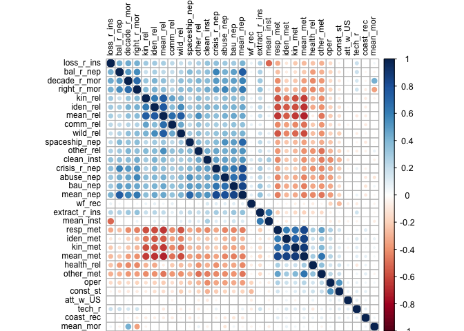

# Correlation exploration WF EV
Sarah Klain  
May 1, 2016  


Setup


```r
library(Hmisc) #to run correlations with sig levels
```

```
## Loading required package: grid
## Loading required package: lattice
## Loading required package: survival
## Loading required package: Formula
## Loading required package: ggplot2
```

```
## Warning: package 'ggplot2' was built under R version 3.2.4
```

```
## Warning: replacing previous import by 'ggplot2::unit' when loading 'Hmisc'
```

```
## Warning: replacing previous import by 'ggplot2::arrow' when loading 'Hmisc'
```

```
## Warning: replacing previous import by 'scales::alpha' when loading 'Hmisc'
```

```
## 
## Attaching package: 'Hmisc'
## 
## The following objects are masked from 'package:base':
## 
##     format.pval, round.POSIXt, trunc.POSIXt, units
```

```r
library(ggthemes) # for pretty themes in ggplot
```

```
## Warning: replacing previous import by 'grid::arrow' when loading 'ggthemes'
```

```
## Warning: replacing previous import by 'grid::unit' when loading 'ggthemes'
```

```
## Warning: replacing previous import by 'scales::alpha' when loading
## 'ggthemes'
```

```r
library(viridis) # for pretty colors
library(dplyr)
```

```
## 
## Attaching package: 'dplyr'
## 
## The following objects are masked from 'package:Hmisc':
## 
##     combine, src, summarize
## 
## The following objects are masked from 'package:stats':
## 
##     filter, lag
## 
## The following objects are masked from 'package:base':
## 
##     intersect, setdiff, setequal, union
```

```r
library(knitr) # tool for making nice tables
library(tidyr) # data table wrangling tool
library(broom)
library(stargazer) # makes pretty tables
```

```
## 
## Please cite as: 
## 
##  Hlavac, Marek (2015). stargazer: Well-Formatted Regression and Summary Statistics Tables.
##  R package version 5.2. http://CRAN.R-project.org/package=stargazer
```

```r
library(corrgram)
library(ggplot2) # for great charts
# library(stats) # for PCA
# library(psych)
```

Input data

In cer_2016_01_08_dem4.csv I recoded const_st by removing the 5s, which removes the "not sure" responses

```r
setwd("/Users/sarahklain/Documents/R_2015/navi") #set working directory
ev_wf <- read.csv("cer_2016_01_08_dem4.csv")
#str(ev_wf)
```

### Correlations


```r
corr1 <- rcorr(as.matrix(ev_wf[11:37]), type = "pearson")
corr1
```

```
##               coast_rec att_w_US  oper const_st wf_rec abuse_nep bal_r_nep
## coast_rec          1.00     0.05  0.04     0.11  -0.05     -0.08     -0.04
## att_w_US           0.05     1.00  0.11     0.08  -0.05     -0.02     -0.03
## oper               0.04     0.11  1.00     0.54  -0.21     -0.32     -0.17
## const_st           0.11     0.08  0.54     1.00  -0.30     -0.18     -0.10
## wf_rec            -0.05    -0.05 -0.21    -0.30   1.00      0.08      0.03
## abuse_nep         -0.08    -0.02 -0.32    -0.18   0.08      1.00      0.44
## bal_r_nep         -0.04    -0.03 -0.17    -0.10   0.03      0.44      1.00
## crisis_r_nep      -0.07    -0.07 -0.35    -0.23   0.12      0.58      0.59
## spaceship_nep     -0.11    -0.02 -0.25    -0.11   0.03      0.50      0.38
## bau_nep           -0.12    -0.03 -0.31    -0.16   0.10      0.65      0.49
## extract_r_ins      0.00     0.03 -0.03     0.05   0.02      0.24      0.25
## loss_r_ins        -0.01     0.01 -0.13    -0.03   0.07      0.32      0.43
## decade_r_mor      -0.01     0.02 -0.15    -0.10  -0.02      0.47      0.48
## comm_rel          -0.08    -0.04 -0.14    -0.10   0.07      0.31      0.22
## wild_rel          -0.04     0.00 -0.21    -0.20  -0.01      0.38      0.25
## clean_inst         0.00    -0.08 -0.40    -0.27   0.13      0.47      0.34
## tech_r             0.07     0.09  0.13     0.11  -0.13      0.01      0.18
## iden_rel          -0.04    -0.04 -0.22    -0.13   0.07      0.38      0.26
## kin_rel           -0.06     0.00 -0.13    -0.06   0.03      0.37      0.20
## right_r_mor       -0.06     0.02 -0.17    -0.07   0.01      0.56      0.53
## health_rel         0.05     0.08  0.13     0.17  -0.06     -0.33     -0.38
## other_rel         -0.03    -0.07 -0.27    -0.17   0.01      0.44      0.31
## kin_met            0.02    -0.02  0.18     0.09  -0.07     -0.30     -0.13
## resp_met           0.10     0.02  0.27     0.14  -0.04     -0.41     -0.26
## iden_met           0.05     0.06  0.18     0.05  -0.02     -0.28     -0.08
## other_met          0.09     0.01  0.24     0.17  -0.05     -0.39     -0.30
## mean_nep          -0.10    -0.05 -0.36    -0.20   0.09      0.79      0.75
##               crisis_r_nep spaceship_nep bau_nep extract_r_ins loss_r_ins
## coast_rec            -0.07         -0.11   -0.12          0.00      -0.01
## att_w_US             -0.07         -0.02   -0.03          0.03       0.01
## oper                 -0.35         -0.25   -0.31         -0.03      -0.13
## const_st             -0.23         -0.11   -0.16          0.05      -0.03
## wf_rec                0.12          0.03    0.10          0.02       0.07
## abuse_nep             0.58          0.50    0.65          0.24       0.32
## bal_r_nep             0.59          0.38    0.49          0.25       0.43
## crisis_r_nep          1.00          0.39    0.65          0.26       0.35
## spaceship_nep         0.39          1.00    0.49          0.22       0.21
## bau_nep               0.65          0.49    1.00          0.30       0.30
## extract_r_ins         0.26          0.22    0.30          1.00       0.26
## loss_r_ins            0.35          0.21    0.30          0.26       1.00
## decade_r_mor          0.47          0.33    0.45          0.31       0.43
## comm_rel              0.29          0.22    0.33          0.10       0.23
## wild_rel              0.33          0.30    0.37          0.19       0.20
## clean_inst            0.46          0.30    0.41          0.23       0.34
## tech_r                0.05         -0.05    0.01          0.17       0.17
## iden_rel              0.38          0.30    0.41          0.23       0.29
## kin_rel               0.27          0.24    0.38          0.19       0.30
## right_r_mor           0.48          0.36    0.43          0.35       0.41
## health_rel           -0.40         -0.23   -0.33         -0.12      -0.25
## other_rel             0.45          0.35    0.44          0.21       0.26
## kin_met              -0.21         -0.29   -0.34         -0.16      -0.23
## resp_met             -0.34         -0.34   -0.42         -0.19      -0.32
## iden_met             -0.19         -0.25   -0.33         -0.10      -0.11
## other_met            -0.41         -0.32   -0.38         -0.14      -0.32
## mean_nep              0.83          0.70    0.84          0.32       0.41
##               decade_r_mor comm_rel wild_rel clean_inst tech_r iden_rel
## coast_rec            -0.01    -0.08    -0.04       0.00   0.07    -0.04
## att_w_US              0.02    -0.04     0.00      -0.08   0.09    -0.04
## oper                 -0.15    -0.14    -0.21      -0.40   0.13    -0.22
## const_st             -0.10    -0.10    -0.20      -0.27   0.11    -0.13
## wf_rec               -0.02     0.07    -0.01       0.13  -0.13     0.07
## abuse_nep             0.47     0.31     0.38       0.47   0.01     0.38
## bal_r_nep             0.48     0.22     0.25       0.34   0.18     0.26
## crisis_r_nep          0.47     0.29     0.33       0.46   0.05     0.38
## spaceship_nep         0.33     0.22     0.30       0.30  -0.05     0.30
## bau_nep               0.45     0.33     0.37       0.41   0.01     0.41
## extract_r_ins         0.31     0.10     0.19       0.23   0.17     0.23
## loss_r_ins            0.43     0.23     0.20       0.34   0.17     0.29
## decade_r_mor          1.00     0.24     0.36       0.38   0.13     0.41
## comm_rel              0.24     1.00     0.44       0.29  -0.03     0.38
## wild_rel              0.36     0.44     1.00       0.28  -0.06     0.55
## clean_inst            0.38     0.29     0.28       1.00  -0.05     0.42
## tech_r                0.13    -0.03    -0.06      -0.05   1.00    -0.04
## iden_rel              0.41     0.38     0.55       0.42  -0.04     1.00
## kin_rel               0.34     0.48     0.43       0.30  -0.02     0.61
## right_r_mor           0.68     0.26     0.37       0.43   0.16     0.42
## health_rel           -0.42    -0.22    -0.26      -0.29  -0.11    -0.31
## other_rel             0.41     0.36     0.38       0.45  -0.07     0.38
## kin_met              -0.22    -0.42    -0.52      -0.24   0.10    -0.57
## resp_met             -0.40    -0.40    -0.56      -0.41   0.06    -0.56
## iden_met             -0.21    -0.34    -0.45      -0.22   0.11    -0.54
## other_met            -0.37    -0.36    -0.42      -0.44   0.06    -0.39
## mean_nep              0.56     0.35     0.42       0.50   0.05     0.44
##               kin_rel right_r_mor health_rel other_rel kin_met resp_met
## coast_rec       -0.06       -0.06       0.05     -0.03    0.02     0.10
## att_w_US         0.00        0.02       0.08     -0.07   -0.02     0.02
## oper            -0.13       -0.17       0.13     -0.27    0.18     0.27
## const_st        -0.06       -0.07       0.17     -0.17    0.09     0.14
## wf_rec           0.03        0.01      -0.06      0.01   -0.07    -0.04
## abuse_nep        0.37        0.56      -0.33      0.44   -0.30    -0.41
## bal_r_nep        0.20        0.53      -0.38      0.31   -0.13    -0.26
## crisis_r_nep     0.27        0.48      -0.40      0.45   -0.21    -0.34
## spaceship_nep    0.24        0.36      -0.23      0.35   -0.29    -0.34
## bau_nep          0.38        0.43      -0.33      0.44   -0.34    -0.42
## extract_r_ins    0.19        0.35      -0.12      0.21   -0.16    -0.19
## loss_r_ins       0.30        0.41      -0.25      0.26   -0.23    -0.32
## decade_r_mor     0.34        0.68      -0.42      0.41   -0.22    -0.40
## comm_rel         0.48        0.26      -0.22      0.36   -0.42    -0.40
## wild_rel         0.43        0.37      -0.26      0.38   -0.52    -0.56
## clean_inst       0.30        0.43      -0.29      0.45   -0.24    -0.41
## tech_r          -0.02        0.16      -0.11     -0.07    0.10     0.06
## iden_rel         0.61        0.42      -0.31      0.38   -0.57    -0.56
## kin_rel          1.00        0.39      -0.29      0.40   -0.57    -0.56
## right_r_mor      0.39        1.00      -0.40      0.36   -0.26    -0.42
## health_rel      -0.29       -0.40       1.00     -0.39    0.18     0.28
## other_rel        0.40        0.36      -0.39      1.00   -0.28    -0.38
## kin_met         -0.57       -0.26       0.18     -0.28    1.00     0.66
## resp_met        -0.56       -0.42       0.28     -0.38    0.66     1.00
## iden_met        -0.48       -0.26       0.16     -0.21    0.74     0.61
## other_met       -0.40       -0.34       0.34     -0.48    0.43     0.50
## mean_nep         0.37        0.60      -0.43      0.51   -0.32    -0.45
##               iden_met other_met mean_nep
## coast_rec         0.05      0.09    -0.10
## att_w_US          0.06      0.01    -0.05
## oper              0.18      0.24    -0.36
## const_st          0.05      0.17    -0.20
## wf_rec           -0.02     -0.05     0.09
## abuse_nep        -0.28     -0.39     0.79
## bal_r_nep        -0.08     -0.30     0.75
## crisis_r_nep     -0.19     -0.41     0.83
## spaceship_nep    -0.25     -0.32     0.70
## bau_nep          -0.33     -0.38     0.84
## extract_r_ins    -0.10     -0.14     0.32
## loss_r_ins       -0.11     -0.32     0.41
## decade_r_mor     -0.21     -0.37     0.56
## comm_rel         -0.34     -0.36     0.35
## wild_rel         -0.45     -0.42     0.42
## clean_inst       -0.22     -0.44     0.50
## tech_r            0.11      0.06     0.05
## iden_rel         -0.54     -0.39     0.44
## kin_rel          -0.48     -0.40     0.37
## right_r_mor      -0.26     -0.34     0.60
## health_rel        0.16      0.34    -0.43
## other_rel        -0.21     -0.48     0.51
## kin_met           0.74      0.43    -0.32
## resp_met          0.61      0.50    -0.45
## iden_met          1.00      0.33    -0.29
## other_met         0.33      1.00    -0.46
## mean_nep         -0.29     -0.46     1.00
## 
## n
##               coast_rec att_w_US oper const_st wf_rec abuse_nep bal_r_nep
## coast_rec           400      400  400      382    400       400       400
## att_w_US            400      400  400      382    400       400       400
## oper                400      400  400      382    400       400       400
## const_st            382      382  382      382    382       382       382
## wf_rec              400      400  400      382    400       400       400
## abuse_nep           400      400  400      382    400       400       400
## bal_r_nep           400      400  400      382    400       400       400
## crisis_r_nep        400      400  400      382    400       400       400
## spaceship_nep       398      398  398      380    398       398       398
## bau_nep             400      400  400      382    400       400       400
## extract_r_ins       400      400  400      382    400       400       400
## loss_r_ins          398      398  398      380    398       398       398
## decade_r_mor        400      400  400      382    400       400       400
## comm_rel            399      399  399      381    399       399       399
## wild_rel            400      400  400      382    400       400       400
## clean_inst          400      400  400      382    400       400       400
## tech_r              400      400  400      382    400       400       400
## iden_rel            400      400  400      382    400       400       400
## kin_rel             398      398  398      380    398       398       398
## right_r_mor         398      398  398      380    398       398       398
## health_rel          398      398  398      380    398       398       398
## other_rel           400      400  400      382    400       400       400
## kin_met             398      398  398      381    398       398       398
## resp_met            399      399  399      381    399       399       399
## iden_met            400      400  400      382    400       400       400
## other_met           400      400  400      382    400       400       400
## mean_nep            400      400  400      382    400       400       400
##               crisis_r_nep spaceship_nep bau_nep extract_r_ins loss_r_ins
## coast_rec              400           398     400           400        398
## att_w_US               400           398     400           400        398
## oper                   400           398     400           400        398
## const_st               382           380     382           382        380
## wf_rec                 400           398     400           400        398
## abuse_nep              400           398     400           400        398
## bal_r_nep              400           398     400           400        398
## crisis_r_nep           400           398     400           400        398
## spaceship_nep          398           398     398           398        396
## bau_nep                400           398     400           400        398
## extract_r_ins          400           398     400           400        398
## loss_r_ins             398           396     398           398        398
## decade_r_mor           400           398     400           400        398
## comm_rel               399           397     399           399        397
## wild_rel               400           398     400           400        398
## clean_inst             400           398     400           400        398
## tech_r                 400           398     400           400        398
## iden_rel               400           398     400           400        398
## kin_rel                398           396     398           398        396
## right_r_mor            398           396     398           398        396
## health_rel             398           396     398           398        396
## other_rel              400           398     400           400        398
## kin_met                398           396     398           398        396
## resp_met               399           397     399           399        397
## iden_met               400           398     400           400        398
## other_met              400           398     400           400        398
## mean_nep               400           398     400           400        398
##               decade_r_mor comm_rel wild_rel clean_inst tech_r iden_rel
## coast_rec              400      399      400        400    400      400
## att_w_US               400      399      400        400    400      400
## oper                   400      399      400        400    400      400
## const_st               382      381      382        382    382      382
## wf_rec                 400      399      400        400    400      400
## abuse_nep              400      399      400        400    400      400
## bal_r_nep              400      399      400        400    400      400
## crisis_r_nep           400      399      400        400    400      400
## spaceship_nep          398      397      398        398    398      398
## bau_nep                400      399      400        400    400      400
## extract_r_ins          400      399      400        400    400      400
## loss_r_ins             398      397      398        398    398      398
## decade_r_mor           400      399      400        400    400      400
## comm_rel               399      399      399        399    399      399
## wild_rel               400      399      400        400    400      400
## clean_inst             400      399      400        400    400      400
## tech_r                 400      399      400        400    400      400
## iden_rel               400      399      400        400    400      400
## kin_rel                398      397      398        398    398      398
## right_r_mor            398      397      398        398    398      398
## health_rel             398      397      398        398    398      398
## other_rel              400      399      400        400    400      400
## kin_met                398      397      398        398    398      398
## resp_met               399      398      399        399    399      399
## iden_met               400      399      400        400    400      400
## other_met              400      399      400        400    400      400
## mean_nep               400      399      400        400    400      400
##               kin_rel right_r_mor health_rel other_rel kin_met resp_met
## coast_rec         398         398        398       400     398      399
## att_w_US          398         398        398       400     398      399
## oper              398         398        398       400     398      399
## const_st          380         380        380       382     381      381
## wf_rec            398         398        398       400     398      399
## abuse_nep         398         398        398       400     398      399
## bal_r_nep         398         398        398       400     398      399
## crisis_r_nep      398         398        398       400     398      399
## spaceship_nep     396         396        396       398     396      397
## bau_nep           398         398        398       400     398      399
## extract_r_ins     398         398        398       400     398      399
## loss_r_ins        396         396        396       398     396      397
## decade_r_mor      398         398        398       400     398      399
## comm_rel          397         397        397       399     397      398
## wild_rel          398         398        398       400     398      399
## clean_inst        398         398        398       400     398      399
## tech_r            398         398        398       400     398      399
## iden_rel          398         398        398       400     398      399
## kin_rel           398         397        396       398     396      397
## right_r_mor       397         398        396       398     396      397
## health_rel        396         396        398       398     396      397
## other_rel         398         398        398       400     398      399
## kin_met           396         396        396       398     398      397
## resp_met          397         397        397       399     397      399
## iden_met          398         398        398       400     398      399
## other_met         398         398        398       400     398      399
## mean_nep          398         398        398       400     398      399
##               iden_met other_met mean_nep
## coast_rec          400       400      400
## att_w_US           400       400      400
## oper               400       400      400
## const_st           382       382      382
## wf_rec             400       400      400
## abuse_nep          400       400      400
## bal_r_nep          400       400      400
## crisis_r_nep       400       400      400
## spaceship_nep      398       398      398
## bau_nep            400       400      400
## extract_r_ins      400       400      400
## loss_r_ins         398       398      398
## decade_r_mor       400       400      400
## comm_rel           399       399      399
## wild_rel           400       400      400
## clean_inst         400       400      400
## tech_r             400       400      400
## iden_rel           400       400      400
## kin_rel            398       398      398
## right_r_mor        398       398      398
## health_rel         398       398      398
## other_rel          400       400      400
## kin_met            398       398      398
## resp_met           399       399      399
## iden_met           400       400      400
## other_met          400       400      400
## mean_nep           400       400      400
## 
## P
##               coast_rec att_w_US oper   const_st wf_rec abuse_nep
## coast_rec               0.3375   0.3828 0.0398   0.3204 0.1091   
## att_w_US      0.3375             0.0259 0.1275   0.3087 0.6244   
## oper          0.3828    0.0259          0.0000   0.0000 0.0000   
## const_st      0.0398    0.1275   0.0000          0.0000 0.0003   
## wf_rec        0.3204    0.3087   0.0000 0.0000          0.0979   
## abuse_nep     0.1091    0.6244   0.0000 0.0003   0.0979          
## bal_r_nep     0.4526    0.5068   0.0007 0.0407   0.6010 0.0000   
## crisis_r_nep  0.1779    0.1792   0.0000 0.0000   0.0128 0.0000   
## spaceship_nep 0.0334    0.7325   0.0000 0.0269   0.6042 0.0000   
## bau_nep       0.0212    0.5216   0.0000 0.0022   0.0471 0.0000   
## extract_r_ins 0.9755    0.5896   0.5573 0.3660   0.7135 0.0000   
## loss_r_ins    0.8908    0.8224   0.0123 0.5082   0.1514 0.0000   
## decade_r_mor  0.7719    0.6511   0.0028 0.0484   0.6394 0.0000   
## comm_rel      0.1261    0.4304   0.0040 0.0610   0.1789 0.0000   
## wild_rel      0.4206    0.9583   0.0000 0.0000   0.9083 0.0000   
## clean_inst    0.9427    0.1235   0.0000 0.0000   0.0086 0.0000   
## tech_r        0.1430    0.0594   0.0106 0.0353   0.0115 0.7687   
## iden_rel      0.4760    0.4270   0.0000 0.0100   0.1441 0.0000   
## kin_rel       0.2620    0.9763   0.0084 0.2401   0.5897 0.0000   
## right_r_mor   0.2571    0.6545   0.0008 0.1584   0.8711 0.0000   
## health_rel    0.2967    0.1168   0.0106 0.0006   0.2400 0.0000   
## other_rel     0.5195    0.1717   0.0000 0.0010   0.8457 0.0000   
## kin_met       0.6495    0.6745   0.0003 0.0716   0.1509 0.0000   
## resp_met      0.0378    0.6291   0.0000 0.0071   0.4631 0.0000   
## iden_met      0.3105    0.2416   0.0003 0.3683   0.7131 0.0000   
## other_met     0.0818    0.8594   0.0000 0.0007   0.2886 0.0000   
## mean_nep      0.0370    0.3680   0.0000 0.0000   0.0602 0.0000   
##               bal_r_nep crisis_r_nep spaceship_nep bau_nep extract_r_ins
## coast_rec     0.4526    0.1779       0.0334        0.0212  0.9755       
## att_w_US      0.5068    0.1792       0.7325        0.5216  0.5896       
## oper          0.0007    0.0000       0.0000        0.0000  0.5573       
## const_st      0.0407    0.0000       0.0269        0.0022  0.3660       
## wf_rec        0.6010    0.0128       0.6042        0.0471  0.7135       
## abuse_nep     0.0000    0.0000       0.0000        0.0000  0.0000       
## bal_r_nep               0.0000       0.0000        0.0000  0.0000       
## crisis_r_nep  0.0000                 0.0000        0.0000  0.0000       
## spaceship_nep 0.0000    0.0000                     0.0000  0.0000       
## bau_nep       0.0000    0.0000       0.0000                0.0000       
## extract_r_ins 0.0000    0.0000       0.0000        0.0000               
## loss_r_ins    0.0000    0.0000       0.0000        0.0000  0.0000       
## decade_r_mor  0.0000    0.0000       0.0000        0.0000  0.0000       
## comm_rel      0.0000    0.0000       0.0000        0.0000  0.0572       
## wild_rel      0.0000    0.0000       0.0000        0.0000  0.0001       
## clean_inst    0.0000    0.0000       0.0000        0.0000  0.0000       
## tech_r        0.0004    0.3431       0.3653        0.9059  0.0006       
## iden_rel      0.0000    0.0000       0.0000        0.0000  0.0000       
## kin_rel       0.0000    0.0000       0.0000        0.0000  0.0001       
## right_r_mor   0.0000    0.0000       0.0000        0.0000  0.0000       
## health_rel    0.0000    0.0000       0.0000        0.0000  0.0138       
## other_rel     0.0000    0.0000       0.0000        0.0000  0.0000       
## kin_met       0.0091    0.0000       0.0000        0.0000  0.0014       
## resp_met      0.0000    0.0000       0.0000        0.0000  0.0001       
## iden_met      0.0902    0.0001       0.0000        0.0000  0.0424       
## other_met     0.0000    0.0000       0.0000        0.0000  0.0068       
## mean_nep      0.0000    0.0000       0.0000        0.0000  0.0000       
##               loss_r_ins decade_r_mor comm_rel wild_rel clean_inst tech_r
## coast_rec     0.8908     0.7719       0.1261   0.4206   0.9427     0.1430
## att_w_US      0.8224     0.6511       0.4304   0.9583   0.1235     0.0594
## oper          0.0123     0.0028       0.0040   0.0000   0.0000     0.0106
## const_st      0.5082     0.0484       0.0610   0.0000   0.0000     0.0353
## wf_rec        0.1514     0.6394       0.1789   0.9083   0.0086     0.0115
## abuse_nep     0.0000     0.0000       0.0000   0.0000   0.0000     0.7687
## bal_r_nep     0.0000     0.0000       0.0000   0.0000   0.0000     0.0004
## crisis_r_nep  0.0000     0.0000       0.0000   0.0000   0.0000     0.3431
## spaceship_nep 0.0000     0.0000       0.0000   0.0000   0.0000     0.3653
## bau_nep       0.0000     0.0000       0.0000   0.0000   0.0000     0.9059
## extract_r_ins 0.0000     0.0000       0.0572   0.0001   0.0000     0.0006
## loss_r_ins               0.0000       0.0000   0.0000   0.0000     0.0007
## decade_r_mor  0.0000                  0.0000   0.0000   0.0000     0.0070
## comm_rel      0.0000     0.0000                0.0000   0.0000     0.5614
## wild_rel      0.0000     0.0000       0.0000            0.0000     0.2419
## clean_inst    0.0000     0.0000       0.0000   0.0000              0.3536
## tech_r        0.0007     0.0070       0.5614   0.2419   0.3536           
## iden_rel      0.0000     0.0000       0.0000   0.0000   0.0000     0.4302
## kin_rel       0.0000     0.0000       0.0000   0.0000   0.0000     0.7250
## right_r_mor   0.0000     0.0000       0.0000   0.0000   0.0000     0.0018
## health_rel    0.0000     0.0000       0.0000   0.0000   0.0000     0.0299
## other_rel     0.0000     0.0000       0.0000   0.0000   0.0000     0.1542
## kin_met       0.0000     0.0000       0.0000   0.0000   0.0000     0.0449
## resp_met      0.0000     0.0000       0.0000   0.0000   0.0000     0.1964
## iden_met      0.0283     0.0000       0.0000   0.0000   0.0000     0.0307
## other_met     0.0000     0.0000       0.0000   0.0000   0.0000     0.1980
## mean_nep      0.0000     0.0000       0.0000   0.0000   0.0000     0.2986
##               iden_rel kin_rel right_r_mor health_rel other_rel kin_met
## coast_rec     0.4760   0.2620  0.2571      0.2967     0.5195    0.6495 
## att_w_US      0.4270   0.9763  0.6545      0.1168     0.1717    0.6745 
## oper          0.0000   0.0084  0.0008      0.0106     0.0000    0.0003 
## const_st      0.0100   0.2401  0.1584      0.0006     0.0010    0.0716 
## wf_rec        0.1441   0.5897  0.8711      0.2400     0.8457    0.1509 
## abuse_nep     0.0000   0.0000  0.0000      0.0000     0.0000    0.0000 
## bal_r_nep     0.0000   0.0000  0.0000      0.0000     0.0000    0.0091 
## crisis_r_nep  0.0000   0.0000  0.0000      0.0000     0.0000    0.0000 
## spaceship_nep 0.0000   0.0000  0.0000      0.0000     0.0000    0.0000 
## bau_nep       0.0000   0.0000  0.0000      0.0000     0.0000    0.0000 
## extract_r_ins 0.0000   0.0001  0.0000      0.0138     0.0000    0.0014 
## loss_r_ins    0.0000   0.0000  0.0000      0.0000     0.0000    0.0000 
## decade_r_mor  0.0000   0.0000  0.0000      0.0000     0.0000    0.0000 
## comm_rel      0.0000   0.0000  0.0000      0.0000     0.0000    0.0000 
## wild_rel      0.0000   0.0000  0.0000      0.0000     0.0000    0.0000 
## clean_inst    0.0000   0.0000  0.0000      0.0000     0.0000    0.0000 
## tech_r        0.4302   0.7250  0.0018      0.0299     0.1542    0.0449 
## iden_rel               0.0000  0.0000      0.0000     0.0000    0.0000 
## kin_rel       0.0000           0.0000      0.0000     0.0000    0.0000 
## right_r_mor   0.0000   0.0000              0.0000     0.0000    0.0000 
## health_rel    0.0000   0.0000  0.0000                 0.0000    0.0004 
## other_rel     0.0000   0.0000  0.0000      0.0000               0.0000 
## kin_met       0.0000   0.0000  0.0000      0.0004     0.0000           
## resp_met      0.0000   0.0000  0.0000      0.0000     0.0000    0.0000 
## iden_met      0.0000   0.0000  0.0000      0.0010     0.0000    0.0000 
## other_met     0.0000   0.0000  0.0000      0.0000     0.0000    0.0000 
## mean_nep      0.0000   0.0000  0.0000      0.0000     0.0000    0.0000 
##               resp_met iden_met other_met mean_nep
## coast_rec     0.0378   0.3105   0.0818    0.0370  
## att_w_US      0.6291   0.2416   0.8594    0.3680  
## oper          0.0000   0.0003   0.0000    0.0000  
## const_st      0.0071   0.3683   0.0007    0.0000  
## wf_rec        0.4631   0.7131   0.2886    0.0602  
## abuse_nep     0.0000   0.0000   0.0000    0.0000  
## bal_r_nep     0.0000   0.0902   0.0000    0.0000  
## crisis_r_nep  0.0000   0.0001   0.0000    0.0000  
## spaceship_nep 0.0000   0.0000   0.0000    0.0000  
## bau_nep       0.0000   0.0000   0.0000    0.0000  
## extract_r_ins 0.0001   0.0424   0.0068    0.0000  
## loss_r_ins    0.0000   0.0283   0.0000    0.0000  
## decade_r_mor  0.0000   0.0000   0.0000    0.0000  
## comm_rel      0.0000   0.0000   0.0000    0.0000  
## wild_rel      0.0000   0.0000   0.0000    0.0000  
## clean_inst    0.0000   0.0000   0.0000    0.0000  
## tech_r        0.1964   0.0307   0.1980    0.2986  
## iden_rel      0.0000   0.0000   0.0000    0.0000  
## kin_rel       0.0000   0.0000   0.0000    0.0000  
## right_r_mor   0.0000   0.0000   0.0000    0.0000  
## health_rel    0.0000   0.0010   0.0000    0.0000  
## other_rel     0.0000   0.0000   0.0000    0.0000  
## kin_met       0.0000   0.0000   0.0000    0.0000  
## resp_met               0.0000   0.0000    0.0000  
## iden_met      0.0000            0.0000    0.0000  
## other_met     0.0000   0.0000             0.0000  
## mean_nep      0.0000   0.0000   0.0000
```

```r
# corr2 <- rcorr(as.matrix(ev_wf[11:37]), type = "spearman")
# corr2
```

Make it visual


```r
corrgram(ev_wf[1:36], order=TRUE, lower.panel=panel.shade, 
   upper.panel=panel.pie, text.panel=panel.txt, main="Environmental Values & Wind Farm (PC2/PC1 Order)")
```

 

```r
#fun colors
cg_yb <- corrgram(ev_wf[11:36], order=TRUE, lower.panel=panel.shade, 
   upper.panel=panel.pie, text.panel=panel.txt, col.regions = colorRampPalette(c("purple4", "skyblue1", "khaki1", "gold1")), main="Environmental Values & Wind Farm (PC2/PC1 Order)")
```

 

```r
cg_yb
```

```
## NULL
```

```r
#ggsave(cg_yb, file = "/Users/sarahklain/Documents/R_2015/navi/corr_figs/cg_y_b.pdf")
#pdf(file = "/Users/sarahklain/Documents/R_2015/navi/corr_figs/cg_y_b.pdf")
```


```r
library(corrplot)
```

```
## Warning: package 'corrplot' was built under R version 3.2.5
```

```r
ev_wf2 <-na.omit(ev_wf)
cp1 <- corrplot(cor(as.matrix(ev_wf2[1:36])), order = "hclust", tl.col='black', tl.cex=.75, na.label.col = "black") 
```

 

```r
cp1
```

```
##                 loss_r_ins    bal_r_nep decade_r_mor right_r_mor
## loss_r_ins     1.000000000  0.422820478  0.442868042  0.43007524
## bal_r_nep      0.422820478  1.000000000  0.500280265  0.55997161
## decade_r_mor   0.442868042  0.500280265  1.000000000  0.69139556
## right_r_mor    0.430075243  0.559971613  0.691395555  1.00000000
## iden_rel       0.309163383  0.283129083  0.414572361  0.42695154
## kin_rel        0.304446651  0.201513544  0.338337072  0.38627405
## comm_rel       0.221115837  0.199546390  0.240284215  0.25550942
## wild_rel       0.196702190  0.254834991  0.354145747  0.37505038
## spaceship_nep  0.215791527  0.380732584  0.354976093  0.38133842
## other_rel      0.259919759  0.306780943  0.410809713  0.36125222
## clean_inst     0.335853852  0.349757030  0.369564537  0.43495854
## crisis_r_nep   0.351308234  0.580730708  0.505170358  0.51889158
## abuse_nep      0.313360909  0.429544025  0.468246571  0.57449327
## bau_nep        0.297543321  0.483503515  0.475648952  0.46012960
## wf_rec         0.071231673  0.035617540  0.000000000  0.03451406
## wages          0.098224183 -0.024540114  0.060013492  0.05567523
## pol_ind       -0.011937054 -0.005427760 -0.012885204  0.02109851
## resp_met      -0.324391099 -0.261474383 -0.416352390 -0.44376662
## kin_met       -0.220774257 -0.136304233 -0.230826986 -0.27920977
## iden_met      -0.098121796 -0.079536245 -0.189492784 -0.26151919
## health_rel    -0.243947978 -0.373312755 -0.426124396 -0.42245491
## other_met     -0.299198676 -0.301707397 -0.376556400 -0.36099895
## pol_dem       -0.052697606 -0.007445712 -0.020460426 -0.06149245
## coast_rec     -0.011829200 -0.038973719 -0.037641335 -0.06944565
## att_w_US       0.002000947 -0.020714580  0.024931584  0.01624157
## oper          -0.151248222 -0.184959115 -0.152039845 -0.18746009
## const_st      -0.046006111 -0.098463136 -0.100769570 -0.08786981
## self.emp       0.001915001 -0.041326818 -0.035979431 -0.06794612
## white          0.104489828  0.026316870  0.087551774  0.05448848
## univ_degr     -0.048603253  0.056235271  0.002409385  0.03657966
## income        -0.099427534 -0.066100011 -0.103728150 -0.10216404
## tech_r         0.180639819  0.186889538  0.138272167  0.16049582
## female         0.136022166  0.141806187  0.238063235  0.24828750
## extract_r_ins  0.256624269  0.264643129  0.316014763  0.34619494
## age            0.034689028  0.045103895  0.049550175  0.04698887
## pol_rep        0.073233990  0.040084906  0.090023166  0.07991932
##                   iden_rel      kin_rel     comm_rel    wild_rel
## loss_r_ins     0.309163383  0.304446651  0.221115837  0.19670219
## bal_r_nep      0.283129083  0.201513544  0.199546390  0.25483499
## decade_r_mor   0.414572361  0.338337072  0.240284215  0.35414575
## right_r_mor    0.426951538  0.386274050  0.255509419  0.37505038
## iden_rel       1.000000000  0.617861778  0.391763321  0.55800288
## kin_rel        0.617861778  1.000000000  0.479318468  0.41707756
## comm_rel       0.391763321  0.479318468  1.000000000  0.46194730
## wild_rel       0.558002879  0.417077558  0.461947300  1.00000000
## spaceship_nep  0.314559452  0.244368097  0.228723488  0.30100433
## other_rel      0.384888976  0.391574965  0.348991743  0.36242680
## clean_inst     0.419508315  0.304991112  0.266622602  0.28245646
## crisis_r_nep   0.395797716  0.268173141  0.284604570  0.33533913
## abuse_nep      0.393567680  0.365085792  0.297230582  0.38405776
## bau_nep        0.422237002  0.378891179  0.335096892  0.38716024
## wf_rec         0.082061888  0.064297833  0.082130471  0.00000000
## wages          0.021282228 -0.005404486 -0.003042859  0.07984642
## pol_ind        0.017817243 -0.045550493  0.037557824  0.10076329
## resp_met      -0.591627881 -0.579021428 -0.427218128 -0.56904542
## kin_met       -0.590665054 -0.579991922 -0.431512283 -0.51714332
## iden_met      -0.560545397 -0.472236720 -0.350616217 -0.43481036
## health_rel    -0.327645531 -0.288759263 -0.226104300 -0.26180352
## other_met     -0.408033449 -0.410500061 -0.379962789 -0.40457063
## pol_dem       -0.025087504  0.074752570  0.035213375 -0.06395139
## coast_rec     -0.075772814 -0.079614465 -0.090439039 -0.03703198
## att_w_US      -0.021211491  0.003152335 -0.050476517  0.01261027
## oper          -0.198374777 -0.136982011 -0.143339149 -0.19858710
## const_st      -0.136104321 -0.073397937 -0.102319222 -0.20809722
## self.emp      -0.005415123  0.022193651 -0.022968989 -0.12074395
## white          0.072127794  0.054298016 -0.079753560  0.01548348
## univ_degr     -0.033914052 -0.103653031 -0.039630271 -0.04462235
## income        -0.176535659 -0.124582056 -0.120150700 -0.13282505
## tech_r        -0.013658910 -0.024536705 -0.031713213 -0.07118382
## female         0.063856107  0.108129020  0.108014868  0.07190791
## extract_r_ins  0.240914041  0.191314762  0.096716329  0.18322078
## age            0.105024453  0.093836964 -0.044573594 -0.02267374
## pol_rep        0.051385363  0.001889737 -0.016955314 -0.02010429
##               spaceship_nep    other_rel   clean_inst crisis_r_nep
## loss_r_ins      0.215791527  0.259919759  0.335853852   0.35130823
## bal_r_nep       0.380732584  0.306780943  0.349757030   0.58073071
## decade_r_mor    0.354976093  0.410809713  0.369564537   0.50517036
## right_r_mor     0.381338423  0.361252225  0.434958539   0.51889158
## iden_rel        0.314559452  0.384888976  0.419508315   0.39579772
## kin_rel         0.244368097  0.391574965  0.304991112   0.26817314
## comm_rel        0.228723488  0.348991743  0.266622602   0.28460457
## wild_rel        0.301004326  0.362426805  0.282456461   0.33533913
## spaceship_nep   1.000000000  0.375642729  0.324671838   0.38697665
## other_rel       0.375642729  1.000000000  0.439270336   0.46859841
## clean_inst      0.324671838  0.439270336  1.000000000   0.48360855
## crisis_r_nep    0.386976648  0.468598411  0.483608546   1.00000000
## abuse_nep       0.547073485  0.432968400  0.472880088   0.58816481
## bau_nep         0.501783005  0.482273857  0.446563591   0.64443331
## wf_rec          0.027153191  0.037514545  0.134090771   0.10670283
## wages          -0.026509244  0.051975327  0.003651437   0.05897606
## pol_ind         0.091143635  0.011063455  0.077824742   0.01742377
## resp_met       -0.338519315 -0.389950431 -0.422483772  -0.34067891
## kin_met        -0.295536566 -0.284135909 -0.238140902  -0.20334876
## iden_met       -0.255065099 -0.203615213 -0.227773634  -0.18549793
## health_rel     -0.246324804 -0.398579845 -0.305434728  -0.41048815
## other_met      -0.328928872 -0.483663697 -0.448882816  -0.42267921
## pol_dem        -0.097320977  0.007375859 -0.102180008  -0.04270871
## coast_rec      -0.101949609 -0.060903144 -0.009704095  -0.05440879
## att_w_US       -0.004557283 -0.071464243 -0.096680039  -0.03608919
## oper           -0.245382486 -0.280911381 -0.416246386  -0.33571042
## const_st       -0.116018214 -0.183842670 -0.296721667  -0.21504270
## self.emp       -0.014135252 -0.045109486  0.035024996  -0.07961179
## white           0.020616274  0.099845595  0.157716922   0.03773781
## univ_degr       0.020633467 -0.038282084  0.024681354   0.05518267
## income         -0.086518126 -0.171392656 -0.073439118  -0.09844790
## tech_r         -0.034108360 -0.079060893 -0.028373423   0.07815894
## female         -0.013730805  0.086102766  0.074192848   0.08621359
## extract_r_ins   0.231162357  0.197012165  0.234924942   0.29107238
## age             0.012925890 -0.028826086 -0.060753381  -0.02812479
## pol_rep         0.014920388  0.052632725  0.101690724   0.07580304
##                  abuse_nep      bau_nep       wf_rec        wages
## loss_r_ins     0.313360909  0.297543321  0.071231673  0.098224183
## bal_r_nep      0.429544025  0.483503515  0.035617540 -0.024540114
## decade_r_mor   0.468246571  0.475648952  0.000000000  0.060013492
## right_r_mor    0.574493267  0.460129598  0.034514061  0.055675233
## iden_rel       0.393567680  0.422237002  0.082061888  0.021282228
## kin_rel        0.365085792  0.378891179  0.064297833 -0.005404486
## comm_rel       0.297230582  0.335096892  0.082130471 -0.003042859
## wild_rel       0.384057765  0.387160243  0.000000000  0.079846419
## spaceship_nep  0.547073485  0.501783005  0.027153191 -0.026509244
## other_rel      0.432968400  0.482273857  0.037514545  0.051975327
## clean_inst     0.472880088  0.446563591  0.134090771  0.003651437
## crisis_r_nep   0.588164814  0.644433314  0.106702829  0.058976057
## abuse_nep      1.000000000  0.664839028  0.101621597  0.052044020
## bau_nep        0.664839028  1.000000000  0.100712902  0.034886233
## wf_rec         0.101621597  0.100712902  1.000000000  0.017431682
## wages          0.052044020  0.034886233  0.017431682  1.000000000
## pol_ind        0.078581015  0.039534014  0.043897886  0.082698006
## resp_met      -0.436719401 -0.433839266 -0.032439378 -0.018556556
## kin_met       -0.312654161 -0.348441676 -0.065090566 -0.019330198
## iden_met      -0.283884295 -0.320020028 -0.034605256 -0.014455174
## health_rel    -0.318354013 -0.336566340 -0.077960170  0.015323475
## other_met     -0.408725171 -0.395948873 -0.037217022  0.038736684
## pol_dem       -0.120140762 -0.008994235  0.000000000 -0.043183990
## coast_rec     -0.091562697 -0.123060009 -0.017960471  0.024034939
## att_w_US      -0.014794541 -0.003274598 -0.074968890 -0.010887914
## oper          -0.349915933 -0.319085459 -0.188852698  0.009655613
## const_st      -0.182939511 -0.149009664 -0.272584642 -0.052888905
## self.emp      -0.049176123 -0.110957164  0.000000000 -0.402600377
## white          0.045345991  0.060374426  0.033938352  0.015725696
## univ_degr      0.029752872 -0.038719157 -0.036657260  0.053872020
## income        -0.080240053 -0.096366207 -0.032706691 -0.007892977
## tech_r         0.009018145  0.012441831 -0.081821603 -0.004427056
## female         0.089437977  0.125212950  0.008730060 -0.010867611
## extract_r_ins  0.246734864  0.326694762  0.045187626  0.033376063
## age           -0.052507826 -0.072661508  0.001990936  0.002269128
## pol_rep        0.107087517  0.036698888  0.031065738  0.006123093
##                    pol_ind     resp_met      kin_met     iden_met
## loss_r_ins    -0.011937054 -0.324391099 -0.220774257 -0.098121796
## bal_r_nep     -0.005427760 -0.261474383 -0.136304233 -0.079536245
## decade_r_mor  -0.012885204 -0.416352390 -0.230826986 -0.189492784
## right_r_mor    0.021098512 -0.443766623 -0.279209772 -0.261519188
## iden_rel       0.017817243 -0.591627881 -0.590665054 -0.560545397
## kin_rel       -0.045550493 -0.579021428 -0.579991922 -0.472236720
## comm_rel       0.037557824 -0.427218128 -0.431512283 -0.350616217
## wild_rel       0.100763295 -0.569045424 -0.517143324 -0.434810356
## spaceship_nep  0.091143635 -0.338519315 -0.295536566 -0.255065099
## other_rel      0.011063455 -0.389950431 -0.284135909 -0.203615213
## clean_inst     0.077824742 -0.422483772 -0.238140902 -0.227773634
## crisis_r_nep   0.017423772 -0.340678907 -0.203348762 -0.185497929
## abuse_nep      0.078581015 -0.436719401 -0.312654161 -0.283884295
## bau_nep        0.039534014 -0.433839266 -0.348441676 -0.320020028
## wf_rec         0.043897886 -0.032439378 -0.065090566 -0.034605256
## wages          0.082698006 -0.018556556 -0.019330198 -0.014455174
## pol_ind        1.000000000 -0.059175997 -0.030034206 -0.029411050
## resp_met      -0.059175997  1.000000000  0.653008364  0.601858437
## kin_met       -0.030034206  0.653008364  1.000000000  0.736153408
## iden_met      -0.029411050  0.601858437  0.736153408  1.000000000
## health_rel    -0.019780347  0.278613091  0.184844235  0.157373099
## other_met      0.045760943  0.476894986  0.395573921  0.299423812
## pol_dem       -0.703672950  0.036049177  0.002072426  0.027951834
## coast_rec     -0.002439838  0.108195056  0.021689973  0.056960895
## att_w_US       0.074534470 -0.007108366 -0.042266506  0.055109913
## oper          -0.039985576  0.260971818  0.158827996  0.171236424
## const_st      -0.002004431  0.155945902  0.105404250  0.052975541
## self.emp      -0.005407260  0.033230561  0.034361719 -0.003044722
## white          0.007171657 -0.121571989 -0.006839537 -0.053118120
## univ_degr     -0.050180062  0.026925037  0.066208846 -0.007750466
## income        -0.049179195  0.094273425  0.140666605  0.058658626
## tech_r         0.015323004  0.043475576  0.109654529  0.129172033
## female        -0.004622102 -0.095213364 -0.044876788 -0.005753149
## extract_r_ins  0.004155297 -0.207667989 -0.167323187 -0.101049551
## age           -0.045980719 -0.033980879 -0.061057927 -0.051239376
## pol_rep       -0.251584151 -0.037611181  0.017035820 -0.041883240
##                 health_rel    other_met      pol_dem    coast_rec
## loss_r_ins    -0.243947978 -0.299198676 -0.052697606 -0.011829200
## bal_r_nep     -0.373312755 -0.301707397 -0.007445712 -0.038973719
## decade_r_mor  -0.426124396 -0.376556400 -0.020460426 -0.037641335
## right_r_mor   -0.422454909 -0.360998954 -0.061492448 -0.069445654
## iden_rel      -0.327645531 -0.408033449 -0.025087504 -0.075772814
## kin_rel       -0.288759263 -0.410500061  0.074752570 -0.079614465
## comm_rel      -0.226104300 -0.379962789  0.035213375 -0.090439039
## wild_rel      -0.261803520 -0.404570627 -0.063951394 -0.037031981
## spaceship_nep -0.246324804 -0.328928872 -0.097320977 -0.101949609
## other_rel     -0.398579845 -0.483663697  0.007375859 -0.060903144
## clean_inst    -0.305434728 -0.448882816 -0.102180008 -0.009704095
## crisis_r_nep  -0.410488152 -0.422679211 -0.042708710 -0.054408785
## abuse_nep     -0.318354013 -0.408725171 -0.120140762 -0.091562697
## bau_nep       -0.336566340 -0.395948873 -0.008994235 -0.123060009
## wf_rec        -0.077960170 -0.037217022  0.000000000 -0.017960471
## wages          0.015323475  0.038736684 -0.043183990  0.024034939
## pol_ind       -0.019780347  0.045760943 -0.703672950 -0.002439838
## resp_met       0.278613091  0.476894986  0.036049177  0.108195056
## kin_met        0.184844235  0.395573921  0.002072426  0.021689973
## iden_met       0.157373099  0.299423812  0.027951834  0.056960895
## health_rel     1.000000000  0.356119218  0.058426759  0.058416754
## other_met      0.356119218  1.000000000 -0.035252469  0.097657845
## pol_dem        0.058426759 -0.035252469  1.000000000  0.003925939
## coast_rec      0.058416754  0.097657845  0.003925939  1.000000000
## att_w_US       0.061717811 -0.004823136 -0.005276630  0.054679180
## oper           0.154549866  0.223328562  0.031218085  0.042557538
## const_st       0.168718650  0.181900163 -0.022803624  0.086272048
## self.emp      -0.065343642 -0.029061335  0.004616758 -0.062814577
## white         -0.009060639 -0.087277528  0.002904601 -0.007537093
## univ_degr     -0.097984497  0.068875450 -0.011065334 -0.034936272
## income         0.073362962  0.170689974 -0.037018588  0.014259317
## tech_r        -0.092297209  0.055325371 -0.088474128  0.085036610
## female        -0.170538607 -0.120137840 -0.019143423 -0.029983826
## extract_r_ins -0.139470408 -0.155461230 -0.078141695 -0.008436136
## age           -0.077857059  0.051997537 -0.034461863  0.026557427
## pol_rep       -0.041165206 -0.084056696 -0.257287905  0.016214818
##                    att_w_US         oper     const_st     self.emp
## loss_r_ins     0.0020009474 -0.151248222 -0.046006111  0.001915001
## bal_r_nep     -0.0207145797 -0.184959115 -0.098463136 -0.041326818
## decade_r_mor   0.0249315843 -0.152039845 -0.100769570 -0.035979431
## right_r_mor    0.0162415650 -0.187460087 -0.087869810 -0.067946125
## iden_rel      -0.0212114910 -0.198374777 -0.136104321 -0.005415123
## kin_rel        0.0031523347 -0.136982011 -0.073397937  0.022193651
## comm_rel      -0.0504765173 -0.143339149 -0.102319222 -0.022968989
## wild_rel       0.0126102708 -0.198587096 -0.208097225 -0.120743954
## spaceship_nep -0.0045572834 -0.245382486 -0.116018214 -0.014135252
## other_rel     -0.0714642425 -0.280911381 -0.183842670 -0.045109486
## clean_inst    -0.0966800385 -0.416246386 -0.296721667  0.035024996
## crisis_r_nep  -0.0360891855 -0.335710417 -0.215042698 -0.079611787
## abuse_nep     -0.0147945405 -0.349915933 -0.182939511 -0.049176123
## bau_nep       -0.0032745982 -0.319085459 -0.149009664 -0.110957164
## wf_rec        -0.0749688898 -0.188852698 -0.272584642  0.000000000
## wages         -0.0108879144  0.009655613 -0.052888905 -0.402600377
## pol_ind        0.0745344697 -0.039985576 -0.002004431 -0.005407260
## resp_met      -0.0071083656  0.260971818  0.155945902  0.033230561
## kin_met       -0.0422665059  0.158827996  0.105404250  0.034361719
## iden_met       0.0551099127  0.171236424  0.052975541 -0.003044722
## health_rel     0.0617178110  0.154549866  0.168718650 -0.065343642
## other_met     -0.0048231363  0.223328562  0.181900163 -0.029061335
## pol_dem       -0.0052766302  0.031218085 -0.022803624  0.004616758
## coast_rec      0.0546791805  0.042557538  0.086272048 -0.062814577
## att_w_US       1.0000000000  0.075801695  0.075734440 -0.111662404
## oper           0.0758016949  1.000000000  0.526593340  0.006824465
## const_st       0.0757344397  0.526593340  1.000000000 -0.023316991
## self.emp      -0.1116624040  0.006824465 -0.023316991  1.000000000
## white         -0.1194493962 -0.117666878 -0.040984601  0.024386033
## univ_degr     -0.0879249291  0.075579297  0.001431552  0.041928463
## income        -0.0784455627 -0.022990096 -0.027003732  0.036425345
## tech_r         0.0958931031  0.082053454  0.101990199 -0.056533505
## female         0.0654340662  0.079520116  0.037974296 -0.071434134
## extract_r_ins -0.0009984147 -0.054509680  0.022913735 -0.097009649
## age            0.0099348544  0.112927025  0.003770314  0.017762370
## pol_rep       -0.0805852254 -0.069786687 -0.015958119 -0.043049471
##                      white    univ_degr       income       tech_r
## loss_r_ins     0.104489828 -0.048603253 -0.099427534  0.180639819
## bal_r_nep      0.026316870  0.056235271 -0.066100011  0.186889538
## decade_r_mor   0.087551774  0.002409385 -0.103728150  0.138272167
## right_r_mor    0.054488480  0.036579661 -0.102164041  0.160495816
## iden_rel       0.072127794 -0.033914052 -0.176535659 -0.013658910
## kin_rel        0.054298016 -0.103653031 -0.124582056 -0.024536705
## comm_rel      -0.079753560 -0.039630271 -0.120150700 -0.031713213
## wild_rel       0.015483485 -0.044622350 -0.132825052 -0.071183817
## spaceship_nep  0.020616274  0.020633467 -0.086518126 -0.034108360
## other_rel      0.099845595 -0.038282084 -0.171392656 -0.079060893
## clean_inst     0.157716922  0.024681354 -0.073439118 -0.028373423
## crisis_r_nep   0.037737809  0.055182672 -0.098447903  0.078158935
## abuse_nep      0.045345991  0.029752872 -0.080240053  0.009018145
## bau_nep        0.060374426 -0.038719157 -0.096366207  0.012441831
## wf_rec         0.033938352 -0.036657260 -0.032706691 -0.081821603
## wages          0.015725696  0.053872020 -0.007892977 -0.004427056
## pol_ind        0.007171657 -0.050180062 -0.049179195  0.015323004
## resp_met      -0.121571989  0.026925037  0.094273425  0.043475576
## kin_met       -0.006839537  0.066208846  0.140666605  0.109654529
## iden_met      -0.053118120 -0.007750466  0.058658626  0.129172033
## health_rel    -0.009060639 -0.097984497  0.073362962 -0.092297209
## other_met     -0.087277528  0.068875450  0.170689974  0.055325371
## pol_dem        0.002904601 -0.011065334 -0.037018588 -0.088474128
## coast_rec     -0.007537093 -0.034936272  0.014259317  0.085036610
## att_w_US      -0.119449396 -0.087924929 -0.078445563  0.095893103
## oper          -0.117666878  0.075579297 -0.022990096  0.082053454
## const_st      -0.040984601  0.001431552 -0.027003732  0.101990199
## self.emp       0.024386033  0.041928463  0.036425345 -0.056533505
## white          1.000000000  0.037100612  0.040538586  0.052125581
## univ_degr      0.037100612  1.000000000  0.169074048  0.060233067
## income         0.040538586  0.169074048  1.000000000 -0.024465558
## tech_r         0.052125581  0.060233067 -0.024465558  1.000000000
## female        -0.007993223  0.050024011  0.027688377  0.149298498
## extract_r_ins  0.082017249 -0.003285902 -0.041538674  0.165014596
## age            0.052156294  0.138636175  0.017125785  0.140998632
## pol_rep        0.012200124  0.047326104  0.097414658  0.048316656
##                     female extract_r_ins          age      pol_rep
## loss_r_ins     0.136022166  0.2566242694  0.034689028  0.073233990
## bal_r_nep      0.141806187  0.2646431288  0.045103895  0.040084906
## decade_r_mor   0.238063235  0.3160147633  0.049550175  0.090023166
## right_r_mor    0.248287496  0.3461949405  0.046988867  0.079919319
## iden_rel       0.063856107  0.2409140408  0.105024453  0.051385363
## kin_rel        0.108129020  0.1913147619  0.093836964  0.001889737
## comm_rel       0.108014868  0.0967163288 -0.044573594 -0.016955314
## wild_rel       0.071907913  0.1832207832 -0.022673739 -0.020104292
## spaceship_nep -0.013730805  0.2311623572  0.012925890  0.014920388
## other_rel      0.086102766  0.1970121652 -0.028826086  0.052632725
## clean_inst     0.074192848  0.2349249418 -0.060753381  0.101690724
## crisis_r_nep   0.086213590  0.2910723803 -0.028124795  0.075803040
## abuse_nep      0.089437977  0.2467348645 -0.052507826  0.107087517
## bau_nep        0.125212950  0.3266947623 -0.072661508  0.036698888
## wf_rec         0.008730060  0.0451876259  0.001990936  0.031065738
## wages         -0.010867611  0.0333760626  0.002269128  0.006123093
## pol_ind       -0.004622102  0.0041552972 -0.045980719 -0.251584151
## resp_met      -0.095213364 -0.2076679891 -0.033980879 -0.037611181
## kin_met       -0.044876788 -0.1673231867 -0.061057927  0.017035820
## iden_met      -0.005753149 -0.1010495506 -0.051239376 -0.041883240
## health_rel    -0.170538607 -0.1394704077 -0.077857059 -0.041165206
## other_met     -0.120137840 -0.1554612303  0.051997537 -0.084056696
## pol_dem       -0.019143423 -0.0781416955 -0.034461863 -0.257287905
## coast_rec     -0.029983826 -0.0084361361  0.026557427  0.016214818
## att_w_US       0.065434066 -0.0009984147  0.009934854 -0.080585225
## oper           0.079520116 -0.0545096800  0.112927025 -0.069786687
## const_st       0.037974296  0.0229137350  0.003770314 -0.015958119
## self.emp      -0.071434134 -0.0970096494  0.017762370 -0.043049471
## white         -0.007993223  0.0820172489  0.052156294  0.012200124
## univ_degr      0.050024011 -0.0032859017  0.138636175  0.047326104
## income         0.027688377 -0.0415386738  0.017125785  0.097414658
## tech_r         0.149298498  0.1650145960  0.140998632  0.048316656
## female         1.000000000  0.2717011863  0.090405659  0.022595568
## extract_r_ins  0.271701186  1.0000000000  0.025173495  0.058701183
## age            0.090405659  0.0251734950  1.000000000  0.094462559
## pol_rep        0.022595568  0.0587011829  0.094462559  1.000000000
```

```r
cp2 <- corrplot(cor(as.matrix(ev_wf2[1:41])), order = "hclust", tl.col='black', tl.cex=.75, na.label.col = "black") 
```

 

```r
cp2
```

```
##                 loss_r_ins    bal_r_nep decade_r_mor right_r_mor
## loss_r_ins     1.000000000  0.422820478  0.442868042  0.43007524
## bal_r_nep      0.422820478  1.000000000  0.500280265  0.55997161
## decade_r_mor   0.442868042  0.500280265  1.000000000  0.69139556
## right_r_mor    0.430075243  0.559971613  0.691395555  1.00000000
## kin_rel        0.304446651  0.201513544  0.338337072  0.38627405
## iden_rel       0.309163383  0.283129083  0.414572361  0.42695154
## mean_rel       0.286557822  0.225395098  0.358562621  0.37723849
## comm_rel       0.221115837  0.199546390  0.240284215  0.25550942
## wild_rel       0.196702190  0.254834991  0.354145747  0.37505038
## spaceship_nep  0.215791527  0.380732584  0.354976093  0.38133842
## other_rel      0.259919759  0.306780943  0.410809713  0.36125222
## clean_inst     0.335853852  0.349757030  0.369564537  0.43495854
## crisis_r_nep   0.351308234  0.580730708  0.505170358  0.51889158
## abuse_nep      0.313360909  0.429544025  0.468246571  0.57449327
## bau_nep        0.297543321  0.483503515  0.475648952  0.46012960
## mean_nep       0.408872169  0.739260085  0.587816535  0.63291191
## wages          0.098224183 -0.024540114  0.060013492  0.05567523
## pol_ind       -0.011937054 -0.005427760 -0.012885204  0.02109851
## resp_met      -0.324391099 -0.261474383 -0.416352390 -0.44376662
## iden_met      -0.098121796 -0.079536245 -0.189492784 -0.26151919
## kin_met       -0.220774257 -0.136304233 -0.230826986 -0.27920977
## mean_met      -0.277560685 -0.226579001 -0.360076976 -0.40545533
## health_rel    -0.243947978 -0.373312755 -0.426124396 -0.42245491
## other_met     -0.299198676 -0.301707397 -0.376556400 -0.36099895
## pol_dem       -0.052697606 -0.007445712 -0.020460426 -0.06149245
## mean_mor       0.031951239 -0.056897547  0.422973440 -0.36222434
## coast_rec     -0.011829200 -0.038973719 -0.037641335 -0.06944565
## att_w_US       0.002000947 -0.020714580  0.024931584  0.01624157
## oper          -0.151248222 -0.184959115 -0.152039845 -0.18746009
## const_st      -0.046006111 -0.098463136 -0.100769570 -0.08786981
## wf_rec         0.071231673  0.035617540  0.000000000  0.03451406
## extract_r_ins  0.256624269  0.264643129  0.316014763  0.34619494
## mean_inst     -0.517694202 -0.021185291  0.007787791  0.06670749
## self.emp       0.001915001 -0.041326818 -0.035979431 -0.06794612
## white          0.104489828  0.026316870  0.087551774  0.05448848
## univ_degr     -0.048603253  0.056235271  0.002409385  0.03657966
## income        -0.099427534 -0.066100011 -0.103728150 -0.10216404
## female         0.136022166  0.141806187  0.238063235  0.24828750
## tech_r         0.180639819  0.186889538  0.138272167  0.16049582
## age            0.034689028  0.045103895  0.049550175  0.04698887
## pol_rep        0.073233990  0.040084906  0.090023166  0.07991932
##                    kin_rel      iden_rel     mean_rel     comm_rel
## loss_r_ins     0.304446651  0.3091633826  0.286557822  0.221115837
## bal_r_nep      0.201513544  0.2831290834  0.225395098  0.199546390
## decade_r_mor   0.338337072  0.4145723611  0.358562621  0.240284215
## right_r_mor    0.386274050  0.4269515376  0.377238488  0.255509419
## kin_rel        1.000000000  0.6178617778  0.749913734  0.479318468
## iden_rel       0.617861778  1.0000000000  0.769142072  0.391763321
## mean_rel       0.749913734  0.7691420724  1.000000000  0.678884188
## comm_rel       0.479318468  0.3917633214  0.678884188  1.000000000
## wild_rel       0.417077558  0.5580028789  0.747909699  0.461947300
## spaceship_nep  0.244368097  0.3145594518  0.333583236  0.228723488
## other_rel      0.391574965  0.3848889757  0.545012240  0.348991743
## clean_inst     0.304991112  0.4195083145  0.383614613  0.266622602
## crisis_r_nep   0.268173141  0.3957977160  0.355574594  0.284604570
## abuse_nep      0.365085792  0.3935676795  0.428369278  0.297230582
## bau_nep        0.378891179  0.4222370021  0.457686636  0.335096892
## mean_nep       0.368598577  0.4604551095  0.456284405  0.342150346
## wages         -0.005404486  0.0212822283  0.048869901 -0.003042859
## pol_ind       -0.045550493  0.0178172429  0.030952275  0.037557824
## resp_met      -0.579021428 -0.5916278806 -0.655788043 -0.427218128
## iden_met      -0.472236720 -0.5605453971 -0.549257715 -0.350616217
## kin_met       -0.579991922 -0.5906650545 -0.648390753 -0.431512283
## mean_met      -0.631298241 -0.6697163903 -0.719650315 -0.488636535
## health_rel    -0.288759263 -0.3276455308 -0.070770567 -0.226104300
## other_met     -0.410500061 -0.4080334488 -0.473061862 -0.379962789
## pol_dem        0.074752570 -0.0250875041  0.024293070  0.035213375
## mean_mor      -0.047971461 -0.0006361596 -0.010545252 -0.010465525
## coast_rec     -0.079614465 -0.0757728142 -0.076562306 -0.090439039
## att_w_US       0.003152335 -0.0212114910 -0.008501642 -0.050476517
## oper          -0.136982011 -0.1983747774 -0.218903540 -0.143339149
## const_st      -0.073397937 -0.1361043210 -0.144014288 -0.102319222
## wf_rec         0.064297833  0.0820618885  0.047408041  0.082130471
## extract_r_ins  0.191314762  0.2409140408  0.217230505  0.096716329
## mean_inst      0.006526842  0.0846146764  0.071849116 -0.008172227
## self.emp       0.022193651 -0.0054151234 -0.075861142 -0.022968989
## white          0.054298016  0.0721277940  0.045383688 -0.079753560
## univ_degr     -0.103653031 -0.0339140520 -0.111630419 -0.039630271
## income        -0.124582056 -0.1765356593 -0.183312786 -0.120150700
## female         0.108129020  0.0638561070  0.063064077  0.108014868
## tech_r        -0.024536705 -0.0136589101 -0.095242639 -0.031713213
## age            0.093836964  0.1050244527  0.008586968 -0.044573594
## pol_rep        0.001889737  0.0513853630  0.004067611 -0.016955314
##                  wild_rel spaceship_nep    other_rel   clean_inst
## loss_r_ins     0.19670219   0.215791527  0.259919759  0.335853852
## bal_r_nep      0.25483499   0.380732584  0.306780943  0.349757030
## decade_r_mor   0.35414575   0.354976093  0.410809713  0.369564537
## right_r_mor    0.37505038   0.381338423  0.361252225  0.434958539
## kin_rel        0.41707756   0.244368097  0.391574965  0.304991112
## iden_rel       0.55800288   0.314559452  0.384888976  0.419508315
## mean_rel       0.74790970   0.333583236  0.545012240  0.383614613
## comm_rel       0.46194730   0.228723488  0.348991743  0.266622602
## wild_rel       1.00000000   0.301004326  0.362426805  0.282456461
## spaceship_nep  0.30100433   1.000000000  0.375642729  0.324671838
## other_rel      0.36242680   0.375642729  1.000000000  0.439270336
## clean_inst     0.28245646   0.324671838  0.439270336  1.000000000
## crisis_r_nep   0.33533913   0.386976648  0.468598411  0.483608546
## abuse_nep      0.38405776   0.547073485  0.432968400  0.472880088
## bau_nep        0.38716024   0.501783005  0.482273857  0.446563591
## mean_nep       0.42171518   0.714249729  0.526693549  0.528105264
## wages          0.07984642  -0.026509244  0.051975327  0.003651437
## pol_ind        0.10076329   0.091143635  0.011063455  0.077824742
## resp_met      -0.56904542  -0.338519315 -0.389950431 -0.422483772
## iden_met      -0.43481036  -0.255065099 -0.203615213 -0.227773634
## kin_met       -0.51714332  -0.295536566 -0.284135909 -0.238140902
## mean_met      -0.59267799  -0.371182961 -0.404584178 -0.397671086
## health_rel    -0.26180352  -0.246324804 -0.398579845 -0.305434728
## other_met     -0.40457063  -0.328928872 -0.483663697 -0.448882816
## pol_dem       -0.06395139  -0.097320977  0.007375859 -0.102180008
## mean_mor      -0.01349924  -0.020314558  0.076910705 -0.068744772
## coast_rec     -0.03703198  -0.101949609 -0.060903144 -0.009704095
## att_w_US       0.01261027  -0.004557283 -0.071464243 -0.096680039
## oper          -0.19858710  -0.245382486 -0.280911381 -0.416246386
## const_st      -0.20809722  -0.116018214 -0.183842670 -0.296721667
## wf_rec         0.00000000   0.027153191  0.037514545  0.134090771
## extract_r_ins  0.18322078   0.231162357  0.197012165  0.234924942
## mean_inst      0.08201678   0.118438206  0.101135864  0.287823010
## self.emp      -0.12074395  -0.014135252 -0.045109486  0.035024996
## white          0.01548348   0.020616274  0.099845595  0.157716922
## univ_degr     -0.04462235   0.020633467 -0.038282084  0.024681354
## income        -0.13282505  -0.086518126 -0.171392656 -0.073439118
## female         0.07190791  -0.013730805  0.086102766  0.074192848
## tech_r        -0.07118382  -0.034108360 -0.079060893 -0.028373423
## age           -0.02267374   0.012925890 -0.028826086 -0.060753381
## pol_rep       -0.02010429   0.014920388  0.052632725  0.101690724
##                crisis_r_nep    abuse_nep      bau_nep    mean_nep
## loss_r_ins     0.3513082342  0.313360909  0.297543321  0.40887217
## bal_r_nep      0.5807307083  0.429544025  0.483503515  0.73926008
## decade_r_mor   0.5051703580  0.468246571  0.475648952  0.58781653
## right_r_mor    0.5188915841  0.574493267  0.460129598  0.63291191
## kin_rel        0.2681731406  0.365085792  0.378891179  0.36859858
## iden_rel       0.3957977160  0.393567680  0.422237002  0.46045511
## mean_rel       0.3555745939  0.428369278  0.457686636  0.45628440
## comm_rel       0.2846045698  0.297230582  0.335096892  0.34215035
## wild_rel       0.3353391306  0.384057765  0.387160243  0.42171518
## spaceship_nep  0.3869766485  0.547073485  0.501783005  0.71424973
## other_rel      0.4685984114  0.432968400  0.482273857  0.52669355
## clean_inst     0.4836085461  0.472880088  0.446563591  0.52810526
## crisis_r_nep   1.0000000000  0.588164814  0.644433314  0.82283739
## abuse_nep      0.5881648139  1.000000000  0.664839028  0.80723579
## bau_nep        0.6444333137  0.664839028  1.000000000  0.84116961
## mean_nep       0.8228373892  0.807235790  0.841169605  1.00000000
## wages          0.0589760571  0.052044020  0.034886233  0.02343395
## pol_ind        0.0174237721  0.078581015  0.039534014  0.05434977
## resp_met      -0.3406789074 -0.436719401 -0.433839266 -0.45840096
## iden_met      -0.1854979290 -0.283884295 -0.320020028 -0.28364828
## kin_met       -0.2033487623 -0.312654161 -0.348441676 -0.32755462
## mean_met      -0.3415005763 -0.435608902 -0.456295632 -0.46362745
## health_rel    -0.4104881518 -0.318354013 -0.336566340 -0.43136640
## other_met     -0.4226792109 -0.408725171 -0.395948873 -0.47264184
## pol_dem       -0.0427087101 -0.120140762 -0.008994235 -0.06711789
## mean_mor       0.0009345872 -0.116438588  0.036548307 -0.03544703
## coast_rec     -0.0544087853 -0.091562697 -0.123060009 -0.10381942
## att_w_US      -0.0360891855 -0.014794541 -0.003274598 -0.02050653
## oper          -0.3357104170 -0.349915933 -0.319085459 -0.36375417
## const_st      -0.2150426978 -0.182939511 -0.149009664 -0.19352332
## wf_rec         0.1067028294  0.101621597  0.100712902  0.09422058
## extract_r_ins  0.2910723803  0.246734864  0.326694762  0.34833362
## mean_inst      0.1115477225  0.106742152  0.167902463  0.12312588
## self.emp      -0.0796117869 -0.049176123 -0.110957164 -0.07629815
## white          0.0377378088  0.045345991  0.060374426  0.04836007
## univ_degr      0.0551826724  0.029752872 -0.038719157  0.03122050
## income        -0.0984479027 -0.080240053 -0.096366207 -0.10938890
## female         0.0862135903  0.089437977  0.125212950  0.10973025
## tech_r         0.0781589353  0.009018145  0.012441831  0.06662891
## age           -0.0281247946 -0.052507826 -0.072661508 -0.02328030
## pol_rep        0.0758030403  0.107087517  0.036698888  0.06800587
##                      wages      pol_ind     resp_met     iden_met
## loss_r_ins     0.098224183 -0.011937054 -0.324391099 -0.098121796
## bal_r_nep     -0.024540114 -0.005427760 -0.261474383 -0.079536245
## decade_r_mor   0.060013492 -0.012885204 -0.416352390 -0.189492784
## right_r_mor    0.055675233  0.021098512 -0.443766623 -0.261519188
## kin_rel       -0.005404486 -0.045550493 -0.579021428 -0.472236720
## iden_rel       0.021282228  0.017817243 -0.591627881 -0.560545397
## mean_rel       0.048869901  0.030952275 -0.655788043 -0.549257715
## comm_rel      -0.003042859  0.037557824 -0.427218128 -0.350616217
## wild_rel       0.079846419  0.100763295 -0.569045424 -0.434810356
## spaceship_nep -0.026509244  0.091143635 -0.338519315 -0.255065099
## other_rel      0.051975327  0.011063455 -0.389950431 -0.203615213
## clean_inst     0.003651437  0.077824742 -0.422483772 -0.227773634
## crisis_r_nep   0.058976057  0.017423772 -0.340678907 -0.185497929
## abuse_nep      0.052044020  0.078581015 -0.436719401 -0.283884295
## bau_nep        0.034886233  0.039534014 -0.433839266 -0.320020028
## mean_nep       0.023433953  0.054349768 -0.458400964 -0.283648283
## wages          1.000000000  0.082698006 -0.018556556 -0.014455174
## pol_ind        0.082698006  1.000000000 -0.059175997 -0.029411050
## resp_met      -0.018556556 -0.059175997  1.000000000  0.601858437
## iden_met      -0.014455174 -0.029411050  0.601858437  1.000000000
## kin_met       -0.019330198 -0.030034206  0.653008364  0.736153408
## mean_met      -0.006176989 -0.024283097  0.834926351  0.850932174
## health_rel     0.015323475 -0.019780347  0.278613091  0.157373099
## other_met      0.038736684  0.045760943  0.476894986  0.299423812
## pol_dem       -0.043183990 -0.703672950  0.036049177  0.027951834
## mean_mor       0.007596596 -0.043085741  0.019429448  0.083530798
## coast_rec      0.024034939 -0.002439838  0.108195056  0.056960895
## att_w_US      -0.010887914  0.074534470 -0.007108366  0.055109913
## oper           0.009655613 -0.039985576  0.260971818  0.171236424
## const_st      -0.052888905 -0.002004431  0.155945902  0.052975541
## wf_rec         0.017431682  0.043897886 -0.032439378 -0.034605256
## extract_r_ins  0.033376063  0.004155297 -0.207667989 -0.101049551
## mean_inst     -0.056280100  0.044212893 -0.048529381 -0.082720206
## self.emp      -0.402600377 -0.005407260  0.033230561 -0.003044722
## white          0.015725696  0.007171657 -0.121571989 -0.053118120
## univ_degr      0.053872020 -0.050180062  0.026925037 -0.007750466
## income        -0.007892977 -0.049179195  0.094273425  0.058658626
## female        -0.010867611 -0.004622102 -0.095213364 -0.005753149
## tech_r        -0.004427056  0.015323004  0.043475576  0.129172033
## age            0.002269128 -0.045980719 -0.033980879 -0.051239376
## pol_rep        0.006123093 -0.251584151 -0.037611181 -0.041883240
##                    kin_met     mean_met   health_rel    other_met
## loss_r_ins    -0.220774257 -0.277560685 -0.243947978 -0.299198676
## bal_r_nep     -0.136304233 -0.226579001 -0.373312755 -0.301707397
## decade_r_mor  -0.230826986 -0.360076976 -0.426124396 -0.376556400
## right_r_mor   -0.279209772 -0.405455326 -0.422454909 -0.360998954
## kin_rel       -0.579991922 -0.631298241 -0.288759263 -0.410500061
## iden_rel      -0.590665054 -0.669716390 -0.327645531 -0.408033449
## mean_rel      -0.648390753 -0.719650315 -0.070770567 -0.473061862
## comm_rel      -0.431512283 -0.488636535 -0.226104300 -0.379962789
## wild_rel      -0.517143324 -0.592677995 -0.261803520 -0.404570627
## spaceship_nep -0.295536566 -0.371182961 -0.246324804 -0.328928872
## other_rel     -0.284135909 -0.404584178 -0.398579845 -0.483663697
## clean_inst    -0.238140902 -0.397671086 -0.305434728 -0.448882816
## crisis_r_nep  -0.203348762 -0.341500576 -0.410488152 -0.422679211
## abuse_nep     -0.312654161 -0.435608902 -0.318354013 -0.408725171
## bau_nep       -0.348441676 -0.456295632 -0.336566340 -0.395948873
## mean_nep      -0.327554625 -0.463627448 -0.431366397 -0.472641841
## wages         -0.019330198 -0.006176989  0.015323475  0.038736684
## pol_ind       -0.030034206 -0.024283097 -0.019780347  0.045760943
## resp_met       0.653008364  0.834926351  0.278613091  0.476894986
## iden_met       0.736153408  0.850932174  0.157373099  0.299423812
## kin_met        1.000000000  0.881633476  0.184844235  0.395573921
## mean_met       0.881633476  1.000000000  0.290278067  0.639581127
## health_rel     0.184844235  0.290278067  1.000000000  0.356119218
## other_met      0.395573921  0.639581127  0.356119218  1.000000000
## pol_dem        0.002072426  0.011110845  0.058426759 -0.035252469
## mean_mor       0.052391992  0.043981564 -0.019907253 -0.033037020
## coast_rec      0.021689973  0.083728689  0.058416754  0.097657845
## att_w_US      -0.042266506  0.002917231  0.061717811 -0.004823136
## oper           0.158827996  0.246010918  0.154549866  0.223328562
## const_st       0.105404250  0.145613849  0.168718650  0.181900163
## wf_rec        -0.065090566 -0.052909732 -0.077960170 -0.037217022
## extract_r_ins -0.167323187 -0.190387490 -0.139470408 -0.155461230
## mean_inst     -0.032354118 -0.065181997 -0.019312886 -0.041477218
## self.emp       0.034361719  0.011360978 -0.065343642 -0.029061335
## white         -0.006839537 -0.078269222 -0.009060639 -0.087277528
## univ_degr      0.066208846  0.044932474 -0.097984497  0.068875450
## income         0.140666605  0.139483971  0.073362962  0.170689974
## female        -0.044876788 -0.075274523 -0.170538607 -0.120137840
## tech_r         0.109654529  0.109901347 -0.092297209  0.055325371
## age           -0.061057927 -0.033898863 -0.077857059  0.051997537
## pol_rep        0.017035820 -0.042627949 -0.041165206 -0.084056696
##                    pol_dem      mean_mor     coast_rec      att_w_US
## loss_r_ins    -0.052697606  0.0319512392 -0.0118291999  0.0020009474
## bal_r_nep     -0.007445712 -0.0568975471 -0.0389737193 -0.0207145797
## decade_r_mor  -0.020460426  0.4229734397 -0.0376413353  0.0249315843
## right_r_mor   -0.061492448 -0.3622243355 -0.0694456537  0.0162415650
## kin_rel        0.074752570 -0.0479714609 -0.0796144648  0.0031523347
## iden_rel      -0.025087504 -0.0006361596 -0.0757728142 -0.0212114910
## mean_rel       0.024293070 -0.0105452518 -0.0765623061 -0.0085016423
## comm_rel       0.035213375 -0.0104655254 -0.0904390394 -0.0504765173
## wild_rel      -0.063951394 -0.0134992430 -0.0370319811  0.0126102708
## spaceship_nep -0.097320977 -0.0203145582 -0.1019496092 -0.0045572834
## other_rel      0.007375859  0.0769107049 -0.0609031444 -0.0714642425
## clean_inst    -0.102180008 -0.0687447716 -0.0097040948 -0.0966800385
## crisis_r_nep  -0.042708710  0.0009345872 -0.0544087853 -0.0360891855
## abuse_nep     -0.120140762 -0.1164385881 -0.0915626968 -0.0147945405
## bau_nep       -0.008994235  0.0365483069 -0.1230600093 -0.0032745982
## mean_nep      -0.067117887 -0.0354470324 -0.1038194173 -0.0205065341
## wages         -0.043183990  0.0075965964  0.0240349387 -0.0108879144
## pol_ind       -0.703672950 -0.0430857407 -0.0024398379  0.0745344697
## resp_met       0.036049177  0.0194294477  0.1081950556 -0.0071083656
## iden_met       0.027951834  0.0835307984  0.0569608952  0.0551099127
## kin_met        0.002072426  0.0523919924  0.0216899732 -0.0422665059
## mean_met       0.011110845  0.0439815637  0.0837286892  0.0029172312
## health_rel     0.058426759 -0.0199072535  0.0584167541  0.0617178110
## other_met     -0.035252469 -0.0330370198  0.0976578448 -0.0048231363
## pol_dem        1.000000000  0.0507281835  0.0039259390 -0.0052766302
## mean_mor       0.050728183  1.0000000000  0.0385375637  0.0117946250
## coast_rec      0.003925939  0.0385375637  1.0000000000  0.0546791805
## att_w_US      -0.005276630  0.0117946250  0.0546791805  1.0000000000
## oper           0.031218085  0.0389639155  0.0425575376  0.0758016949
## const_st      -0.022803624 -0.0197983912  0.0862720481  0.0757344397
## wf_rec         0.000000000 -0.0432881157 -0.0179604712 -0.0749688898
## extract_r_ins -0.078141695 -0.0265023235 -0.0084361361 -0.0009984147
## mean_inst     -0.054192125 -0.0736183720 -0.0003422729 -0.0411997320
## self.emp       0.004616758  0.0388009078 -0.0628145774 -0.1116624040
## white          0.002904601  0.0446130974 -0.0075370928 -0.1194493962
## univ_degr     -0.011065334 -0.0427703973 -0.0349362718 -0.0879249291
## income        -0.037018588 -0.0056872898  0.0142593172 -0.0784455627
## female        -0.019143423 -0.0042730289 -0.0299838263  0.0654340662
## tech_r        -0.088474128 -0.0229070144  0.0850366100  0.0958931031
## age           -0.034461863  0.0049921079  0.0265574268  0.0099348544
## pol_rep       -0.257287905  0.0159057369  0.0162148177 -0.0805852254
##                       oper     const_st       wf_rec extract_r_ins
## loss_r_ins    -0.151248222 -0.046006111  0.071231673  0.2566242694
## bal_r_nep     -0.184959115 -0.098463136  0.035617540  0.2646431288
## decade_r_mor  -0.152039845 -0.100769570  0.000000000  0.3160147633
## right_r_mor   -0.187460087 -0.087869810  0.034514061  0.3461949405
## kin_rel       -0.136982011 -0.073397937  0.064297833  0.1913147619
## iden_rel      -0.198374777 -0.136104321  0.082061888  0.2409140408
## mean_rel      -0.218903540 -0.144014288  0.047408041  0.2172305048
## comm_rel      -0.143339149 -0.102319222  0.082130471  0.0967163288
## wild_rel      -0.198587096 -0.208097225  0.000000000  0.1832207832
## spaceship_nep -0.245382486 -0.116018214  0.027153191  0.2311623572
## other_rel     -0.280911381 -0.183842670  0.037514545  0.1970121652
## clean_inst    -0.416246386 -0.296721667  0.134090771  0.2349249418
## crisis_r_nep  -0.335710417 -0.215042698  0.106702829  0.2910723803
## abuse_nep     -0.349915933 -0.182939511  0.101621597  0.2467348645
## bau_nep       -0.319085459 -0.149009664  0.100712902  0.3266947623
## mean_nep      -0.363754173 -0.193523321  0.094220580  0.3483336228
## wages          0.009655613 -0.052888905  0.017431682  0.0333760626
## pol_ind       -0.039985576 -0.002004431  0.043897886  0.0041552972
## resp_met       0.260971818  0.155945902 -0.032439378 -0.2076679891
## iden_met       0.171236424  0.052975541 -0.034605256 -0.1010495506
## kin_met        0.158827996  0.105404250 -0.065090566 -0.1673231867
## mean_met       0.246010918  0.145613849 -0.052909732 -0.1903874902
## health_rel     0.154549866  0.168718650 -0.077960170 -0.1394704077
## other_met      0.223328562  0.181900163 -0.037217022 -0.1554612303
## pol_dem        0.031218085 -0.022803624  0.000000000 -0.0781416955
## mean_mor       0.038963916 -0.019798391 -0.043288116 -0.0265023235
## coast_rec      0.042557538  0.086272048 -0.017960471 -0.0084361361
## att_w_US       0.075801695  0.075734440 -0.074968890 -0.0009984147
## oper           1.000000000  0.526593340 -0.188852698 -0.0545096800
## const_st       0.526593340  1.000000000 -0.272584642  0.0229137350
## wf_rec        -0.188852698 -0.272584642  1.000000000  0.0451876259
## extract_r_ins -0.054509680  0.022913735  0.045187626  1.0000000000
## mean_inst     -0.078791557 -0.062637260  0.026635737  0.6131675020
## self.emp       0.006824465 -0.023316991  0.000000000 -0.0970096494
## white         -0.117666878 -0.040984601  0.033938352  0.0820172489
## univ_degr      0.075579297  0.001431552 -0.036657260 -0.0032859017
## income        -0.022990096 -0.027003732 -0.032706691 -0.0415386738
## female         0.079520116  0.037974296  0.008730060  0.2717011863
## tech_r         0.082053454  0.101990199 -0.081821603  0.1650145960
## age            0.112927025  0.003770314  0.001990936  0.0251734950
## pol_rep       -0.069786687 -0.015958119  0.031065738  0.0587011829
##                   mean_inst     self.emp        white    univ_degr
## loss_r_ins    -0.5176942016  0.001915001  0.104489828 -0.048603253
## bal_r_nep     -0.0211852908 -0.041326818  0.026316870  0.056235271
## decade_r_mor   0.0077877912 -0.035979431  0.087551774  0.002409385
## right_r_mor    0.0667074946 -0.067946125  0.054488480  0.036579661
## kin_rel        0.0065268424  0.022193651  0.054298016 -0.103653031
## iden_rel       0.0846146764 -0.005415123  0.072127794 -0.033914052
## mean_rel       0.0718491156 -0.075861142  0.045383688 -0.111630419
## comm_rel      -0.0081722269 -0.022968989 -0.079753560 -0.039630271
## wild_rel       0.0820167831 -0.120743954  0.015483485 -0.044622350
## spaceship_nep  0.1184382064 -0.014135252  0.020616274  0.020633467
## other_rel      0.1011358644 -0.045109486  0.099845595 -0.038282084
## clean_inst     0.2878230100  0.035024996  0.157716922  0.024681354
## crisis_r_nep   0.1115477225 -0.079611787  0.037737809  0.055182672
## abuse_nep      0.1067421516 -0.049176123  0.045345991  0.029752872
## bau_nep        0.1679024634 -0.110957164  0.060374426 -0.038719157
## mean_nep       0.1231258785 -0.076298146  0.048360072  0.031220499
## wages         -0.0562800998 -0.402600377  0.015725696  0.053872020
## pol_ind        0.0442128926 -0.005407260  0.007171657 -0.050180062
## resp_met      -0.0485293813  0.033230561 -0.121571989  0.026925037
## iden_met      -0.0827202060 -0.003044722 -0.053118120 -0.007750466
## kin_met       -0.0323541178  0.034361719 -0.006839537  0.066208846
## mean_met      -0.0651819974  0.011360978 -0.078269222  0.044932474
## health_rel    -0.0193128859 -0.065343642 -0.009060639 -0.097984497
## other_met     -0.0414772185 -0.029061335 -0.087277528  0.068875450
## pol_dem       -0.0541921250  0.004616758  0.002904601 -0.011065334
## mean_mor      -0.0736183720  0.038800908  0.044613097 -0.042770397
## coast_rec     -0.0003422729 -0.062814577 -0.007537093 -0.034936272
## att_w_US      -0.0411997320 -0.111662404 -0.119449396 -0.087924929
## oper          -0.0787915573  0.006824465 -0.117666878  0.075579297
## const_st      -0.0626372596 -0.023316991 -0.040984601  0.001431552
## wf_rec         0.0266357368  0.000000000  0.033938352 -0.036657260
## extract_r_ins  0.6131675020 -0.097009649  0.082017249 -0.003285902
## mean_inst      1.0000000000 -0.058759377  0.035113283  0.048692252
## self.emp      -0.0587593771  1.000000000  0.024386033  0.041928463
## white          0.0351132826  0.024386033  1.000000000  0.037100612
## univ_degr      0.0486922516  0.041928463  0.037100612  1.000000000
## income         0.0231757435  0.036425345  0.040538586  0.169074048
## female         0.1152067193 -0.071434134 -0.007993223  0.050024011
## tech_r        -0.0416879187 -0.056533505  0.052125581  0.060233067
## age           -0.0342016636  0.017762370  0.052156294  0.138636175
## pol_rep        0.0226572184 -0.043049471  0.012200124  0.047326104
##                     income       female       tech_r          age
## loss_r_ins    -0.099427534  0.136022166  0.180639819  0.034689028
## bal_r_nep     -0.066100011  0.141806187  0.186889538  0.045103895
## decade_r_mor  -0.103728150  0.238063235  0.138272167  0.049550175
## right_r_mor   -0.102164041  0.248287496  0.160495816  0.046988867
## kin_rel       -0.124582056  0.108129020 -0.024536705  0.093836964
## iden_rel      -0.176535659  0.063856107 -0.013658910  0.105024453
## mean_rel      -0.183312786  0.063064077 -0.095242639  0.008586968
## comm_rel      -0.120150700  0.108014868 -0.031713213 -0.044573594
## wild_rel      -0.132825052  0.071907913 -0.071183817 -0.022673739
## spaceship_nep -0.086518126 -0.013730805 -0.034108360  0.012925890
## other_rel     -0.171392656  0.086102766 -0.079060893 -0.028826086
## clean_inst    -0.073439118  0.074192848 -0.028373423 -0.060753381
## crisis_r_nep  -0.098447903  0.086213590  0.078158935 -0.028124795
## abuse_nep     -0.080240053  0.089437977  0.009018145 -0.052507826
## bau_nep       -0.096366207  0.125212950  0.012441831 -0.072661508
## mean_nep      -0.109388905  0.109730250  0.066628905 -0.023280304
## wages         -0.007892977 -0.010867611 -0.004427056  0.002269128
## pol_ind       -0.049179195 -0.004622102  0.015323004 -0.045980719
## resp_met       0.094273425 -0.095213364  0.043475576 -0.033980879
## iden_met       0.058658626 -0.005753149  0.129172033 -0.051239376
## kin_met        0.140666605 -0.044876788  0.109654529 -0.061057927
## mean_met       0.139483971 -0.075274523  0.109901347 -0.033898863
## health_rel     0.073362962 -0.170538607 -0.092297209 -0.077857059
## other_met      0.170689974 -0.120137840  0.055325371  0.051997537
## pol_dem       -0.037018588 -0.019143423 -0.088474128 -0.034461863
## mean_mor      -0.005687290 -0.004273029 -0.022907014  0.004992108
## coast_rec      0.014259317 -0.029983826  0.085036610  0.026557427
## att_w_US      -0.078445563  0.065434066  0.095893103  0.009934854
## oper          -0.022990096  0.079520116  0.082053454  0.112927025
## const_st      -0.027003732  0.037974296  0.101990199  0.003770314
## wf_rec        -0.032706691  0.008730060 -0.081821603  0.001990936
## extract_r_ins -0.041538674  0.271701186  0.165014596  0.025173495
## mean_inst      0.023175744  0.115206719 -0.041687919 -0.034201664
## self.emp       0.036425345 -0.071434134 -0.056533505  0.017762370
## white          0.040538586 -0.007993223  0.052125581  0.052156294
## univ_degr      0.169074048  0.050024011  0.060233067  0.138636175
## income         1.000000000  0.027688377 -0.024465558  0.017125785
## female         0.027688377  1.000000000  0.149298498  0.090405659
## tech_r        -0.024465558  0.149298498  1.000000000  0.140998632
## age            0.017125785  0.090405659  0.140998632  1.000000000
## pol_rep        0.097414658  0.022595568  0.048316656  0.094462559
##                    pol_rep
## loss_r_ins     0.073233990
## bal_r_nep      0.040084906
## decade_r_mor   0.090023166
## right_r_mor    0.079919319
## kin_rel        0.001889737
## iden_rel       0.051385363
## mean_rel       0.004067611
## comm_rel      -0.016955314
## wild_rel      -0.020104292
## spaceship_nep  0.014920388
## other_rel      0.052632725
## clean_inst     0.101690724
## crisis_r_nep   0.075803040
## abuse_nep      0.107087517
## bau_nep        0.036698888
## mean_nep       0.068005866
## wages          0.006123093
## pol_ind       -0.251584151
## resp_met      -0.037611181
## iden_met      -0.041883240
## kin_met        0.017035820
## mean_met      -0.042627949
## health_rel    -0.041165206
## other_met     -0.084056696
## pol_dem       -0.257287905
## mean_mor       0.015905737
## coast_rec      0.016214818
## att_w_US      -0.080585225
## oper          -0.069786687
## const_st      -0.015958119
## wf_rec         0.031065738
## extract_r_ins  0.058701183
## mean_inst      0.022657218
## self.emp      -0.043049471
## white          0.012200124
## univ_degr      0.047326104
## income         0.097414658
## female         0.022595568
## tech_r         0.048316656
## age            0.094462559
## pol_rep        1.000000000
```

```r
corr <- cor((as.matrix(ev_wf2[12:25])))
corrplot(corr, method = "number", tl.cex = 1, tl.col='black')
```

 

get p values for smaller subset of variables

```r
library(psych)
```

```
## 
## Attaching package: 'psych'
## 
## The following object is masked from 'package:Hmisc':
## 
##     describe
## 
## The following objects are masked from 'package:ggplot2':
## 
##     %+%, alpha
```

```r
corr.test(ev_wf[11:15], ev_wf[11:15])
```

```
## Call:corr.test(x = ev_wf[11:15], y = ev_wf[11:15])
## Correlation matrix 
##           coast_rec att_w_US  oper const_st wf_rec
## coast_rec      1.00     0.05  0.04     0.11  -0.05
## att_w_US       0.05     1.00  0.11     0.08  -0.05
## oper           0.04     0.11  1.00     0.54  -0.21
## const_st       0.11     0.08  0.54     1.00  -0.30
## wf_rec        -0.05    -0.05 -0.21    -0.30   1.00
## Sample Size 
##           coast_rec att_w_US oper const_st wf_rec
## coast_rec       400      400  400      382    400
## att_w_US        400      400  400      382    400
## oper            400      400  400      382    400
## const_st        382      382  382      382    382
## wf_rec          400      400  400      382    400
## Probability values  adjusted for multiple tests. 
##           coast_rec att_w_US oper const_st wf_rec
## coast_rec      0.00     1.00 1.00     0.48      1
## att_w_US       1.00     0.00 0.36     1.00      1
## oper           1.00     0.36 0.00     0.00      0
## const_st       0.48     1.00 0.00     0.00      0
## wf_rec         1.00     1.00 0.00     0.00      0
## 
##  To see confidence intervals of the correlations, print with the short=FALSE option
```

```r
corr.test(ev_wf[11:15], ev_wf[38:41])
```

```
## Call:corr.test(x = ev_wf[11:15], y = ev_wf[38:41])
## Correlation matrix 
##           mean_rel mean_met mean_inst mean_mor
## coast_rec    -0.05     0.08      0.00     0.05
## att_w_US     -0.01     0.02     -0.02     0.00
## oper         -0.24     0.26     -0.08     0.02
## const_st     -0.13     0.13     -0.05    -0.04
## wf_rec        0.03    -0.06      0.01    -0.04
## Sample Size 
##           mean_rel mean_met mean_inst mean_mor
## coast_rec      400      400       400      400
## att_w_US       400      400       400      400
## oper           400      400       400      400
## const_st       382      382       382      382
## wf_rec         400      400       400      400
## Probability values  adjusted for multiple tests. 
##           mean_rel mean_met mean_inst mean_mor
## coast_rec     1.00     1.00         1        1
## att_w_US      1.00     1.00         1        1
## oper          0.00     0.00         1        1
## const_st      0.18     0.18         1        1
## wf_rec        1.00     1.00         1        1
## 
##  To see confidence intervals of the correlations, print with the short=FALSE option
```

```r
corr.test(ev_wf[11:15], ev_wf[16:41])
```

```
## Call:corr.test(x = ev_wf[11:15], y = ev_wf[16:41])
## Correlation matrix 
##           abuse_nep bal_r_nep crisis_r_nep spaceship_nep bau_nep
## coast_rec     -0.08     -0.04        -0.07         -0.11   -0.12
## att_w_US      -0.02     -0.03        -0.07         -0.02   -0.03
## oper          -0.32     -0.17        -0.35         -0.25   -0.31
## const_st      -0.18     -0.10        -0.23         -0.11   -0.16
## wf_rec         0.08      0.03         0.12          0.03    0.10
##           extract_r_ins loss_r_ins decade_r_mor comm_rel wild_rel
## coast_rec          0.00      -0.01        -0.01    -0.08    -0.04
## att_w_US           0.03       0.01         0.02    -0.04     0.00
## oper              -0.03      -0.13        -0.15    -0.14    -0.21
## const_st           0.05      -0.03        -0.10    -0.10    -0.20
## wf_rec             0.02       0.07        -0.02     0.07    -0.01
##           clean_inst tech_r iden_rel kin_rel right_r_mor health_rel
## coast_rec       0.00   0.07    -0.04   -0.06       -0.06       0.05
## att_w_US       -0.08   0.09    -0.04    0.00        0.02       0.08
## oper           -0.40   0.13    -0.22   -0.13       -0.17       0.13
## const_st       -0.27   0.11    -0.13   -0.06       -0.07       0.17
## wf_rec          0.13  -0.13     0.07    0.03        0.01      -0.06
##           other_rel kin_met resp_met iden_met other_met mean_nep mean_rel
## coast_rec     -0.03    0.02     0.10     0.05      0.09    -0.10    -0.05
## att_w_US      -0.07   -0.02     0.02     0.06      0.01    -0.05    -0.01
## oper          -0.27    0.18     0.27     0.18      0.24    -0.36    -0.24
## const_st      -0.17    0.09     0.14     0.05      0.17    -0.20    -0.13
## wf_rec         0.01   -0.07    -0.04    -0.02     -0.05     0.09     0.03
##           mean_met mean_inst mean_mor
## coast_rec     0.08      0.00     0.05
## att_w_US      0.02     -0.02     0.00
## oper          0.26     -0.08     0.02
## const_st      0.13     -0.05    -0.04
## wf_rec       -0.06      0.01    -0.04
## Sample Size 
##           abuse_nep bal_r_nep crisis_r_nep spaceship_nep bau_nep
## coast_rec       400       400          400           398     400
## att_w_US        400       400          400           398     400
## oper            400       400          400           398     400
## const_st        382       382          382           380     382
## wf_rec          400       400          400           398     400
##           extract_r_ins loss_r_ins decade_r_mor comm_rel wild_rel
## coast_rec           400        398          400      399      400
## att_w_US            400        398          400      399      400
## oper                400        398          400      399      400
## const_st            382        380          382      381      382
## wf_rec              400        398          400      399      400
##           clean_inst tech_r iden_rel kin_rel right_r_mor health_rel
## coast_rec        400    400      400     398         398        398
## att_w_US         400    400      400     398         398        398
## oper             400    400      400     398         398        398
## const_st         382    382      382     380         380        380
## wf_rec           400    400      400     398         398        398
##           other_rel kin_met resp_met iden_met other_met mean_nep mean_rel
## coast_rec       400     398      399      400       400      400      400
## att_w_US        400     398      399      400       400      400      400
## oper            400     398      399      400       400      400      400
## const_st        382     381      381      382       382      382      382
## wf_rec          400     398      399      400       400      400      400
##           mean_met mean_inst mean_mor
## coast_rec      400       400      400
## att_w_US       400       400      400
## oper           400       400      400
## const_st       382       382      382
## wf_rec         400       400      400
## Probability values  adjusted for multiple tests. 
##           abuse_nep bal_r_nep crisis_r_nep spaceship_nep bau_nep
## coast_rec      1.00      1.00            1             1    1.00
## att_w_US       1.00      1.00            1             1    1.00
## oper           0.00      0.08            0             0    0.00
## const_st       0.03      1.00            0             1    0.23
## wf_rec         1.00      1.00            1             1    1.00
##           extract_r_ins loss_r_ins decade_r_mor comm_rel wild_rel
## coast_rec             1          1         1.00     1.00     1.00
## att_w_US              1          1         1.00     1.00     1.00
## oper                  1          1         0.29     0.41     0.00
## const_st              1          1         1.00     1.00     0.01
## wf_rec                1          1         1.00     1.00     1.00
##           clean_inst tech_r iden_rel kin_rel right_r_mor health_rel
## coast_rec       1.00      1     1.00    1.00        1.00       1.00
## att_w_US        1.00      1     1.00    1.00        1.00       1.00
## oper            0.00      1     0.00    0.85        0.08       1.00
## const_st        0.00      1     0.98    1.00        1.00       0.07
## wf_rec          0.86      1     1.00    1.00        1.00       1.00
##           other_rel kin_met resp_met iden_met other_met mean_nep mean_rel
## coast_rec       1.0    1.00     1.00     1.00      1.00     1.00     1.00
## att_w_US        1.0    1.00     1.00     1.00      1.00     1.00     1.00
## oper            0.0    0.03     0.00     0.04      0.00     0.00     0.00
## const_st        0.1    1.00     0.73     1.00      0.08     0.01     0.99
## wf_rec          1.0    1.00     1.00     1.00      1.00     1.00     1.00
##           mean_met mean_inst mean_mor
## coast_rec     1.00         1        1
## att_w_US      1.00         1        1
## oper          0.00         1        1
## const_st      0.98         1        1
## wf_rec        1.00         1        1
## 
##  To see confidence intervals of the correlations, print with the short=FALSE option
```

oper negatively correlates with other_rel, 
const_st neg corr with clean instr

