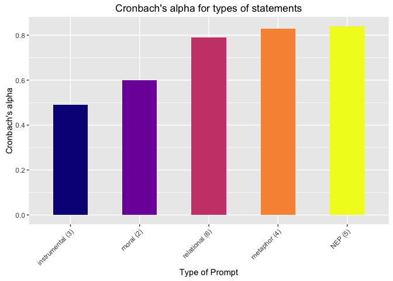

# Cronbach alpha
Sarah Klain  
April 30, 2016  


```r
library(stats) # for PCA & FA
library(psych) # for PCA

setwd("/Users/sarahklain/Documents/R_2015/navi")
ev_mt <- read.csv("ev_mt.csv")
```

### Cronbach's alpha
Cronbach's alpha for M-Turk value prompt data

```r
mt_val <- (ev_mt[3:23]) 
str(mt_val)
```

```
## 'data.frame':	400 obs. of  21 variables:
##  $ abuse_nep    : int  5 5 3 5 4 5 5 5 5 5 ...
##  $ bal_nep      : int  3 2 4 1 3 2 1 2 2 1 ...
##  $ crisis_nep   : int  1 1 3 1 2 1 1 1 1 1 ...
##  $ spaceship_nep: int  5 4 2 4 3 4 4 5 4 5 ...
##  $ bau_nep      : int  5 4 2 5 4 5 5 4 4 5 ...
##  $ extract_ins  : int  4 2 4 3 3 1 2 4 2 2 ...
##  $ loss_instr   : int  4 1 3 1 2 3 2 2 1 1 ...
##  $ decade_mor   : int  4 2 3 1 2 5 2 2 2 1 ...
##  $ comm_rel     : int  5 4 4 4 4 5 4 4 4 5 ...
##  $ wild_rel     : int  5 4 1 5 4 5 3 4 4 5 ...
##  $ clean_inst   : int  5 5 4 5 4 5 5 5 5 5 ...
##  $ tech         : int  5 3 3 4 4 5 4 4 3 4 ...
##  $ iden_rel     : int  3 4 2 5 4 5 5 5 3 5 ...
##  $ kin_rel      : int  3 4 4 5 4 5 4 5 3 5 ...
##  $ right        : int  4 1 4 1 2 1 1 2 1 1 ...
##  $ health_rel   : int  2 4 2 5 4 1 5 4 3 5 ...
##  $ other_rel    : int  5 4 4 5 5 5 5 5 4 5 ...
##  $ kin_met      : int  3 4 3 5 5 5 2 4 3 4 ...
##  $ resp_met     : int  4 4 3 5 5 5 4 4 3 5 ...
##  $ iden_met     : int  4 3 3 5 5 5 3 4 1 4 ...
##  $ other_met    : int  5 5 3 5 4 5 5 5 4 5 ...
```

```r
alpha(mt_val, check.keys = TRUE)
```

```
## Warning in alpha(mt_val, check.keys = TRUE): Some items were negatively correlated with total scale and were automatically reversed.
##  This is indicated by a negative sign for the variable name.
```

```
## 
## Reliability analysis   
## Call: alpha(x = mt_val, check.keys = TRUE)
## 
##   raw_alpha std.alpha G6(smc) average_r S/N  ase mean   sd
##       0.91      0.91    0.93      0.32  10 0.01  3.8 0.56
## 
##  lower alpha upper     95% confidence boundaries
## 0.89 0.91 0.93 
## 
##  Reliability if an item is dropped:
##               raw_alpha std.alpha G6(smc) average_r  S/N alpha se
## abuse_nep          0.90      0.90    0.92      0.32  9.3   0.0109
## bal_nep-           0.90      0.91    0.92      0.32  9.6   0.0107
## crisis_nep-        0.90      0.90    0.92      0.32  9.3   0.0109
## spaceship_nep      0.90      0.91    0.93      0.33  9.7   0.0106
## bau_nep            0.90      0.90    0.92      0.32  9.2   0.0109
## extract_ins-       0.91      0.91    0.93      0.34 10.1   0.0104
## loss_instr-        0.90      0.91    0.93      0.33  9.7   0.0106
## decade_mor-        0.90      0.90    0.92      0.32  9.3   0.0109
## comm_rel           0.90      0.91    0.93      0.33  9.7   0.0106
## wild_rel           0.90      0.90    0.92      0.32  9.4   0.0108
## clean_inst         0.90      0.91    0.92      0.32  9.5   0.0106
## tech-              0.91      0.92    0.93      0.36 11.1   0.0099
## iden_rel           0.90      0.90    0.92      0.32  9.3   0.0109
## kin_rel            0.90      0.90    0.92      0.32  9.4   0.0108
## right-             0.90      0.90    0.92      0.32  9.3   0.0109
## health_rel         0.90      0.91    0.93      0.33  9.8   0.0106
## other_rel          0.90      0.90    0.92      0.32  9.5   0.0107
## kin_met            0.90      0.91    0.92      0.32  9.5   0.0107
## resp_met           0.90      0.90    0.92      0.32  9.2   0.0110
## iden_met           0.90      0.91    0.92      0.33  9.7   0.0105
## other_met          0.90      0.90    0.92      0.32  9.4   0.0108
## 
##  Item statistics 
##                 n raw.r std.r r.cor r.drop mean   sd
## abuse_nep     400  0.70  0.71 0.699  0.659  4.3 0.80
## bal_nep-      400  0.60  0.60 0.581  0.542  3.8 0.97
## crisis_nep-   400  0.68  0.68 0.674  0.627  4.0 1.03
## spaceship_nep 398  0.56  0.56 0.525  0.497  3.9 0.95
## bau_nep       400  0.71  0.71 0.705  0.665  3.9 0.99
## extract_ins-  400  0.42  0.42 0.366  0.346  2.8 0.95
## loss_instr-   398  0.54  0.54 0.502  0.471  3.8 1.09
## decade_mor-   400  0.68  0.68 0.669  0.632  3.9 1.02
## comm_rel      399  0.54  0.55 0.515  0.489  4.1 0.73
## wild_rel      400  0.64  0.64 0.619  0.591  3.7 0.96
## clean_inst    400  0.58  0.61 0.585  0.551  4.7 0.52
## tech-         400  0.11  0.11 0.039  0.031  2.5 0.90
## iden_rel      400  0.70  0.70 0.689  0.659  3.8 0.94
## kin_rel       398  0.65  0.65 0.639  0.608  4.0 0.87
## right-        398  0.71  0.71 0.701  0.662  4.0 0.99
## health_rel    398  0.54  0.53 0.496  0.468  3.7 1.05
## other_rel     400  0.61  0.63 0.605  0.567  4.3 0.70
## kin_met       398  0.63  0.61 0.607  0.567  3.4 1.14
## resp_met      399  0.72  0.72 0.710  0.681  4.0 0.95
## iden_met      400  0.57  0.54 0.531  0.489  3.0 1.25
## other_met     400  0.63  0.64 0.615  0.582  4.1 0.93
## 
## Non missing response frequency for each item
##                  1    2    3    4    5 miss
## abuse_nep     0.00 0.03 0.10 0.43 0.43 0.00
## bal_nep       0.24 0.48 0.16 0.11 0.02 0.00
## crisis_nep    0.37 0.36 0.16 0.10 0.01 0.00
## spaceship_nep 0.01 0.11 0.15 0.47 0.26 0.01
## bau_nep       0.02 0.09 0.18 0.41 0.30 0.00
## extract_ins   0.05 0.20 0.31 0.42 0.03 0.00
## loss_instr    0.28 0.40 0.15 0.13 0.03 0.01
## decade_mor    0.30 0.39 0.18 0.12 0.01 0.00
## comm_rel      0.00 0.03 0.12 0.58 0.26 0.00
## wild_rel      0.01 0.12 0.21 0.46 0.19 0.00
## clean_inst    0.00 0.00 0.01 0.28 0.71 0.00
## tech          0.02 0.12 0.34 0.41 0.12 0.00
## iden_rel      0.01 0.08 0.22 0.44 0.25 0.00
## kin_rel       0.01 0.05 0.17 0.46 0.30 0.01
## right         0.36 0.39 0.14 0.09 0.01 0.01
## health_rel    0.02 0.14 0.18 0.42 0.24 0.01
## other_rel     0.00 0.02 0.05 0.48 0.44 0.00
## kin_met       0.06 0.17 0.29 0.29 0.19 0.01
## resp_met      0.02 0.03 0.24 0.36 0.35 0.00
## iden_met      0.15 0.19 0.31 0.21 0.14 0.00
## other_met     0.02 0.04 0.20 0.35 0.40 0.00
```

M-Turk NEP data

```r
mt_nep <- (ev_mt[3:7]) 
str(mt_nep)
```

```
## 'data.frame':	400 obs. of  5 variables:
##  $ abuse_nep    : int  5 5 3 5 4 5 5 5 5 5 ...
##  $ bal_nep      : int  3 2 4 1 3 2 1 2 2 1 ...
##  $ crisis_nep   : int  1 1 3 1 2 1 1 1 1 1 ...
##  $ spaceship_nep: int  5 4 2 4 3 4 4 5 4 5 ...
##  $ bau_nep      : int  5 4 2 5 4 5 5 4 4 5 ...
```

```r
alpha(mt_nep, check.keys = TRUE)
```

```
## Warning in alpha(mt_nep, check.keys = TRUE): Some items were negatively correlated with total scale and were automatically reversed.
##  This is indicated by a negative sign for the variable name.
```

```
## 
## Reliability analysis   
## Call: alpha(x = mt_nep, check.keys = TRUE)
## 
##   raw_alpha std.alpha G6(smc) average_r S/N   ase mean   sd
##       0.84      0.84    0.82      0.52 5.3 0.028    4 0.74
## 
##  lower alpha upper     95% confidence boundaries
## 0.79 0.84 0.89 
## 
##  Reliability if an item is dropped:
##               raw_alpha std.alpha G6(smc) average_r S/N alpha se
## abuse_nep          0.80      0.80    0.77      0.50 4.0    0.036
## bal_nep-           0.82      0.83    0.79      0.54 4.8    0.034
## crisis_nep-        0.79      0.80    0.75      0.49 3.9    0.036
## spaceship_nep      0.84      0.84    0.81      0.57 5.2    0.033
## bau_nep            0.78      0.79    0.75      0.48 3.7    0.037
## 
##  Item statistics 
##                 n raw.r std.r r.cor r.drop mean   sd
## abuse_nep     400  0.79  0.81  0.75   0.69  4.3 0.80
## bal_nep-      400  0.75  0.74  0.64   0.59  3.8 0.97
## crisis_nep-   400  0.83  0.82  0.77   0.70  4.0 1.03
## spaceship_nep 398  0.70  0.71  0.59   0.53  3.9 0.95
## bau_nep       400  0.84  0.84  0.80   0.73  3.9 0.99
## 
## Non missing response frequency for each item
##                  1    2    3    4    5 miss
## abuse_nep     0.00 0.03 0.10 0.43 0.43 0.00
## bal_nep       0.24 0.48 0.16 0.11 0.02 0.00
## crisis_nep    0.37 0.36 0.16 0.10 0.01 0.00
## spaceship_nep 0.01 0.11 0.15 0.47 0.26 0.01
## bau_nep       0.02 0.09 0.18 0.41 0.30 0.00
```

M-Turk metaphor data

```r
mt_met <- read.csv("met_mt.csv")
str(mt_met)
```

```
## 'data.frame':	400 obs. of  4 variables:
##  $ kin_met  : int  3 4 3 5 5 5 2 4 3 4 ...
##  $ resp_met : int  4 4 3 5 5 5 4 4 3 5 ...
##  $ iden_met : int  4 3 3 5 5 5 3 4 1 4 ...
##  $ other_met: int  5 5 3 5 4 5 5 5 4 5 ...
```

```r
alpha(mt_met, check.keys = TRUE)
```

```
## 
## Reliability analysis   
## Call: alpha(x = mt_met, check.keys = TRUE)
## 
##   raw_alpha std.alpha G6(smc) average_r S/N   ase mean   sd
##       0.83      0.83    0.81      0.54 4.8 0.033  3.6 0.87
## 
##  lower alpha upper     95% confidence boundaries
## 0.76 0.83 0.89 
## 
##  Reliability if an item is dropped:
##           raw_alpha std.alpha G6(smc) average_r S/N alpha se
## kin_met        0.72      0.74    0.68      0.48 2.8    0.050
## resp_met       0.76      0.75    0.72      0.50 3.0    0.047
## iden_met       0.77      0.77    0.71      0.53 3.4    0.047
## other_met      0.85      0.86    0.81      0.67 6.1    0.041
## 
##  Item statistics 
##             n raw.r std.r r.cor r.drop mean   sd
## kin_met   398  0.88  0.87  0.84   0.77  3.4 1.14
## resp_met  399  0.84  0.85  0.79   0.72  4.0 0.95
## iden_met  400  0.85  0.83  0.77   0.69  3.0 1.25
## other_met 400  0.66  0.70  0.52   0.47  4.1 0.93
## 
## Non missing response frequency for each item
##              1    2    3    4    5 miss
## kin_met   0.06 0.17 0.29 0.29 0.19 0.01
## resp_met  0.02 0.03 0.24 0.36 0.35 0.00
## iden_met  0.15 0.19 0.31 0.21 0.14 0.00
## other_met 0.02 0.04 0.20 0.35 0.40 0.00
```

M-Turk relational data

```r
mt_rel <- read.csv("mt_rel.csv")
str(mt_rel)
```

```
## 'data.frame':	400 obs. of  6 variables:
##  $ comm_rel  : int  5 4 4 4 4 5 4 4 4 5 ...
##  $ wild_rel  : int  5 4 1 5 4 5 3 4 4 5 ...
##  $ iden_rel  : int  3 4 2 5 4 5 5 5 3 5 ...
##  $ kin_rel   : int  3 4 4 5 4 5 4 5 3 5 ...
##  $ health_rel: int  2 4 2 5 4 1 5 4 3 5 ...
##  $ other_rel : int  5 4 4 5 5 5 5 5 4 5 ...
```

```r
alpha(mt_rel, check.keys = TRUE)
```

```
## 
## Reliability analysis   
## Call: alpha(x = mt_rel, check.keys = TRUE)
## 
##   raw_alpha std.alpha G6(smc) average_r S/N   ase mean   sd
##       0.79      0.79    0.78      0.39 3.9 0.029  3.9 0.61
## 
##  lower alpha upper     95% confidence boundaries
## 0.73 0.79 0.84 
## 
##  Reliability if an item is dropped:
##            raw_alpha std.alpha G6(smc) average_r S/N alpha se
## comm_rel        0.76      0.77    0.75      0.40 3.3    0.034
## wild_rel        0.74      0.76    0.73      0.38 3.1    0.035
## iden_rel        0.73      0.74    0.71      0.37 2.9    0.036
## kin_rel         0.73      0.74    0.71      0.37 2.9    0.036
## health_rel      0.80      0.80    0.77      0.44 3.9    0.031
## other_rel       0.76      0.77    0.75      0.40 3.3    0.034
## 
##  Item statistics 
##              n raw.r std.r r.cor r.drop mean   sd
## comm_rel   399  0.66  0.69  0.59   0.52  4.1 0.73
## wild_rel   400  0.74  0.73  0.65   0.57  3.7 0.96
## iden_rel   400  0.78  0.77  0.73   0.64  3.8 0.94
## kin_rel    398  0.75  0.76  0.71   0.62  4.0 0.87
## health_rel 398  0.62  0.59  0.45   0.39  3.7 1.05
## other_rel  400  0.66  0.69  0.59   0.53  4.3 0.70
## 
## Non missing response frequency for each item
##               1    2    3    4    5 miss
## comm_rel   0.00 0.03 0.12 0.58 0.26 0.00
## wild_rel   0.01 0.12 0.21 0.46 0.19 0.00
## iden_rel   0.01 0.08 0.22 0.44 0.25 0.00
## kin_rel    0.01 0.05 0.17 0.46 0.30 0.01
## health_rel 0.02 0.14 0.18 0.42 0.24 0.01
## other_rel  0.00 0.02 0.05 0.48 0.44 0.00
```

M-Turk instrumental data

```r
mt_ins <- read.csv("mt_inst.csv")
str(mt_ins)
```

```
## 'data.frame':	400 obs. of  3 variables:
##  $ extract_ins: int  4 2 4 3 3 1 2 4 2 2 ...
##  $ loss_instr : int  4 1 3 1 2 3 2 2 1 1 ...
##  $ clean_inst : int  5 5 4 5 4 5 5 5 5 5 ...
```

```r
alpha(mt_ins, check.keys = TRUE)
```

```
## Warning in alpha(mt_ins, check.keys = TRUE): Some items were negatively correlated with total scale and were automatically reversed.
##  This is indicated by a negative sign for the variable name.
```

```
## 
## Reliability analysis   
## Call: alpha(x = mt_ins, check.keys = TRUE)
## 
##   raw_alpha std.alpha G6(smc) average_r S/N   ase mean   sd
##       0.49      0.53    0.44      0.28 1.1 0.064  2.2 0.62
## 
##  lower alpha upper     95% confidence boundaries
## 0.36 0.49 0.62 
## 
##  Reliability if an item is dropped:
##             raw_alpha std.alpha G6(smc) average_r  S/N alpha se
## extract_ins      0.42      0.51    0.34      0.34 1.03    0.082
## loss_instr       0.33      0.38    0.23      0.23 0.61    0.087
## clean_inst-      0.40      0.41    0.26      0.26 0.69    0.091
## 
##  Item statistics 
##               n raw.r std.r r.cor r.drop mean   sd
## extract_ins 400  0.72  0.69  0.41   0.29  3.2 0.95
## loss_instr  398  0.81  0.74  0.52   0.35  2.2 1.09
## clean_inst- 400  0.59  0.73  0.50   0.36  1.3 0.52
## 
## Non missing response frequency for each item
##                1   2    3    4    5 miss
## extract_ins 0.05 0.2 0.31 0.42 0.03 0.00
## loss_instr  0.28 0.4 0.15 0.13 0.03 0.01
## clean_inst  0.00 0.0 0.01 0.28 0.71 0.00
```


M-Turk moral data

```r
mt_ins <- read.csv("mt_mor_t.csv")
mt_ins1 <- (mt_ins[1:2])
str(mt_ins1)
```

```
## 'data.frame':	400 obs. of  2 variables:
##  $ decade_mor: int  4 2 3 1 2 5 2 2 2 1 ...
##  $ right     : int  4 1 4 1 2 1 1 2 1 1 ...
```

```r
alpha(mt_ins, check.keys = TRUE)
```

```
## 
## Reliability analysis   
## Call: alpha(x = mt_ins, check.keys = TRUE)
## 
##   raw_alpha std.alpha G6(smc) average_r S/N   ase mean   sd
##        0.6      0.59    0.59      0.32 1.4 0.056  2.5 0.72
## 
##  lower alpha upper     95% confidence boundaries
## 0.49 0.6 0.71 
## 
##  Reliability if an item is dropped:
##            raw_alpha std.alpha G6(smc) average_r  S/N alpha se
## decade_mor      0.27      0.27    0.16      0.16 0.37    0.096
## right           0.24      0.24    0.13      0.13 0.31    0.096
## tech            0.81      0.81    0.68      0.68 4.25    0.067
## 
##  Item statistics 
##              n raw.r std.r r.cor r.drop mean   sd
## decade_mor 400  0.84  0.82  0.75   0.55  2.1 1.02
## right      398  0.84  0.83  0.77   0.58  2.0 0.99
## tech       400  0.55  0.58  0.19   0.16  3.5 0.90
## 
## Non missing response frequency for each item
##               1    2    3    4    5 miss
## decade_mor 0.30 0.39 0.18 0.12 0.01 0.00
## right      0.36 0.39 0.14 0.09 0.01 0.01
## tech       0.02 0.12 0.34 0.41 0.12 0.00
```

Plot out alphas


```r
library(ggplot2)
```

```
## Warning: package 'ggplot2' was built under R version 3.2.4
```

```
## 
## Attaching package: 'ggplot2'
## 
## The following objects are masked from 'package:psych':
## 
##     %+%, alpha
```

```r
library(viridis)
library(dplyr)
```

```
## 
## Attaching package: 'dplyr'
## 
## The following objects are masked from 'package:stats':
## 
##     filter, lag
## 
## The following objects are masked from 'package:base':
## 
##     intersect, setdiff, setequal, union
```

```r
cr <- read.csv("cron_a.csv")
```

```
## Warning in read.table(file = file, header = header, sep = sep, quote =
## quote, : incomplete final line found by readTableHeader on 'cron_a.csv'
```

```r
cron <- cr %>% 
  tbl_df

cron2 <- cron %>% 
  mutate(prompt = reorder(prompt, alpha)) %>% 
  arrange(alpha)

cron_bar <- ggplot(cron2, aes(x = prompt, y = alpha, fill = prompt)) +
  geom_bar(stat = "identity", width = 0.5) +
  scale_fill_viridis(discrete=TRUE, option = "viridis") +
  xlab("Type of Prompt") +
  ylab("Cronbach's alpha") +
  ggtitle("Cronbach's alpha for types of statements") +
  theme(axis.text.x = element_text(angle = 45, hjust = 1), legend.position="none") 
  #coord_cartesian(xlim = c(1, 5)) 

cron_bar
```

 

```r
ggsave ("cron_bar.pdf", width = 9, height = 4)
```

