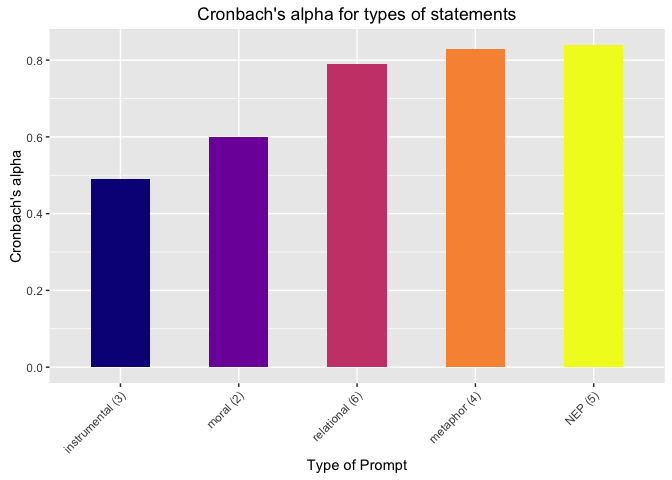

# Cronbach alpha
Sarah Klain  
April 30, 2016  


```r
library(stats) # for Cronbach alpha
library(psych) # for Cronbach alpha

setwd("/Users/sarahklain/Documents/R_2015/navi")
```


```r
ev <- read.csv("Env_Val_05_19_2016.csv")
ev1 <- (ev[3:19])

ev_mt <- read.csv("ev_mt.csv")
```

### Cronbach's alpha
for pooled data

```r
#alpha(ev, check.keys = TRUE)
alpha(ev1, check.keys = TRUE)
```

```
## 
## Reliability analysis   
## Call: alpha(x = ev1, check.keys = TRUE)
## 
##   raw_alpha std.alpha G6(smc) average_r S/N    ase mean   sd
##       0.89       0.9    0.92      0.34 8.9 0.0081    4 0.61
## 
##  lower alpha upper     95% confidence boundaries
## 0.87 0.89 0.91 
## 
##  Reliability if an item is dropped:
##               raw_alpha std.alpha G6(smc) average_r S/N alpha se
## abuse_nep          0.88      0.89    0.92      0.34 8.3   0.0086
## bal_r_nep          0.89      0.90    0.92      0.35 8.6   0.0085
## crisis_r_nep       0.90      0.91    0.93      0.38 9.6   0.0077
## spaceship_nep      0.88      0.89    0.92      0.35 8.5   0.0085
## bau_nep            0.88      0.89    0.91      0.34 8.1   0.0088
## comm_rel           0.88      0.89    0.92      0.34 8.4   0.0085
## wild_rel           0.88      0.89    0.92      0.34 8.2   0.0087
## iden_rel           0.88      0.89    0.92      0.33 8.0   0.0088
## kin_rel            0.88      0.89    0.92      0.34 8.1   0.0087
## other_rel          0.88      0.89    0.92      0.34 8.2   0.0086
## resp_rel           0.89      0.90    0.92      0.35 8.7   0.0084
## right_r_mor        0.88      0.89    0.92      0.34 8.3   0.0086
## health_rel2        0.89      0.89    0.92      0.35 8.5   0.0085
## kin_met            0.88      0.89    0.91      0.34 8.2   0.0087
## resp_met           0.88      0.89    0.91      0.33 8.0   0.0088
## iden_met           0.88      0.89    0.91      0.34 8.2   0.0086
## other_met          0.88      0.89    0.92      0.34 8.2   0.0086
## 
##  Item statistics 
##                 n raw.r std.r r.cor r.drop mean   sd
## abuse_nep     912  0.67  0.64  0.62   0.59  4.3 0.90
## bal_r_nep     910  0.58  0.55  0.51   0.48  4.0 1.05
## crisis_r_nep  909  0.30  0.25  0.19   0.16  3.6 1.31
## spaceship_nep 909  0.62  0.59  0.56   0.52  4.0 1.06
## bau_nep       912  0.73  0.69  0.68   0.65  4.1 1.05
## comm_rel      903  0.59  0.62  0.58   0.54  4.2 0.80
## wild_rel      907  0.67  0.67  0.64   0.61  3.8 0.99
## iden_rel      907  0.71  0.73  0.72   0.68  4.0 0.93
## kin_rel       906  0.67  0.68  0.66   0.62  4.0 0.89
## other_rel     799  0.66  0.67  0.64   0.61  4.5 0.66
## resp_rel      505  0.52  0.51  0.49   0.42  4.3 0.72
## right_r_mor   656  0.60  0.62  0.59   0.56  4.1 1.01
## health_rel2   545  0.55  0.57  0.54   0.49  3.8 1.04
## kin_met       649  0.73  0.68  0.68   0.62  3.7 1.06
## resp_met      650  0.77  0.73  0.72   0.68  4.2 0.87
## iden_met      651  0.72  0.65  0.65   0.58  3.5 1.24
## other_met     651  0.67  0.65  0.62   0.59  4.2 0.83
## 
## Non missing response frequency for each item
##                  1    2 2.5    3 3.5    4 4.5    5 miss
## abuse_nep     0.01 0.03   0 0.12   0 0.32   0 0.51 0.00
## bal_r_nep     0.03 0.08   0 0.16   0 0.36   0 0.37 0.00
## crisis_r_nep  0.10 0.12   0 0.18   0 0.29   0 0.31 0.00
## spaceship_nep 0.03 0.08   0 0.16   0 0.33   0 0.41 0.00
## bau_nep       0.02 0.08   0 0.17   0 0.29   0 0.44 0.00
## comm_rel      0.01 0.02   0 0.11   0 0.42   0 0.43 0.01
## wild_rel      0.02 0.09   0 0.18   0 0.44   0 0.27 0.01
## iden_rel      0.01 0.06   0 0.19   0 0.39   0 0.34 0.01
## kin_rel       0.01 0.05   0 0.17   0 0.45   0 0.32 0.01
## other_rel     0.00 0.02   0 0.04   0 0.39   0 0.55 0.12
## resp_rel      0.01 0.01   0 0.10   0 0.45   0 0.43 0.45
## right_r_mor   0.02 0.07   0 0.15   0 0.35   0 0.41 0.28
## health_rel2   0.02 0.12   0 0.18   0 0.41   0 0.27 0.40
## kin_met       0.04 0.11   0 0.20   0 0.40   0 0.25 0.29
## resp_met      0.01 0.02   0 0.16   0 0.36   0 0.45 0.29
## iden_met      0.09 0.12   0 0.22   0 0.32   0 0.25 0.29
## other_met     0.01 0.02   0 0.14   0 0.40   0 0.43 0.29
```

```r
alpha(ev[3:7],check.keys = TRUE )
```

```
## 
## Reliability analysis   
## Call: alpha(x = ev[3:7], check.keys = TRUE)
## 
##   raw_alpha std.alpha G6(smc) average_r S/N   ase mean   sd
##       0.73      0.75    0.75      0.38 3.1 0.024    4 0.75
## 
##  lower alpha upper     95% confidence boundaries
## 0.68 0.73 0.78 
## 
##  Reliability if an item is dropped:
##               raw_alpha std.alpha G6(smc) average_r S/N alpha se
## abuse_nep          0.65      0.67    0.65      0.33 2.0    0.031
## bal_r_nep          0.67      0.71    0.70      0.38 2.4    0.029
## crisis_r_nep       0.81      0.81    0.77      0.52 4.3    0.023
## spaceship_nep      0.66      0.69    0.67      0.36 2.3    0.030
## bau_nep            0.61      0.64    0.61      0.31 1.8    0.032
## 
##  Item statistics 
##                 n raw.r std.r r.cor r.drop mean  sd
## abuse_nep     912  0.75  0.79  0.73   0.62  4.3 0.9
## bal_r_nep     910  0.71  0.71  0.59   0.52  4.0 1.0
## crisis_r_nep  909  0.54  0.48  0.26   0.22  3.6 1.3
## spaceship_nep 909  0.73  0.74  0.68   0.54  4.0 1.1
## bau_nep       912  0.81  0.83  0.82   0.68  4.1 1.0
## 
## Non missing response frequency for each item
##                  1    2 2.5    3 3.5    4 4.5    5 miss
## abuse_nep     0.01 0.03   0 0.12   0 0.32   0 0.51    0
## bal_r_nep     0.03 0.08   0 0.16   0 0.36   0 0.37    0
## crisis_r_nep  0.10 0.12   0 0.18   0 0.29   0 0.31    0
## spaceship_nep 0.03 0.08   0 0.16   0 0.33   0 0.41    0
## bau_nep       0.02 0.08   0 0.17   0 0.29   0 0.44    0
```

```r
alpha(ev[8:12],check.keys = TRUE )
```

```
## 
## Reliability analysis   
## Call: alpha(x = ev[8:12], check.keys = TRUE)
## 
##   raw_alpha std.alpha G6(smc) average_r S/N  ase mean   sd
##        0.8       0.8    0.78      0.45 4.1 0.02  4.1 0.66
## 
##  lower alpha upper     95% confidence boundaries
## 0.76 0.8 0.84 
## 
##  Reliability if an item is dropped:
##           raw_alpha std.alpha G6(smc) average_r S/N alpha se
## comm_rel       0.78      0.78    0.74      0.47 3.6    0.025
## wild_rel       0.76      0.77    0.72      0.45 3.3    0.025
## iden_rel       0.73      0.74    0.69      0.42 2.9    0.027
## kin_rel        0.75      0.76    0.71      0.44 3.1    0.026
## other_rel      0.78      0.78    0.75      0.47 3.6    0.024
## 
##  Item statistics 
##             n raw.r std.r r.cor r.drop mean   sd
## comm_rel  903  0.69  0.71  0.60   0.53  4.2 0.80
## wild_rel  907  0.78  0.75  0.66   0.60  3.8 0.99
## iden_rel  907  0.82  0.80  0.75   0.67  4.0 0.93
## kin_rel   906  0.78  0.77  0.70   0.62  4.0 0.89
## other_rel 799  0.69  0.71  0.59   0.53  4.5 0.66
## 
## Non missing response frequency for each item
##              1    2    3    4 4.5    5 miss
## comm_rel  0.01 0.02 0.11 0.42   0 0.43 0.01
## wild_rel  0.02 0.09 0.18 0.44   0 0.27 0.01
## iden_rel  0.01 0.06 0.19 0.39   0 0.34 0.01
## kin_rel   0.01 0.05 0.17 0.45   0 0.32 0.01
## other_rel 0.00 0.02 0.04 0.39   0 0.55 0.12
```

farmers

```r
farm <- ev[which(ev$sub_pop =='Farmer'), ]
alpha(farm, check.keys = TRUE)
```

```
## Warning in var(if (is.vector(x)) x else as.double(x), na.rm = na.rm): NAs
## introduced by coercion
```

```
## Warning in var(if (is.vector(x)) x else as.double(x), na.rm = na.rm): NAs
## introduced by coercion
```

```
## Warning in alpha(farm, check.keys = TRUE): Item = sub_pop had no variance
## and was deleted
```

```
## Warning in alpha(farm, check.keys = TRUE): Item = id_num had no variance
## and was deleted
```

```
## Warning in alpha(farm, check.keys = TRUE): Item = right_r_mor had no
## variance and was deleted
```

```
## Warning in alpha(farm, check.keys = TRUE): Item = health_rel2 had no
## variance and was deleted
```

```
## Warning in alpha(farm, check.keys = TRUE): Item = decade_r_mor had no
## variance and was deleted
```

```
## Warning in alpha(farm, check.keys = TRUE): Item = extract_r_ins had no
## variance and was deleted
```

```
## Warning in alpha(farm, check.keys = TRUE): Item = loss_r_ins had no
## variance and was deleted
```

```
## Warning in alpha(farm, check.keys = TRUE): Item = clean_inst had no
## variance and was deleted
```

```
## Warning in alpha(farm, check.keys = TRUE): Item = tech_r had no variance
## and was deleted
```

```
## Warning in alpha(farm, check.keys = TRUE): Some items were negatively correlated with total scale and were automatically reversed.
##  This is indicated by a negative sign for the variable name.
```

```
## 
## Reliability analysis   
## Call: alpha(x = farm, check.keys = TRUE)
## 
##   raw_alpha std.alpha G6(smc) average_r S/N   ase mean   sd
##       0.72       0.8    0.85      0.21 4.1 0.032  4.4 0.33
## 
##  lower alpha upper     95% confidence boundaries
## 0.66 0.72 0.78 
## 
##  Reliability if an item is dropped:
##               raw_alpha std.alpha G6(smc) average_r S/N alpha se
## abuse_nep          0.71      0.81    0.85      0.23 4.2    0.033
## bal_r_nep          0.75      0.81    0.85      0.24 4.4    0.029
## crisis_r_nep-      0.79      0.81    0.85      0.24 4.4    0.026
## spaceship_nep      0.73      0.81    0.85      0.23 4.3    0.032
## bau_nep            0.72      0.81    0.85      0.23 4.3    0.032
## comm_rel           0.71      0.80    0.84      0.22 3.9    0.033
## wild_rel           0.70      0.79    0.84      0.22 3.8    0.034
## iden_rel           0.68      0.78    0.82      0.20 3.5    0.035
## kin_rel            0.68      0.78    0.82      0.20 3.5    0.035
## other_rel          0.70      0.79    0.84      0.21 3.7    0.034
## resp_rel           0.69      0.78    0.83      0.20 3.6    0.035
## kin_met            0.68      0.78    0.82      0.20 3.4    0.036
## resp_met           0.69      0.78    0.82      0.20 3.5    0.035
## iden_met           0.67      0.77    0.82      0.19 3.4    0.037
## other_met          0.67      0.77    0.81      0.19 3.3    0.036
## 
##  Item statistics 
##                 n raw.r std.r r.cor r.drop mean   sd
## abuse_nep     251  0.31  0.32  0.23  0.226  4.8 0.43
## bal_r_nep     250  0.25  0.22  0.12  0.035  4.5 1.04
## crisis_r_nep- 250  0.40  0.24  0.14  0.090  3.2 1.56
## spaceship_nep 251  0.24  0.28  0.20  0.109  4.7 0.66
## bau_nep       251  0.21  0.27  0.19  0.119  4.8 0.46
## comm_rel      251  0.42  0.46  0.39  0.320  4.7 0.55
## wild_rel      251  0.48  0.49  0.44  0.341  4.2 0.77
## iden_rel      251  0.65  0.68  0.66  0.576  4.5 0.59
## kin_rel       250  0.65  0.67  0.66  0.573  4.3 0.59
## other_rel     251  0.53  0.58  0.53  0.460  4.8 0.44
## resp_rel      251  0.64  0.65  0.63  0.563  4.3 0.56
## kin_met       251  0.69  0.70  0.71  0.615  4.3 0.61
## resp_met      251  0.63  0.68  0.67  0.557  4.6 0.55
## iden_met      251  0.74  0.74  0.76  0.672  4.3 0.63
## other_met     251  0.74  0.76  0.78  0.681  4.4 0.57
## 
## Non missing response frequency for each item
##                  1    2    3    4    5 miss
## abuse_nep     0.00 0.00 0.01 0.17 0.82    0
## bal_r_nep     0.03 0.06 0.04 0.12 0.74    0
## crisis_r_nep  0.31 0.16 0.14 0.17 0.22    0
## spaceship_nep 0.01 0.01 0.03 0.13 0.82    0
## bau_nep       0.00 0.00 0.03 0.14 0.84    0
## comm_rel      0.00 0.01 0.02 0.24 0.74    0
## wild_rel      0.01 0.02 0.08 0.52 0.37    0
## iden_rel      0.00 0.00 0.05 0.43 0.51    0
## kin_rel       0.00 0.00 0.06 0.60 0.34    0
## other_rel     0.00 0.00 0.00 0.24 0.76    0
## resp_rel      0.00 0.00 0.04 0.59 0.37    0
## kin_met       0.00 0.00 0.08 0.58 0.34    0
## resp_met      0.00 0.00 0.03 0.37 0.61    0
## iden_met      0.00 0.00 0.08 0.49 0.43    0
## other_met     0.00 0.00 0.04 0.48 0.48    0
```

```r
alpha(farm[3:7], check.keys = TRUE)
```

```
## 
## Reliability analysis   
## Call: alpha(x = farm[3:7], check.keys = TRUE)
## 
##   raw_alpha std.alpha G6(smc) average_r  S/N   ase mean   sd
##       0.35      0.48    0.47      0.15 0.91 0.072  4.3 0.49
## 
##  lower alpha upper     95% confidence boundaries
## 0.21 0.35 0.49 
## 
##  Reliability if an item is dropped:
##               raw_alpha std.alpha G6(smc) average_r  S/N alpha se
## abuse_nep          0.35      0.48    0.45      0.19 0.93    0.077
## bal_r_nep          0.25      0.43    0.42      0.16 0.76    0.076
## crisis_r_nep       0.42      0.51    0.48      0.21 1.04    0.074
## spaceship_nep      0.26      0.34    0.31      0.11 0.51    0.080
## bau_nep            0.25      0.32    0.29      0.10 0.46    0.082
## 
##  Item statistics 
##                 n raw.r std.r r.cor r.drop mean   sd
## abuse_nep     251  0.26  0.50  0.27   0.09  4.8 0.43
## bal_r_nep     250  0.61  0.56  0.34   0.23  4.5 1.04
## crisis_r_nep  250  0.74  0.46  0.19   0.15  2.8 1.56
## spaceship_nep 251  0.49  0.65  0.56   0.25  4.7 0.66
## bau_nep       251  0.51  0.68  0.60   0.35  4.8 0.46
## 
## Non missing response frequency for each item
##                  1    2    3    4    5 miss
## abuse_nep     0.00 0.00 0.01 0.17 0.82    0
## bal_r_nep     0.03 0.06 0.04 0.12 0.74    0
## crisis_r_nep  0.31 0.16 0.14 0.17 0.22    0
## spaceship_nep 0.01 0.01 0.03 0.13 0.82    0
## bau_nep       0.00 0.00 0.03 0.14 0.84    0
```

```r
alpha(farm[8:12],check.keys = TRUE)
```

```
## 
## Reliability analysis   
## Call: alpha(x = farm[8:12], check.keys = TRUE)
## 
##   raw_alpha std.alpha G6(smc) average_r S/N   ase mean  sd
##       0.69      0.71    0.68      0.33 2.4 0.048  4.5 0.4
## 
##  lower alpha upper     95% confidence boundaries
## 0.6 0.69 0.79 
## 
##  Reliability if an item is dropped:
##           raw_alpha std.alpha G6(smc) average_r S/N alpha se
## comm_rel       0.67      0.69    0.65      0.36 2.2    0.057
## wild_rel       0.68      0.69    0.64      0.35 2.2    0.055
## iden_rel       0.58      0.61    0.55      0.28 1.6    0.064
## kin_rel        0.64      0.65    0.59      0.32 1.8    0.059
## other_rel      0.65      0.66    0.62      0.32 1.9    0.058
## 
##  Item statistics 
##             n raw.r std.r r.cor r.drop mean   sd
## comm_rel  251  0.61  0.62  0.45   0.39  4.7 0.55
## wild_rel  251  0.70  0.63  0.49   0.40  4.2 0.77
## iden_rel  251  0.76  0.76  0.70   0.58  4.5 0.59
## kin_rel   250  0.68  0.70  0.61   0.47  4.3 0.59
## other_rel 251  0.63  0.69  0.56   0.46  4.8 0.44
## 
## Non missing response frequency for each item
##              1    2    3    4    5 miss
## comm_rel  0.00 0.01 0.02 0.24 0.74    0
## wild_rel  0.01 0.02 0.08 0.52 0.37    0
## iden_rel  0.00 0.00 0.05 0.43 0.51    0
## kin_rel   0.00 0.00 0.06 0.60 0.34    0
## other_rel 0.00 0.00 0.00 0.24 0.76    0
```

```r
#NEP alpha with no crisis prompt
farm2 <- farm
farm2$crisis_r_nep <- NULL
alpha(farm2[3:6], check.keys = TRUE)
```

```
## 
## Reliability analysis   
## Call: alpha(x = farm2[3:6], check.keys = TRUE)
## 
##   raw_alpha std.alpha G6(smc) average_r S/N   ase mean   sd
##       0.42      0.51    0.48      0.21   1 0.074  4.7 0.42
## 
##  lower alpha upper     95% confidence boundaries
## 0.28 0.42 0.57 
## 
##  Reliability if an item is dropped:
##               raw_alpha std.alpha G6(smc) average_r  S/N alpha se
## abuse_nep          0.36      0.48    0.43      0.24 0.93    0.087
## bal_r_nep          0.53      0.53    0.46      0.27 1.12    0.077
## spaceship_nep      0.30      0.36    0.28      0.16 0.57    0.085
## bau_nep            0.28      0.36    0.28      0.16 0.57    0.090
## 
##  Item statistics 
##                 n raw.r std.r r.cor r.drop mean   sd
## abuse_nep     251  0.49  0.60  0.35   0.26  4.8 0.43
## bal_r_nep     250  0.74  0.56  0.27   0.18  4.5 1.04
## spaceship_nep 251  0.63  0.69  0.57   0.29  4.7 0.66
## bau_nep       251  0.60  0.69  0.57   0.37  4.8 0.46
## 
## Non missing response frequency for each item
##                  1    2    3    4    5 miss
## abuse_nep     0.00 0.00 0.01 0.17 0.82    0
## bal_r_nep     0.03 0.06 0.04 0.12 0.74    0
## spaceship_nep 0.01 0.01 0.03 0.13 0.82    0
## bau_nep       0.00 0.00 0.03 0.14 0.84    0
```

tourists

```r
tour <- ev[which(ev$sub_pop =='Tourist'), ]
alpha(tour, check.keys = TRUE)
```

```
## Warning in var(if (is.vector(x)) x else as.double(x), na.rm = na.rm): NAs
## introduced by coercion
```

```
## Warning in var(if (is.vector(x)) x else as.double(x), na.rm = na.rm): NAs
## introduced by coercion
```

```
## Warning in alpha(tour, check.keys = TRUE): Item = sub_pop had no variance
## and was deleted
```

```
## Warning in alpha(tour, check.keys = TRUE): Item = id_num had no variance
## and was deleted
```

```
## Warning in alpha(tour, check.keys = TRUE): Item = kin_met had no variance
## and was deleted
```

```
## Warning in alpha(tour, check.keys = TRUE): Item = resp_met had no variance
## and was deleted
```

```
## Warning in alpha(tour, check.keys = TRUE): Item = iden_met had no variance
## and was deleted
```

```
## Warning in alpha(tour, check.keys = TRUE): Item = other_met had no variance
## and was deleted
```

```
## Warning in alpha(tour, check.keys = TRUE): Item = decade_r_mor had no
## variance and was deleted
```

```
## 
## Reliability analysis   
## Call: alpha(x = tour, check.keys = TRUE)
## 
##   raw_alpha std.alpha G6(smc) average_r S/N   ase mean   sd
##       0.86      0.87    0.89      0.28 6.5 0.018  3.8 0.59
## 
##  lower alpha upper     95% confidence boundaries
## 0.82 0.86 0.89 
## 
##  Reliability if an item is dropped:
##               raw_alpha std.alpha G6(smc) average_r S/N alpha se
## abuse_nep          0.85      0.86    0.88      0.28 6.1    0.019
## bal_r_nep          0.85      0.86    0.89      0.27 6.0    0.019
## crisis_r_nep       0.85      0.86    0.88      0.27 5.9    0.019
## spaceship_nep      0.85      0.86    0.89      0.28 6.1    0.019
## bau_nep            0.85      0.86    0.88      0.27 5.9    0.019
## comm_rel           0.86      0.86    0.88      0.28 6.2    0.019
## wild_rel           0.85      0.86    0.88      0.27 6.0    0.019
## iden_rel           0.85      0.86    0.88      0.27 6.0    0.019
## kin_rel            0.84      0.85    0.88      0.27 5.8    0.020
## other_rel          0.85      0.85    0.88      0.27 5.8    0.019
## resp_rel           0.85      0.86    0.88      0.27 6.0    0.019
## right_r_mor        0.85      0.86    0.89      0.28 6.1    0.019
## health_rel2        0.85      0.86    0.88      0.27 6.0    0.019
## extract_r_ins      0.86      0.87    0.89      0.29 6.6    0.018
## loss_r_ins         0.86      0.86    0.89      0.28 6.4    0.018
## clean_inst         0.85      0.86    0.89      0.28 6.1    0.019
## tech_r             0.86      0.87    0.89      0.29 6.6    0.018
## 
##  Item statistics 
##                 n raw.r std.r r.cor r.drop mean   sd
## abuse_nep     261  0.59  0.56  0.53   0.49  3.8 1.10
## bal_r_nep     260  0.62  0.60  0.56   0.53  3.7 1.01
## crisis_r_nep  259  0.64  0.63  0.60   0.57  3.7 1.12
## spaceship_nep 260  0.57  0.55  0.51   0.47  3.5 1.16
## bau_nep       261  0.67  0.65  0.64   0.59  3.6 1.14
## comm_rel      253  0.46  0.51  0.48   0.40  4.1 0.94
## wild_rel      256  0.62  0.62  0.59   0.54  3.7 1.14
## iden_rel      256  0.60  0.61  0.60   0.53  3.8 1.02
## kin_rel       258  0.68  0.70  0.69   0.63  3.8 1.09
## other_rel     148  0.69  0.68  0.66   0.60  4.4 0.74
## resp_rel      254  0.55  0.60  0.58   0.51  4.3 0.86
## right_r_mor   258  0.56  0.55  0.51   0.47  4.1 1.04
## health_rel2   147  0.61  0.60  0.58   0.51  3.9 1.01
## extract_r_ins 250  0.40  0.35  0.28   0.27  2.5 1.15
## loss_r_ins    257  0.49  0.46  0.41   0.38  3.7 1.22
## clean_inst    258  0.51  0.57  0.54   0.48  4.7 0.59
## tech_r        256  0.39  0.36  0.30   0.28  3.1 1.13
## 
## Non missing response frequency for each item
##                  1    2 2.5    3  3.5    4 4.5    5 miss
## abuse_nep     0.04 0.07   0 0.25 0.00 0.30   0 0.33 0.00
## bal_r_nep     0.04 0.07   0 0.26 0.00 0.41   0 0.22 0.00
## crisis_r_nep  0.03 0.12   0 0.25 0.01 0.30   0 0.29 0.01
## spaceship_nep 0.07 0.10   0 0.30 0.00 0.30   0 0.23 0.00
## bau_nep       0.04 0.15   0 0.28 0.01 0.26   0 0.26 0.00
## comm_rel      0.02 0.03   0 0.20 0.00 0.35   0 0.40 0.03
## wild_rel      0.05 0.10   0 0.24 0.00 0.32   0 0.29 0.02
## iden_rel      0.01 0.09   0 0.29 0.00 0.29   0 0.32 0.02
## kin_rel       0.03 0.08   0 0.26 0.00 0.30   0 0.33 0.01
## other_rel     0.00 0.02   0 0.09 0.00 0.37   0 0.51 0.43
## resp_rel      0.01 0.01   0 0.16 0.00 0.32   0 0.49 0.03
## right_r_mor   0.03 0.05   0 0.16 0.00 0.28   0 0.48 0.01
## health_rel2   0.01 0.09   0 0.19 0.00 0.36   0 0.35 0.44
## extract_r_ins 0.21 0.32   0 0.25 0.00 0.17   0 0.05 0.04
## loss_r_ins    0.05 0.14   0 0.20 0.00 0.27   0 0.33 0.02
## clean_inst    0.00 0.00   0 0.04 0.00 0.25   0 0.71 0.01
## tech_r        0.09 0.21   0 0.33 0.00 0.25   0 0.12 0.02
```

```r
alpha(tour[3:7], check.keys = TRUE)
```

```
## 
## Reliability analysis   
## Call: alpha(x = tour[3:7], check.keys = TRUE)
## 
##   raw_alpha std.alpha G6(smc) average_r S/N   ase mean   sd
##       0.79      0.79    0.77      0.43 3.8 0.039  3.7 0.81
## 
##  lower alpha upper     95% confidence boundaries
## 0.71 0.79 0.87 
## 
##  Reliability if an item is dropped:
##               raw_alpha std.alpha G6(smc) average_r S/N alpha se
## abuse_nep          0.74      0.74    0.71      0.42 2.9    0.049
## bal_r_nep          0.77      0.77    0.73      0.45 3.3    0.047
## crisis_r_nep       0.77      0.77    0.73      0.45 3.3    0.047
## spaceship_nep      0.76      0.76    0.71      0.44 3.1    0.048
## bau_nep            0.71      0.71    0.66      0.39 2.5    0.052
## 
##  Item statistics 
##                 n raw.r std.r r.cor r.drop mean  sd
## abuse_nep     261  0.76  0.76  0.67   0.60  3.8 1.1
## bal_r_nep     260  0.68  0.70  0.58   0.51  3.7 1.0
## crisis_r_nep  259  0.70  0.70  0.58   0.51  3.7 1.1
## spaceship_nep 260  0.73  0.72  0.64   0.55  3.5 1.2
## bau_nep       261  0.82  0.81  0.77   0.68  3.6 1.1
## 
## Non missing response frequency for each item
##                  1    2 2.5    3  3.5    4 4.5    5 miss
## abuse_nep     0.04 0.07   0 0.25 0.00 0.30   0 0.33 0.00
## bal_r_nep     0.04 0.07   0 0.26 0.00 0.41   0 0.22 0.00
## crisis_r_nep  0.03 0.12   0 0.25 0.01 0.30   0 0.29 0.01
## spaceship_nep 0.07 0.10   0 0.30 0.00 0.30   0 0.23 0.00
## bau_nep       0.04 0.15   0 0.28 0.01 0.26   0 0.26 0.00
```

```r
alpha(tour[8:12],check.keys = TRUE)
```

```
## 
## Reliability analysis   
## Call: alpha(x = tour[8:12], check.keys = TRUE)
## 
##   raw_alpha std.alpha G6(smc) average_r S/N   ase mean   sd
##       0.79      0.79    0.79      0.43 3.8 0.039  3.9 0.77
## 
##  lower alpha upper     95% confidence boundaries
## 0.71 0.79 0.86 
## 
##  Reliability if an item is dropped:
##           raw_alpha std.alpha G6(smc) average_r S/N alpha se
## comm_rel       0.78      0.78    0.75      0.47 3.6    0.046
## wild_rel       0.74      0.75    0.72      0.43 3.0    0.049
## iden_rel       0.72      0.74    0.71      0.41 2.8    0.051
## kin_rel        0.72      0.73    0.70      0.40 2.7    0.051
## other_rel      0.76      0.76    0.73      0.44 3.2    0.047
## 
##  Item statistics 
##             n raw.r std.r r.cor r.drop mean   sd
## comm_rel  253  0.63  0.67  0.55   0.46  4.1 0.94
## wild_rel  256  0.79  0.75  0.66   0.59  3.7 1.14
## iden_rel  256  0.80  0.77  0.71   0.63  3.8 1.02
## kin_rel   258  0.80  0.78  0.72   0.64  3.8 1.09
## other_rel 148  0.69  0.72  0.62   0.54  4.4 0.74
## 
## Non missing response frequency for each item
##              1    2    3    4 4.5    5 miss
## comm_rel  0.02 0.03 0.20 0.35   0 0.40 0.03
## wild_rel  0.05 0.10 0.24 0.32   0 0.29 0.02
## iden_rel  0.01 0.09 0.29 0.29   0 0.32 0.02
## kin_rel   0.03 0.08 0.26 0.30   0 0.33 0.01
## other_rel 0.00 0.02 0.09 0.37   0 0.51 0.43
```

M-Turk

```r
mt <- ev[which(ev$sub_pop =='M-Turk'), ]
alpha(mt, check.keys = TRUE)
```

```
## Warning in var(if (is.vector(x)) x else as.double(x), na.rm = na.rm): NAs
## introduced by coercion
```

```
## Warning in var(if (is.vector(x)) x else as.double(x), na.rm = na.rm): NAs
## introduced by coercion
```

```
## Warning in alpha(mt, check.keys = TRUE): Item = sub_pop had no variance and
## was deleted
```

```
## Warning in alpha(mt, check.keys = TRUE): Item = id_num had no variance and
## was deleted
```

```
## Warning in alpha(mt, check.keys = TRUE): Item = resp_rel had no variance
## and was deleted
```

```
## 
## Reliability analysis   
## Call: alpha(x = mt, check.keys = TRUE)
## 
##   raw_alpha std.alpha G6(smc) average_r S/N  ase mean   sd
##       0.91      0.91    0.93      0.32  10 0.01  3.8 0.56
## 
##  lower alpha upper     95% confidence boundaries
## 0.89 0.91 0.93 
## 
##  Reliability if an item is dropped:
##               raw_alpha std.alpha G6(smc) average_r  S/N alpha se
## abuse_nep          0.90      0.90    0.92      0.32  9.3   0.0109
## bal_r_nep          0.90      0.91    0.92      0.32  9.6   0.0107
## crisis_r_nep       0.90      0.90    0.92      0.32  9.3   0.0109
## spaceship_nep      0.90      0.91    0.93      0.33  9.7   0.0106
## bau_nep            0.90      0.90    0.92      0.32  9.2   0.0109
## comm_rel           0.90      0.91    0.93      0.33  9.7   0.0106
## wild_rel           0.90      0.90    0.92      0.32  9.4   0.0108
## iden_rel           0.90      0.90    0.92      0.32  9.3   0.0109
## kin_rel            0.90      0.90    0.92      0.32  9.4   0.0108
## other_rel          0.90      0.90    0.92      0.32  9.5   0.0107
## right_r_mor        0.90      0.90    0.92      0.32  9.3   0.0109
## health_rel2        0.90      0.91    0.93      0.33  9.8   0.0106
## kin_met            0.90      0.91    0.92      0.32  9.5   0.0107
## resp_met           0.90      0.90    0.92      0.32  9.2   0.0110
## iden_met           0.90      0.91    0.92      0.33  9.7   0.0105
## other_met          0.90      0.90    0.92      0.32  9.4   0.0108
## decade_r_mor       0.90      0.90    0.92      0.32  9.3   0.0109
## extract_r_ins      0.91      0.91    0.93      0.34 10.1   0.0104
## loss_r_ins         0.90      0.91    0.93      0.33  9.7   0.0106
## clean_inst         0.90      0.91    0.92      0.32  9.5   0.0106
## tech_r             0.91      0.92    0.93      0.36 11.1   0.0099
## 
##  Item statistics 
##                 n raw.r std.r r.cor r.drop mean   sd
## abuse_nep     400  0.70  0.71 0.699  0.659  4.3 0.80
## bal_r_nep     400  0.60  0.60 0.581  0.542  3.8 0.97
## crisis_r_nep  400  0.68  0.68 0.674  0.627  4.0 1.03
## spaceship_nep 398  0.56  0.56 0.525  0.497  3.9 0.95
## bau_nep       400  0.71  0.71 0.705  0.665  3.9 0.99
## comm_rel      399  0.54  0.55 0.515  0.489  4.1 0.73
## wild_rel      400  0.64  0.64 0.619  0.591  3.7 0.96
## iden_rel      400  0.70  0.70 0.689  0.659  3.8 0.94
## kin_rel       398  0.65  0.65 0.639  0.608  4.0 0.87
## other_rel     400  0.61  0.63 0.605  0.567  4.3 0.70
## right_r_mor   398  0.71  0.71 0.701  0.662  4.0 0.99
## health_rel2   398  0.54  0.53 0.496  0.468  3.7 1.05
## kin_met       398  0.63  0.61 0.607  0.567  3.4 1.14
## resp_met      399  0.72  0.72 0.710  0.681  4.0 0.95
## iden_met      400  0.57  0.54 0.531  0.489  3.0 1.25
## other_met     400  0.63  0.64 0.615  0.582  4.1 0.93
## decade_r_mor  400  0.68  0.68 0.669  0.632  3.9 1.02
## extract_r_ins 400  0.42  0.42 0.366  0.346  2.8 0.95
## loss_r_ins    398  0.54  0.54 0.502  0.471  3.8 1.09
## clean_inst    400  0.58  0.61 0.585  0.551  4.7 0.52
## tech_r        400  0.11  0.11 0.039  0.031  2.5 0.90
## 
## Non missing response frequency for each item
##                  1    2    3    4    5 miss
## abuse_nep     0.00 0.03 0.10 0.43 0.43 0.00
## bal_r_nep     0.02 0.11 0.16 0.48 0.24 0.00
## crisis_r_nep  0.01 0.10 0.16 0.36 0.37 0.00
## spaceship_nep 0.01 0.11 0.15 0.47 0.26 0.01
## bau_nep       0.02 0.09 0.18 0.41 0.30 0.00
## comm_rel      0.00 0.03 0.12 0.58 0.26 0.00
## wild_rel      0.01 0.12 0.21 0.46 0.19 0.00
## iden_rel      0.01 0.08 0.22 0.44 0.25 0.00
## kin_rel       0.01 0.05 0.17 0.46 0.30 0.01
## other_rel     0.00 0.02 0.05 0.48 0.44 0.00
## right_r_mor   0.01 0.09 0.14 0.39 0.36 0.01
## health_rel2   0.02 0.14 0.18 0.42 0.24 0.01
## kin_met       0.06 0.17 0.29 0.29 0.19 0.01
## resp_met      0.02 0.03 0.24 0.36 0.35 0.00
## iden_met      0.15 0.19 0.31 0.21 0.14 0.00
## other_met     0.02 0.04 0.20 0.35 0.40 0.00
## decade_r_mor  0.01 0.12 0.18 0.39 0.30 0.00
## extract_r_ins 0.03 0.42 0.31 0.20 0.05 0.00
## loss_r_ins    0.03 0.13 0.15 0.40 0.28 0.01
## clean_inst    0.00 0.00 0.01 0.28 0.71 0.00
## tech_r        0.12 0.41 0.34 0.12 0.02 0.00
```

```r
alpha(mt[3:7], check.keys = TRUE)
```

```
## 
## Reliability analysis   
## Call: alpha(x = mt[3:7], check.keys = TRUE)
## 
##   raw_alpha std.alpha G6(smc) average_r S/N   ase mean   sd
##       0.84      0.84    0.82      0.52 5.3 0.028    4 0.74
## 
##  lower alpha upper     95% confidence boundaries
## 0.79 0.84 0.89 
## 
##  Reliability if an item is dropped:
##               raw_alpha std.alpha G6(smc) average_r S/N alpha se
## abuse_nep          0.80      0.80    0.77      0.50 4.0    0.036
## bal_r_nep          0.82      0.83    0.79      0.54 4.8    0.034
## crisis_r_nep       0.79      0.80    0.75      0.49 3.9    0.036
## spaceship_nep      0.84      0.84    0.81      0.57 5.2    0.033
## bau_nep            0.78      0.79    0.75      0.48 3.7    0.037
## 
##  Item statistics 
##                 n raw.r std.r r.cor r.drop mean   sd
## abuse_nep     400  0.79  0.81  0.75   0.69  4.3 0.80
## bal_r_nep     400  0.75  0.74  0.64   0.59  3.8 0.97
## crisis_r_nep  400  0.83  0.82  0.77   0.70  4.0 1.03
## spaceship_nep 398  0.70  0.71  0.59   0.53  3.9 0.95
## bau_nep       400  0.84  0.84  0.80   0.73  3.9 0.99
## 
## Non missing response frequency for each item
##                  1    2    3    4    5 miss
## abuse_nep     0.00 0.03 0.10 0.43 0.43 0.00
## bal_r_nep     0.02 0.11 0.16 0.48 0.24 0.00
## crisis_r_nep  0.01 0.10 0.16 0.36 0.37 0.00
## spaceship_nep 0.01 0.11 0.15 0.47 0.26 0.01
## bau_nep       0.02 0.09 0.18 0.41 0.30 0.00
```

```r
#M-Turk relational data
mt_rel <- read.csv("mt_rel.csv")
#str(mt_rel)
alpha(mt_rel, check.keys = TRUE)
```

```
## 
## Reliability analysis   
## Call: alpha(x = mt_rel, check.keys = TRUE)
## 
##   raw_alpha std.alpha G6(smc) average_r S/N   ase mean   sd
##       0.79      0.79    0.78      0.39 3.9 0.029  3.9 0.61
## 
##  lower alpha upper     95% confidence boundaries
## 0.73 0.79 0.84 
## 
##  Reliability if an item is dropped:
##            raw_alpha std.alpha G6(smc) average_r S/N alpha se
## comm_rel        0.76      0.77    0.75      0.40 3.3    0.034
## wild_rel        0.74      0.76    0.73      0.38 3.1    0.035
## iden_rel        0.73      0.74    0.71      0.37 2.9    0.036
## kin_rel         0.73      0.74    0.71      0.37 2.9    0.036
## health_rel      0.80      0.80    0.77      0.44 3.9    0.031
## other_rel       0.76      0.77    0.75      0.40 3.3    0.034
## 
##  Item statistics 
##              n raw.r std.r r.cor r.drop mean   sd
## comm_rel   399  0.66  0.69  0.59   0.52  4.1 0.73
## wild_rel   400  0.74  0.73  0.65   0.57  3.7 0.96
## iden_rel   400  0.78  0.77  0.73   0.64  3.8 0.94
## kin_rel    398  0.75  0.76  0.71   0.62  4.0 0.87
## health_rel 398  0.62  0.59  0.45   0.39  3.7 1.05
## other_rel  400  0.66  0.69  0.59   0.53  4.3 0.70
## 
## Non missing response frequency for each item
##               1    2    3    4    5 miss
## comm_rel   0.00 0.03 0.12 0.58 0.26 0.00
## wild_rel   0.01 0.12 0.21 0.46 0.19 0.00
## iden_rel   0.01 0.08 0.22 0.44 0.25 0.00
## kin_rel    0.01 0.05 0.17 0.46 0.30 0.01
## health_rel 0.02 0.14 0.18 0.42 0.24 0.01
## other_rel  0.00 0.02 0.05 0.48 0.44 0.00
```

But... when calculating 
M-Turk NEP data

```r
mt_nep <- (ev_mt[3:7]) 
str(mt_nep)
```

```
## 'data.frame':	400 obs. of  5 variables:
##  $ abuse_nep    : int  5 5 3 5 4 5 5 5 5 5 ...
##  $ bal_nep      : int  3 2 4 1 3 2 1 2 2 1 ...
##  $ crisis_nep   : int  1 1 3 1 2 1 1 1 1 1 ...
##  $ spaceship_nep: int  5 4 2 4 3 4 4 5 4 5 ...
##  $ bau_nep      : int  5 4 2 5 4 5 5 4 4 5 ...
```

```r
alpha(mt_nep, check.keys = TRUE)
```

```
## Warning in alpha(mt_nep, check.keys = TRUE): Some items were negatively correlated with total scale and were automatically reversed.
##  This is indicated by a negative sign for the variable name.
```

```
## 
## Reliability analysis   
## Call: alpha(x = mt_nep, check.keys = TRUE)
## 
##   raw_alpha std.alpha G6(smc) average_r S/N   ase mean   sd
##       0.84      0.84    0.82      0.52 5.3 0.028    4 0.74
## 
##  lower alpha upper     95% confidence boundaries
## 0.79 0.84 0.89 
## 
##  Reliability if an item is dropped:
##               raw_alpha std.alpha G6(smc) average_r S/N alpha se
## abuse_nep          0.80      0.80    0.77      0.50 4.0    0.036
## bal_nep-           0.82      0.83    0.79      0.54 4.8    0.034
## crisis_nep-        0.79      0.80    0.75      0.49 3.9    0.036
## spaceship_nep      0.84      0.84    0.81      0.57 5.2    0.033
## bau_nep            0.78      0.79    0.75      0.48 3.7    0.037
## 
##  Item statistics 
##                 n raw.r std.r r.cor r.drop mean   sd
## abuse_nep     400  0.79  0.81  0.75   0.69  4.3 0.80
## bal_nep-      400  0.75  0.74  0.64   0.59  3.8 0.97
## crisis_nep-   400  0.83  0.82  0.77   0.70  4.0 1.03
## spaceship_nep 398  0.70  0.71  0.59   0.53  3.9 0.95
## bau_nep       400  0.84  0.84  0.80   0.73  3.9 0.99
## 
## Non missing response frequency for each item
##                  1    2    3    4    5 miss
## abuse_nep     0.00 0.03 0.10 0.43 0.43 0.00
## bal_nep       0.24 0.48 0.16 0.11 0.02 0.00
## crisis_nep    0.37 0.36 0.16 0.10 0.01 0.00
## spaceship_nep 0.01 0.11 0.15 0.47 0.26 0.01
## bau_nep       0.02 0.09 0.18 0.41 0.30 0.00
```


Cronbach's alpha for M-Turk value prompt data

```r
mt_val <- (ev_mt[3:23]) 
str(mt_val)
```

```
## 'data.frame':	400 obs. of  21 variables:
##  $ abuse_nep    : int  5 5 3 5 4 5 5 5 5 5 ...
##  $ bal_nep      : int  3 2 4 1 3 2 1 2 2 1 ...
##  $ crisis_nep   : int  1 1 3 1 2 1 1 1 1 1 ...
##  $ spaceship_nep: int  5 4 2 4 3 4 4 5 4 5 ...
##  $ bau_nep      : int  5 4 2 5 4 5 5 4 4 5 ...
##  $ extract_ins  : int  4 2 4 3 3 1 2 4 2 2 ...
##  $ loss_instr   : int  4 1 3 1 2 3 2 2 1 1 ...
##  $ decade_mor   : int  4 2 3 1 2 5 2 2 2 1 ...
##  $ comm_rel     : int  5 4 4 4 4 5 4 4 4 5 ...
##  $ wild_rel     : int  5 4 1 5 4 5 3 4 4 5 ...
##  $ clean_inst   : int  5 5 4 5 4 5 5 5 5 5 ...
##  $ tech         : int  5 3 3 4 4 5 4 4 3 4 ...
##  $ iden_rel     : int  3 4 2 5 4 5 5 5 3 5 ...
##  $ kin_rel      : int  3 4 4 5 4 5 4 5 3 5 ...
##  $ right        : int  4 1 4 1 2 1 1 2 1 1 ...
##  $ health_rel   : int  2 4 2 5 4 1 5 4 3 5 ...
##  $ other_rel    : int  5 4 4 5 5 5 5 5 4 5 ...
##  $ kin_met      : int  3 4 3 5 5 5 2 4 3 4 ...
##  $ resp_met     : int  4 4 3 5 5 5 4 4 3 5 ...
##  $ iden_met     : int  4 3 3 5 5 5 3 4 1 4 ...
##  $ other_met    : int  5 5 3 5 4 5 5 5 4 5 ...
```

```r
alpha(mt_val, check.keys = TRUE)
```

```
## Warning in alpha(mt_val, check.keys = TRUE): Some items were negatively correlated with total scale and were automatically reversed.
##  This is indicated by a negative sign for the variable name.
```

```
## 
## Reliability analysis   
## Call: alpha(x = mt_val, check.keys = TRUE)
## 
##   raw_alpha std.alpha G6(smc) average_r S/N  ase mean   sd
##       0.91      0.91    0.93      0.32  10 0.01  3.8 0.56
## 
##  lower alpha upper     95% confidence boundaries
## 0.89 0.91 0.93 
## 
##  Reliability if an item is dropped:
##               raw_alpha std.alpha G6(smc) average_r  S/N alpha se
## abuse_nep          0.90      0.90    0.92      0.32  9.3   0.0109
## bal_nep-           0.90      0.91    0.92      0.32  9.6   0.0107
## crisis_nep-        0.90      0.90    0.92      0.32  9.3   0.0109
## spaceship_nep      0.90      0.91    0.93      0.33  9.7   0.0106
## bau_nep            0.90      0.90    0.92      0.32  9.2   0.0109
## extract_ins-       0.91      0.91    0.93      0.34 10.1   0.0104
## loss_instr-        0.90      0.91    0.93      0.33  9.7   0.0106
## decade_mor-        0.90      0.90    0.92      0.32  9.3   0.0109
## comm_rel           0.90      0.91    0.93      0.33  9.7   0.0106
## wild_rel           0.90      0.90    0.92      0.32  9.4   0.0108
## clean_inst         0.90      0.91    0.92      0.32  9.5   0.0106
## tech-              0.91      0.92    0.93      0.36 11.1   0.0099
## iden_rel           0.90      0.90    0.92      0.32  9.3   0.0109
## kin_rel            0.90      0.90    0.92      0.32  9.4   0.0108
## right-             0.90      0.90    0.92      0.32  9.3   0.0109
## health_rel         0.90      0.91    0.93      0.33  9.8   0.0106
## other_rel          0.90      0.90    0.92      0.32  9.5   0.0107
## kin_met            0.90      0.91    0.92      0.32  9.5   0.0107
## resp_met           0.90      0.90    0.92      0.32  9.2   0.0110
## iden_met           0.90      0.91    0.92      0.33  9.7   0.0105
## other_met          0.90      0.90    0.92      0.32  9.4   0.0108
## 
##  Item statistics 
##                 n raw.r std.r r.cor r.drop mean   sd
## abuse_nep     400  0.70  0.71 0.699  0.659  4.3 0.80
## bal_nep-      400  0.60  0.60 0.581  0.542  3.8 0.97
## crisis_nep-   400  0.68  0.68 0.674  0.627  4.0 1.03
## spaceship_nep 398  0.56  0.56 0.525  0.497  3.9 0.95
## bau_nep       400  0.71  0.71 0.705  0.665  3.9 0.99
## extract_ins-  400  0.42  0.42 0.366  0.346  2.8 0.95
## loss_instr-   398  0.54  0.54 0.502  0.471  3.8 1.09
## decade_mor-   400  0.68  0.68 0.669  0.632  3.9 1.02
## comm_rel      399  0.54  0.55 0.515  0.489  4.1 0.73
## wild_rel      400  0.64  0.64 0.619  0.591  3.7 0.96
## clean_inst    400  0.58  0.61 0.585  0.551  4.7 0.52
## tech-         400  0.11  0.11 0.039  0.031  2.5 0.90
## iden_rel      400  0.70  0.70 0.689  0.659  3.8 0.94
## kin_rel       398  0.65  0.65 0.639  0.608  4.0 0.87
## right-        398  0.71  0.71 0.701  0.662  4.0 0.99
## health_rel    398  0.54  0.53 0.496  0.468  3.7 1.05
## other_rel     400  0.61  0.63 0.605  0.567  4.3 0.70
## kin_met       398  0.63  0.61 0.607  0.567  3.4 1.14
## resp_met      399  0.72  0.72 0.710  0.681  4.0 0.95
## iden_met      400  0.57  0.54 0.531  0.489  3.0 1.25
## other_met     400  0.63  0.64 0.615  0.582  4.1 0.93
## 
## Non missing response frequency for each item
##                  1    2    3    4    5 miss
## abuse_nep     0.00 0.03 0.10 0.43 0.43 0.00
## bal_nep       0.24 0.48 0.16 0.11 0.02 0.00
## crisis_nep    0.37 0.36 0.16 0.10 0.01 0.00
## spaceship_nep 0.01 0.11 0.15 0.47 0.26 0.01
## bau_nep       0.02 0.09 0.18 0.41 0.30 0.00
## extract_ins   0.05 0.20 0.31 0.42 0.03 0.00
## loss_instr    0.28 0.40 0.15 0.13 0.03 0.01
## decade_mor    0.30 0.39 0.18 0.12 0.01 0.00
## comm_rel      0.00 0.03 0.12 0.58 0.26 0.00
## wild_rel      0.01 0.12 0.21 0.46 0.19 0.00
## clean_inst    0.00 0.00 0.01 0.28 0.71 0.00
## tech          0.02 0.12 0.34 0.41 0.12 0.00
## iden_rel      0.01 0.08 0.22 0.44 0.25 0.00
## kin_rel       0.01 0.05 0.17 0.46 0.30 0.01
## right         0.36 0.39 0.14 0.09 0.01 0.01
## health_rel    0.02 0.14 0.18 0.42 0.24 0.01
## other_rel     0.00 0.02 0.05 0.48 0.44 0.00
## kin_met       0.06 0.17 0.29 0.29 0.19 0.01
## resp_met      0.02 0.03 0.24 0.36 0.35 0.00
## iden_met      0.15 0.19 0.31 0.21 0.14 0.00
## other_met     0.02 0.04 0.20 0.35 0.40 0.00
```

But... when calculating 
M-Turk NEP data

```r
mt_nep <- (ev_mt[3:7]) 
str(mt_nep)
```

```
## 'data.frame':	400 obs. of  5 variables:
##  $ abuse_nep    : int  5 5 3 5 4 5 5 5 5 5 ...
##  $ bal_nep      : int  3 2 4 1 3 2 1 2 2 1 ...
##  $ crisis_nep   : int  1 1 3 1 2 1 1 1 1 1 ...
##  $ spaceship_nep: int  5 4 2 4 3 4 4 5 4 5 ...
##  $ bau_nep      : int  5 4 2 5 4 5 5 4 4 5 ...
```

```r
alpha(mt_nep, check.keys = TRUE)
```

```
## Warning in alpha(mt_nep, check.keys = TRUE): Some items were negatively correlated with total scale and were automatically reversed.
##  This is indicated by a negative sign for the variable name.
```

```
## 
## Reliability analysis   
## Call: alpha(x = mt_nep, check.keys = TRUE)
## 
##   raw_alpha std.alpha G6(smc) average_r S/N   ase mean   sd
##       0.84      0.84    0.82      0.52 5.3 0.028    4 0.74
## 
##  lower alpha upper     95% confidence boundaries
## 0.79 0.84 0.89 
## 
##  Reliability if an item is dropped:
##               raw_alpha std.alpha G6(smc) average_r S/N alpha se
## abuse_nep          0.80      0.80    0.77      0.50 4.0    0.036
## bal_nep-           0.82      0.83    0.79      0.54 4.8    0.034
## crisis_nep-        0.79      0.80    0.75      0.49 3.9    0.036
## spaceship_nep      0.84      0.84    0.81      0.57 5.2    0.033
## bau_nep            0.78      0.79    0.75      0.48 3.7    0.037
## 
##  Item statistics 
##                 n raw.r std.r r.cor r.drop mean   sd
## abuse_nep     400  0.79  0.81  0.75   0.69  4.3 0.80
## bal_nep-      400  0.75  0.74  0.64   0.59  3.8 0.97
## crisis_nep-   400  0.83  0.82  0.77   0.70  4.0 1.03
## spaceship_nep 398  0.70  0.71  0.59   0.53  3.9 0.95
## bau_nep       400  0.84  0.84  0.80   0.73  3.9 0.99
## 
## Non missing response frequency for each item
##                  1    2    3    4    5 miss
## abuse_nep     0.00 0.03 0.10 0.43 0.43 0.00
## bal_nep       0.24 0.48 0.16 0.11 0.02 0.00
## crisis_nep    0.37 0.36 0.16 0.10 0.01 0.00
## spaceship_nep 0.01 0.11 0.15 0.47 0.26 0.01
## bau_nep       0.02 0.09 0.18 0.41 0.30 0.00
```

M-Turk metaphor data

```r
mt_met <- read.csv("met_mt.csv")
#str(mt_met)
alpha(mt_met, check.keys = TRUE)
```

```
## 
## Reliability analysis   
## Call: alpha(x = mt_met, check.keys = TRUE)
## 
##   raw_alpha std.alpha G6(smc) average_r S/N   ase mean   sd
##       0.83      0.83    0.81      0.54 4.8 0.033  3.6 0.87
## 
##  lower alpha upper     95% confidence boundaries
## 0.76 0.83 0.89 
## 
##  Reliability if an item is dropped:
##           raw_alpha std.alpha G6(smc) average_r S/N alpha se
## kin_met        0.72      0.74    0.68      0.48 2.8    0.050
## resp_met       0.76      0.75    0.72      0.50 3.0    0.047
## iden_met       0.77      0.77    0.71      0.53 3.4    0.047
## other_met      0.85      0.86    0.81      0.67 6.1    0.041
## 
##  Item statistics 
##             n raw.r std.r r.cor r.drop mean   sd
## kin_met   398  0.88  0.87  0.84   0.77  3.4 1.14
## resp_met  399  0.84  0.85  0.79   0.72  4.0 0.95
## iden_met  400  0.85  0.83  0.77   0.69  3.0 1.25
## other_met 400  0.66  0.70  0.52   0.47  4.1 0.93
## 
## Non missing response frequency for each item
##              1    2    3    4    5 miss
## kin_met   0.06 0.17 0.29 0.29 0.19 0.01
## resp_met  0.02 0.03 0.24 0.36 0.35 0.00
## iden_met  0.15 0.19 0.31 0.21 0.14 0.00
## other_met 0.02 0.04 0.20 0.35 0.40 0.00
```


M-Turk instrumental data

```r
mt_ins <- read.csv("mt_inst.csv")
str(mt_ins)
```

```
## 'data.frame':	400 obs. of  3 variables:
##  $ extract_ins: int  4 2 4 3 3 1 2 4 2 2 ...
##  $ loss_instr : int  4 1 3 1 2 3 2 2 1 1 ...
##  $ clean_inst : int  5 5 4 5 4 5 5 5 5 5 ...
```

```r
alpha(mt_ins, check.keys = TRUE)
```

```
## Warning in alpha(mt_ins, check.keys = TRUE): Some items were negatively correlated with total scale and were automatically reversed.
##  This is indicated by a negative sign for the variable name.
```

```
## 
## Reliability analysis   
## Call: alpha(x = mt_ins, check.keys = TRUE)
## 
##   raw_alpha std.alpha G6(smc) average_r S/N   ase mean   sd
##       0.49      0.53    0.44      0.28 1.1 0.064  2.2 0.62
## 
##  lower alpha upper     95% confidence boundaries
## 0.36 0.49 0.62 
## 
##  Reliability if an item is dropped:
##             raw_alpha std.alpha G6(smc) average_r  S/N alpha se
## extract_ins      0.42      0.51    0.34      0.34 1.03    0.082
## loss_instr       0.33      0.38    0.23      0.23 0.61    0.087
## clean_inst-      0.40      0.41    0.26      0.26 0.69    0.091
## 
##  Item statistics 
##               n raw.r std.r r.cor r.drop mean   sd
## extract_ins 400  0.72  0.69  0.41   0.29  3.2 0.95
## loss_instr  398  0.81  0.74  0.52   0.35  2.2 1.09
## clean_inst- 400  0.59  0.73  0.50   0.36  1.3 0.52
## 
## Non missing response frequency for each item
##                1   2    3    4    5 miss
## extract_ins 0.05 0.2 0.31 0.42 0.03 0.00
## loss_instr  0.28 0.4 0.15 0.13 0.03 0.01
## clean_inst  0.00 0.0 0.01 0.28 0.71 0.00
```


M-Turk moral data

```r
mt_ins <- read.csv("mt_mor_t.csv")
mt_ins1 <- (mt_ins[1:2])
str(mt_ins1)
```

```
## 'data.frame':	400 obs. of  2 variables:
##  $ decade_mor: int  4 2 3 1 2 5 2 2 2 1 ...
##  $ right_mor : int  4 1 4 1 2 1 1 2 1 1 ...
```

```r
alpha(mt_ins, check.keys = TRUE)
```

```
## 
## Reliability analysis   
## Call: alpha(x = mt_ins, check.keys = TRUE)
## 
##   raw_alpha std.alpha G6(smc) average_r S/N   ase mean   sd
##        0.6      0.59    0.59      0.32 1.4 0.056  2.5 0.72
## 
##  lower alpha upper     95% confidence boundaries
## 0.49 0.6 0.71 
## 
##  Reliability if an item is dropped:
##            raw_alpha std.alpha G6(smc) average_r  S/N alpha se
## decade_mor      0.27      0.27    0.16      0.16 0.37    0.096
## right_mor       0.24      0.24    0.13      0.13 0.31    0.096
## tech            0.81      0.81    0.68      0.68 4.25    0.067
## 
##  Item statistics 
##              n raw.r std.r r.cor r.drop mean   sd
## decade_mor 400  0.84  0.82  0.75   0.55  2.1 1.02
## right_mor  398  0.84  0.83  0.77   0.58  2.0 0.99
## tech       400  0.55  0.58  0.19   0.16  3.5 0.90
## 
## Non missing response frequency for each item
##               1    2    3    4    5 miss
## decade_mor 0.30 0.39 0.18 0.12 0.01 0.00
## right_mor  0.36 0.39 0.14 0.09 0.01 0.01
## tech       0.02 0.12 0.34 0.41 0.12 0.00
```

Plot out alphas


```r
library(ggplot2)
```

```
## Warning: package 'ggplot2' was built under R version 3.2.4
```

```
## 
## Attaching package: 'ggplot2'
## 
## The following objects are masked from 'package:psych':
## 
##     %+%, alpha
```

```r
library(viridis)
library(dplyr)
```

```
## 
## Attaching package: 'dplyr'
## 
## The following objects are masked from 'package:stats':
## 
##     filter, lag
## 
## The following objects are masked from 'package:base':
## 
##     intersect, setdiff, setequal, union
```

```r
cr <- read.csv("cron_a.csv")

cron <- cr %>% 
  tbl_df

cron2 <- cron %>% 
  mutate(prompt = reorder(prompt, alpha)) %>% 
  arrange(alpha)

cron_bar <- ggplot(cron2, aes(x = prompt, y = alpha, fill = prompt)) +
  geom_bar(stat = "identity", width = 0.5) +
  scale_fill_viridis(discrete=TRUE, option = "plasma") +
  xlab("Type of Prompt") +
  ylab("Cronbach's alpha") +
  ggtitle("Cronbach's alpha for types of statements") +
  theme(axis.text.x = element_text(angle = 45, hjust = 1), legend.position="none") 
  #coord_cartesian(xlim = c(1, 5)) 

cron_bar
```

 

```r
ggsave ("cron_bar.pdf", width = 9, height = 4)
```

