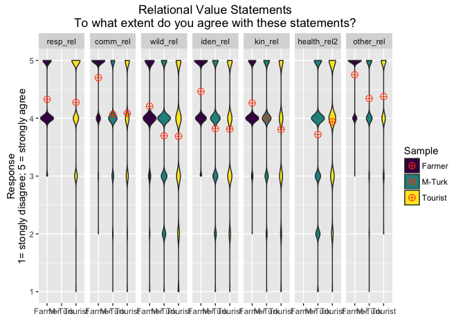
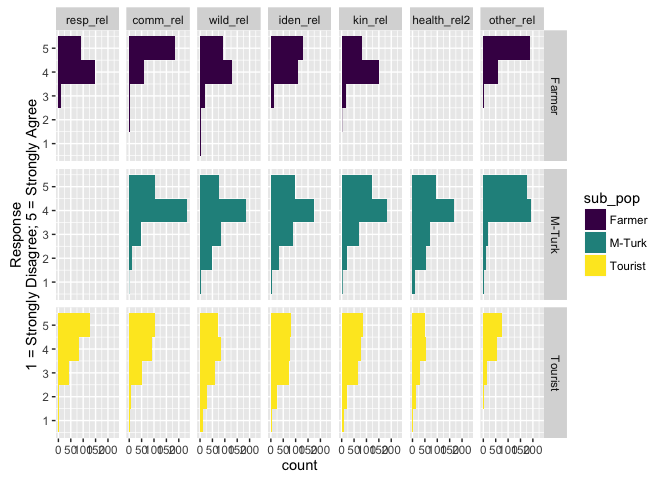
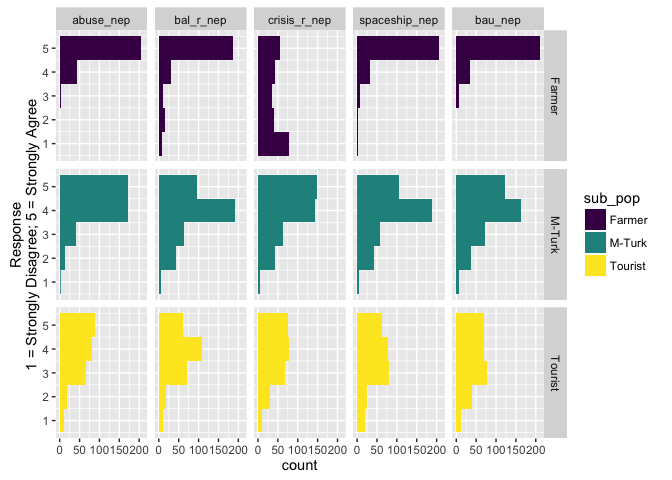

# MT_T_F_value_statements
Sarah Klain  
May 13, 2016  


Setup


```r
library(Hmisc) #to run correlations with sig levels
```

```
## Loading required package: grid
## Loading required package: lattice
## Loading required package: survival
## Loading required package: Formula
## Loading required package: ggplot2
```

```
## Warning: package 'ggplot2' was built under R version 3.2.4
```

```
## Warning: replacing previous import by 'ggplot2::unit' when loading 'Hmisc'
```

```
## Warning: replacing previous import by 'ggplot2::arrow' when loading 'Hmisc'
```

```
## Warning: replacing previous import by 'scales::alpha' when loading 'Hmisc'
```

```
## 
## Attaching package: 'Hmisc'
## 
## The following objects are masked from 'package:base':
## 
##     format.pval, round.POSIXt, trunc.POSIXt, units
```

```r
library(ggplot2) # for great charts
library(ggthemes) # for pretty themes in ggplot
```

```
## Warning: replacing previous import by 'grid::arrow' when loading 'ggthemes'
```

```
## Warning: replacing previous import by 'grid::unit' when loading 'ggthemes'
```

```
## Warning: replacing previous import by 'scales::alpha' when loading
## 'ggthemes'
```

```r
library(viridis) # for pretty colors
library(dplyr)
```

```
## 
## Attaching package: 'dplyr'
## 
## The following objects are masked from 'package:Hmisc':
## 
##     combine, src, summarize
## 
## The following objects are masked from 'package:stats':
## 
##     filter, lag
## 
## The following objects are masked from 'package:base':
## 
##     intersect, setdiff, setequal, union
```

```r
library(knitr) # tool for making nice tables
library(tidyr) # data table wrangling tool
library(broom)
library(stargazer) # makes pretty tables
```

```
## 
## Please cite as: 
## 
##  Hlavac, Marek (2015). stargazer: Well-Formatted Regression and Summary Statistics Tables.
##  R package version 5.2. http://CRAN.R-project.org/package=stargazer
```

```r
# library(stats) # for PCA
# library(psych)
```

### All statements, all populations

Input data

```r
setwd("/Users/sarahklain/Documents/R_2015/navi") #set working directory
ev <- read.csv("Env_Val_02_29_2016.csv")
#str(ev)
#head(ev)
```

Bring into dplyr


```r
#Env values long form
evl <- tidyr::gather(ev, "val_state", "response", 3:33) #short form to long form data for ease in analysis

#bring into dplyr for ease in extracting one sub-population
evtab <- evl %>%
  tbl_df

# str(evl)
# head(evl)
View(evtab)
```

Add new column to group data by env value type


```r
ev_nep <- evtab %>% 
  filter(val_state == "abuse_nep" | val_state == "bal_r_nep" | val_state == "crisis_r_nep" | val_state == "spaceship_nep" | val_state == "bau_nep") %>% 
  mutate(v_type = "NEP")

ev_inst <- evtab %>% 
  filter(val_state == "extract_r_ins" | val_state == "clean_inst" | val_state == "loss_r_ins") %>% 
  mutate(v_type = "inst")

ev_rel <- evtab %>% 
  filter(val_state == "comm_rel" | val_state == "iden_rel" | val_state == "kin_rel" | val_state == "wild_rel" | val_state == "health_rel2" | val_state == "other_rel" ) %>% 
  mutate(v_type = "rel")

ev_met <- evtab %>% 
  filter(val_state == "kin_met" | val_state == "resp_met" | val_state == "iden_met" | val_state == "other_met") %>% 
  mutate(v_type = "met")

ev_mor <- evtab %>% 
  filter(val_state == "decade_r_mor" | val_state == "right_r_mor") %>% 
  mutate(v_type = "moral")

# View(ev_met)
eval_t2 <- bind_rows(ev_nep, ev_inst, ev_rel, ev_met, ev_mor)
str(eval_t2)
```

```
## Classes 'tbl_df', 'tbl' and 'data.frame':	18920 obs. of  5 variables:
##  $ sub_pop  : Factor w/ 3 levels "Farmer","M-Turk",..: 3 3 3 3 3 3 3 3 3 3 ...
##  $ id_num   : Factor w/ 946 levels "D101","D102",..: 121 5 8 13 17 19 22 27 28 30 ...
##  $ val_state: Factor w/ 31 levels "abuse_nep","bal",..: 1 1 1 1 1 1 1 1 1 1 ...
##  $ response : num  1 4 4 5 5 5 5 3 5 5 ...
##  $ v_type   : chr  "NEP" "NEP" "NEP" "NEP" ...
```

```r
summary(eval_t2)
```

```
##     sub_pop         id_num              val_state        response    
##  Farmer :5060   D101   :   20   abuse_nep    :  946   Min.   :1.000  
##  M-Turk :8000   D102   :   20   bal_r_nep    :  946   1st Qu.:3.000  
##  Tourist:5860   D103   :   20   crisis_r_nep :  946   Median :4.000  
##                 D104   :   20   spaceship_nep:  946   Mean   :3.963  
##                 D105   :   20   bau_nep      :  946   3rd Qu.:5.000  
##                 D106   :   20   extract_r_ins:  946   Max.   :5.000  
##                 (Other):18800   (Other)      :13244   NA's   :3701   
##     v_type         
##  Length:18920      
##  Class :character  
##  Mode  :character  
##                    
##                    
##                    
## 
```

```r
eval_t3 <- eval_t2 %>% 
  filter(response > 0)
```

Violin plot

```r
val_st_vio <- ggplot(eval_t3, aes(x = val_state, y = response, fill = v_type)) +
 geom_violin(adjust=0.3) +
  xlab("Statement") + ylab("Response\n1= stongly disagree; 5 = strongly agree") +
  scale_fill_viridis(discrete=TRUE, "Category of Value\nStatement") +
  ggtitle("To what extent do you agree with these value statements?") +
  coord_cartesian(ylim = c(1, 5)) +
  stat_summary(fun.y=mean, colour="orangered", geom="point", 
               shape=18, size=2)  

val_st_vio
```

 

Faceted Violin plot by sub-pop

```r
val_st_vio_sp <- ggplot(eval_t3, aes(x = val_state, y = response, fill = v_type)) +
 geom_violin(adjust=0.3) +
  xlab("Statement") + ylab("Response\n1= stongly disagree; 5 = strongly agree") +
  scale_fill_viridis(discrete=TRUE, "Category of Value\nStatement") +
  ggtitle("To what extent do you agree with these value statements?") +
  coord_cartesian(ylim = c(1, 5)) +
  stat_summary(fun.y=mean, colour="orangered", geom="point", 
               shape=18, size=2)  +
  facet_grid(~ sub_pop)

val_st_vio_sp
```

 

Faceted Violin plot by sub-pop for all prompts

```r
val_st_vio_sp <- ggplot(eval_t3, aes(x = val_state, y = response, fill = v_type)) +
 geom_violin(adjust=0.3) +
  xlab("Statement") + ylab("Response\n1= stongly disagree; 5 = strongly agree") +
  scale_fill_viridis(discrete=TRUE, "Category of Value\nStatement") +
  ggtitle("To what extent do you agree with these value statements?") +
  coord_cartesian(ylim = c(1, 5)) +
  stat_summary(fun.y=mean, colour="orangered", geom="point", 
               shape=18, size=2)  +
  facet_grid(sub_pop ~.)

val_st_vio_sp
```

 

Faceted Violin plot by sub-pop, rel and NEP

```r
eval_t4 <- eval_t3 %>% 
  filter(v_type != "met") %>% 
  filter(v_type != "moral") %>% 
  filter(v_type != "inst")
#View(eval_t4)

val_st_vio_sp2 <- ggplot(eval_t4, aes(x = val_state, y = response, fill = v_type)) +
 geom_violin(adjust=0.3) +
  xlab("Statement") + ylab("Response\n1= stongly disagree; 5 = strongly agree") +
  scale_fill_viridis(discrete=TRUE, "Category of Value\nStatement") +
  ggtitle("To what extent do you agree with these value statements?") +
  coord_cartesian(ylim = c(1, 5)) +
  stat_summary(fun.y=mean, colour="orangered", geom="point", 
               shape=18, size=2)  +
  facet_grid(sub_pop~.)

val_st_vio_sp2
```

 

Bar plot, all value statements


```r
eval_t3$val_state <- factor(eval_t3$val_state, levels=c("extract_r_ins" ,"loss_r_ins","clean_inst","kin_met", "resp_met", "iden_met","other_met", "decade_r_mor","right_r_mor", "abuse_nep", "bal_r_nep", "crisis_r_nep", "spaceship_nep", "bau_nep", "comm_rel", "wild_rel", "iden_rel", "kin_rel", "health_rel2", "other_rel"))

bar_all <- ggplot(eval_t3, aes(x = response, fill = v_type)) +
  geom_histogram(binwidth = 0.5) +
  scale_fill_viridis(discrete=TRUE, option = "viridis") +
  xlab("Response\n1 = Strongly Disagree; 2 = Disagree; 3 = Neither Agree nor Disagree;\n4 = Agree; 5 = Strongly Agree") +
  ggtitle("To what extent do you agree with these statements?") +
  coord_cartesian(xlim = c(1, 5)) +
  facet_grid(~ val_state)

bar_all
```

 

```r
bar_all2 <- ggplot(eval_t3, aes(x = response, fill = v_type)) +
  geom_histogram(binwidth = 0.5) +
  scale_fill_viridis(discrete=TRUE, option = "viridis") +
  xlab("Response\n1 = Strongly Disagree; 2 = Disagree; 3 = Neither Agree nor Disagree;\n4 = Agree; 5 = Strongly Agree") +
  ggtitle("To what extent do you agree with these statements?") +
  coord_cartesian(xlim = c(1, 5)) +
  facet_grid(sub_pop ~ val_state)

bar_all2
```

 

```r
#ggsave(bar_all, file="/Users/sarahklain/Documents/R_2015/env_val/figs/bar_all.pdf")
```


Vio plot with means, NEP and rel


```r
val_st_vio_sp_mean <- ggplot(eval_t4, aes(x = v_type, y = response, fill = v_type)) +
 geom_violin(adjust=0.3) +
  xlab("Statement") + ylab("Response\n1 = Strongly Disagree; 2 = Disagree; 3 = Neither Agree nor Disagree;\n4 = Agree; 5 = Strongly Agree") +
  scale_fill_viridis(discrete=TRUE, "Category of Value\nStatement") +
  ggtitle("To what extent do you agree with these value statements?") +
  coord_cartesian(ylim = c(1, 5)) +
  stat_summary(fun.y=mean, colour="orangered", geom="point", 
               shape=10, size=5)  +
  facet_grid(~ sub_pop)

val_st_vio_sp_mean
```

 

```r
ggsave(val_st_vio_sp_mean, file="/Users/sarahklain/Documents/R_2015/navi/figs/val_st_vio_sp_mean.jpg")
```

```
## Saving 7 x 5 in image
```

with other value types

```r
val_st_vio_mean <- ggplot(eval_t3, aes(x = v_type, y = response, fill = v_type)) +
 geom_violin(adjust=0.3) +
  xlab("Statement") + ylab("Response\n1 = Strongly Disagree; 2 = Disagree; 3 = Neither Agree nor Disagree;\n4 = Agree; 5 = Strongly Agree") +
  scale_fill_viridis(discrete=TRUE, "Category of Value\nStatement") +
  ggtitle("To what extent do you agree with these value statements?") +
  coord_cartesian(ylim = c(1, 5)) +
  stat_summary(fun.y=mean, colour="orangered", geom="point", 
               shape=10, size=5)  +
  facet_grid(~ sub_pop)

val_st_vio_mean
```

 

```r
ggsave(val_st_vio_mean, file="/Users/sarahklain/Documents/R_2015/navi/figs/val_st_vio_mean.jpg")
```

```
## Saving 7 x 5 in image
```


```r
all_m <- read.csv("all_means.csv")
all_m_t <- all_m %>%
  tbl_df

all_m2 <- all_m_t %>%
  filter(v_type != "met") %>% 
  filter(v_type != "other") %>%
  filter(ave > 0) %>% 
  mutate(value = reorder(value, ave)) %>% 
  arrange(ave)

#cron2 <- cron %>% 
#  mutate(prompt = reorder(prompt, alpha)) %>% 
#  arrange(alpha)

bar_means <- ggplot(all_m2, aes(x = value, y = ave, fill = v_type)) +
  geom_bar(stat = "identity") +
  scale_fill_viridis(discrete=TRUE, option = "viridis", name = "Type of\nValue Prompt") +
  xlab("Social-Ecological Value Prompt") +
  ylab("Response\n1 = Strongly Disagree; 2 = Disagree;\n3 = Neither Agree nor Disagree;\n4 = Agree; 5 = Strongly Agree") + 
  ggtitle("Mean Response to Value Prompts") 

bar_means
```

 


```r
m3p <- read.csv("means_3pop.csv")

#sort by mturk responses

m3p$value <- factor(m3p$value, levels=c("clean", "other","abuse", "other", "comm", "right", "kin", "resp", "crisis", "resp", "bau", "spaceship", "decade", "iden", "bal", "loss", "health", "wild", "kin_m", "iden_m", "extract", "tech"))
```

```
## Warning in `levels<-`(`*tmp*`, value = if (nl == nL) as.character(labels)
## else paste0(labels, : duplicated levels in factors are deprecated
```

```r
#sort by tourist responses
#m3p$value <- factor(m3p$value, levels=c("other_m", "iden_m", "resp_m", "kin_m", "clean",	"other",	"resp",	"right",	"comm",	"health",	"iden",	"decade",	"abuse",	"kin",	"bal",	"loss",	"wild",	"crisis",	"bau",	"spaceship",	"tech",	"extract,"))

m3pt <- m3p %>% 
  tbl_df %>% 
  filter(type1 != "Metaphor") %>% 
  filter(type1 != "Other") # %>% 
  #mutate(value = reorder(value, mean_resp)) %>% 
  #arrange(value)

bar_mean_3 <- ggplot(m3pt, aes(x = value, y = mean_resp, fill = type2)) +
  geom_bar(stat = "identity", width = 0.75) +
  scale_fill_viridis(discrete=TRUE, option = "viridis", name = "Type of\nValue Prompt") +
  xlab("Social-Ecological Value Prompt") +
  ylab("Response\n1 = Strongly Disagree; 2 = Disagree;\n3 = Neither Agree nor Disagree;4 = Agree; 5 = Strongly Agree") + 
  ggtitle("Mean Response to Value Prompts") +
  facet_grid(sub_pop~.)

bar_mean_3
```

```
## Warning in `levels<-`(`*tmp*`, value = if (nl == nL) as.character(labels)
## else paste0(labels, : duplicated levels in factors are deprecated
```

```
## Warning in `levels<-`(`*tmp*`, value = if (nl == nL) as.character(labels)
## else paste0(labels, : duplicated levels in factors are deprecated
```

```
## Warning: Removed 8 rows containing missing values (position_stack).
```

 

