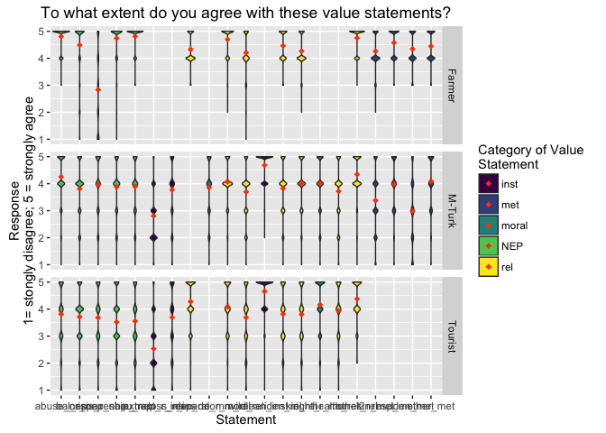

# MT_T_F_value_statements
Sarah Klain  
May 13, 2016  


Setup


```r
library(Hmisc) #to run correlations with sig levels
```

```
## Loading required package: grid
## Loading required package: lattice
## Loading required package: survival
## Loading required package: Formula
## Loading required package: ggplot2
```

```
## Warning: package 'ggplot2' was built under R version 3.2.4
```

```
## Warning: replacing previous import by 'ggplot2::unit' when loading 'Hmisc'
```

```
## Warning: replacing previous import by 'ggplot2::arrow' when loading 'Hmisc'
```

```
## Warning: replacing previous import by 'scales::alpha' when loading 'Hmisc'
```

```
## 
## Attaching package: 'Hmisc'
## 
## The following objects are masked from 'package:base':
## 
##     format.pval, round.POSIXt, trunc.POSIXt, units
```

```r
library(ggplot2) # for great charts
library(ggthemes) # for pretty themes in ggplot
```

```
## Warning: replacing previous import by 'grid::arrow' when loading 'ggthemes'
```

```
## Warning: replacing previous import by 'grid::unit' when loading 'ggthemes'
```

```
## Warning: replacing previous import by 'scales::alpha' when loading
## 'ggthemes'
```

```r
library(viridis) # for pretty colors
library(dplyr)
```

```
## 
## Attaching package: 'dplyr'
## 
## The following objects are masked from 'package:Hmisc':
## 
##     combine, src, summarize
## 
## The following objects are masked from 'package:stats':
## 
##     filter, lag
## 
## The following objects are masked from 'package:base':
## 
##     intersect, setdiff, setequal, union
```

```r
library(knitr) # tool for making nice tables
library(tidyr) # data table wrangling tool
library(broom)
library(stargazer) # makes pretty tables
```

```
## 
## Please cite as: 
## 
##  Hlavac, Marek (2015). stargazer: Well-Formatted Regression and Summary Statistics Tables.
##  R package version 5.2. http://CRAN.R-project.org/package=stargazer
```

```r
# library(stats) # for PCA
# library(psych)
```

### All statements, all populations

Input data

```r
setwd("/Users/sarahklain/Documents/R_2015/navi") #set working directory
ev <- read.csv("Env_Val_02_29_2016.csv")
#str(ev)
#head(ev)
```

Bring into dplyr


```r
#Env values long form
evl <- tidyr::gather(ev, "val_state", "response", 3:33) #short form to long form data for ease in analysis

#bring into dplyr for ease in extracting one sub-population
evtab <- evl %>%
  tbl_df

# str(evl)
# head(evl)
# View(evtab)
```

Add new column to group data by env value type


```r
ev_nep <- evtab %>% 
  filter(val_state == "abuse_nep" | val_state == "bal_r_nep" | val_state == "crisis_r_nep" | val_state == "spaceship_nep" | val_state == "bau_nep") %>% 
  mutate(v_type = "NEP")

ev_inst <- evtab %>% 
  filter(val_state == "extract_r_ins" | val_state == "clean_inst" | val_state == "loss_r_ins") %>% 
  mutate(v_type = "inst")

ev_rel <- evtab %>% 
  filter(val_state == "comm_rel" | val_state == "iden_rel" | val_state == "kin_rel" | val_state == "wild_rel" | val_state == "health_rel2" | val_state == "other_rel" | val_state == "resp_rel" ) %>% 
  mutate(v_type = "rel")

ev_met <- evtab %>% 
  filter(val_state == "kin_met" | val_state == "resp_met" | val_state == "iden_met" | val_state == "other_met") %>% 
  mutate(v_type = "met")

ev_mor <- evtab %>% 
  filter(val_state == "decade_r_mor" | val_state == "right_r_mor") %>% 
  mutate(v_type = "moral")

# View(ev_met)
eval_t2 <- bind_rows(ev_nep, ev_inst, ev_rel, ev_met, ev_mor)
str(eval_t2)
```

```
## Classes 'tbl_df', 'tbl' and 'data.frame':	19866 obs. of  5 variables:
##  $ sub_pop  : Factor w/ 3 levels "Farmer","M-Turk",..: 3 3 3 3 3 3 3 3 3 3 ...
##  $ id_num   : Factor w/ 946 levels "D101","D102",..: 121 5 8 13 17 19 22 27 28 30 ...
##  $ val_state: Factor w/ 31 levels "abuse_nep","bal",..: 1 1 1 1 1 1 1 1 1 1 ...
##  $ response : num  1 4 4 5 5 5 5 3 5 5 ...
##  $ v_type   : chr  "NEP" "NEP" "NEP" "NEP" ...
```

```r
summary(eval_t2)
```

```
##     sub_pop         id_num              val_state        response    
##  Farmer :5313   D101   :   21   abuse_nep    :  946   Min.   :1.000  
##  M-Turk :8400   D102   :   21   bal_r_nep    :  946   1st Qu.:3.000  
##  Tourist:6153   D103   :   21   crisis_r_nep :  946   Median :4.000  
##                 D104   :   21   spaceship_nep:  946   Mean   :3.974  
##                 D105   :   21   bau_nep      :  946   3rd Qu.:5.000  
##                 D106   :   21   extract_r_ins:  946   Max.   :5.000  
##                 (Other):19740   (Other)      :14190   NA's   :4136   
##     v_type         
##  Length:19866      
##  Class :character  
##  Mode  :character  
##                    
##                    
##                    
## 
```

```r
eval_t3 <- eval_t2 %>% 
  filter(response > 0)
```

Violin plot

```r
val_st_vio <- ggplot(eval_t3, aes(x = val_state, y = response, fill = v_type)) +
 geom_violin(adjust=0.3) +
  xlab("Statement") + ylab("Response\n1= stongly disagree; 5 = strongly agree") +
  scale_fill_viridis(discrete=TRUE, "Category of Value\nStatement") +
  ggtitle("To what extent do you agree with these value statements?") +
  coord_cartesian(ylim = c(1, 5)) +
  stat_summary(fun.y=mean, colour="orangered", geom="point", 
               shape=18, size=2)  

val_st_vio
```

 

Faceted Violin plot by sub-pop

```r
val_st_vio_sp <- ggplot(eval_t3, aes(x = val_state, y = response, fill = v_type)) +
 geom_violin(adjust=0.3) +
  xlab("Statement") + ylab("Response\n1= stongly disagree; 5 = strongly agree") +
  scale_fill_viridis(discrete=TRUE, "Category of Value\nStatement") +
  ggtitle("To what extent do you agree with these value statements?") +
  coord_cartesian(ylim = c(1, 5)) +
  stat_summary(fun.y=mean, colour="orangered", geom="point", 
               shape=18, size=2)  +
  facet_grid(~ sub_pop)

val_st_vio_sp
```

 

Faceted Violin plot by sub-pop for all prompts

```r
val_st_vio_sp <- ggplot(eval_t3, aes(x = val_state, y = response, fill = v_type)) +
 geom_violin(adjust=0.3) +
  xlab("Statement") + ylab("Response\n1= stongly disagree; 5 = strongly agree") +
  scale_fill_viridis(discrete=TRUE, "Category of Value\nStatement") +
  ggtitle("To what extent do you agree with these value statements?") +
  coord_cartesian(ylim = c(1, 5)) +
  stat_summary(fun.y=mean, colour="orangered", geom="point", 
               shape=18, size=2)  +
  facet_grid(sub_pop ~.)

val_st_vio_sp
```

 

Faceted Violin plot by sub-pop, rel and NEP

```r
eval_t4 <- eval_t3 %>% 
  filter(v_type != "met") %>% 
  filter(v_type != "moral") %>% 
  filter(v_type != "inst")
#View(eval_t4)

val_st_vio_sp2 <- ggplot(eval_t4, aes(x = val_state, y = response, fill = v_type)) +
 geom_violin(adjust=0.3) +
  xlab("Statement") + ylab("Response\n1= stongly disagree; 5 = strongly agree") +
  scale_fill_viridis(discrete=TRUE, "Category of Value\nStatement") +
  ggtitle("To what extent do you agree with these value statements?") +
  coord_cartesian(ylim = c(1, 5)) +
  stat_summary(fun.y=mean, colour="orangered", geom="point", 
               shape=18, size=2)  +
  facet_grid(sub_pop~.)

val_st_vio_sp2
```

 

Faceted Violin plot by rel

```r
eval_t5 <- eval_t4 %>% 
  filter(v_type == "rel")

val_st_vio_sp3 <- ggplot(eval_t5, aes(x = sub_pop, y = response, fill = sub_pop)) +
 geom_violin(adjust=0.3) +
  xlab("") + ylab("Response\n1= stongly disagree; 5 = strongly agree") +
  scale_fill_viridis(discrete=TRUE, "Sample") +
  ggtitle("Relational Value Statements\nTo what extent do you agree with these statements?") +
  coord_cartesian(ylim = c(1, 5)) +
  stat_summary(fun.y=mean, colour="orangered", geom="point", 
               shape=10, size=3)  +
  facet_grid(~val_state)

val_st_vio_sp3
```

 

Histogram plot by rel

```r
eval_t5 <- eval_t4 %>% 
  filter(v_type == "rel")

library(plyr)
```

```
## -------------------------------------------------------------------------
## You have loaded plyr after dplyr - this is likely to cause problems.
## If you need functions from both plyr and dplyr, please load plyr first, then dplyr:
## library(plyr); library(dplyr)
## -------------------------------------------------------------------------
## 
## Attaching package: 'plyr'
## 
## The following objects are masked from 'package:dplyr':
## 
##     arrange, count, desc, failwith, id, mutate, rename, summarise,
##     summarize
## 
## The following objects are masked from 'package:Hmisc':
## 
##     is.discrete, summarize
```

```r
cdat <- ddply(eval_t5, "val_state", summarise, rsp.mean=mean(response))
cdat
```

```
##     val_state rsp.mean
## 1    resp_rel 4.300391
## 2    comm_rel 4.248075
## 3    wild_rel 3.835159
## 4    iden_rel 3.996166
## 5     kin_rel 4.017544
## 6 health_rel2 3.779197
## 7   other_rel 4.477556
```

```r
val_st_hist_sp3 <- ggplot(eval_t5, aes(x = response, fill = sub_pop)) +
 geom_histogram(binwidth = 1) +
  xlab("Response\n1 = Strongly Disagree; 5 = Strongly Agree") +
  scale_fill_viridis(discrete=TRUE) +
  #coord_cartesian(ylim = c(1, 5)) +
  coord_flip() +
  facet_grid(sub_pop ~ val_state) #+
  #geom_vline(data=cdat, aes(xintercept=rsp.mean),
    #           linetype="dotted", size=0.5, colour="red")

val_st_hist_sp3
```

 


NEP

```r
eval_NEP <- eval_t4 %>% 
  filter(v_type == "NEP")

val_st_vio_NEP <- ggplot(eval_NEP, aes(x = sub_pop, y = response, fill = sub_pop)) +
 geom_violin(adjust=0.3) +
  xlab("") + ylab("Response\n1= stongly disagree; 5 = strongly agree") +
  scale_fill_viridis(discrete=TRUE, "") +
  ggtitle("NEP\nTo what extent do you agree with these statements?") +
  coord_cartesian(ylim = c(1, 5)) +
  stat_summary(fun.y=mean, colour="orangered", geom="point", 
               shape=10, size=3)  +
  facet_grid(~val_state)

val_st_vio_NEP
```

 

hist by NEP

```r
eval_NEP <- eval_t4 %>% 
  filter(v_type == "NEP")


NEP_hist <- ggplot(eval_NEP, aes(x = response, fill = sub_pop)) +
 geom_histogram(binwidth = 1) +
  xlab("Response\n1 = Strongly Disagree; 5 = Strongly Agree") +
  scale_fill_viridis(discrete=TRUE) +
  #coord_cartesian(ylim = c(1, 5)) +
  coord_flip() +
  facet_grid(sub_pop ~ val_state) #+
  #geom_vline(data=cdat, aes(xintercept=rsp.mean),
    #           linetype="dotted", size=0.5, colour="red")

NEP_hist
```

 

### Histogram, all value statements


```r
eval_t3$val_state <- factor(eval_t3$val_state, levels=c("extract_r_ins" ,"loss_r_ins","clean_inst", "kin_met", "resp_met", "iden_met","other_met", "decade_r_mor","right_r_mor", "abuse_nep", "bal_r_nep", "crisis_r_nep", "spaceship_nep", "bau_nep", "comm_rel", "wild_rel","resp_rel", "iden_rel", "kin_rel", "health_rel2", "other_rel"))

bar_all <- ggplot(eval_t3, aes(x = response, fill = v_type)) +
  geom_histogram(binwidth = 1) +
  scale_fill_viridis(discrete=TRUE, option = "viridis", "") +
  xlab("Response\n1 = Strongly Disagree;\n2 = Disagree; 3 = Neither Agree nor Disagree;\n4 = Agree; 5 = Strongly Agree") +
  ggtitle("To what extent do you agree with these statements?") +
  coord_cartesian(xlim = c(1, 5)) + coord_flip() +
  facet_grid(~ val_state)
  
bar_all
```

 

### Histogram by value statement and pop

```r
bar_all2 <- ggplot(eval_t3, aes(x = response, fill = v_type)) +
  geom_histogram(binwidth = 1) +
  scale_fill_viridis(discrete=TRUE, option = "viridis", "") +
  xlab("Response\n1 = Strongly Disagree;\n2 = Disagree; 3 = Neither Agree nor Disagree;\n4 = Agree; 5 = Strongly Agree") +
  ggtitle("To what extent do you agree with these statements?") +
  coord_cartesian(xlim = c(1, 5)) + coord_flip() +
  facet_grid(sub_pop ~ val_state)

bar_all2
```

 

```r
#ggsave(bar_all, file="/Users/sarahklain/Documents/R_2015/env_val/figs/bar_all.pdf")
```

### Means with error bars

```r
val_mean_se <- ggplot(eval_t3, aes(factor(val_state), response, color = v_type, width = 0.25)) +
  stat_boxplot(geom ='errorbar', width = 0.25) +
  geom_boxplot(width = 0.25) +
  scale_color_viridis(discrete=TRUE) +
  ylab("Response\n1 = Strongly Disagree;\n2 = Disagree; 3 = Neither Agree nor Disagree;\n4 = Agree; 5 = Strongly Agree") +
  ggtitle("To what extent do you agree with these statements?") +
  stat_summary(fun.y=mean, geom="point", shape=10, size=2)  +
  #coord_flip() +
  facet_grid(sub_pop~.)

val_mean_se
```

 


```r
val_mean_se <- ggplot(eval_t3, aes(factor(val_state), response, color = v_type, width = 0.25)) +
  stat_boxplot(geom ='errorbar', width = 0.25) +
  geom_boxplot(width = 0.25) +
  scale_color_viridis(discrete=TRUE) +
  ylab("Response\n1 = Strongly Disagree;\n2 = Disagree; 3 = Neither Agree nor Disagree;\n4 = Agree; 5 = Strongly Agree") +
  ggtitle("To what extent do you agree with these statements?") +
  stat_summary(fun.y=mean, geom="point", shape=10, size=2)  +
  #coord_flip() +
  facet_grid(sub_pop~.)

val_mean_se
```

 

Vio plot with means, NEP and rel


```r
val_st_vio_sp_mean <- ggplot(eval_t4, aes(x = v_type, y = response, fill = v_type)) +
 geom_violin(adjust=0.3) +
  xlab("Statement") + ylab("Response\n1 = Strongly Disagree; 2 = Disagree;\n13 = Neither Agree nor Disagree;\n4 = Agree; 5 = Strongly Agree") +
  scale_fill_viridis(discrete=TRUE, "Category \nof Value\nStatement") +
  ggtitle("To what extent do you agree with these value statements?") +
  coord_cartesian(ylim = c(1, 5)) +
  stat_summary(fun.y=mean, colour="orangered", geom="point", 
               shape=10, size=5)  +
  facet_grid(~ sub_pop)

val_st_vio_sp_mean
```

 

```r
ggsave(val_st_vio_sp_mean, file="/Users/sarahklain/Documents/R_2015/navi/figs/val_st_vio_sp_mean.jpg")
```

```
## Saving 7 x 5 in image
```

with other value types

```r
val_st_vio_mean <- ggplot(eval_t3, aes(x = v_type, y = response, fill = v_type)) +
 geom_violin(adjust=0.3) +
  xlab("Statement") + ylab("Response\n1 = Strongly Disagree 2 = Disagree;\n3 = Neither Agree nor Disagree;\n4 = Agree; 5 = Strongly Agree") +
  scale_fill_viridis(discrete=TRUE, "Category\nof Value\nStatement") +
  ggtitle("To what extent do you agree with these value statements?") +
  coord_cartesian(ylim = c(1, 5)) +
  stat_summary(fun.y=mean, colour="orangered", geom="point", 
               shape=10, size=4)  +
  facet_grid(~ sub_pop)

val_st_vio_mean
```

 

```r
#ggsave(val_st_vio_mean, file="/Users/sarahklain/Documents/R_2015/navi/figs/val_st_vio_mean.jpg")
```

Instead of box plots, use a mean-whisker plot, but (a) make the mean prominent (especially the yellow gets washed out), and (b) make the whiskers represent the standard error of the mean (what is it now? The 95%ile range? That’s very different).

calc SE

```r
summarySE <- function(data=NULL, measurevar, groupvars=NULL, na.rm=FALSE,
                      conf.interval=.95, .drop=TRUE) {
    library(plyr)

    # New version of length which can handle NA's: if na.rm==T, don't count them
    length2 <- function (x, na.rm=FALSE) {
        if (na.rm) sum(!is.na(x))
        else       length(x)
    }

    # This does the summary. For each group's data frame, return a vector with
    # N, mean, and sd
    datac <- ddply(data, groupvars, .drop=.drop,
      .fun = function(xx, col) {
        c(N    = length2(xx[[col]], na.rm=na.rm),
          mean = mean   (xx[[col]], na.rm=na.rm),
          sd   = sd     (xx[[col]], na.rm=na.rm)
        )
      },
      measurevar
    )

    # Rename the "mean" column    
    datac <- rename(datac, c("mean" = measurevar))

    datac$se <- datac$sd / sqrt(datac$N)  # Calculate standard error of the mean

    # Confidence interval multiplier for standard error
    # Calculate t-statistic for confidence interval: 
    # e.g., if conf.interval is .95, use .975 (above/below), and use df=N-1
    ciMult <- qt(conf.interval/2 + .5, datac$N-1)
    datac$ci <- datac$se * ciMult

    return(datac)
}
```

use SE function with my data


```r
r_se <- summarySE(eval_t3, measurevar="response", groupvars=c("sub_pop", "val_state", "v_type"))

# Standard error of the mean
whisk_se <- ggplot(r_se, aes(x = val_state, y=response, colour=sub_pop)) + 
  geom_errorbar(aes(ymin = response - se, ymax = response + se), width=.4) +
  scale_fill_viridis(discrete=TRUE) + 
  scale_color_viridis(discrete=TRUE, "") +
  coord_cartesian(ylim = c(1, 5)) +
    ylab("Response\n1 = Strongly Disagree 2 = Disagree; 3 = Neither Agree nor Disagree;\n4 = Agree; 5 = Strongly Agree") +
  xlab("") +
  geom_point() +
  stat_summary(fun.y=mean, colour="orangered", geom="point", 
               shape=10, size=2) +
  theme(panel.background = element_rect(fill = "gray40"))

whisk_se
```

 


```r
val_st_bp_mean_all <- ggplot(eval_t3, aes(x = val_state, y = response, fill = v_type)) +
 geom_boxplot() +
  xlab("Statement") + ylab("Response\n1 = Strongly Disagree 2 = Disagree;\n3 = Neither Agree nor Disagree;\n4 = Agree; 5 = Strongly Agree") +
  scale_fill_viridis(discrete=TRUE, "Category\nof Value\nStatement") +
  ggtitle("To what extent do you agree with these value statements?") +
  coord_cartesian(ylim = c(1, 5)) +
  stat_summary(fun.y=mean, colour="orangered", geom="point", 
               shape=10, size=4)  +
  facet_grid(~ sub_pop)

val_st_bp_mean_all
```

 


```r
all_m <- read.csv("all_means.csv")
all_m_t <- all_m %>%
  tbl_df

all_m2 <- all_m_t %>%
  filter(v_type != "met") %>% 
  filter(v_type != "other") %>%
  filter(ave > 0) %>% 
  mutate(value = reorder(value, ave)) %>% 
  arrange(ave)

#cron2 <- cron %>% 
#  mutate(prompt = reorder(prompt, alpha)) %>% 
#  arrange(alpha)

bar_means <- ggplot(all_m2, aes(x = value, y = ave, fill = v_type)) +
  geom_bar(stat = "identity") +
  scale_fill_viridis(discrete=TRUE, option = "viridis", name = "Type of\nValue Prompt") +
  xlab("Social-Ecological Value Prompt") +
  ylab("Response\n1 = Strongly Disagree; 2 = Disagree;\n3 = Neither Agree nor Disagree;\n4 = Agree; 5 = Strongly Agree") + 
  ggtitle("Mean Response to Value Prompts") 

bar_means
```

 


```r
m3p <- read.csv("means_3pop.csv")

#sort by mturk responses

m3p$value <- factor(m3p$value, levels=c("clean", "other","resp", "abuse", "other_m", "comm", "right", "kin", "resp_m", "crisis",  "bau", "spaceship", "decade", "iden", "bal", "loss", "health", "wild", "kin_m", "iden_m", "extract", "tech"))


#sort by tourist responses
#m3p$value <- factor(m3p$value, levels=c("other_m", "iden_m", "resp_m", "kin_m", "clean",	"other",	"resp",	"right",	"comm",	"health",	"iden",	"decade",	"abuse",	"kin",	"bal",	"loss",	"wild",	"crisis",	"bau",	"spaceship",	"tech",	"extract,"))

m3pt <- m3p %>% 
  tbl_df %>% 
#  filter(type1 != "Metaphor") %>% 
  filter(type1 != "Other") # %>% 
  #mutate(value = reorder(value, mean_resp)) %>% 
  #arrange(value)

bar_mean2 <- ggplot(na.omit(m3pt), aes(x = value, y = mean_resp, fill = type1)) +
  geom_bar(stat = "identity", width = 0.75) +
  scale_fill_viridis(discrete=TRUE, option = "viridis", name = "Type of\nValue Prompt") +
  xlab("Social-Ecological Value Prompt") +
  ylab("Response\n1 = Strongly Disagree; 2 = Disagree;\n3 = Neither Agree nor Disagree;4 = Agree; 5 = Strongly Agree") + 
  ggtitle("Mean Response to Value Prompts") +
  facet_grid(sub_pop~.)

bar_mean2
```

 

calc means for sub pops, relational values


```r
eval_rel_f <- eval_t4 %>% 
  filter(v_type == "rel") %>% 
  filter(sub_pop == "Farmer") 

mean(eval_rel_f$response)
```

```
## [1] 4.452492
```

```r
eval_rel_mt <- eval_t4 %>% 
  filter(v_type == "rel") %>% 
  filter(sub_pop == "M-Turk") 

mean(eval_rel_mt$response)
```

```
## [1] 3.941962
```

```r
eval_rel_to <- eval_t4 %>% 
  filter(v_type == "rel") %>% 
  filter(sub_pop == "Tourist") 

mean(eval_rel_to$response)
```

```
## [1] 3.975746
```

calc means for sub pops, NEP


```r
eval_NEP_f <- eval_t4 %>% 
  filter(v_type == "NEP") %>% 
  filter(sub_pop == "Farmer") 

mean(eval_NEP_f$response)
```

```
## [1] 4.336792
```

```r
eval_NEP_mt <- eval_t4 %>% 
  filter(v_type == "NEP") %>% 
  filter(sub_pop == "M-Turk") 

mean(eval_NEP_mt$response)
```

```
## [1] 3.960961
```

```r
eval_NEP_to <- eval_t4 %>% 
  filter(v_type == "NEP") %>% 
  filter(sub_pop == "Tourist") 

mean(eval_NEP_to$response)
```

```
## [1] 3.655873
```

T-tests
Are means for subpops different from each other?


```r
library(Hmisc)

#Relational
t.test(eval_rel_f$response, eval_rel_to$response, paired = FALSE)
```

```
## 
## 	Welch Two Sample t-test
## 
## data:  eval_rel_f$response and eval_rel_to$response
## t = 15.858, df = 2701.2, p-value < 2.2e-16
## alternative hypothesis: true difference in means is not equal to 0
## 95 percent confidence interval:
##  0.4177947 0.5356961
## sample estimates:
## mean of x mean of y 
##  4.452492  3.975746
```

```r
t.test(eval_rel_mt$response, eval_rel_to$response, paired = FALSE)
```

```
## 
## 	Welch Two Sample t-test
## 
## data:  eval_rel_mt$response and eval_rel_to$response
## t = -1.0745, df = 3182.9, p-value = 0.2827
## alternative hypothesis: true difference in means is not equal to 0
## 95 percent confidence interval:
##  -0.0954341  0.0278664
## sample estimates:
## mean of x mean of y 
##  3.941962  3.975746
```

```r
#NEP
t.test(eval_NEP_f$response, eval_NEP_to$response, paired = FALSE)
```

```
## 
## 	Welch Two Sample t-test
## 
## data:  eval_NEP_f$response and eval_NEP_to$response
## t = 14.917, df = 2535.1, p-value < 2.2e-16
## alternative hypothesis: true difference in means is not equal to 0
## 95 percent confidence interval:
##  0.5914097 0.7704267
## sample estimates:
## mean of x mean of y 
##  4.336792  3.655873
```

```r
t.test(eval_NEP_f$response, eval_NEP_mt$response, paired = FALSE)
```

```
## 
## 	Welch Two Sample t-test
## 
## data:  eval_NEP_f$response and eval_NEP_mt$response
## t = 9.3564, df = 2240.5, p-value < 2.2e-16
## alternative hypothesis: true difference in means is not equal to 0
## 95 percent confidence interval:
##  0.2970596 0.4546019
## sample estimates:
## mean of x mean of y 
##  4.336792  3.960961
```

```r
t.test(eval_NEP_mt$response, eval_NEP_to$response, paired = FALSE)
```

```
## 
## 	Welch Two Sample t-test
## 
## data:  eval_NEP_mt$response and eval_NEP_to$response
## t = 8.1541, df = 2554.9, p-value = 5.453e-16
## alternative hypothesis: true difference in means is not equal to 0
## 95 percent confidence interval:
##  0.2317198 0.3784551
## sample estimates:
## mean of x mean of y 
##  3.960961  3.655873
```


```r
library(corrplot)
```

```
## Warning: package 'corrplot' was built under R version 3.2.5
```

```r
#foo <-na.omit(ev)
#corrplot(cor(as.matrix(foo)), order = "hclust", tl.col='black', #tl.cex=.75, na.label.col = "black") 
```

