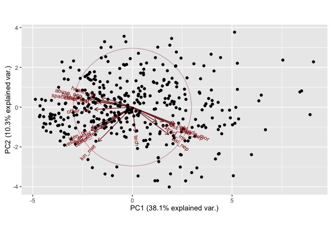
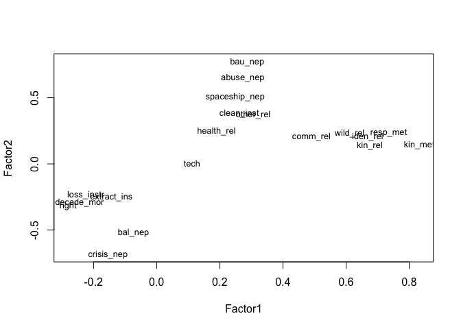
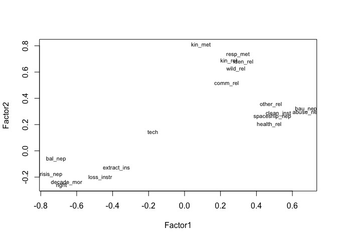

# Env_val
Sarah Klain  
March 6, 2016  


## PCA & Factor Analysis

#### Setup


```r
library(Hmisc) #to run correlations with sig levels
```

```
## Loading required package: grid
## Loading required package: lattice
## Loading required package: survival
## Loading required package: Formula
## Loading required package: ggplot2
```

```
## Warning: package 'ggplot2' was built under R version 3.2.4
```

```
## Warning: replacing previous import by 'ggplot2::unit' when loading 'Hmisc'
```

```
## Warning: replacing previous import by 'ggplot2::arrow' when loading 'Hmisc'
```

```
## Warning: replacing previous import by 'scales::alpha' when loading 'Hmisc'
```

```
## 
## Attaching package: 'Hmisc'
## 
## The following objects are masked from 'package:base':
## 
##     format.pval, round.POSIXt, trunc.POSIXt, units
```

```r
 library(ggplot2) # for great charts
# library(ggthemes) # for pretty themes in ggplot
library(viridis) # for pretty colors
 suppressMessages(library(dplyr))
library(knitr) # tool for making nice tables
# library(tidyr) # data table wrangling tool
# library(broom)
# library(stargazer) # mekes pretty tables
library(stats) # for PCA & FA
library(psych) # for PCA
```

```
## 
## Attaching package: 'psych'
## 
## The following object is masked from 'package:Hmisc':
## 
##     describe
## 
## The following objects are masked from 'package:ggplot2':
## 
##     %+%, alpha
```

```r
#library(dplyr)
```

#### Input data

```r
setwd("/Users/sarahklain/Documents/R_2015/navi") #set working directory
#ev <- read.csv("Env_Val_02_29_2016.csv")

ev <- read.csv("ev_mt_f_t_no_R.csv")
ev1 <- (ev[3:11])

ev_mt <- read.csv("ev_mt.csv")
```

### Cronbach's alpha

```r
# Cronbach's alpha for relational and NEP variables
alpha(ev1, check.keys = TRUE)
```

```
## Warning in alpha(ev1, check.keys = TRUE): Some items were negatively correlated with total scale and were automatically reversed.
##  This is indicated by a negative sign for the variable name.
```

```
## 
## Reliability analysis   
## Call: alpha(x = ev1, check.keys = TRUE)
## 
##   raw_alpha std.alpha G6(smc) average_r S/N   ase mean   sd
##       0.81      0.82    0.83      0.34 4.6 0.015    4 0.64
## 
##  lower alpha upper     95% confidence boundaries
## 0.78 0.81 0.84 
## 
##  Reliability if an item is dropped:
##               raw_alpha std.alpha G6(smc) average_r S/N alpha se
## abuse_nep          0.77      0.79    0.80      0.32 3.8    0.017
## bal_nep-           0.79      0.81    0.82      0.34 4.1    0.016
## crisis_nep-        0.84      0.84    0.85      0.39 5.2    0.014
## spaceship_nep      0.78      0.80    0.81      0.33 3.9    0.017
## bau_nep            0.76      0.78    0.79      0.31 3.6    0.018
## comm_rel           0.79      0.81    0.82      0.34 4.2    0.016
## wild_rel           0.78      0.80    0.81      0.33 3.9    0.017
## iden_rel           0.78      0.79    0.80      0.33 3.9    0.017
## kin_rel            0.79      0.80    0.81      0.33 4.0    0.016
## 
##  Item statistics 
##                 n raw.r std.r r.cor r.drop mean   sd
## abuse_nep     918  0.72  0.72  0.68   0.62  4.3 0.91
## bal_nep-      916  0.63  0.62  0.54   0.50  4.0 1.05
## crisis_nep-   915  0.41  0.36  0.22   0.20  3.6 1.31
## spaceship_nep 914  0.68  0.67  0.63   0.55  4.0 1.06
## bau_nep       917  0.79  0.78  0.78   0.70  4.0 1.05
## comm_rel      909  0.57  0.60  0.52   0.46  4.2 0.80
## wild_rel      913  0.66  0.67  0.62   0.54  3.8 1.00
## iden_rel      913  0.68  0.69  0.66   0.57  4.0 0.93
## kin_rel       912  0.64  0.66  0.61   0.53  4.0 0.89
## 
## Non missing response frequency for each item
##                  1 1.5    2 2.5    3 3.5    4 4.5    5 miss
## abuse_nep     0.02   0 0.03   0 0.12   0 0.32   0 0.51 0.01
## bal_nep       0.37   0 0.36   0 0.16   0 0.08   0 0.03 0.01
## crisis_nep    0.30   0 0.29   0 0.18   0 0.12   0 0.10 0.01
## spaceship_nep 0.03   0 0.08   0 0.16   0 0.33   0 0.41 0.01
## bau_nep       0.02   0 0.08   0 0.17   0 0.29   0 0.44 0.01
## comm_rel      0.01   0 0.02   0 0.12   0 0.42   0 0.43 0.02
## wild_rel      0.02   0 0.09   0 0.18   0 0.44   0 0.27 0.01
## iden_rel      0.01   0 0.06   0 0.19   0 0.39   0 0.34 0.01
## kin_rel       0.01   0 0.05   0 0.17   0 0.45   0 0.32 0.02
```

```r
# Cronbach's alpha for only NEP variables
nep <- read.csv("nep.csv")
alpha(nep)
```

```
## 
## Reliability analysis   
## Call: alpha(x = nep)
## 
##   raw_alpha std.alpha G6(smc) average_r S/N   ase mean   sd
##       0.74      0.76    0.75      0.39 3.1 0.023    4 0.75
## 
##  lower alpha upper     95% confidence boundaries
## 0.69 0.74 0.78 
## 
##  Reliability if an item is dropped:
##               raw_alpha std.alpha G6(smc) average_r S/N alpha se
## abuse_nep          0.65      0.67    0.66      0.34 2.1    0.030
## bal_r_nep          0.68      0.72    0.71      0.39 2.5    0.028
## crisis_r_nep       0.81      0.81    0.78      0.52 4.3    0.023
## spaceship_nep      0.67      0.70    0.67      0.37 2.3    0.029
## bau_nep            0.62      0.65    0.62      0.32 1.8    0.031
## 
##  Item statistics 
##                 n raw.r std.r r.cor r.drop mean   sd
## abuse_nep     918  0.76  0.79  0.74   0.62  4.3 0.91
## bal_r_nep     916  0.71  0.71  0.59   0.52  4.0 1.05
## crisis_r_nep  914  0.54  0.49  0.26   0.23  3.6 1.31
## spaceship_nep 914  0.73  0.75  0.68   0.55  4.0 1.06
## bau_nep       917  0.82  0.83  0.82   0.68  4.0 1.05
## 
## Non missing response frequency for each item
##                  1    2 2.5    3 3.5    4 4.5    5 miss
## abuse_nep     0.02 0.03   0 0.12   0 0.32   0 0.51 0.03
## bal_r_nep     0.03 0.08   0 0.16   0 0.36   0 0.37 0.03
## crisis_r_nep  0.10 0.12   0 0.18   0 0.29   0 0.31 0.03
## spaceship_nep 0.03 0.08   0 0.16   0 0.33   0 0.41 0.03
## bau_nep       0.02 0.08   0 0.17   0 0.29   0 0.44 0.03
```

```r
#Cronbach's alpha for M-Turk value prompt data
mt_val <- (ev_mt[3:21]) 
str(mt_val)
```

```
## 'data.frame':	400 obs. of  19 variables:
##  $ abuse_nep    : int  5 5 3 5 4 5 5 5 5 5 ...
##  $ bal_nep      : int  3 2 4 1 3 2 1 2 2 1 ...
##  $ crisis_nep   : int  1 1 3 1 2 1 1 1 1 1 ...
##  $ spaceship_nep: int  5 4 2 4 3 4 4 5 4 5 ...
##  $ bau_nep      : int  5 4 2 5 4 5 5 4 4 5 ...
##  $ extract_ins  : int  4 2 4 3 3 1 2 4 2 2 ...
##  $ loss_instr   : int  4 1 3 1 2 3 2 2 1 1 ...
##  $ decade_mor   : int  4 2 3 1 2 5 2 2 2 1 ...
##  $ comm_rel     : int  5 4 4 4 4 5 4 4 4 5 ...
##  $ wild_rel     : int  5 4 1 5 4 5 3 4 4 5 ...
##  $ clean_inst   : int  5 5 4 5 4 5 5 5 5 5 ...
##  $ tech         : int  5 3 3 4 4 5 4 4 3 4 ...
##  $ iden_rel     : int  3 4 2 5 4 5 5 5 3 5 ...
##  $ kin_rel      : int  3 4 4 5 4 5 4 5 3 5 ...
##  $ right        : int  4 1 4 1 2 1 1 2 1 1 ...
##  $ health_rel   : int  2 4 2 5 4 1 5 4 3 5 ...
##  $ other_rel    : int  5 4 4 5 5 5 5 5 4 5 ...
##  $ kin_met      : int  3 4 3 5 5 5 2 4 3 4 ...
##  $ resp_met     : int  4 4 3 5 5 5 4 4 3 5 ...
```

```r
alpha(mt_val, check.keys = TRUE)
```

```
## Warning in alpha(mt_val, check.keys = TRUE): Some items were negatively correlated with total scale and were automatically reversed.
##  This is indicated by a negative sign for the variable name.
```

```
## 
## Reliability analysis   
## Call: alpha(x = mt_val, check.keys = TRUE)
## 
##   raw_alpha std.alpha G6(smc) average_r S/N   ase mean   sd
##        0.9       0.9    0.92      0.32 9.1 0.011  3.8 0.55
## 
##  lower alpha upper     95% confidence boundaries
## 0.88 0.9 0.92 
## 
##  Reliability if an item is dropped:
##               raw_alpha std.alpha G6(smc) average_r  S/N alpha se
## abuse_nep          0.89      0.89    0.91      0.32  8.3    0.012
## bal_nep-           0.89      0.90    0.91      0.32  8.6    0.012
## crisis_nep-        0.89      0.89    0.91      0.32  8.4    0.012
## spaceship_nep      0.89      0.90    0.92      0.33  8.8    0.012
## bau_nep            0.89      0.89    0.91      0.32  8.3    0.012
## extract_ins-       0.90      0.90    0.92      0.34  9.1    0.011
## loss_instr-        0.89      0.90    0.92      0.33  8.8    0.012
## decade_mor-        0.89      0.89    0.91      0.32  8.4    0.012
## comm_rel           0.89      0.90    0.92      0.33  8.8    0.012
## wild_rel           0.89      0.90    0.91      0.32  8.6    0.012
## clean_inst         0.89      0.90    0.91      0.32  8.6    0.012
## tech-              0.91      0.91    0.92      0.36 10.1    0.011
## iden_rel           0.89      0.89    0.91      0.32  8.4    0.012
## kin_rel            0.89      0.90    0.91      0.32  8.5    0.012
## right-             0.89      0.89    0.91      0.32  8.3    0.012
## health_rel         0.90      0.90    0.92      0.33  8.8    0.012
## other_rel          0.89      0.90    0.91      0.32  8.6    0.012
## kin_met            0.89      0.90    0.91      0.33  8.7    0.012
## resp_met           0.89      0.89    0.91      0.32  8.4    0.012
## 
##  Item statistics 
##                 n raw.r std.r r.cor r.drop mean   sd
## abuse_nep     400  0.71  0.72 0.710  0.668  4.3 0.80
## bal_nep-      400  0.63  0.63 0.607  0.573  3.8 0.97
## crisis_nep-   400  0.70  0.70 0.689  0.643  4.0 1.03
## spaceship_nep 398  0.56  0.56 0.527  0.497  3.9 0.95
## bau_nep       400  0.72  0.72 0.713  0.670  3.9 0.99
## extract_ins-  400  0.44  0.44 0.382  0.363  2.8 0.95
## loss_instr-   398  0.56  0.55 0.513  0.486  3.8 1.09
## decade_mor-   400  0.70  0.70 0.685  0.649  3.9 1.02
## comm_rel      399  0.53  0.54 0.504  0.473  4.1 0.73
## wild_rel      400  0.63  0.63 0.604  0.567  3.7 0.96
## clean_inst    400  0.58  0.61 0.584  0.550  4.7 0.52
## tech-         400  0.14  0.13 0.059  0.054  2.5 0.90
## iden_rel      400  0.69  0.69 0.674  0.634  3.8 0.94
## kin_rel       398  0.64  0.64 0.625  0.584  4.0 0.87
## right-        398  0.73  0.72 0.719  0.680  4.0 0.99
## health_rel    398  0.55  0.54 0.501  0.473  3.7 1.05
## other_rel     400  0.61  0.63 0.603  0.566  4.3 0.70
## kin_met       398  0.58  0.57 0.554  0.501  3.4 1.14
## resp_met      399  0.69  0.69 0.680  0.639  4.0 0.95
## 
## Non missing response frequency for each item
##                  1    2    3    4    5 miss
## abuse_nep     0.00 0.03 0.10 0.43 0.43 0.00
## bal_nep       0.24 0.48 0.16 0.11 0.02 0.00
## crisis_nep    0.37 0.36 0.16 0.10 0.01 0.00
## spaceship_nep 0.01 0.11 0.15 0.47 0.26 0.01
## bau_nep       0.02 0.09 0.18 0.41 0.30 0.00
## extract_ins   0.05 0.20 0.31 0.42 0.03 0.00
## loss_instr    0.28 0.40 0.15 0.13 0.03 0.01
## decade_mor    0.30 0.39 0.18 0.12 0.01 0.00
## comm_rel      0.00 0.03 0.12 0.58 0.26 0.00
## wild_rel      0.01 0.12 0.21 0.46 0.19 0.00
## clean_inst    0.00 0.00 0.01 0.28 0.71 0.00
## tech          0.02 0.12 0.34 0.41 0.12 0.00
## iden_rel      0.01 0.08 0.22 0.44 0.25 0.00
## kin_rel       0.01 0.05 0.17 0.46 0.30 0.01
## right         0.36 0.39 0.14 0.09 0.01 0.01
## health_rel    0.02 0.14 0.18 0.42 0.24 0.01
## other_rel     0.00 0.02 0.05 0.48 0.44 0.00
## kin_met       0.06 0.17 0.29 0.29 0.19 0.01
## resp_met      0.02 0.03 0.24 0.36 0.35 0.00
```

### PCA


```r
fit_ev_mt <- prcomp(~ ., data=mt_val, na.action=na.omit, scale=TRUE)

summary(fit_ev_mt) # print variance accounted for 
```

```
## Importance of components:
##                           PC1    PC2     PC3     PC4     PC5     PC6
## Standard deviation     2.6909 1.3999 1.10845 0.96710 0.89897 0.87153
## Proportion of Variance 0.3811 0.1032 0.06467 0.04923 0.04253 0.03998
## Cumulative Proportion  0.3811 0.4843 0.54892 0.59814 0.64068 0.68065
##                            PC7     PC8     PC9    PC10    PC11    PC12
## Standard deviation     0.86213 0.79574 0.79146 0.77923 0.75166 0.70741
## Proportion of Variance 0.03912 0.03333 0.03297 0.03196 0.02974 0.02634
## Cumulative Proportion  0.71977 0.75310 0.78607 0.81803 0.84776 0.87410
##                           PC13    PC14    PC15    PC16    PC17    PC18
## Standard deviation     0.68726 0.65277 0.60954 0.57093 0.55504 0.50657
## Proportion of Variance 0.02486 0.02243 0.01955 0.01716 0.01621 0.01351
## Cumulative Proportion  0.89896 0.92139 0.94094 0.95810 0.97431 0.98782
##                           PC19
## Standard deviation     0.48109
## Proportion of Variance 0.01218
## Cumulative Proportion  1.00000
```

```r
loadings(fit_ev_mt) # pc loadings 
```

```
## NULL
```

```r
plot(fit_ev_mt,type="lines") # scree plot 
```

 

```r
fit_ev_mt$scores # the principal components
```

```
## NULL
```

```r
biplot(fit_ev_mt)
```

 

```r
# how do I interpret this?
# how do I account for demographic features?
```


```r
# data from all three surveys: mt, t and f

fit_ev <- prcomp(~ ., data = ev1, na.action = na.omit, scale=TRUE)

fit_ev
```

```
## Standard deviations:
## [1] 1.9638405 1.1230006 0.9800090 0.8335437 0.7779137 0.7228354 0.6686091
## [8] 0.5830746 0.5588671
## 
## Rotation:
##                      PC1        PC2         PC3         PC4        PC5
## abuse_nep      0.3709631 -0.3013228  0.20452981 -0.03201124  0.1740279
## bal_nep       -0.3046918  0.3620514  0.10943881 -0.33578796  0.7668384
## crisis_nep    -0.1277600  0.3717405  0.85001546  0.09412999 -0.2678406
## spaceship_nep  0.3533437 -0.2782552  0.37936742 -0.10706032  0.2334809
## bau_nep        0.4063242 -0.2667647  0.17577460 -0.14778353  0.1424981
## comm_rel       0.3096774  0.3264253 -0.03242605  0.70329596  0.1175109
## wild_rel       0.3466487  0.3232128 -0.15475021  0.21069542  0.3373483
## iden_rel       0.3632067  0.3780694 -0.09368854 -0.34091145 -0.1831291
## kin_rel        0.3395454  0.3706569 -0.12276584 -0.43453538 -0.2719679
##                        PC6          PC7         PC8         PC9
## abuse_nep     -0.170629437  0.723616840 -0.16443088  0.34449212
## bal_nep       -0.227002942  0.035736393 -0.07976105 -0.06434990
## crisis_nep     0.135132921  0.122653985  0.08102411 -0.04991224
## spaceship_nep  0.001747844 -0.656538066 -0.01522585  0.39566436
## bau_nep       -0.005672542  0.012123047  0.15107677 -0.81712393
## comm_rel      -0.488552842 -0.117916535 -0.16279511 -0.09471296
## wild_rel       0.659999779  0.110458527  0.36250702  0.11837200
## iden_rel       0.218310187 -0.052112415 -0.71528987 -0.06778927
## kin_rel       -0.423221214  0.006876043  0.51713302  0.15123947
```

```r
summary(fit_ev) # print variance accounted for 
```

```
## Importance of components:
##                           PC1    PC2    PC3    PC4     PC5     PC6     PC7
## Standard deviation     1.9638 1.1230 0.9800 0.8335 0.77791 0.72284 0.66861
## Proportion of Variance 0.4285 0.1401 0.1067 0.0772 0.06724 0.05805 0.04967
## Cumulative Proportion  0.4285 0.5686 0.6754 0.7526 0.81980 0.87785 0.92752
##                            PC8    PC9
## Standard deviation     0.58307 0.5589
## Proportion of Variance 0.03778 0.0347
## Cumulative Proportion  0.96530 1.0000
```

```r
loadings(fit_ev) # pc loadings 
```

```
## NULL
```

```r
plot(fit_ev,type="lines") # scree plot 
```

 

```r
fit_ev$scores # the principal components
```

```
## NULL
```

```r
biplot(fit_ev)
```

 


```r
library(devtools) # for nice plots of PCAs
# install_github("ggbiplot", "vqv")
library(ggbiplot)
```

```
## Loading required package: plyr
## -------------------------------------------------------------------------
## You have loaded plyr after dplyr - this is likely to cause problems.
## If you need functions from both plyr and dplyr, please load plyr first, then dplyr:
## library(plyr); library(dplyr)
## -------------------------------------------------------------------------
## 
## Attaching package: 'plyr'
## 
## The following objects are masked from 'package:dplyr':
## 
##     arrange, count, desc, failwith, id, mutate, rename, summarise,
##     summarize
## 
## The following objects are masked from 'package:Hmisc':
## 
##     is.discrete, summarize
## 
## Loading required package: scales
```

```
## Warning: package 'scales' was built under R version 3.2.3
```

```
## 
## Attaching package: 'scales'
## 
## The following objects are masked from 'package:psych':
## 
##     alpha, rescale
```

```r
g <- ggbiplot(fit_ev, obs.scale = 1, var.scale = 1, 
              ellipse = TRUE, 
              circle = TRUE)
g <- g + scale_color_discrete(name = '')
g <- g + theme(legend.direction = 'horizontal', 
               legend.position = 'top')
print(g)
```

 
 
###PCA with MT data


```r
gmt <- ggbiplot(fit_ev_mt, obs.scale = 1, var.scale = 1, 
              ellipse = TRUE, 
              circle = TRUE)
gmt <- gmt + scale_color_discrete(name = '')
gmt <- gmt + theme(legend.direction = 'horizontal', 
               legend.position = 'top')
print(gmt)
```

 
 ### Factor Analysis

 # factanal(x, factors, data = NULL, covmat = NULL, n.obs = NA,
 #        subset, na.action, start = NULL,
 #        scores = c("none", "regression", "Bartlett"),
 #        rotation = "varimax", control = NULL, ...)
 
 ## FA for M-Turk Data


```r
fit_mt <- factanal(~ ., factors = 7, data = mt_val)
print(fit_mt, digits=2, cutoff=.3, sort=TRUE)
```

```
## 
## Call:
## factanal(x = ~., factors = 7, data = mt_val)
## 
## Uniquenesses:
##     abuse_nep       bal_nep    crisis_nep spaceship_nep       bau_nep 
##          0.27          0.40          0.34          0.63          0.29 
##   extract_ins    loss_instr    decade_mor      comm_rel      wild_rel 
##          0.81          0.63          0.39          0.65          0.46 
##    clean_inst          tech      iden_rel       kin_rel         right 
##          0.00          0.82          0.43          0.00          0.18 
##    health_rel     other_rel       kin_met      resp_met 
##          0.66          0.51          0.29          0.35 
## 
## Loadings:
##               Factor1 Factor2 Factor3 Factor4 Factor5 Factor6 Factor7
## wild_rel       0.63                                                  
## iden_rel       0.63                                                  
## kin_met        0.82                                                  
## resp_met       0.73                                                  
## abuse_nep              0.73                                          
## crisis_nep            -0.62    0.32           -0.34                  
## spaceship_nep          0.52                                          
## bau_nep                0.74                                          
## bal_nep               -0.44    0.57                                  
## clean_inst                             0.90                          
## kin_rel        0.58                                    0.77          
## right                 -0.32    0.49                            0.60  
## extract_ins                    0.30                                  
## loss_instr                     0.49                                  
## decade_mor                     0.43           -0.34            0.41  
## comm_rel       0.45                                                  
## tech                           0.40                                  
## health_rel                                     0.42                  
## other_rel              0.37                    0.46                  
## 
##                Factor1 Factor2 Factor3 Factor4 Factor5 Factor6 Factor7
## SS loadings       3.09    2.68    1.51    1.08    1.01    0.76    0.73
## Proportion Var    0.16    0.14    0.08    0.06    0.05    0.04    0.04
## Cumulative Var    0.16    0.30    0.38    0.44    0.49    0.53    0.57
## 
## Test of the hypothesis that 7 factors are sufficient.
## The chi square statistic is 86.25 on 59 degrees of freedom.
## The p-value is 0.0119
```

```r
# plot factor 1 by factor 2 
load <- fit_mt$loadings[,1:2] 
plot(load,type="n") # set up plot 
text(load,labels=names(mt_val),cex=.7) # add variable names
```

 


```r
fit_mt <- factanal(~ ., factors = 5, data = mt_val)
print(fit_mt, digits=2, cutoff=.3, sort=TRUE)
```

```
## 
## Call:
## factanal(x = ~., factors = 5, data = mt_val)
## 
## Uniquenesses:
##     abuse_nep       bal_nep    crisis_nep spaceship_nep       bau_nep 
##          0.28          0.36          0.35          0.63          0.31 
##   extract_ins    loss_instr    decade_mor      comm_rel      wild_rel 
##          0.83          0.67          0.40          0.66          0.53 
##    clean_inst          tech      iden_rel       kin_rel         right 
##          0.62          0.85          0.43          0.45          0.16 
##    health_rel     other_rel       kin_met      resp_met 
##          0.67          0.46          0.27          0.37 
## 
## Loadings:
##               Factor1 Factor2 Factor3 Factor4 Factor5
## wild_rel       0.61                                  
## iden_rel       0.67                                  
## kin_rel        0.67                                  
## kin_met        0.84                                  
## resp_met       0.73                                  
## abuse_nep              0.73                          
## crisis_nep            -0.63    0.35   -0.32          
## spaceship_nep          0.53                          
## bau_nep                0.73                          
## bal_nep               -0.46    0.62                  
## other_rel      0.31    0.35            0.56          
## right                 -0.33    0.53           -0.59  
## extract_ins                                          
## loss_instr                     0.45                  
## decade_mor                     0.48   -0.31   -0.36  
## comm_rel       0.49                                  
## clean_inst             0.38            0.35          
## tech                           0.37                  
## health_rel                             0.39          
## 
##                Factor1 Factor2 Factor3 Factor4 Factor5
## SS loadings       3.41    2.78    1.63    1.19    0.68
## Proportion Var    0.18    0.15    0.09    0.06    0.04
## Cumulative Var    0.18    0.33    0.41    0.47    0.51
## 
## Test of the hypothesis that 5 factors are sufficient.
## The chi square statistic is 149.33 on 86 degrees of freedom.
## The p-value is 2.76e-05
```

```r
# plot factor 1 by factor 2 
load <- fit_mt$loadings[,1:2] 
plot(load,type="n") # set up plot 
text(load,labels=names(mt_val),cex=.7) # add variable names
```

 


```r
fit_mt <- factanal(~ ., factors = 4, data = mt_val)
print(fit_mt, digits=2, cutoff=.3, sort=TRUE)
```

```
## 
## Call:
## factanal(x = ~., factors = 4, data = mt_val)
## 
## Uniquenesses:
##     abuse_nep       bal_nep    crisis_nep spaceship_nep       bau_nep 
##          0.40          0.49          0.37          0.65          0.28 
##   extract_ins    loss_instr    decade_mor      comm_rel      wild_rel 
##          0.82          0.70          0.37          0.66          0.53 
##    clean_inst          tech      iden_rel       kin_rel         right 
##          0.63          0.86          0.43          0.45          0.29 
##    health_rel     other_rel       kin_met      resp_met 
##          0.69          0.43          0.28          0.37 
## 
## Loadings:
##               Factor1 Factor2 Factor3 Factor4
## wild_rel       0.61                          
## iden_rel       0.67                          
## kin_rel        0.67                          
## kin_met        0.83                          
## resp_met       0.73                          
## abuse_nep              0.65                  
## bal_nep               -0.52    0.46          
## crisis_nep            -0.68                  
## spaceship_nep          0.51                  
## bau_nep                0.77                  
## decade_mor                     0.62   -0.32  
## right                 -0.32    0.69          
## other_rel      0.31    0.37            0.58  
## extract_ins                    0.32          
## loss_instr                     0.42          
## comm_rel       0.49                          
## clean_inst             0.38            0.34  
## tech                           0.34          
## health_rel                             0.37  
## 
##                Factor1 Factor2 Factor3 Factor4
## SS loadings       3.42    2.90    1.86    1.12
## Proportion Var    0.18    0.15    0.10    0.06
## Cumulative Var    0.18    0.33    0.43    0.49
## 
## Test of the hypothesis that 4 factors are sufficient.
## The chi square statistic is 205.03 on 101 degrees of freedom.
## The p-value is 4.56e-09
```

```r
# plot factor 1 by factor 2 
load <- fit_mt$loadings[,1:2] 
plot(load,type="n") # set up plot 
text(load,labels=names(mt_val),cex=.8) # add variable names
```

 


```r
fit_mt <- factanal(~ ., factors = 3, data = mt_val)
print(fit_mt, digits=2, cutoff=.3, sort=TRUE)
```

```
## 
## Call:
## factanal(x = ~., factors = 3, data = mt_val)
## 
## Uniquenesses:
##     abuse_nep       bal_nep    crisis_nep spaceship_nep       bau_nep 
##          0.41          0.50          0.37          0.66          0.30 
##   extract_ins    loss_instr    decade_mor      comm_rel      wild_rel 
##          0.83          0.70          0.37          0.68          0.53 
##    clean_inst          tech      iden_rel       kin_rel         right 
##          0.65          0.89          0.43          0.46          0.29 
##    health_rel     other_rel       kin_met      resp_met 
##          0.73          0.63          0.34          0.37 
## 
## Loadings:
##               Factor1 Factor2 Factor3
## comm_rel       0.51                  
## wild_rel       0.62                  
## iden_rel       0.69                  
## kin_rel        0.69                  
## kin_met        0.80                  
## resp_met       0.74                  
## abuse_nep              0.68          
## bal_nep               -0.54    0.45  
## crisis_nep            -0.73          
## spaceship_nep          0.52          
## bau_nep                0.78          
## decade_mor            -0.36    0.66  
## right                 -0.37    0.70  
## extract_ins                    0.30  
## loss_instr                     0.42  
## clean_inst             0.45          
## tech                           0.32  
## health_rel             0.32   -0.34  
## other_rel      0.35    0.47          
## 
##                Factor1 Factor2 Factor3
## SS loadings       3.53    3.38    1.96
## Proportion Var    0.19    0.18    0.10
## Cumulative Var    0.19    0.36    0.47
## 
## Test of the hypothesis that 3 factors are sufficient.
## The chi square statistic is 253 on 117 degrees of freedom.
## The p-value is 5.03e-12
```

```r
# plot factor 1 by factor 2 
load <- fit_mt$loadings[,1:2] 
plot(load,type="n") # set up plot 
text(load,labels=names(mt_val),cex=.7) # add variable names
```

 


```r
fit_mt <- factanal(~ ., factors = 2, data = mt_val)
print(fit_mt, digits=2, cutoff=.3, sort=TRUE)
```

```
## 
## Call:
## factanal(x = ~., factors = 2, data = mt_val)
## 
## Uniquenesses:
##     abuse_nep       bal_nep    crisis_nep spaceship_nep       bau_nep 
##          0.45          0.49          0.41          0.69          0.44 
##   extract_ins    loss_instr    decade_mor      comm_rel      wild_rel 
##          0.84          0.74          0.51          0.68          0.53 
##    clean_inst          tech      iden_rel       kin_rel         right 
##          0.65          0.95          0.43          0.47          0.46 
##    health_rel     other_rel       kin_met      resp_met 
##          0.74          0.64          0.34          0.37 
## 
## Loadings:
##               Factor1 Factor2
## abuse_nep      0.68          
## bal_nep       -0.71          
## crisis_nep    -0.75          
## bau_nep        0.68    0.32  
## decade_mor    -0.66          
## clean_inst     0.52          
## right         -0.68          
## comm_rel               0.51  
## wild_rel               0.63  
## iden_rel       0.33    0.68  
## kin_rel                0.69  
## kin_met                0.81  
## resp_met               0.73  
## spaceship_nep  0.49          
## extract_ins   -0.38          
## loss_instr    -0.47          
## tech                         
## health_rel     0.47          
## other_rel      0.48    0.36  
## 
##                Factor1 Factor2
## SS loadings       4.65    3.52
## Proportion Var    0.24    0.19
## Cumulative Var    0.24    0.43
## 
## Test of the hypothesis that 2 factors are sufficient.
## The chi square statistic is 415.66 on 134 degrees of freedom.
## The p-value is 1.37e-30
```

```r
# plot factor 1 by factor 2 
load <- fit_mt$loadings[,1:2] 
plot(load,type="n") # set up plot 
text(load,labels=names(mt_val),cex=.7) # add variable names
```

 


```r
fit_ev <- factanal(~ ., factors = 3, data = ev1)
print(fit_ev, digits=2, cutoff=.3, sort=TRUE)
```

```
## 
## Call:
## factanal(x = ~., factors = 3, data = ev1)
## 
## Uniquenesses:
##     abuse_nep       bal_nep    crisis_nep spaceship_nep       bau_nep 
##          0.44          0.68          0.00          0.45          0.26 
##      comm_rel      wild_rel      iden_rel       kin_rel 
##          0.69          0.55          0.32          0.47 
## 
## Loadings:
##               Factor1 Factor2 Factor3
## abuse_nep      0.71                  
## spaceship_nep  0.71                  
## bau_nep        0.79    0.31          
## comm_rel               0.50          
## wild_rel               0.61          
## iden_rel               0.80          
## kin_rel                0.69          
## crisis_nep                     0.99  
## bal_nep       -0.50                  
## 
##                Factor1 Factor2 Factor3
## SS loadings       2.11    2.00    1.03
## Proportion Var    0.23    0.22    0.11
## Cumulative Var    0.23    0.46    0.57
## 
## Test of the hypothesis that 3 factors are sufficient.
## The chi square statistic is 67.79 on 12 degrees of freedom.
## The p-value is 8.27e-10
```

```r
# plot factor 1 by factor 2 
load <- fit_ev$loadings[,1:2] 
plot(load,type="n") # set up plot 
text(load,labels=names(ev1),cex=.7) # add variable names
```

 

## FA for all three surveys pooled

```r
fit_ev <- factanal(~ ., factors = 4, data = ev1)
print(fit_ev, digits=2, cutoff=.3, sort=TRUE)
```

```
## 
## Call:
## factanal(x = ~., factors = 4, data = ev1)
## 
## Uniquenesses:
##     abuse_nep       bal_nep    crisis_nep spaceship_nep       bau_nep 
##          0.44          0.68          0.00          0.46          0.25 
##      comm_rel      wild_rel      iden_rel       kin_rel 
##          0.00          0.58          0.11          0.54 
## 
## Loadings:
##               Factor1 Factor2 Factor3 Factor4
## abuse_nep      0.71                          
## spaceship_nep  0.71                          
## bau_nep        0.82                          
## wild_rel               0.50                  
## iden_rel               0.91                  
## kin_rel                0.60                  
## comm_rel                       0.93          
## crisis_nep                             0.99  
## bal_nep       -0.50                          
## 
##                Factor1 Factor2 Factor3 Factor4
## SS loadings       2.17    1.70    1.04    1.02
## Proportion Var    0.24    0.19    0.12    0.11
## Cumulative Var    0.24    0.43    0.55    0.66
## 
## Test of the hypothesis that 4 factors are sufficient.
## The chi square statistic is 6.5 on 6 degrees of freedom.
## The p-value is 0.369
```

```r
# plot factor 1 by factor 2 
load <- fit_ev$loadings[,1:2] 
plot(load,type="n") # set up plot 
text(load,labels=names(ev1),cex=.7) # add variable names
```

 

## Compare argument from one 
t-test


```r
tkin <- t.test(mt_val$kin_rel,mt_val$kin_met,paired=TRUE)
tkin
```

```
## 
## 	Paired t-test
## 
## data:  mt_val$kin_rel and mt_val$kin_met
## t = 12.641, df = 395, p-value < 2.2e-16
## alternative hypothesis: true difference in means is not equal to 0
## 95 percent confidence interval:
##  0.5203307 0.7119925
## sample estimates:
## mean of the differences 
##               0.6161616
```

```r
summary(mt_val$kin_rel)
```

```
##    Min. 1st Qu.  Median    Mean 3rd Qu.    Max.    NA's 
##   1.000   4.000   4.000   4.003   5.000   5.000       2
```

```r
summary(mt_val$kin_met)
```

```
##    Min. 1st Qu.  Median    Mean 3rd Qu.    Max.    NA's 
##   1.000   3.000   3.000   3.382   4.000   5.000       2
```

```r
#less agreement with metaphor, more agreement with relational statement

t_resp <- t.test(mt_val$res,mt_val$iden,paired=TRUE)

summary(mt_val$kin_rel)
```

```
##    Min. 1st Qu.  Median    Mean 3rd Qu.    Max.    NA's 
##   1.000   4.000   4.000   4.003   5.000   5.000       2
```

```r
summary(mt_val$kin_met)
```

```
##    Min. 1st Qu.  Median    Mean 3rd Qu.    Max.    NA's 
##   1.000   3.000   3.000   3.382   4.000   5.000       2
```

```r
t_ot_cl <- t.test(mt_val$other_rel,mt_val$clean_inst,paired=TRUE)
t_ot_cl
```

```
## 
## 	Paired t-test
## 
## data:  mt_val$other_rel and mt_val$clean_inst
## t = -10.431, df = 399, p-value < 2.2e-16
## alternative hypothesis: true difference in means is not equal to 0
## 95 percent confidence interval:
##  -0.4070525 -0.2779475
## sample estimates:
## mean of the differences 
##                 -0.3425
```

```r
t_kr_rm <- t.test(mt_val$kin_rel, mt_val$resp_met, paired = TRUE)
t_kr_rm
```

```
## 
## 	Paired t-test
## 
## data:  mt_val$kin_rel and mt_val$resp_met
## t = 0.29177, df = 396, p-value = 0.7706
## alternative hypothesis: true difference in means is not equal to 0
## 95 percent confidence interval:
##  -0.07226920  0.09745812
## sample estimates:
## mean of the differences 
##              0.01259446
```

```r
t_cr_rm <- t.test(mt_val$comm_rel, mt_val$resp_met, paired = TRUE)
t_cr_rm
```

```
## 
## 	Paired t-test
## 
## data:  mt_val$comm_rel and mt_val$resp_met
## t = 1.8174, df = 397, p-value = 0.0699
## alternative hypothesis: true difference in means is not equal to 0
## 95 percent confidence interval:
##  -0.006980835  0.177835106
## sample estimates:
## mean of the differences 
##              0.08542714
```

```r
t_hr_wr <- t.test(mt_val$health_rel, mt_val$wild_rel, paired = TRUE)
t_hr_wr
```

```
## 
## 	Paired t-test
## 
## data:  mt_val$health_rel and mt_val$wild_rel
## t = 0.32843, df = 397, p-value = 0.7428
## alternative hypothesis: true difference in means is not equal to 0
## 95 percent confidence interval:
##  -0.1002199  0.1404209
## sample estimates:
## mean of the differences 
##               0.0201005
```

```r
t_cr_bn <- t.test(mt_val$comm_rel, mt_val$bau_nep, paired = TRUE)
t_cr_bn
```

```
## 
## 	Paired t-test
## 
## data:  mt_val$comm_rel and mt_val$bau_nep
## t = 3.4539, df = 398, p-value = 0.0006119
## alternative hypothesis: true difference in means is not equal to 0
## 95 percent confidence interval:
##  0.07557988 0.27529732
## sample estimates:
## mean of the differences 
##               0.1754386
```

```r
t_ir_bn <- t.test(mt_val$iden_rel, mt_val$health_rel, paired = TRUE)
t_ir_bn
```

```
## 
## 	Paired t-test
## 
## data:  mt_val$iden_rel and mt_val$health_rel
## t = 1.7992, df = 397, p-value = 0.07275
## alternative hypothesis: true difference in means is not equal to 0
## 95 percent confidence interval:
##  -0.009781625  0.220836901
## sample estimates:
## mean of the differences 
##               0.1055276
```

```r
t_ir_wr <- t.test(mt_val$iden_rel, mt_val$wild_rel, paired = TRUE)
t_ir_wr
```

```
## 
## 	Paired t-test
## 
## data:  mt_val$iden_rel and mt_val$wild_rel
## t = 2.7584, df = 399, p-value = 0.006076
## alternative hypothesis: true difference in means is not equal to 0
## 95 percent confidence interval:
##  0.03591135 0.21408865
## sample estimates:
## mean of the differences 
##                   0.125
```
 
 Average agreement with each prompt
 Average2 = reverse coded prompts are reversed


```r
a_mt_val <- read.csv("ave_ev_mt.csv")

a_mt_tbl <- a_mt_val %>% 
  tbl_df


a_mt_tbl2 <- a_mt_tbl %>% 
  mutate(Prompt = reorder(Prompt, Average2)) %>% 
  arrange(Average2)

a_mt_tbl2
```

```
## Source: local data frame [21 x 3]
## 
##         Prompt  Average Average2
##         (fctr)    (dbl)    (dbl)
## 1   loss_instr 2.226131 2.773869
## 2      bal_nep 2.187500 2.812500
## 3   decade_mor 2.140000 2.860000
## 4   crisis_nep 2.032500 2.967500
## 5     iden_met 2.987500 2.987500
## 6        right 1.994975 3.005025
## 7  extract_ins 3.192500 3.192500
## 8      kin_met 3.381910 3.381910
## 9         tech 3.497500 3.497500
## 10    wild_rel 3.697500 3.697500
## ..         ...      ...      ...
```

```r
a_mt_bar <- ggplot(a_mt_tbl2, aes(x = Prompt, y = Average2, fill = Prompt)) +
  geom_bar(stat = "identity", width = 0.5) +
  scale_fill_viridis(discrete=TRUE, option = "viridis") +
  xlab("Value Prompt") +
  ylab("Mean Response") +
  ggtitle("Mean response to prompts\nTo what extent do you agree with these statements?") +
  theme(axis.text.x = element_text(angle = 45, hjust = 1), legend.position="none") 
  #coord_cartesian(xlim = c(1, 5)) 

a_mt_bar
```

 

