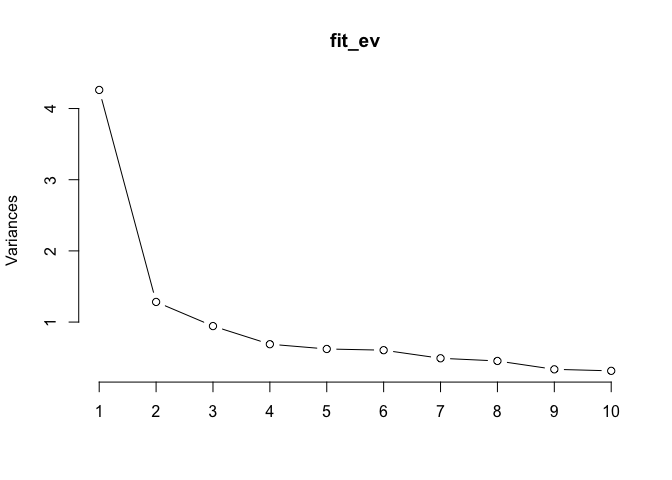
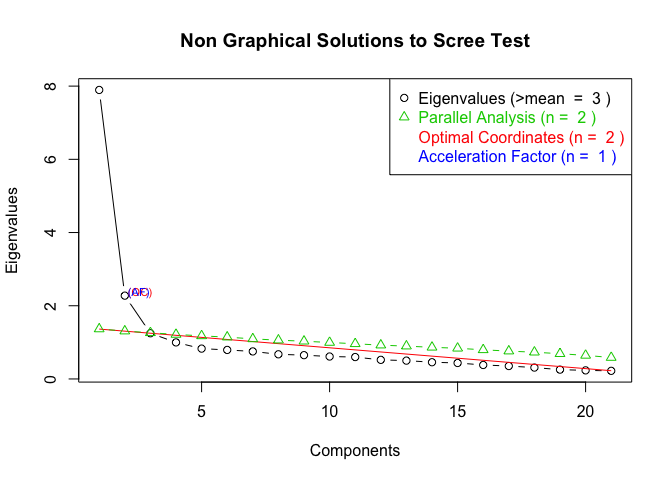
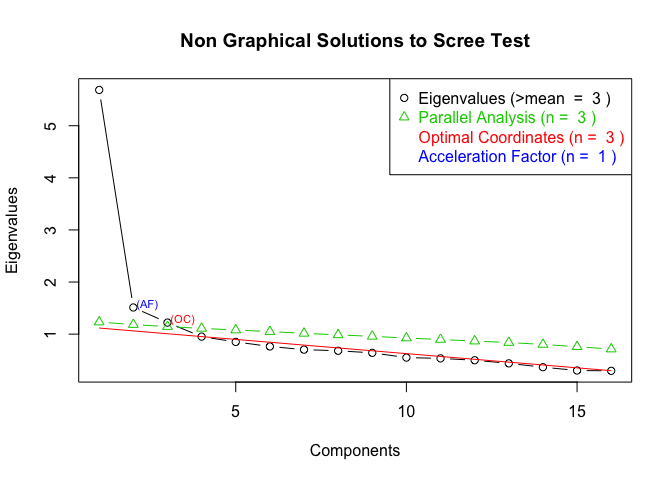

# PCA and FA and t-test
Sarah Klain  
May 19, 2016  


#### Setup


```r
library(stats) # for PCA & FA
library(psych) # for PCA
```

#### Input data

```r
setwd("/Users/sarahklain/Documents/R_2015/navi") #set working directory
#ev <- read.csv("Env_Val_02_29_2016.csv")

ev <- read.csv("Env_Val_05_19_2016.csv")
ev1 <- (ev[3:12])
```

#### PCA
data from all three surveys: mt, t and f

```r
fit_ev <- prcomp(~ ., data = ev1, na.action = na.omit, scale=TRUE)

fit_ev
```

```
## Standard deviations:
##  [1] 2.0642044 1.1325667 0.9714900 0.8301672 0.7886641 0.7779177 0.7009838
##  [8] 0.6736541 0.5798550 0.5610840
## 
## Rotation:
##                      PC1         PC2         PC3         PC4         PC5
## abuse_nep     0.34994841 -0.28805667  0.20013585 -0.15692810  0.04770036
## bal_r_nep     0.27331149 -0.39033640 -0.04932260  0.55099598 -0.16176498
## crisis_r_nep  0.09753388 -0.44902587 -0.81974151 -0.17195427  0.11592056
## spaceship_nep 0.32233475 -0.28392683  0.41421192 -0.21757727  0.11041581
## bau_nep       0.38196114 -0.26396228  0.19592018 -0.17981422  0.05574319
## comm_rel      0.31158077  0.26530838 -0.03005515  0.61823601  0.17482709
## wild_rel      0.32063558  0.28658301 -0.14405554  0.01857464  0.69206468
## iden_rel      0.35458577  0.32593267 -0.09927446 -0.26225319 -0.05190820
## kin_rel       0.32337182  0.38224411 -0.18152954 -0.29769850 -0.33782198
## other_rel     0.33665995  0.08879786 -0.10543645  0.15024578 -0.56256916
##                       PC6         PC7         PC8           PC9
## abuse_nep      0.08567361  0.32890242  0.68040578  0.2077322682
## bal_r_nep     -0.63301168 -0.13031072 -0.03890516 -0.0889428896
## crisis_r_nep   0.18305769  0.09434728 -0.15068957  0.0925002892
## spaceship_nep  0.18002055 -0.13992392 -0.62675039  0.1203706356
## bau_nep        0.03755767  0.08770430  0.01448966 -0.3761304103
## comm_rel       0.34161122  0.48421462 -0.19206594  0.1535439096
## wild_rel      -0.04364895 -0.43448488  0.17648403 -0.2632278450
## iden_rel      -0.38019785 -0.07851855 -0.06341207  0.6772397579
## kin_rel       -0.19697196  0.36148406 -0.14287549 -0.4825957234
## other_rel      0.47188594 -0.52781943  0.16531966 -0.0001890767
##                        PC10
## abuse_nep     -3.255486e-01
## bal_r_nep     -1.167562e-01
## crisis_r_nep  -1.434358e-02
## spaceship_nep -3.536829e-01
## bau_nep        7.482097e-01
## comm_rel       8.496007e-02
## wild_rel      -1.545788e-01
## iden_rel       2.707764e-01
## kin_rel       -3.013940e-01
## other_rel     -2.181643e-05
```

```r
summary(fit_ev) # print variance accounted for 
```

```
## Importance of components:
##                           PC1    PC2     PC3     PC4    PC5     PC6
## Standard deviation     2.0642 1.1326 0.97149 0.83017 0.7887 0.77792
## Proportion of Variance 0.4261 0.1283 0.09438 0.06892 0.0622 0.06052
## Cumulative Proportion  0.4261 0.5544 0.64874 0.71766 0.7799 0.84038
##                            PC7     PC8     PC9    PC10
## Standard deviation     0.70098 0.67365 0.57986 0.56108
## Proportion of Variance 0.04914 0.04538 0.03362 0.03148
## Cumulative Proportion  0.88951 0.93490 0.96852 1.00000
```

```r
loadings(fit_ev) # pc loadings 
```

```
## NULL
```

```r
plot(fit_ev,type="lines") # scree plot 
```

 

```r
fit_ev$scores # the principal components
```

```
## NULL
```

```r
biplot(fit_ev)
```

 


```r
fit_ev_pr <- principal(ev1, nfactors=2, rotate="varimax")
fit_ev_pr # print results
```

```
## Principal Components Analysis
## Call: principal(r = ev1, nfactors = 2, rotate = "varimax")
## Standardized loadings (pattern matrix) based upon correlation matrix
##                 PC1  PC2   h2   u2 com
## abuse_nep      0.32 0.73 0.64 0.36 1.4
## bal_r_nep      0.17 0.70 0.52 0.48 1.1
## crisis_r_nep  -0.09 0.49 0.25 0.75 1.1
## spaceship_nep  0.32 0.68 0.56 0.44 1.4
## bau_nep        0.40 0.75 0.72 0.28 1.5
## comm_rel       0.69 0.13 0.49 0.51 1.1
## wild_rel       0.73 0.17 0.56 0.44 1.1
## iden_rel       0.81 0.14 0.67 0.33 1.1
## kin_rel        0.77 0.13 0.61 0.39 1.1
## other_rel      0.62 0.34 0.50 0.50 1.5
## 
##                        PC1  PC2
## SS loadings           3.04 2.49
## Proportion Var        0.30 0.25
## Cumulative Var        0.30 0.55
## Proportion Explained  0.55 0.45
## Cumulative Proportion 0.55 1.00
## 
## Mean item complexity =  1.2
## Test of the hypothesis that 2 components are sufficient.
## 
## The root mean square of the residuals (RMSR) is  0.09 
##  with the empirical chi square  599.19  with prob <  8.8e-110 
## 
## Fit based upon off diagonal values = 0.95
```


```r
library(devtools) # for nice plots of PCAs
# install_github("ggbiplot", "vqv")
library(ggbiplot)
```

```
## Loading required package: ggplot2
```

```
## Warning: package 'ggplot2' was built under R version 3.2.4
```

```
## 
## Attaching package: 'ggplot2'
## 
## The following objects are masked from 'package:psych':
## 
##     %+%, alpha
## 
## Loading required package: plyr
## Loading required package: scales
```

```
## Warning: package 'scales' was built under R version 3.2.3
```

```
## 
## Attaching package: 'scales'
## 
## The following objects are masked from 'package:psych':
## 
##     alpha, rescale
## 
## Loading required package: grid
```

```r
g <- ggbiplot(fit_ev, obs.scale = 1, var.scale = 1, 
              ellipse = TRUE, 
              circle = TRUE)
g <- g + scale_color_discrete(name = '')
g <- g + theme(legend.direction = 'horizontal', 
               legend.position = 'top')
print(g)
```

 
 
### Factor Analysis
#### FA for three populations
3 factors

```r
fit_ev <- factanal(~ ., factors = 3, data = ev1)
print(fit_ev, digits=2, cutoff=.3, sort=TRUE)
```

```
## 
## Call:
## factanal(x = ~., factors = 3, data = ev1)
## 
## Uniquenesses:
##     abuse_nep     bal_r_nep  crisis_r_nep spaceship_nep       bau_nep 
##          0.44          0.64          0.75          0.44          0.27 
##      comm_rel      wild_rel      iden_rel       kin_rel     other_rel 
##          0.65          0.58          0.35          0.42          0.59 
## 
## Loadings:
##               Factor1 Factor2 Factor3
## comm_rel      0.53                   
## wild_rel      0.60                   
## iden_rel      0.77                   
## kin_rel       0.74                   
## other_rel     0.52    0.33           
## abuse_nep             0.65           
## spaceship_nep         0.72           
## bau_nep       0.34    0.76           
## bal_r_nep             0.43    0.36   
## crisis_r_nep                  0.49   
## 
##                Factor1 Factor2 Factor3
## SS loadings       2.35    2.00    0.51
## Proportion Var    0.24    0.20    0.05
## Cumulative Var    0.24    0.44    0.49
## 
## Test of the hypothesis that 3 factors are sufficient.
## The chi square statistic is 72.79 on 18 degrees of freedom.
## The p-value is 1.52e-08
```

```r
# plot factor 1 by factor 2 
load <- fit_ev$loadings[,1:2] 
plot(load,type="n") # set up plot 
text(load,labels=names(ev1),cex=.7) # add variable names
```

 
2 factors

```r
fit_ev <- factanal(~ ., factors = 2, data = ev1)
print(fit_ev, digits=2, cutoff=.3, sort=TRUE)
```

```
## 
## Call:
## factanal(x = ~., factors = 2, data = ev1)
## 
## Uniquenesses:
##     abuse_nep     bal_r_nep  crisis_r_nep spaceship_nep       bau_nep 
##          0.44          0.70          0.95          0.49          0.26 
##      comm_rel      wild_rel      iden_rel       kin_rel     other_rel 
##          0.65          0.58          0.35          0.42          0.60 
## 
## Loadings:
##               Factor1 Factor2
## comm_rel      0.54           
## wild_rel      0.61           
## iden_rel      0.78           
## kin_rel       0.75           
## other_rel     0.52    0.35   
## abuse_nep     0.31    0.68   
## bal_r_nep             0.50   
## spaceship_nep         0.67   
## bau_nep       0.36    0.78   
## crisis_r_nep                 
## 
##                Factor1 Factor2
## SS loadings       2.43    2.11
## Proportion Var    0.24    0.21
## Cumulative Var    0.24    0.45
## 
## Test of the hypothesis that 2 factors are sufficient.
## The chi square statistic is 102.95 on 26 degrees of freedom.
## The p-value is 4.13e-11
```

```r
# plot factor 1 by factor 2 
load <- fit_ev$loadings[,1:2] 
plot(load,type="n", col = "black") # set up plot 
text(load,labels=names(ev1),cex=.7, col = "black") # add variable names
```

 

### Scree Plot, three populations
Determine Number of Factors to Extract

```r
library(nFactors)
```

```
## Loading required package: MASS
## Loading required package: boot
## 
## Attaching package: 'boot'
## 
## The following object is masked from 'package:psych':
## 
##     logit
## 
## Loading required package: lattice
## 
## Attaching package: 'lattice'
## 
## The following object is masked from 'package:boot':
## 
##     melanoma
## 
## 
## Attaching package: 'nFactors'
## 
## The following object is masked from 'package:lattice':
## 
##     parallel
```

```r
ev <- eigen(cor(ev1, y = NULL, "complete.obs")) # get eigenvalues

ap <- parallel(subject=nrow(ev1),var=ncol(ev1),
  rep=100,cent=.05)
nS <- nScree(x=ev$values, aparallel=ap$eigen$qevpea)
plotnScree(nS)
```

 

```r
#pdf(file = "/Users/sarahklain/Documents/R_2015/navi/figs_PCA_FA/eigen_all.pdf")
#jpeg(file = "/Users/sarahklain/Documents/R_2015/navi/figs_PCA_FA/eigen_all.jpg")
```

### FA Three populations

```r
fit_ev <- factanal(~ ., factors = 3, data = ev1)
print(fit_ev, digits=2, cutoff=.3, sort=TRUE)
```

```
## 
## Call:
## factanal(x = ~., factors = 3, data = ev1)
## 
## Uniquenesses:
##     abuse_nep     bal_r_nep  crisis_r_nep spaceship_nep       bau_nep 
##          0.44          0.64          0.75          0.44          0.27 
##      comm_rel      wild_rel      iden_rel       kin_rel     other_rel 
##          0.65          0.58          0.35          0.42          0.59 
## 
## Loadings:
##               Factor1 Factor2 Factor3
## comm_rel      0.53                   
## wild_rel      0.60                   
## iden_rel      0.77                   
## kin_rel       0.74                   
## other_rel     0.52    0.33           
## abuse_nep             0.65           
## spaceship_nep         0.72           
## bau_nep       0.34    0.76           
## bal_r_nep             0.43    0.36   
## crisis_r_nep                  0.49   
## 
##                Factor1 Factor2 Factor3
## SS loadings       2.35    2.00    0.51
## Proportion Var    0.24    0.20    0.05
## Cumulative Var    0.24    0.44    0.49
## 
## Test of the hypothesis that 3 factors are sufficient.
## The chi square statistic is 72.79 on 18 degrees of freedom.
## The p-value is 1.52e-08
```

```r
# plot factor 1 by factor 2 
load <- fit_ev$loadings[,1:2] 
plot(load,type="n", col = "black") # set up plot 
text(load,col = "black", labels=names(ev1),cex=.7) # add variable names
```

 

## Scree and FA for M-Turk Data

```r
ev_mt <- read.csv("ev_mt.csv")
mt_val <- ev_mt[3:23]

#Scree Plot
ev <- eigen(cor(mt_val, y = NULL, "complete.obs")) # get eigenvalues

ap <- parallel(subject=nrow(mt_val),var=ncol(mt_val),
  rep=100,cent=.05)
nS <- nScree(x=ev$values, aparallel=ap$eigen$qevpea)
plotnScree(nS)
```

 

MT 4 factors

```r
fit_mt <- factanal(~ ., factors = 4, data = mt_val)
print(fit_mt, digits=2, cutoff=.3, sort=TRUE)
```

```
## 
## Call:
## factanal(x = ~., factors = 4, data = mt_val)
## 
## Uniquenesses:
##     abuse_nep       bal_nep    crisis_nep spaceship_nep       bau_nep 
##          0.40          0.51          0.38          0.65          0.27 
##   extract_ins    loss_instr    decade_mor      comm_rel      wild_rel 
##          0.82          0.70          0.38          0.66          0.55 
##    clean_inst          tech      iden_rel       kin_rel         right 
##          0.62          0.88          0.44          0.48          0.26 
##    health_rel     other_rel       kin_met      resp_met      iden_met 
##          0.70          0.47          0.24          0.36          0.29 
##     other_met 
##          0.54 
## 
## Loadings:
##               Factor1 Factor2 Factor3 Factor4
## wild_rel       0.55                          
## iden_rel       0.62                          
## kin_rel        0.60                    0.34  
## kin_met        0.86                          
## resp_met       0.71                          
## iden_met       0.83                          
## abuse_nep              0.65                  
## crisis_nep            -0.67           -0.31  
## bau_nep                0.78                  
## decade_mor                     0.63          
## right                 -0.32    0.73          
## other_rel              0.36            0.59  
## bal_nep               -0.50    0.45          
## spaceship_nep          0.50                  
## extract_ins                    0.32          
## loss_instr                     0.40          
## comm_rel       0.42                    0.36  
## clean_inst             0.36            0.40  
## tech                           0.32          
## health_rel                             0.37  
## other_met      0.38                    0.50  
## 
##                Factor1 Factor2 Factor3 Factor4
## SS loadings       3.77    2.87    1.95    1.83
## Proportion Var    0.18    0.14    0.09    0.09
## Cumulative Var    0.18    0.32    0.41    0.50
## 
## Test of the hypothesis that 4 factors are sufficient.
## The chi square statistic is 250.18 on 132 degrees of freedom.
## The p-value is 2.45e-09
```

```r
# plot factor 1 by factor 2 
load <- fit_mt$loadings[,1:2] 
plot(load,type="n", col = "black") # set up plot 
text(load,col = "black", labels=names(ev1),cex=.7) # add variable names
```

 

MT 3 factors

```r
fit_mt <- factanal(~ ., factors = 3, data = mt_val)
print(fit_mt, digits=2, cutoff=.3, sort=TRUE)
```

```
## 
## Call:
## factanal(x = ~., factors = 3, data = mt_val)
## 
## Uniquenesses:
##     abuse_nep       bal_nep    crisis_nep spaceship_nep       bau_nep 
##          0.41          0.51          0.36          0.66          0.32 
##   extract_ins    loss_instr    decade_mor      comm_rel      wild_rel 
##          0.83          0.70          0.37          0.70          0.55 
##    clean_inst          tech      iden_rel       kin_rel         right 
##          0.64          0.89          0.45          0.51          0.31 
##    health_rel     other_rel       kin_met      resp_met      iden_met 
##          0.73          0.63          0.24          0.36          0.36 
##     other_met 
##          0.63 
## 
## Loadings:
##               Factor1 Factor2 Factor3
## wild_rel       0.59                  
## iden_rel       0.66                  
## kin_rel        0.64                  
## kin_met        0.86                  
## resp_met       0.73                  
## iden_met       0.79                  
## abuse_nep              0.68          
## bal_nep               -0.55    0.43  
## crisis_nep            -0.74          
## spaceship_nep          0.52          
## bau_nep                0.77          
## other_rel              0.51          
## decade_mor            -0.38    0.66  
## right                 -0.39    0.68  
## extract_ins                    0.30  
## loss_instr                     0.43  
## comm_rel       0.47                  
## clean_inst             0.48          
## tech                           0.31  
## health_rel             0.35   -0.34  
## other_met      0.44    0.39          
## 
##                Factor1 Factor2 Factor3
## SS loadings       4.13    3.76    1.97
## Proportion Var    0.20    0.18    0.09
## Cumulative Var    0.20    0.38    0.47
## 
## Test of the hypothesis that 3 factors are sufficient.
## The chi square statistic is 349.36 on 150 degrees of freedom.
## The p-value is 6.02e-18
```

```r
# plot factor 1 by factor 2 
load <- fit_mt$loadings[,1:2] 
plot(load,type="n", col = "black") # set up plot 
text(load,col = "black", labels=names(ev1),cex=.7) # add variable names
```

 

MT 2 factors

```r
fit_mt <- factanal(~ ., factors = 2, data = mt_val)
print(fit_mt, digits=2, cutoff=.3, sort=TRUE)
```

```
## 
## Call:
## factanal(x = ~., factors = 2, data = mt_val)
## 
## Uniquenesses:
##     abuse_nep       bal_nep    crisis_nep spaceship_nep       bau_nep 
##          0.46          0.50          0.41          0.69          0.45 
##   extract_ins    loss_instr    decade_mor      comm_rel      wild_rel 
##          0.84          0.73          0.51          0.70          0.55 
##    clean_inst          tech      iden_rel       kin_rel         right 
##          0.64          0.95          0.45          0.52          0.47 
##    health_rel     other_rel       kin_met      resp_met      iden_met 
##          0.73          0.64          0.24          0.37          0.35 
##     other_met 
##          0.63 
## 
## Loadings:
##               Factor1 Factor2
## abuse_nep      0.68          
## bal_nep       -0.71          
## crisis_nep    -0.75          
## bau_nep        0.68    0.31  
## decade_mor    -0.67          
## clean_inst     0.55          
## right         -0.69          
## other_rel      0.52          
## wild_rel       0.33    0.58  
## iden_rel       0.37    0.64  
## kin_rel        0.30    0.63  
## kin_met                0.87  
## resp_met       0.33    0.72  
## iden_met               0.80  
## spaceship_nep  0.49          
## extract_ins   -0.38          
## loss_instr    -0.49          
## comm_rel               0.47  
## tech                         
## health_rel     0.49          
## other_met      0.43    0.43  
## 
##                Factor1 Factor2
## SS loadings       5.11    4.06
## Proportion Var    0.24    0.19
## Cumulative Var    0.24    0.44
## 
## Test of the hypothesis that 2 factors are sufficient.
## The chi square statistic is 507.77 on 169 degrees of freedom.
## The p-value is 1.38e-35
```

```r
# plot factor 1 by factor 2 
load <- fit_mt$loadings[,1:2] 
plot(load,type="n", col = "black") # set up plot 
text(load,col = "black", labels=names(ev1),cex=.7) # add variable names
```

 

#### Scree, FA, PCA for Tourists and MT

```r
library(nFactors)
mtt <- read.csv("mt_t_05_23_2016.csv")
mtt2 <- mtt[3:18]

#Scree Plot
ev <- eigen(cor(mtt2, y = NULL, "complete.obs")) # get eigenvalues
ap <- parallel(subject=nrow(mtt2),var=ncol(mtt2),
  rep=100,cent=.05)
nS <- nScree(x=ev$values, aparallel=ap$eigen$qevpea)
plotnScree(nS)
```

 

```r
#PCA
fit_mtt <- prcomp(~ ., data = mtt2, na.action = na.omit, scale=TRUE)

fit_mtt
```

```
## Standard deviations:
##  [1] 2.3845823 1.2295499 1.1053933 0.9761003 0.9222773 0.8740448 0.8383065
##  [8] 0.8250989 0.8005839 0.7419635 0.7313036 0.7064452 0.6629542 0.6049946
## [15] 0.5501738 0.5437651
## 
## Rotation:
##                      PC1         PC2         PC3         PC4         PC5
## abuse_nep     0.29340239 -0.11449109  0.35019103 -0.03270283  0.09376966
## bal_r_nep     0.25765353 -0.32579424  0.02066962 -0.23205772  0.13061771
## crisis_r_nep  0.30554833 -0.18897433  0.19622738 -0.12847828  0.01209693
## spaceship_nep 0.24172294 -0.07556483  0.41482812  0.07306403  0.18549534
## bau_nep       0.31232938 -0.07651861  0.32088158  0.02681277  0.16225771
## comm_rel      0.21459400  0.33292777 -0.16571972 -0.18553035  0.33501879
## wild_rel      0.24763364  0.34889038 -0.08122770  0.11621814  0.34138449
## iden_rel      0.28105485  0.29765018 -0.21054358  0.18638147 -0.01343020
## kin_rel       0.27316734  0.33788702 -0.23075179  0.17167665  0.03791515
## other_rel     0.28179204  0.15404097  0.01229929 -0.15437023 -0.25251877
## health_rel2   0.23078433  0.01116832 -0.21708238 -0.46491056 -0.27292435
## extract_r_ins 0.15102667 -0.29372988 -0.14143673  0.67755219  0.08322257
## loss_r_ins    0.20028466 -0.26660297 -0.27182670  0.23612810 -0.29486036
## clean_inst    0.25889148  0.02906320  0.02666283  0.04624652 -0.51786957
## right_r_mor   0.27072974 -0.21132532 -0.21162183 -0.03026636 -0.08766926
## tech_r        0.03597935 -0.41404589 -0.49506128 -0.22916470  0.41817235
##                         PC6          PC7         PC8           PC9
## abuse_nep     -0.0172206000 -0.213727740  0.02101960  0.1117088720
## bal_r_nep      0.3496683411  0.047003999  0.18896129 -0.0862000964
## crisis_r_nep   0.2470868196  0.139410348  0.13589184 -0.1042518804
## spaceship_nep -0.3501319560 -0.087048264 -0.32171903  0.0009109502
## bau_nep       -0.1437885238 -0.062189632 -0.08319684 -0.1481171114
## comm_rel       0.4304718149  0.340201901 -0.29593158  0.1622978918
## wild_rel       0.0858087833 -0.081951546  0.27707250 -0.0268143680
## iden_rel      -0.1514153564 -0.309642839  0.13422692 -0.0361491078
## kin_rel       -0.1415114972 -0.153292695 -0.12668850 -0.1094512264
## other_rel     -0.1722831612  0.484585485 -0.22130265  0.0198847377
## health_rel2   -0.3628529230  0.138324736  0.26431599 -0.4112227184
## extract_r_ins -0.1313649394  0.533825564  0.23687875 -0.0239969723
## loss_r_ins     0.3352306132 -0.241122543 -0.50585222 -0.4069557893
## clean_inst    -0.0006762222  0.008051145 -0.08564621  0.6416178123
## right_r_mor    0.1282846849 -0.282025404  0.36061837  0.2862516998
## tech_r        -0.3606346829 -0.052252902 -0.26140421  0.2786304265
##                      PC10         PC11        PC12         PC13
## abuse_nep     -0.53957636  0.070926560  0.12079384 -0.096692426
## bal_r_nep      0.49321420 -0.007681854 -0.33552934 -0.044561706
## crisis_r_nep   0.02879303  0.400088942  0.03158744  0.152828711
## spaceship_nep  0.29482717 -0.530339022 -0.14939042 -0.128312227
## bau_nep       -0.08965414  0.335538027  0.12567928 -0.009106709
## comm_rel      -0.19136194 -0.131236915 -0.06680969 -0.346034872
## wild_rel       0.22655700 -0.191027607  0.62890690  0.194196129
## iden_rel       0.25160269  0.208884519 -0.21354081  0.082747151
## kin_rel       -0.14291855  0.217379328 -0.42883875 -0.098826298
## other_rel     -0.05958945 -0.094796790 -0.06638587  0.659804366
## health_rel2   -0.06933641 -0.137791266  0.16516907 -0.407288820
## extract_r_ins -0.07850450 -0.032419957 -0.01509780 -0.179758327
## loss_r_ins    -0.01578040 -0.121655957  0.24878911  0.027725952
## clean_inst     0.26600021  0.150323110  0.22032109 -0.291008603
## right_r_mor   -0.33287592 -0.437686875 -0.20373974  0.216136307
## tech_r         0.04239268  0.195963995  0.14270759  0.094797560
##                       PC14          PC15         PC16
## abuse_nep     -0.129339527  0.3906375412 -0.469013692
## bal_r_nep     -0.420694064  0.0672749163 -0.221642211
## crisis_r_nep   0.547772749  0.2717656096  0.383121955
## spaceship_nep  0.228653309  0.1043784675  0.142181992
## bau_nep       -0.228358031 -0.7110291040  0.137728287
## comm_rel       0.185591956 -0.1844604463 -0.086664587
## wild_rel      -0.178633196  0.1495921888  0.115734351
## iden_rel       0.423822833 -0.1553887087 -0.501878206
## kin_rel       -0.347475327  0.3130603350  0.418815919
## other_rel     -0.129511427  0.0165250842 -0.160966142
## health_rel2    0.045960094  0.0008171817 -0.004955059
## extract_r_ins  0.009281596  0.0120608943 -0.077497609
## loss_r_ins     0.010801844  0.0083120097 -0.047970961
## clean_inst    -0.095013021  0.0080024021  0.079661626
## right_r_mor    0.077817139 -0.2605373443  0.236947573
## tech_r         0.030209960  0.0746635703 -0.002843607
```

```r
g1 <- ggbiplot(fit_mtt, obs.scale = 1, var.scale = 1, 
              ellipse = TRUE, 
              circle = TRUE)
g1 <- g1 + scale_color_discrete(name = '')
g1 <- g1 + theme(legend.direction = 'horizontal', 
               legend.position = 'top')
print(g1)
```

 

```r
#Factor Analysis
#3 factors
fit_mt_t <- factanal(~ ., factors = 3, data = mtt2)
print(fit_mt_t, digits=2, cutoff=.3, sort=TRUE)
```

```
## 
## Call:
## factanal(x = ~., factors = 3, data = mtt2)
## 
## Uniquenesses:
##     abuse_nep     bal_r_nep  crisis_r_nep spaceship_nep       bau_nep 
##          0.42          0.50          0.41          0.60          0.30 
##      comm_rel      wild_rel      iden_rel       kin_rel     other_rel 
##          0.72          0.59          0.39          0.37          0.61 
##   health_rel2 extract_r_ins    loss_r_ins    clean_inst   right_r_mor 
##          0.72          0.86          0.73          0.68          0.51 
##        tech_r 
##          0.86 
## 
## Loadings:
##               Factor1 Factor2 Factor3
## wild_rel       0.59                  
## iden_rel       0.75                  
## kin_rel        0.77                  
## abuse_nep              0.70          
## crisis_r_nep           0.61    0.40  
## spaceship_nep          0.59          
## bau_nep        0.32    0.76          
## bal_r_nep              0.43    0.54  
## right_r_mor    0.32            0.57  
## comm_rel       0.50                  
## other_rel      0.47    0.36          
## health_rel2    0.36            0.32  
## extract_r_ins                        
## loss_r_ins                     0.44  
## clean_inst     0.38    0.33          
## tech_r                         0.37  
## 
##                Factor1 Factor2 Factor3
## SS loadings       2.70    2.55    1.48
## Proportion Var    0.17    0.16    0.09
## Cumulative Var    0.17    0.33    0.42
## 
## Test of the hypothesis that 3 factors are sufficient.
## The chi square statistic is 210.95 on 75 degrees of freedom.
## The p-value is 7.34e-15
```

```r
# plot factor 1 by factor 2 
load <- fit_mt_t$loadings[,1:2] 
plot(load,type="n", col = "black") # set up plot 
text(load,labels=names(mtt2),cex=.7, col = "black") # add variable names
```

 

```r
#2 factors
fit_mt_t <- factanal(~ ., factors = 2, data = mtt2)
print(fit_mt_t, digits=2, cutoff=.3, sort=TRUE)
```

```
## 
## Call:
## factanal(x = ~., factors = 2, data = mtt2)
## 
## Uniquenesses:
##     abuse_nep     bal_r_nep  crisis_r_nep spaceship_nep       bau_nep 
##          0.47          0.58          0.39          0.67          0.42 
##      comm_rel      wild_rel      iden_rel       kin_rel     other_rel 
##          0.72          0.60          0.39          0.36          0.60 
##   health_rel2 extract_r_ins    loss_r_ins    clean_inst   right_r_mor 
##          0.75          0.89          0.82          0.68          0.65 
##        tech_r 
##          0.98 
## 
## Loadings:
##               Factor1 Factor2
## comm_rel       0.51          
## wild_rel       0.60          
## iden_rel       0.76          
## kin_rel        0.79          
## other_rel      0.50    0.38  
## abuse_nep      0.31    0.66  
## bal_r_nep              0.62  
## crisis_r_nep           0.72  
## spaceship_nep          0.51  
## bau_nep        0.38    0.66  
## health_rel2    0.39    0.32  
## extract_r_ins                
## loss_r_ins             0.35  
## clean_inst     0.41    0.39  
## right_r_mor    0.36    0.47  
## tech_r                       
## 
##                Factor1 Factor2
## SS loadings       3.05    3.00
## Proportion Var    0.19    0.19
## Cumulative Var    0.19    0.38
## 
## Test of the hypothesis that 2 factors are sufficient.
## The chi square statistic is 357.82 on 89 degrees of freedom.
## The p-value is 6.44e-34
```

```r
# plot factor 1 by factor 2 
load <- fit_mt_t$loadings[,1:2] 
plot(load,type="n", col = "black") # set up plot 
text(load,labels=names(mtt2),cex=.7, col = "black") # add variable names
```

 

```r
#only NEP and relational data
mtt3 <- mtt[3:13]
fit_mtt_n_r <- factanal(~ ., factors = 2, data = mtt3)
print(fit_mtt_n_r, digits=2, cutoff=.3, sort=TRUE)
```

```
## 
## Call:
## factanal(x = ~., factors = 2, data = mtt3)
## 
## Uniquenesses:
##     abuse_nep     bal_r_nep  crisis_r_nep spaceship_nep       bau_nep 
##          0.44          0.63          0.42          0.63          0.36 
##      comm_rel      wild_rel      iden_rel       kin_rel     other_rel 
##          0.71          0.59          0.40          0.36          0.61 
##   health_rel2 
##          0.76 
## 
## Loadings:
##               Factor1 Factor2
## abuse_nep     0.71           
## bal_r_nep     0.58           
## crisis_r_nep  0.72           
## spaceship_nep 0.57           
## bau_nep       0.73    0.33   
## wild_rel              0.59   
## iden_rel              0.75   
## kin_rel               0.78   
## comm_rel              0.50   
## other_rel     0.42    0.47   
## health_rel2   0.32    0.37   
## 
##                Factor1 Factor2
## SS loadings       2.68    2.41
## Proportion Var    0.24    0.22
## Cumulative Var    0.24    0.46
## 
## Test of the hypothesis that 2 factors are sufficient.
## The chi square statistic is 158.07 on 34 degrees of freedom.
## The p-value is 6.54e-18
```

```r
# plot factor 1 by factor 2 
load <- fit_mtt_n_r$loadings[,1:2] 
plot(load,type="n", col = "black") # set up plot 
text(load,labels=names(mtt2),cex=.7, col = "black") # add variable names
```

 

## T-tests
Compare value framings
MT data

```r
t_kr_km <- t.test(mt_val$kin_rel,mt_val$kin_met, paired = TRUE)
t_kr_km 
```

```
## 
## 	Paired t-test
## 
## data:  mt_val$kin_rel and mt_val$kin_met
## t = 12.641, df = 395, p-value < 2.2e-16
## alternative hypothesis: true difference in means is not equal to 0
## 95 percent confidence interval:
##  0.5203307 0.7119925
## sample estimates:
## mean of the differences 
##               0.6161616
```

```r
t_or_om <- t.test(mt_val$other_rel, mt_val$other_met, paired = TRUE)
t_or_om
```

```
## 
## 	Paired t-test
## 
## data:  mt_val$other_rel and mt_val$other_met
## t = 5.9414, df = 399, p-value = 6.161e-09
## alternative hypothesis: true difference in means is not equal to 0
## 95 percent confidence interval:
##  0.1706243 0.3393757
## sample estimates:
## mean of the differences 
##                   0.255
```

```r
#less agreement with metaphor, more agreement with relational statements
```


```r
library(Hmisc) #to run correlations with sig levels
```

```
## Loading required package: survival
## 
## Attaching package: 'survival'
## 
## The following object is masked from 'package:boot':
## 
##     aml
## 
## Loading required package: Formula
```

```
## Warning: replacing previous import by 'ggplot2::unit' when loading 'Hmisc'
```

```
## Warning: replacing previous import by 'ggplot2::arrow' when loading 'Hmisc'
```

```
## Warning: replacing previous import by 'scales::alpha' when loading 'Hmisc'
```

```
## 
## Attaching package: 'Hmisc'
## 
## The following objects are masked from 'package:plyr':
## 
##     is.discrete, summarize
## 
## The following object is masked from 'package:psych':
## 
##     describe
## 
## The following objects are masked from 'package:base':
## 
##     format.pval, round.POSIXt, trunc.POSIXt, units
```

```r
t_or_ci <- t.test(mt_val$other_rel,mt_val$clean_inst,paired=TRUE)
t_or_ci
```

```
## 
## 	Paired t-test
## 
## data:  mt_val$other_rel and mt_val$clean_inst
## t = -10.431, df = 399, p-value < 2.2e-16
## alternative hypothesis: true difference in means is not equal to 0
## 95 percent confidence interval:
##  -0.4070525 -0.2779475
## sample estimates:
## mean of the differences 
##                 -0.3425
```

```r
t_kr_rm <- t.test(mt_val$kin_rel, mt_val$resp_met, paired = TRUE)
t_kr_rm
```

```
## 
## 	Paired t-test
## 
## data:  mt_val$kin_rel and mt_val$resp_met
## t = 0.29177, df = 396, p-value = 0.7706
## alternative hypothesis: true difference in means is not equal to 0
## 95 percent confidence interval:
##  -0.07226920  0.09745812
## sample estimates:
## mean of the differences 
##              0.01259446
```

```r
t_cr_rm <- t.test(mt_val$comm_rel, mt_val$resp_met, paired = TRUE)
t_cr_rm
```

```
## 
## 	Paired t-test
## 
## data:  mt_val$comm_rel and mt_val$resp_met
## t = 1.8174, df = 397, p-value = 0.0699
## alternative hypothesis: true difference in means is not equal to 0
## 95 percent confidence interval:
##  -0.006980835  0.177835106
## sample estimates:
## mean of the differences 
##              0.08542714
```

```r
t_hr_wr <- t.test(mt_val$health_rel, mt_val$wild_rel, paired = TRUE)
t_hr_wr
```

```
## 
## 	Paired t-test
## 
## data:  mt_val$health_rel and mt_val$wild_rel
## t = 0.32843, df = 397, p-value = 0.7428
## alternative hypothesis: true difference in means is not equal to 0
## 95 percent confidence interval:
##  -0.1002199  0.1404209
## sample estimates:
## mean of the differences 
##               0.0201005
```

```r
t_cr_bn <- t.test(mt_val$comm_rel, mt_val$bau_nep, paired = TRUE)
t_cr_bn
```

```
## 
## 	Paired t-test
## 
## data:  mt_val$comm_rel and mt_val$bau_nep
## t = 3.4539, df = 398, p-value = 0.0006119
## alternative hypothesis: true difference in means is not equal to 0
## 95 percent confidence interval:
##  0.07557988 0.27529732
## sample estimates:
## mean of the differences 
##               0.1754386
```

```r
t_ir_bn <- t.test(mt_val$iden_rel, mt_val$health_rel, paired = TRUE)
t_ir_bn
```

```
## 
## 	Paired t-test
## 
## data:  mt_val$iden_rel and mt_val$health_rel
## t = 1.7992, df = 397, p-value = 0.07275
## alternative hypothesis: true difference in means is not equal to 0
## 95 percent confidence interval:
##  -0.009781625  0.220836901
## sample estimates:
## mean of the differences 
##               0.1055276
```

```r
t_ir_wr <- t.test(mt_val$iden_rel, mt_val$wild_rel, paired = TRUE)
t_ir_wr
```

```
## 
## 	Paired t-test
## 
## data:  mt_val$iden_rel and mt_val$wild_rel
## t = 2.7584, df = 399, p-value = 0.006076
## alternative hypothesis: true difference in means is not equal to 0
## 95 percent confidence interval:
##  0.03591135 0.21408865
## sample estimates:
## mean of the differences 
##                   0.125
```

```r
t_om_wr <- t.test(mt_val$other_met, mt_val$wild_rel, paired = TRUE)
t_om_wr
```

```
## 
## 	Paired t-test
## 
## data:  mt_val$other_met and mt_val$wild_rel
## t = 7.6101, df = 399, p-value = 1.994e-13
## alternative hypothesis: true difference in means is not equal to 0
## 95 percent confidence interval:
##  0.289251 0.490749
## sample estimates:
## mean of the differences 
##                    0.39
```

```r
t_om_rm <- t.test(mt_val$other_met, mt_val$resp_met, paired = TRUE)
t_om_rm
```

```
## 
## 	Paired t-test
## 
## data:  mt_val$other_met and mt_val$resp_met
## t = 2.2371, df = 398, p-value = 0.02583
## alternative hypothesis: true difference in means is not equal to 0
## 95 percent confidence interval:
##  0.0127605 0.1977658
## sample estimates:
## mean of the differences 
##               0.1052632
```

```r
#head(mt_val)
```

