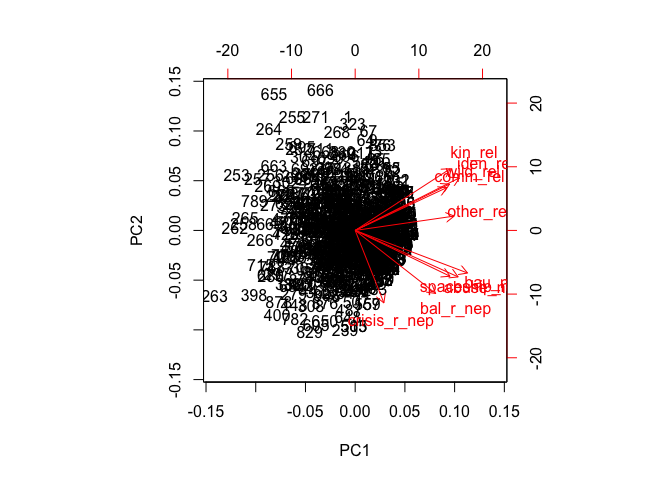
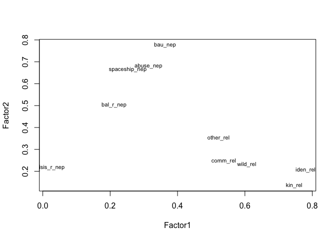

# PCA and FA and t-test
Sarah Klain  
May 19, 2016  


## PCA & Factor Analysis

#### Setup


```r
library(Hmisc) #to run correlations with sig levels
```

```
## Loading required package: grid
## Loading required package: lattice
## Loading required package: survival
## Loading required package: Formula
## Loading required package: ggplot2
```

```
## Warning: package 'ggplot2' was built under R version 3.2.4
```

```
## Warning: replacing previous import by 'ggplot2::unit' when loading 'Hmisc'
```

```
## Warning: replacing previous import by 'ggplot2::arrow' when loading 'Hmisc'
```

```
## Warning: replacing previous import by 'scales::alpha' when loading 'Hmisc'
```

```
## 
## Attaching package: 'Hmisc'
## 
## The following objects are masked from 'package:base':
## 
##     format.pval, round.POSIXt, trunc.POSIXt, units
```

```r
 library(ggplot2) # for great charts
# library(ggthemes) # for pretty themes in ggplot
library(viridis) # for pretty colors
 suppressMessages(library(dplyr))
library(knitr) # tool for making nice tables
# library(tidyr) # data table wrangling tool
# library(broom)
# library(stargazer) # mekes pretty tables
library(stats) # for PCA & FA
library(psych) # for PCA
```

```
## 
## Attaching package: 'psych'
## 
## The following object is masked from 'package:Hmisc':
## 
##     describe
## 
## The following objects are masked from 'package:ggplot2':
## 
##     %+%, alpha
```

```r
#library(dplyr)
```

#### Input data

```r
setwd("/Users/sarahklain/Documents/R_2015/navi") #set working directory
#ev <- read.csv("Env_Val_02_29_2016.csv")

ev <- read.csv("Env_Val_05_19_2016.csv")
ev1 <- (ev[3:11])
```

### PCA

# data from all three surveys: mt, t and f

```r
fit_ev <- prcomp(~ ., data = ev1, na.action = na.omit, scale=TRUE)

fit_ev
```

```
## Standard deviations:
## [1] 1.9638666 1.1233342 0.9794249 0.8335869 0.7779829 0.7229076 0.6686696
## [8] 0.5830381 0.5588405
## 
## Rotation:
##                     PC1        PC2         PC3         PC4        PC5
## abuse_nep     0.3709695 -0.3007986  0.20555036 -0.03216805  0.1734424
## bal_r_nep     0.3046931 -0.3616159 -0.10827346  0.33720179 -0.7669136
## crisis_r_nep  0.1278951 -0.3736894 -0.84940703 -0.09360033  0.2678076
## spaceship_nep 0.3533681 -0.2777982  0.37978220 -0.10782314  0.2335356
## bau_nep       0.4063512 -0.2665590  0.17577460 -0.14804239  0.1423605
## comm_rel      0.3096496  0.3264015 -0.03263445  0.70274780  0.1194709
## wild_rel      0.3466118  0.3231363 -0.15485554  0.21064717  0.3367140
## iden_rel      0.3631711  0.3779488 -0.09436587 -0.34063773 -0.1838422
## kin_rel       0.3395297  0.3702493 -0.12430693 -0.43439154 -0.2716383
##                        PC6          PC7         PC8         PC9
## abuse_nep     -0.169405664  0.724037925 -0.16388384  0.34459651
## bal_r_nep      0.225782919 -0.036501463  0.07994469  0.06410891
## crisis_r_nep  -0.134194016 -0.121812343 -0.08140381  0.05051744
## spaceship_nep  0.001320907 -0.656334225 -0.01460482  0.39568953
## bau_nep       -0.005421647  0.012175183  0.15002408 -0.81734959
## comm_rel      -0.488969616 -0.117541067 -0.16298413 -0.09442128
## wild_rel       0.660537164  0.109800724  0.36254914  0.11792796
## iden_rel       0.218057403 -0.052446064 -0.71537073 -0.06685564
## kin_rel       -0.423479586  0.007275927  0.51734209  0.15056116
```

```r
summary(fit_ev) # print variance accounted for 
```

```
## Importance of components:
##                           PC1    PC2    PC3     PC4     PC5     PC6
## Standard deviation     1.9639 1.1233 0.9794 0.83359 0.77798 0.72291
## Proportion of Variance 0.4285 0.1402 0.1066 0.07721 0.06725 0.05807
## Cumulative Proportion  0.4285 0.5687 0.6753 0.75253 0.81978 0.87785
##                            PC7     PC8    PC9
## Standard deviation     0.66867 0.58304 0.5588
## Proportion of Variance 0.04968 0.03777 0.0347
## Cumulative Proportion  0.92753 0.96530 1.0000
```

```r
loadings(fit_ev) # pc loadings 
```

```
## NULL
```

```r
plot(fit_ev,type="lines") # scree plot 
```

 

```r
fit_ev$scores # the principal components
```

```
## NULL
```

```r
biplot(fit_ev)
```

 


```r
fit_ev_pr <- principal(ev1, nfactors=4, rotate="varimax")
fit_ev_pr # print results
```

```
## Principal Components Analysis
## Call: principal(r = ev1, nfactors = 4, rotate = "varimax")
## Standardized loadings (pattern matrix) based upon correlation matrix
##                PC1   PC2   PC4   PC3   h2    u2 com
## abuse_nep     0.79  0.19  0.14  0.09 0.69 0.315 1.2
## bal_r_nep     0.60 -0.02  0.33  0.36 0.60 0.403 2.3
## crisis_r_nep  0.08  0.07 -0.02  0.96 0.93 0.066 1.0
## spaceship_nep 0.82  0.20  0.06 -0.09 0.72 0.276 1.1
## bau_nep       0.81  0.31  0.10  0.11 0.77 0.231 1.4
## comm_rel      0.17  0.24  0.88 -0.04 0.87 0.134 1.2
## wild_rel      0.19  0.56  0.53  0.09 0.64 0.358 2.3
## iden_rel      0.22  0.83  0.20  0.02 0.78 0.221 1.3
## kin_rel       0.19  0.84  0.11  0.04 0.76 0.241 1.2
## 
##                        PC1  PC2  PC4  PC3
## SS loadings           2.46 1.94 1.26 1.09
## Proportion Var        0.27 0.22 0.14 0.12
## Cumulative Var        0.27 0.49 0.63 0.75
## Proportion Explained  0.36 0.29 0.19 0.16
## Cumulative Proportion 0.36 0.65 0.84 1.00
## 
## Mean item complexity =  1.4
## Test of the hypothesis that 4 components are sufficient.
## 
## The root mean square of the residuals (RMSR) is  0.08 
##  with the empirical chi square  382.41  with prob <  1.7e-79 
## 
## Fit based upon off diagonal values = 0.96
```


```r
library(devtools) # for nice plots of PCAs
# install_github("ggbiplot", "vqv")
library(ggbiplot)
```

```
## Loading required package: plyr
## -------------------------------------------------------------------------
## You have loaded plyr after dplyr - this is likely to cause problems.
## If you need functions from both plyr and dplyr, please load plyr first, then dplyr:
## library(plyr); library(dplyr)
## -------------------------------------------------------------------------
## 
## Attaching package: 'plyr'
## 
## The following objects are masked from 'package:dplyr':
## 
##     arrange, count, desc, failwith, id, mutate, rename, summarise,
##     summarize
## 
## The following objects are masked from 'package:Hmisc':
## 
##     is.discrete, summarize
## 
## Loading required package: scales
```

```
## Warning: package 'scales' was built under R version 3.2.3
```

```
## 
## Attaching package: 'scales'
## 
## The following objects are masked from 'package:psych':
## 
##     alpha, rescale
```

```r
g <- ggbiplot(fit_ev, obs.scale = 1, var.scale = 1, 
              ellipse = TRUE, 
              circle = TRUE)
g <- g + scale_color_discrete(name = '')
g <- g + theme(legend.direction = 'horizontal', 
               legend.position = 'top')
print(g)
```

 
 
PCA M-turk data
#```{r}
library(dplyr)
ev_tbl <- ev %>% 
  tbl_df

ev_mt_tbl <- ev_tbl %>% 
  filter(sub_pop == "MT")

library(stats) # for PCA & FA
library(psych) # for PCA
fit_ev_mt <- prcomp(~ ., data=ev_mt_tbl[3,24], na.action=na.omit, scale=TRUE)

summary(fit_ev_mt) # print variance accounted for 
loadings(fit_ev_mt) # pc loadings 
plot(fit_ev_mt,type="lines") # scree plot 
fit_ev_mt$scores # the principal components
biplot(fit_ev_mt)
#```
 
###PCA with MT data, nicer plot
#```{r}
gmt <- ggbiplot(fit_ev_mt, obs.scale = 1, var.scale = 1, 
              ellipse = TRUE, 
              circle = TRUE)
gmt <- gmt + scale_color_discrete(name = '')
gmt <- gmt + theme(legend.direction = 'horizontal', 
               legend.position = 'top')
print(gmt)

#```

### Factor Analysis

FA for all three surveys pooled

```r
fit_ev <- factanal(~ ., factors = 3, data = ev1)
print(fit_ev, digits=2, cutoff=.3, sort=TRUE)
```

```
## 
## Call:
## factanal(x = ~., factors = 3, data = ev1)
## 
## Uniquenesses:
##     abuse_nep     bal_r_nep  crisis_r_nep spaceship_nep       bau_nep 
##          0.44          0.68          0.00          0.45          0.26 
##      comm_rel      wild_rel      iden_rel       kin_rel 
##          0.69          0.55          0.32          0.47 
## 
## Loadings:
##               Factor1 Factor2 Factor3
## abuse_nep      0.71                  
## spaceship_nep  0.71                  
## bau_nep        0.79    0.31          
## comm_rel               0.50          
## wild_rel               0.61          
## iden_rel               0.80          
## kin_rel                0.69          
## crisis_r_nep                   0.99  
## bal_r_nep      0.50                  
## 
##                Factor1 Factor2 Factor3
## SS loadings       2.11    2.00    1.03
## Proportion Var    0.23    0.22    0.11
## Cumulative Var    0.23    0.46    0.57
## 
## Test of the hypothesis that 3 factors are sufficient.
## The chi square statistic is 67.8 on 12 degrees of freedom.
## The p-value is 8.23e-10
```

```r
# plot factor 1 by factor 2 
load <- fit_ev$loadings[,1:2] 
plot(load,type="n") # set up plot 
text(load,labels=names(ev1),cex=.7) # add variable names
```

 


Determine Number of Factors to Extract

```r
library(nFactors)
```

```
## Loading required package: MASS
## 
## Attaching package: 'MASS'
## 
## The following object is masked from 'package:dplyr':
## 
##     select
## 
## Loading required package: boot
## 
## Attaching package: 'boot'
## 
## The following object is masked from 'package:psych':
## 
##     logit
## 
## The following object is masked from 'package:survival':
## 
##     aml
## 
## The following object is masked from 'package:lattice':
## 
##     melanoma
## 
## 
## Attaching package: 'nFactors'
## 
## The following object is masked from 'package:lattice':
## 
##     parallel
```

```r
ev <- eigen(cor(ev1, y = NULL, "complete.obs")) # get eigenvalues

ap <- parallel(subject=nrow(ev1),var=ncol(ev1),
  rep=100,cent=.05)
nS <- nScree(x=ev$values, aparallel=ap$eigen$qevpea)
plotnScree(nS)
```

 

```r
#pdf(file = "/Users/sarahklain/Documents/R_2015/navi/figs_PCA_FA/eigen_all.pdf")
#jpeg(file = "/Users/sarahklain/Documents/R_2015/navi/figs_PCA_FA/eigen_all.jpg")
```

 
 ## FA for M-Turk Data


```r
ev_mt <- read.csv("ev_mt.csv")
```

fit_mt <- factanal(~ ., factors = 7, data = mt_val)
print(fit_mt, digits=2, cutoff=.3, sort=TRUE)
# plot factor 1 by factor 2 
load <- fit_mt$loadings[,1:2] 
plot(load,type="n") # set up plot 
text(load,labels=names(mt_val),cex=.7) # add variable names
#```

#```{r}
fit_mt <- factanal(~ ., factors = 5, data = mt_val)
print(fit_mt, digits=2, cutoff=.3, sort=TRUE)
# plot factor 1 by factor 2 
load <- fit_mt$loadings[,1:2] 
plot(load,type="n") # set up plot 
text(load,labels=names(mt_val),cex=.7) # add variable names
#```

#```{r}
fit_mt <- factanal(~ ., factors = 4, data = mt_val)
print(fit_mt, digits=2, cutoff=.3, sort=TRUE)
# plot factor 1 by factor 2 
load <- fit_mt$loadings[,1:2] 
plot(load,type="n") # set up plot 
text(load,labels=names(mt_val),cex=.7) # add variable names
```

#```{r}
fit_mt <- factanal(~ ., factors = 3, data = mt_val)
print(fit_mt, digits=2, cutoff=.3, sort=TRUE)
# plot factor 1 by factor 2 
load <- fit_mt$loadings[,1:2] 
plot(load,type="n") # set up plot 
text(load,labels=names(mt_val),cex=.7) # add variable names
```

#```{r}
fit_mt <- factanal(~ ., factors = 2, data = mt_val)
print(fit_mt, digits=2, cutoff=.3, sort=TRUE)
# plot factor 1 by factor 2 
load <- fit_mt$loadings[,1:2] 
plot(load,type="n") # set up plot 
text(load,labels=names(mt_val),cex=.7) # add variable names
#```


```r
fit_ev <- factanal(~ ., factors = 3, data = ev1)
print(fit_ev, digits=2, cutoff=.3, sort=TRUE)
```

```
## 
## Call:
## factanal(x = ~., factors = 3, data = ev1)
## 
## Uniquenesses:
##     abuse_nep     bal_r_nep  crisis_r_nep spaceship_nep       bau_nep 
##          0.44          0.68          0.00          0.45          0.26 
##      comm_rel      wild_rel      iden_rel       kin_rel 
##          0.69          0.55          0.32          0.47 
## 
## Loadings:
##               Factor1 Factor2 Factor3
## abuse_nep      0.71                  
## spaceship_nep  0.71                  
## bau_nep        0.79    0.31          
## comm_rel               0.50          
## wild_rel               0.61          
## iden_rel               0.80          
## kin_rel                0.69          
## crisis_r_nep                   0.99  
## bal_r_nep      0.50                  
## 
##                Factor1 Factor2 Factor3
## SS loadings       2.11    2.00    1.03
## Proportion Var    0.23    0.22    0.11
## Cumulative Var    0.23    0.46    0.57
## 
## Test of the hypothesis that 3 factors are sufficient.
## The chi square statistic is 67.8 on 12 degrees of freedom.
## The p-value is 8.23e-10
```

```r
# plot factor 1 by factor 2 
load <- fit_ev$loadings[,1:2] 
plot(load,type="n") # set up plot 
text(load,labels=names(ev1),cex=.7) # add variable names
```

 


## T-tests
Compare value framings

#```{r}
t_kr_km <- t.test(mt_val$kin_rel,mt_val$kin_met, paired = TRUE)
t_kr_km 

t_or_om <- t.test(mt_val$other_rel, mt_val$other_met, paired = TRUE)
t_or_om

#less agreement with metaphor, more agreement with relational statements
#```


#```{r}
t_resp <- t.test(mt_val$res,mt_val$iden,paired=TRUE)

summary(mt_val$kin_rel)
summary(mt_val$kin_met)

t_or_ci <- t.test(mt_val$other_rel,mt_val$clean_inst,paired=TRUE)
t_or_ci

t_kr_rm <- t.test(mt_val$kin_rel, mt_val$resp_met, paired = TRUE)
t_kr_rm

t_cr_rm <- t.test(mt_val$comm_rel, mt_val$resp_met, paired = TRUE)
t_cr_rm

t_hr_wr <- t.test(mt_val$health_rel, mt_val$wild_rel, paired = TRUE)
t_hr_wr

t_cr_bn <- t.test(mt_val$comm_rel, mt_val$bau_nep, paired = TRUE)
t_cr_bn

t_ir_bn <- t.test(mt_val$iden_rel, mt_val$health_rel, paired = TRUE)
t_ir_bn

t_ir_wr <- t.test(mt_val$iden_rel, mt_val$wild_rel, paired = TRUE)
t_ir_wr

t_om_wr <- t.test(mt_val$other_met, mt_val$wild_rel, paired = TRUE)
t_om_wr

t_om_rm <- t.test(mt_val$other_met, mt_val$resp_met, paired = TRUE)
t_om_rm

head(mt_val)

#```

